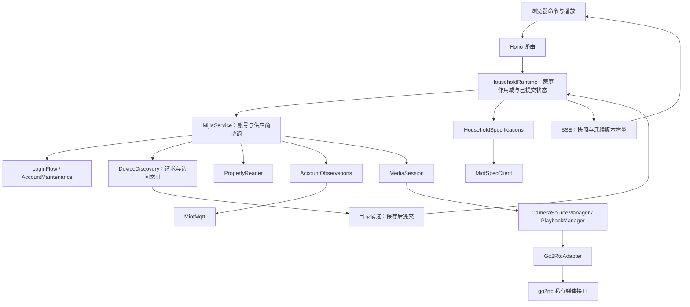

# 设备接入代码职责参考

本文索引 [Step 1：米家设备接入](plans/household-steps/01-device-access/README.md) 与[家庭运行时](household.md)的当前代码。按业务所有权、关键函数和接线路径组织；协议细节、使用方法和实机限制分别以[米家接入](mijia.md)、[来源契约](mijia-source-contract.md)及阶段文档为准。

## 1. 范围与所有权

| 目录                           | 所有权与责任                                               |
| ------------------------------ | ---------------------------------------------------------- |
| `apps/backend/src/mijia/`      | 统一米家账号、凭据接纳、HTTP 边界和跨模块生命周期。        |
| `mijia/account/`               | 扫码候选、恢复续期任务、账号级 MQTT 观察与重连。           |
| `mijia/homes/`                 | 按稳定账号身份保存家庭选择。                               |
| `mijia/devices/`               | 云端目录请求、供应商访问索引、目录转换与变化通知。         |
| `mijia/properties/`            | 明确属性集合的预检、串行读取预算和来源语义。               |
| `mijia/media/`                 | 媒体绑定、共享摄像头源、独立观看者和远端清理。             |
| `mijia/protocols/`             | MiCloud、OAuth、MQTT 的供应商协议与边界转换。              |
| `apps/backend/src/household/`  | 已提交家庭目录、规格、作用域、公共状态及 SSE。             |
| `packages/api/src/`            | 跨应用 schema、状态协议、HTTP 预算和安全错误。             |
| `apps/web/src/features/mijia/` | 单条家庭状态订阅、命令、扫码材料、目录展示及观看生命周期。 |
| `docker/go2rtc/`               | 固定上游构建、私有媒体接口、双镜头共享及安全诊断。         |

账号实例、家庭 `scope_epoch`、读取 `readGeneration`、MQTT `generation`、媒体 `revision` 和观看 `playbackId` 分别表达不同生命周期。媒体源与订阅集合是目录的派生资源。供应商目录保留原始接入资料，家庭状态机持有已提交公共目录；规格请求不接收账号凭据。

## 2. 家庭运行时与 HTTP 边界

### 2.1 家庭模块

| 文件与关键入口                                                                                                             | 责任                                                                                                                         |
| -------------------------------------------------------------------------------------------------------------------------- | ---------------------------------------------------------------------------------------------------------------------------- |
| [runtime.ts](../apps/backend/src/household/runtime.ts) / `start`、`close`                                                  | 创建并启动 XState actor，接收 service 变化，分发已提交状态通知和命令效果；关闭规格、订阅及接入服务。                         |
| 同文件 / `selectHome`、`requestRefresh`                                                                                    | 校验当前 epoch 和账号。切家先清空运行状态，再保存选择；选择保存失败时目录重试仍针对目标家庭，规格单独刷新不能越过选择阶段。  |
| 同文件 / `restore`、`commitDirectory`                                                                                      | 恢复持久目录作未同步展示；校验候选、容量及当前目标，事务保存后提交。账号、epoch 或请求过期时拒收。                           |
| 同文件 / `syncService`                                                                                                     | 将账号、登录、媒体、目录撤销和错误转换为公共状态；账号替换或家庭失去访问时撤销旧作用域。                                     |
| 同文件 / `withSpecifications`、`specification`                                                                             | 为设备关联已准备的规格、类别和能力标签；内部读取只使用已接纳能力。                                                           |
| 同文件 / `snapshot`、`changes`、`version`                                                                                  | 返回同一已提交版本的快照、变更和版本；快照按版本复用。                                                                       |
| [machine.ts](../apps/backend/src/household/machine.ts)                                                                     | 同步处理发布、选择、刷新和停止输入，核对 epoch、检查容量、更新公共版本及命令效果。数据库和网络在状态机外执行。               |
| [projection.ts](../apps/backend/src/household/projection.ts) / `initialProjection`、`publicDirectory`、`projectionChanges` | 初始化公共结构、把目录候选转换为 schema 白名单字段、计算一次提交的实体增删。                                                 |
| [repository.ts](../apps/backend/src/household/repository.ts) / `read`、`save`                                              | 按账号及家庭保存目录；完整清单中缺失的对象归档，恢复时过滤归档对象。事务设置锁、语句和总时限；提交响应不确定时核对持久结果。 |
| [config.ts](../apps/backend/src/household/config.ts)                                                                       | 后端目录、事务、规格并发与重试预算；状态流协议预算复用共享契约。                                                             |

`running` 表示账号和本次完整目录已经保存、接纳；规格可继续准备。启动恢复目录不能直接取得读取或新播放资格。普通目录刷新失败保留已确认目录；明确访问撤销先取消资格，再保存归档。

### 2.2 状态流与路由

[stream.ts](../apps/backend/src/household/stream.ts) 的 `createHouseholdStream` 先注册变化监听，再取得初始快照；同一版本的序列化帧供连接复用。每个连接有独立有界 FIFO，快照、增量、心跳和关闭提示共用发送路径。`pump` 管理写入期限，`close` 统一退订、清计时器、释放队列并中止流。作用域变化发送 `resync_required`；新连接总从完整快照开始。

[household/routes.ts](../apps/backend/src/household/routes.ts) 装配状态、SSE、家庭选择与目录刷新；[mijia/routes.ts](../apps/backend/src/mijia/routes.ts) 装配账号、登录材料、目录推送诊断和播放接口。路由使用 Hono 参数校验、请求体限制、本机访问检查、`no-store` 和安全错误映射；不创建供应商客户端。

| `/api/mijia` 下的接口                                        | 输入与输出边界                                                                                        |
| ------------------------------------------------------------ | ----------------------------------------------------------------------------------------------------- |
| `GET /state`、`GET /events`                                  | 已提交家庭快照及 SSE；不触发云端刷新。                                                                |
| `PUT /scope/homes`                                           | `{ scope_epoch, home_id }`；接纳后返回 `{ state_version }`。                                          |
| `POST /devices/refresh`                                      | `{ scope_epoch, target }`，target 为 `directory/specs/all`；HTTP 202 只确认接纳，完成状态由订阅发布。 |
| `GET /directory/push`                                        | 目录通知连接、确认／失败数量及接收时间，不返回 topic、账号或设备标识。                                |
| `POST /login`、`DELETE /login/:id`、`POST /login/:id/verify` | 创建、取消扫码或提交验证；命令不直接返回可写入前端缓存的业务快照。                                    |
| `GET /login/:id/material`                                    | 当前尝试的二维码或验证材料，与公共状态中的材料版本核对。                                              |
| `POST /connection/retry`、`DELETE /session`                  | 重试接入或退出；持久授权删除失败不能报告成功退出。                                                    |
| `POST /playback/reservations`                                | 家庭 epoch、媒体 revision、设备和镜头；返回独立观看资源 ID。                                          |
| `GET/PUT/DELETE /playback/:id`                               | 查询观看状态、提交 SDP、释放观看。SDP 不进入家庭状态流。                                              |

## 3. 账号、家庭与目录

### 3.1 [service.ts](../apps/backend/src/mijia/service.ts)

`MijiaService` 持有 MiCloud 与 OAuth 组成的完整接入会话、稳定账号身份及串行提交队列。`attachHousehold` 注入家庭恢复、目录提交、就绪和规格读取能力。

| 方法组                                                    | 责任                                                                                                                     |
| --------------------------------------------------------- | ------------------------------------------------------------------------------------------------------------------------ |
| `initialize`、`commitRestored`                            | 读取本地家庭选择与可展示目录；账号维护准备完整候选，凭据保存成功后接纳并提交目录。                                       |
| `startLogin`、`cancelLogin`、`verifyLogin`、`commitLogin` | 控制唯一扫码入口，完成后端 OAuth，串行保存与接纳新账号；失败候选不替换现有账号。                                         |
| `commitRenewed`                                           | 校验稳定身份、保存新凭据、替换实例、撤销旧读取；有效家庭范围与规格继续复用，OAuth 改变时重建 MQTT。                      |
| `selectHome`、`suspendHousehold`、`commitCatalog`         | 保存所选家庭，暂停旧访问；完整候选经撤销、容量、保存和家庭提交后接纳新增设备。选择失败不能由普通目录刷新重新启用旧家庭。 |
| `identity`、`directoryCandidate`、`directorySnapshot`     | 提供账号键和纯目录投影；目录转换交给 `deviceDirectory`。                                                                 |
| `invalidateDeviceAccess`、`invalidatePropertyReads`       | 取消旧观察与读取范围，合并 MQTT 关闭任务并更新读取代次。                                                                 |
| `accountObservations`、`syncDirectoryNotifications`       | 共享账号 MQTT 所有者，动态读取当前 OAuth；认证拒绝交账号维护，ACL 拒绝触发目录复核。                                     |
| `observeDevices`、`readProperties`、`getDeviceSpec`       | 校验家庭、已确认目录和成员资格；异步结果交付前再次核验。规格入口只读取家庭已准备数据。                                   |
| `requestConnection`、`reconnect`                          | 合并正在执行的重连命令，协调配置、账号恢复、目录和媒体；通过公共状态报告结果。                                           |
| `logout`、`expireAccount`、`close`                        | 分别处理主动退出、认证失效和进程停止；撤销本地资格并安排媒体清理，关闭不删除持久登录凭据。                               |
| `serial`、`subscribe`、`flushChanges`                     | 串行保存／接纳，合并服务变化通知；路由返回版本前可同步发布当前变化。                                                     |

### 3.2 账号模块与家庭选择

| 文件                                                                                                     | 关键函数与职责                                                                                                                                                                              |
| -------------------------------------------------------------------------------------------------------- | ------------------------------------------------------------------------------------------------------------------------------------------------------------------------------------------- |
| [account/login-flow.ts](../apps/backend/src/mijia/account/login-flow.ts)                                 | `LoginFlow.start/prepareLogin/verifyLogin` 拥有一次扫码候选与取消；`prepareCommit/adopt` 将成功实例转交 service。`publicSnapshot` 只输出公共状态，`material` 单独返回当前二维码或验证材料。 |
| [account/session.ts](../apps/backend/src/mijia/account/session.ts)                                       | `restoreAccountSession`、`renewAccountSession` 准备 MiCloud、OAuth 和完整目录候选；不自行接纳业务账号。                                                                                     |
| [account/maintenance.ts](../apps/backend/src/mijia/account/maintenance.ts)                               | `restore/renew` 合并维护任务；`scheduleRenewal` 管理期限；`rejectOAuth` 保留被拒 token 并强制刷新；尊重 Retry-After，失败由 service 决定撤销范围。                                          |
| [homes/store.ts](../apps/backend/src/mijia/homes/store.ts)                                               | 家庭选择的数据库读写；提交前后断言当前操作，事务期限及不确定提交核对属于存储适配责任。                                                                                                      |
| [retry-timer.ts](../apps/backend/src/mijia/retry-timer.ts)                                               | 可取消退避和长期限分段调度，避免超大 setTimeout 溢出。                                                                                                                                      |
| [errors.ts](../apps/backend/src/mijia/errors.ts)、[operation.ts](../apps/backend/src/mijia/operation.ts) | 将协议错误转换为静态业务码；记录操作与安全错误，不输出上游报文或凭据。                                                                                                                      |

### 3.3 目录模块

| 文件与入口                                                                                         | 责任                                                                                                                                                              |
| -------------------------------------------------------------------------------------------------- | ----------------------------------------------------------------------------------------------------------------------------------------------------------------- |
| [devices/discovery.ts](../apps/backend/src/mijia/devices/discovery.ts) / `load`                    | 云端目录请求与持久化重试的唯一所有者；合并进行中请求和一次后续刷新，保留最新完整待保存候选。                                                                      |
| 同文件 / `revoke`、`retain`、`set`                                                                 | 先移除已确认撤销的资格，再暂存候选；保存成功后更新供应商索引与已确认状态。                                                                                        |
| 同文件 / `select`、`suspend`、`reset`                                                              | 管理供应商侧家庭索引和访问 revision，取消旧请求及后台计时。                                                                                                       |
| 同文件 / `schedule`、`fail`                                                                        | 五分钟目录发现、退避与失败报告；普通目录错误和首次尚未确认目录分别处理。                                                                                          |
| [devices/directory.ts](../apps/backend/src/mijia/devices/directory.ts) / `deviceDirectory`         | 纯转换：完整 catalog、稳定账号键和目标家庭生成公共目录候选；一次遍历映射设备及 spec_type，不反向依赖 service。                                                    |
| [devices/mapping.ts](../apps/backend/src/mijia/devices/mapping.ts)                                 | `describeMijiaDevice(s)` 投影展示字段；`isCamera/cameraChannels` 按型号能力表识别镜头。云 online 是诊断信息，不是视频可用性的唯一依据。                           |
| [devices/directory-notifications.ts](../apps/backend/src/mijia/devices/directory-notifications.ts) | `update` 注册账号级 bind/unbind 与设备 rename/hr_change；新监听先接入，再取消旧监听。`schedule` 做五秒尾沿防抖；`snapshot` 返回脱敏诊断，`close` 取消监听和计时。 |

目录通知只触发完整刷新，不直接采用通知载荷修改设备归属。账号下非受管家庭的设备也可参与目录通知订阅，属性观察仍严格限定当前家庭。

## 4. 属性读取与来源语义

| 文件                                                                                     | 关键责任                                                                                                                                                           |
| ---------------------------------------------------------------------------------------- | ------------------------------------------------------------------------------------------------------------------------------------------------------------------ |
| [properties/read-request.ts](../apps/backend/src/mijia/properties/read-request.ts)       | `preparePropertyRead` 复制输入、按设备分组，同步检查正整数地址和家庭已准备规格中的 readable 能力。                                                                 |
| [properties/reader.ts](../apps/backend/src/mijia/properties/reader.ts)                   | `PropertyReader.read` 组织每批最多 150 项的全服务串行预算；`readBatch` 按请求地址匹配响应并保存来源级 Retry-After 门；`classifyRow` 区分成功、失败、缺值与无效值。 |
| [properties/source-profiles.ts](../apps/backend/src/mijia/properties/source-profiles.ts) | `miotSourceId/miotPushSourceId` 从账号、区域和通路派生稳定哈希身份；profile 记录协议条件、时间与交付语义及有限型号证据。                                           |

调用链是 `service.readProperties → preparePropertyRead → PropertyReader → MiCloud.getProperties → RC4 transport`。读取前、排队后及交付前检查取消和活动范围；同账号换凭据不会清空来源限流门。`datasource=1` 保守标为 `baseline/cloud_cache`、`observed_at=null`，HTTP 返回时间不能证明设备采样时间。逐项失败不会抹除同批成功项。

## 5. MiCloud 与公开规格协议

| 文件                                                                                                                   | 关键函数与职责                                                                                                                                                                                                                                         |
| ---------------------------------------------------------------------------------------------------------------------- | ------------------------------------------------------------------------------------------------------------------------------------------------------------------------------------------------------------------------------------------------------ |
| [protocols/micloud/client.ts](../apps/backend/src/mijia/protocols/micloud/client.ts)                                   | `MiCloud.createLogin/pollLogin/submitSecurityCode` 管理供应商扫码；`exportSession/renewSession/getCredentials` 维护完整会话；`getProfile/getHomes/getCatalog/getProperties` 请求资料、目录和属性；`#deviceRequest` 编码 RC4 请求，`dispose` 取消实例。 |
| [protocols/micloud/transport.ts](../apps/backend/src/mijia/protocols/micloud/transport.ts)                             | `trustedUrl` 限制供应商 URL；`MiCloudTransport.request` 管理 Cookie、重定向、请求／响应体期限及起始时间；取消和正文大小限制覆盖传输读取。                                                                                                              |
| [protocols/micloud/homes.ts](../apps/backend/src/mijia/protocols/micloud/homes.ts)                                     | 校验与合并自有／共享家庭、房间和设备归属；不持久化业务家庭选择。                                                                                                                                                                                       |
| [protocols/micloud/session.ts](../apps/backend/src/mijia/protocols/micloud/session.ts)                                 | 保存会话 schema 与恢复所需凭据边界。                                                                                                                                                                                                                   |
| [protocols/micloud/rc4.ts](../apps/backend/src/mijia/protocols/micloud/rc4.ts)                                         | 供应商 nonce、签名与 RC4 编解码。                                                                                                                                                                                                                      |
| [protocols/micloud/properties.ts](../apps/backend/src/mijia/protocols/micloud/properties.ts)                           | MIoT 属性地址 schema、150 项批次及 30 秒请求预算。                                                                                                                                                                                                     |
| [protocols/micloud/camera-capabilities.ts](../apps/backend/src/mijia/protocols/micloud/camera-capabilities.ts) 与 JSON | 已声明型号的镜头数量，供映射和媒体输入共同使用。                                                                                                                                                                                                       |
| [protocols/micloud/errors.ts](../apps/backend/src/mijia/protocols/micloud/errors.ts)                                   | 安全协议错误类型及状态信息；业务层再映射公开错误码。                                                                                                                                                                                                   |

### 5.1 规格任务与协议客户端

[household/specifications.ts](../apps/backend/src/household/specifications.ts) 的 `HouseholdSpecifications` 是规格业务所有者：

- `update` 按活动型号／URN 线性分组，移除无引用资料；显式刷新独立重置已完成组，在途组继续当前尝试。
- `pump/load` 最多准备三组规格，临时错误额外在两秒、十秒后重试。无相关目录变化和显式刷新时不反复重试已完成的失败。
- `commit` 在能力校验与家庭容量检查后，才按最终 URN 共享结果及型号别名。型号解析到新 URN 并不等于新规格已接纳；失败保留原能力的 URN／版本，错误挂在原型号组，避免冒充新版本或覆盖共享旧规格的设备。
- `snapshot` 返回规格及设备引用，`clear` 取消全部任务并释放别名。普通读取不请求规格网络服务。

[protocols/micloud/spec.ts](../apps/backend/src/mijia/protocols/micloud/spec.ts) 的 `MiotSpecClient.resolve` 解析已知 URN 或通过型号取得 URN，并建立同一次 30 秒预算；`read` 使用剩余预算获取实例与可选中文翻译。`parseSpec` 保留类别、readable/writeable/notify 和属性、动作、事件标识。

同一客户端按 URL 共享在途请求，每个调用者独立取消，最后一位等待者离开才中止传输。实例在翻译结束前仍保持共享引用，稍后解析到同一 URN 的型号无需重复获取实例。可选翻译失败或预算耗尽保留已验证能力和原文；调用范围取消仍终止操作。响应有大小限制，最终资料受家庭总容量检查；没有按时间自动过期的持久规格缓存。

## 6. OAuth 与账号 MQTT 观察

[protocols/oauth/client.ts](../apps/backend/src/mijia/protocols/oauth/client.ts) 的 `authorizeOAuth` 在唯一扫码流程内完成后端授权，限制账号域名、路径、回调 state 与应用参数；`exchange/refreshOAuth` 交换或更新 token，保留安全 Retry-After 期限。HTTP 状态、响应体与供应商认证错误分开处理。MiCloud 与 OAuth 凭据由 service 统一保存，协议客户端不拥有第二份账号。

| 文件与方法                                                                                           | 责任                                                                                                                |
| ---------------------------------------------------------------------------------------------------- | ------------------------------------------------------------------------------------------------------------------- |
| [account/observations.ts](../apps/backend/src/mijia/account/observations.ts) / `AccountObservations` | 账号级活动观察和重连所有者，同时服务设备属性／在线观察及目录通知。                                                  |
| `observe`、`observeTopics`、`watch`                                                                  | 注册明确设备或精确主题集合；保存回调、取消和快照，多个消费者共享连接及 topic。                                      |
| `connect`、`bind`、`schedule`                                                                        | 建立新 MQTT 代次，重新绑定活动观察；按统一退避重连，稳定连接后重置退避。                                            |
| `credentialsUpdated`、`close`                                                                        | OAuth 更新时重建连接并清理相应拒绝状态；范围撤销取消全部观察，迟到旧连接不能覆盖新实例。                            |
| [protocols/miot/mqtt.ts](../apps/backend/src/mijia/protocols/miot/mqtt.ts) / `MiotMqtt`              | 单代 MQTT 5/TLS 连接、精确 topic 引用、订阅队列与 SUBACK。16 个在途名额和十秒确认期限；永久拒绝与临时失败分别处理。 |
| [protocols/miot/messages.ts](../apps/backend/src/mijia/protocols/miot/messages.ts)                   | topic 构造与匹配、method/did/地址/value 校验、属性／在线／目录消息规范化。拒绝非法单层标识，不猜测转义规则。        |

合法早到消息可以交付，但不能代替 SUBACK；同值上报保留。订阅确认超时关闭当前连接代次并释放 SDK 未确认请求，再由账号观察所有者退避恢复；明确的单项拒绝按各自原因处理。正常属性推送为 live，retained 为 baseline。普通断线不直接撤销账号或媒体；认证拒绝由账号维护确认处理，topic ACL 拒绝触发目录复核。自动补读和家庭 latest 由后续采集步骤负责。

## 7. 后端媒体资源

| 文件与入口                                                                                 | 所有权与责任                                                                                                                                                                       |
| ------------------------------------------------------------------------------------------ | ---------------------------------------------------------------------------------------------------------------------------------------------------------------------------------- |
| [media/session.ts](../apps/backend/src/mijia/media/session.ts) / `MediaSession`            | 媒体配置、账号绑定、revision、摄像头源和观看资源的协调者。                                                                                                                         |
| `startBinding`、`retryBinding`、`installAccount`                                           | 只有家庭允许绑定时安装当前账号媒体凭据；异步提交前检查账号和取消。                                                                                                                 |
| `prepareRebind`、`revokeAccount`                                                           | 立即停止旧绑定、撤销本地资源与适配器资格；`revokeAccount` 同时清空设备输入。                                                                                                       |
| `queueCleanup`、`clearAdapter`                                                             | 独立排队清理旧适配器，失败保留原目标并退避重试；不依赖家庭是否继续运行，旧清理不能关闭替代实例。                                                                                   |
| `reconcileConfiguration`、`close`                                                          | 定期协调媒体 URL，配置变化按旧资源清理后重新绑定；停止时撤销计时、资源及会话。                                                                                                     |
| [media/camera-source-manager.ts](../apps/backend/src/mijia/media/camera-source-manager.ts) | `update/reconcile` 按当前设备与镜头维护共享源；`ensure/prepareStream` 合并创建，`retire/remove` 撤销关联观看并回收远端源；局部错误独立重试。                                       |
| [media/playback-manager.ts](../apps/backend/src/mijia/media/playback-manager.ts)           | `reserve/offer/negotiate` 管理独立观看预约与协商；相同参数协商可合并。`release` 立即撤销本地可见资格，远端确认前保存释放责任；`retryReleases/forgetAdapter` 处理重试和整会话清理。 |
| [media/go2rtc-adapter.ts](../apps/backend/src/mijia/media/go2rtc-adapter.ts)               | `install/prepareCamera/offer/release` 适配私有媒体接口；`renewSessionLease` 和心跳确认会话；`revoke` 停止旧资格，`close` 主动删除远端会话。                                        |
| [media/camera-source-spec.ts](../apps/backend/src/mijia/media/camera-source-spec.ts)       | 镜头源输入边界：设备、型号、通道数量及局域网地址。                                                                                                                                 |

目录 online 是诊断信息，实际媒体连通性决定播放可用性。观看 DELETE 只释放该观看者；共享源由目录／媒体会话持有。远端清理失败不能恢复本地观看资格，go2rtc 租约提供最终回收约束，但不代替主动删除确认。

## 8. go2rtc 私有媒体实现

本节以仓库内 overlay 和 runtime.patch 为边界。Go 接入的会话是内存媒体授权租约，不是 backend 的持久业务账号。源码中的 goroutine、defer、AfterFunc 属于相应函数的生命周期责任。

### 8.1 [internal/xiaomi/home_agent.go](../docker/go2rtc/overlay/internal/xiaomi/home_agent.go)

`homeAgentSession` 保存 id、私有 cloud alias、region、原子期限、镜头 Map、两分钟 retired 墓碑和双镜头共享源 Map。`homeAgentCurrent` 原子指针与 `homeAgentMu` 管理跨 HTTP 请求的所有权。

| 函数                      | 责任                                                                                                                                                                                                             |
| ------------------------- | ---------------------------------------------------------------------------------------------------------------------------------------------------------------------------------------------------------------- |
| `initHomeAgent`           | 注册私有 API；后台每 5 秒清过期会话及到期墓碑。                                                                                                                                                                  |
| `homeAgentLocalRequest`   | 要求真实对端 loopback/private IP、无 Origin/Sec-Fetch-Site、X-Home-Agent=mijia、无 query；适配 Docker 私网转发，不以 forwarded header 代替真实对端。                                                             |
| `homeAgentError`          | 输出静态 JSON code 和 HTTP status。                                                                                                                                                                              |
| `homeAgentRead`           | application/json、最大 128 KiB、拒未知字段、多 JSON 对象和尾部杂质。                                                                                                                                             |
| `homeAgentAPI`            | 路由 session/camera/playback/heartbeat；heartbeat 在锁内核验 owner、续 60 秒租约并取活动 IDs。管理操作先取得锁并检查请求取消，过期会话先清；camera DELETE 写墓碑再删源，session DELETE 区分 reset 与特定 owner。 |
| `homeAgentRequireSession` | ID 与当前 session 一致且未过期，否则 session_expired。调用方负责锁。                                                                                                                                             |
| `homeAgentInstall`        | 校验 UUID、数字用户 ID、token 字符和 cn；先清旧会话，再用新 Cloud 登录；请求仍活动才把 cloud 存入随机私有 alias 并发布新 session，失败不保留旧画面。                                                             |
| `homeAgentCloudErrorCode` | timeout 与临时网络／ErrCloudUnavailable 单独分类，其余归 credentials_rejected；不暴露原始错误。                                                                                                                  |
| `homeAgentClear`          | 原子撤销当前 session，关闭各镜头与共享双摄源，删除对应 cloud alias；不清其他静态账号配置。                                                                                                                       |

### 8.2 [internal/xiaomi/home_agent_camera.go](../docker/go2rtc/overlay/internal/xiaomi/home_agent_camera.go)

每 `homeAgentCameraState` 持有私有 stream、独立 ctx/cancel、串行 AddConsumer/Close 的 gate、playbacks 和可选共享源 releaseSource。常驻 consumer 只观察包活性，不解码或存储视频。

| 函数／方法                         | 责任                                                                                                                                                                                                           |
| ---------------------------------- | -------------------------------------------------------------------------------------------------------------------------------------------------------------------------------------------------------------- |
| `homeAgentCamera`                  | 校验 session/source UUID、墓碑、最多 32 源、1/2 通道、数字 did、camera/cateye 型号及私网 IPv4。相同 source ID 幂等；构造 audio=0 私有 xiaomi URL，双摄交 homeAgentDualStream，启动 resident capture。          |
| `homeAgentCloseCamera`             | cancel 镜头所有者并释放双摄引用；异步拿 gate 后 Close，避免阻塞会话锁／心跳，也避免与 AddConsumer 竞态。                                                                                                       |
| `homeAgentNewConsumer`             | 构造支持 H264/H265 的 packet-only 常驻视频 consumer。                                                                                                                                                          |
| `homeAgentSourceConsumer.AddTrack` | 建 sender 并挂 RTP handler，每包只更新原子活动时间，保存 sender；不要求关键帧才算活动。                                                                                                                        |
| `homeAgentRestartStalled`          | 拿 gate 后重查是否已恢复包或 producer 正在重连；仍停滞且 owner 有效才退役所有 viewers，再在会话锁外 Close 整个私有 stream。                                                                                    |
| `homeAgentCapture`                 | 独立 goroutine 循环附加 resident consumer，每 10 秒检查活性；首包允许 90 秒，已有流静默 30 秒。尊重底层 producer 自身重连；需持续媒体一分钟才重置本层退避；失败按 5—60 秒且最多减 25% 抖动重试，ctx 取消退出。 |

初次没有包和已经正常运行后断流不同；“AddConsumer 成功”不会直接复位重试延迟。每次 attachment 新建 activity，旧 sender 缓冲包不计入新源首包。

### 8.3 [internal/xiaomi/home_agent_playback.go](../docker/go2rtc/overlay/internal/xiaomi/home_agent_playback.go)

| 函数／方法                      | 责任                                                                                                                                                                                                                   |
| ------------------------------- | ---------------------------------------------------------------------------------------------------------------------------------------------------------------------------------------------------------------------- |
| `homeAgentPlaybackOwner.valid`  | 验证 source/playback UUID；session 是否有效另查。                                                                                                                                                                      |
| `homeAgentPlayback`             | 校验 JSON、SDP ≤96 KiB、当前 session/source、墓碑、重复 viewer 和全会话 ≤32 viewers；建立属于 camera 的 viewer owner。50 秒协商期限及请求取消只管理协商；成功前核验所有权，把连接生命周期转交 ownerCtx 后发布 answer。 |
| `homeAgentPlayback.releaseGate` | sync.OnceFunc，确保 gate 恰好释放一次。                                                                                                                                                                                |
| `homeAgentPlayback.cleanup`     | sync.Once 防重复关闭；锁内退役 viewer，另 goroutine 拿 gate 移除 WebRTC consumer，不阻塞会话锁。                                                                                                                       |
| `homeAgentRelease`              | 验 owner 和 session；先写两分钟墓碑，若 viewer 存在则退役，返回 204。DELETE 可先于迟到 POST 到达。                                                                                                                     |
| `homeAgentRetirePlayback`       | 只撤销 Map 中同一对象，写墓碑并 cancel；常驻源不受 viewer 删除影响。                                                                                                                                                   |

### 8.4 [internal/xiaomi/home_agent_dual_camera.go](../docker/go2rtc/overlay/internal/xiaomi/home_agent_dual_camera.go)

`homeAgentDualStream` 在会话锁内，去 channel 参数后的私有 URL 作 key（含账号 alias、设备与地址），同物理设备共享一个 `miss.DualCamera`。第一次创建的 resolveURL 回调动态取云取流参数；每通道创建独立私有 Stream，其 dial 回调调用 `shared.source.Open(channel)`。返回的 `release` 为 sync.OnceFunc，递减通道所有者计数，最后通道退出才关闭物理源并从 session Map 删除。此共享范围仅当前进程、当前账号会话。

### 8.5 [pkg/xiaomi/miss/dual_camera.go](../docker/go2rtc/overlay/pkg/xiaomi/miss/dual_camera.go)

| 函数／方法             | 责任                                                                                                                                                             |
| ---------------------- | ---------------------------------------------------------------------------------------------------------------------------------------------------------------- |
| `NewDualCamera`        | 建物理设备拥有者 ctx/cancel，保存动态 URL resolver。                                                                                                             |
| `DualCamera.Close`     | 取消父生命周期并关闭当前物理 session。                                                                                                                           |
| `DualCamera.Open`      | 仅通道 1/2；mutex 串行云 key 交换和首次连接，复用未关闭 session。创建 NewClient 后 prepare 两路 codec，启动 run；任一取消／探测失败关闭；返回指定镜头 producer。 |
| `dualSession.closed`   | 非阻塞检查 done channel。                                                                                                                                        |
| `dualSession.close`    | sync.Once 标 stopping、关闭 transport 唤醒读者、关闭 done。                                                                                                      |
| `dualSession.prepare`  | 一条视频启动命令同时设置 videoquality/videoquality2、禁音频；15 秒内读取两路 H264 SPS／H265 VPS，根据 Flags 高字节 0/1 探测 codec，其他通道拒绝。                |
| `dualSession.producer` | 按镜头 codec 建独立 producer、100 包队列及 done，不另拨摄像头。                                                                                                  |
| `dualSession.run`      | 每次 ReadPacket 设 10 秒期限，按镜头投递视频包；非法通道终止。某 reader 队列满就结束该 reader，不阻塞另一镜头或累积无限帧。                                      |
| `dualProducer.finish`  | sync.Once 关闭该 producer 的 done。                                                                                                                              |
| `dualProducer.Start`   | 注册到 readers，退出时移除；包的序号／时间转 RTP，AnnexB→AVCC，投递已绑定 receivers；自身或物理 session 关闭则 EOF。                                             |
| `dualProducer.Stop`    | 结束自身并停止 core.Connection，不关闭仍由其他通道拥有的物理连接。                                                                                               |

### 8.6 WebRTC、streams、登录与诊断扩展

| 文件／函数                                                                                                                | 责任                                                                                                                                                                                   |
| ------------------------------------------------------------------------------------------------------------------------- | -------------------------------------------------------------------------------------------------------------------------------------------------------------------------------------- |
| [internal/streams/home_agent.go](../docker/go2rtc/overlay/internal/streams/home_agent.go) / `NewHomeAgentStream`          | 私有 dial 工厂建立 Stream，URL 仅为静态 xiaomi:private，不进入全局源注册。                                                                                                             |
| 同文件 / `Stream.HomeAgentReconnecting`                                                                                   | 在 stream 锁内读取 producer 原子 reconnecting，涵盖拨号与退避，不等待网络拨号持有的 producer mutex。                                                                                   |
| [internal/webrtc/home_agent.go](../docker/go2rtc/overlay/internal/webrtc/home_agent.go) / `HomeAgentOffer`                | 建被动 consumer PeerConnection；SetOffer 后只允许服务端 sendonly 且至少一个视频；AddConsumer、完整 answer、静态错误映射；失败／取消关闭并 cleanup，成功返回 answer 和显式拥有的 conn。 |
| `HomeAgentOffer.closeConnection`、监听回调                                                                                | 关闭 conn 并调用外层 cleanup；peer closed 也回收；协商 ctx 的 AfterFunc 可中止，但成功后由调用方转移 owner。                                                                           |
| [pkg/webrtc/home_agent.go](../docker/go2rtc/overlay/pkg/webrtc/home_agent.go) / `Conn.HomeAgentCompleteAnswer`            | 注册不阻塞 ICE 回调，mutex 保护 candidates；等待 gathering 或 ctx 取消，将候选写入第一个媒体描述并序列化 SDP。                                                                         |
| [pkg/xiaomi/home_agent_login.go](../docker/go2rtc/overlay/pkg/xiaomi/home_agent_login.go) / `Cloud.LoginHomeAgentSession` | 临时替换新 Cloud 的 RoundTripper，调用现有 LoginWithToken，finally 还原，记录安全阶段结果。                                                                                            |
| 同文件 / `homeAgentLoginTransport.RoundTrip`                                                                              | 第一跳 cloud_token_request，后续 cloud_sts_request；仅记录 scheme、status、安全错误类别，原样返回传输结果。                                                                            |
| [pkg/xiaomi/diagnostic/diagnostic.go](../docker/go2rtc/overlay/pkg/xiaomi/diagnostic/diagnostic.go) / `Report`            | 打印实现定义 stage 和 failureReason。                                                                                                                                                  |
| 同文件 / `ReportHTTP`                                                                                                     | 限定 status 为 100—599，否则 0；HTTP 错误标 http_error；scheme 只允许 http/https，绝不输出 host/path。                                                                                 |
| 同文件 / `failureReason`                                                                                                  | nil、timeout、DNS、拒连、不可达、权限、EOF 分类为静态标签，未知 failed。                                                                                                               |

### 8.7 [runtime.patch](../docker/go2rtc/runtime.patch) 与构建

补丁是本项目部署所需代码的一部分。下面的路径是固定上游应用补丁后的目标，不是另一个本地源码目录；只列补丁添加／改变的职责。

| 上游目标文件                    | 函数／改动责任                                                                                                                                                                                                                                                                                                          |
| ------------------------------- | ----------------------------------------------------------------------------------------------------------------------------------------------------------------------------------------------------------------------------------------------------------------------------------------------------------------------- |
| `internal/streams/producer.go`  | `Producer` 加 factory 与原子 reconnecting；原初始拨号位置和 `reconnect` 改用 `dial`。`worker` 检查 workerID 后标重连，`reconnect` 成功清标志，`stop` 失效 worker／清标志。新增 `dial` 选择私有工厂或上游 GetProducer；`logSource` 隐去 xiaomi URL，`logError` 把小米错误转静态消息；start/reconnect/stop 日志使用它们。 |
| `internal/streams/stream.go`    | 新增 `Stream.Close`，锁内取出并清 consumers，锁外停 consumers/producers；调用者负责和 AddConsumer 串行。                                                                                                                                                                                                                |
| `internal/xiaomi/xiaomi.go`     | `Init` 注册 `initHomeAgent`；xiaomi producer handler 校验 URL、解析云参数、拨号，移除含秘密 URL 日志，失败用静态错误。                                                                                                                                                                                                  |
| `pkg/xiaomi/cloud.go`           | 新增 `cloudResponseError` 把 408/429/5xx 标临时不可用；`finishAuth` 校验响应与完整会话；`LoginWithToken` 校验 location/ssecurity、保留未轮换 passToken、确认 userID 一致；其余登录响应处理与 `readLoginResponse` 不再把原始 body 放错误。                                                                               |
| `pkg/xiaomi/legacy/producer.go` | `Dial` 把 audio 配置传入 `probe`；`probe` 在仅视频请求中不等待音频，存在音频 codec 才发布音频媒体。目录名是供应商现有协议名，不是本项目新增版本兼容层。                                                                                                                                                                 |
| `pkg/xiaomi/miss/client.go`     | `NewClient` 限定鉴权阶段 15 秒、静态诊断、启动 `startCommandLoop` 消耗命令包；`login` 不输出原始失败包；`StartMedia` 复用提取后的 `videoQuality`，保留协议默认画质规则。                                                                                                                                                |
| `pkg/xiaomi/miss/producer.go`   | `Dial` 在启动、probe 成功／失败处补安全诊断，失败关闭 client。                                                                                                                                                                                                                                                          |
| `pkg/xiaomi/miss/cs2/conn.go`   | `handshake` 分阶段诊断；`Conn.worker` 校验长度、magic、通道，禁止未知包 dump；`udpConn.Read` 只接纳目标 IP 且长度有效；`WriteUntil` 发送失败唤醒读并优先返回原发送错误，接收仍校验来源和长度。                                                                                                                          |
| `pkg/tutk/conn.go`              | `Conn.worker` 不输出未知包原文。                                                                                                                                                                                                                                                                                        |
| `pkg/tutk/dtls/conn_dtls.go`    | `AVServStart`／`AVSendAudioData` verbose 输出改为 redacted，移除报文 hexDump 工具。                                                                                                                                                                                                                                     |

[Dockerfile](../docker/go2rtc/Dockerfile) 固定 go2rtc commit 和构建／运行基础镜像摘要，检查 git apply 后复制 overlay，按原生二进制导出与容器运行两种目标构建。没有运行时账号业务函数。[README](../docker/go2rtc/README.md) 与 [LICENSE](../docker/go2rtc/LICENSE) 负责构建说明、来源及许可。

## 9. 共享契约、存储与启动接线

| 文件                                                                                                                       | 范围内职责                                                                                                                                                                            |
| -------------------------------------------------------------------------------------------------------------------------- | ------------------------------------------------------------------------------------------------------------------------------------------------------------------------------------- |
| [contracts/household.ts](../packages/api/src/contracts/household.ts)                                                       | 家庭、目录、规格、快照、增量、版本、命令及登录材料 schema；`DirectoryRefreshTarget` 从共享 schema 推导；`householdStreamPolicy` 统一前后端状态流预算；`applyChanges` 应用已校验增量。 |
| [contracts/mijia.ts](../packages/api/src/contracts/mijia.ts)、[mijia-spec.ts](../packages/api/src/contracts/mijia-spec.ts) | 账号、家庭选择、设备、能力与播放契约，供 RPC 和内部边界复用。                                                                                                                         |
| [contracts/mijia-errors.ts](../packages/api/src/contracts/mijia-errors.ts)                                                 | 安全错误码、HTTP 状态和消息定义；不保存上游原文。                                                                                                                                     |
| [http/read-body.ts](../packages/api/src/http/read-body.ts)、[retry-after.ts](../packages/api/src/http/retry-after.ts)      | 有界响应体读取、取消及最早重试期限解析。                                                                                                                                              |
| [http/local-access.ts](../packages/api/src/http/local-access.ts)、[errors/hono.ts](../packages/api/src/errors/hono.ts)     | 本机请求边界、JSON 校验和 Hono 安全错误响应。                                                                                                                                         |
| [credentials/store.ts](../apps/backend/src/credentials/store.ts)                                                           | 加密凭据的数据库读写，不解释米家有效性。                                                                                                                                              |
| [db/schema.ts](../apps/backend/src/db/schema.ts)、[db/index.ts](../apps/backend/src/db/index.ts)、`apps/backend/drizzle/`  | 凭据、家庭选择和家庭目录表、连接配置及迁移。                                                                                                                                          |
| [main.ts](../apps/backend/src/main.ts)、[app.ts](../apps/backend/src/app.ts)                                               | 装配存储、MijiaService、HouseholdRuntime 和路由；家庭运行不依赖页面挂载，应用停止负责统一关闭。                                                                                       |

家庭目录持久化不包含 token、Cookie、SDP、连接或 Promise。历史归属的归档记录与活动目录分开解释；恢复规格、availability 和采集状态时不伪造在线证明。

## 10. 浏览器接线

| 文件                                                                                                                                                                                                    | 关键入口与职责                                                                                                                                                                                            |
| ------------------------------------------------------------------------------------------------------------------------------------------------------------------------------------------------------- | --------------------------------------------------------------------------------------------------------------------------------------------------------------------------------------------------------- |
| [subscription.ts](../apps/web/src/features/mijia/subscription.ts)                                                                                                                                       | `subscribeHousehold` 每应用／标签页一条 SSE；Hono RPC fetch 与 eventsource-parser 解码，先收快照再应用同 epoch 连续版本。缺口、非法消息或作用域变更重连；遵守服务端 Retry-After、连接期限和共享静默期限。 |
| [household-state.ts](../apps/web/src/features/mijia/household-state.ts)                                                                                                                                 | 共享快照、同步状态、最后有效消息时间和重连入口 atoms。                                                                                                                                                    |
| [state.ts](../apps/web/src/features/mijia/state.ts)                                                                                                                                                     | 从家庭 projection 派生页面状态、账号／家庭资格和命令状态；命令响应仅用于确认版本，不覆盖订阅快照。                                                                                                        |
| [api.ts](../apps/web/src/features/mijia/api.ts)                                                                                                                                                         | `executeMijiaCommand` 携带当前 epoch；`getLoginMaterial` 单独取私密扫码材料；播放使用预约、协商、释放专用接口。                                                                                           |
| [use-mijia.ts](../apps/web/src/features/mijia/use-mijia.ts)、[use-login.ts](../apps/web/src/features/mijia/use-login.ts)                                                                                | 组合展示、同步可靠性和账号命令；二维码展示核对当前尝试与材料版本。                                                                                                                                        |
| [HomeSelection.tsx](../apps/web/src/features/mijia/HomeSelection.tsx)、[MijiaView.tsx](../apps/web/src/features/mijia/MijiaView.tsx)                                                                    | 家庭选择、初始化／错误提示、目录刷新和设备／摄像头页面共同容器。                                                                                                                                          |
| [DeviceGrid.tsx](../apps/web/src/features/mijia/DeviceGrid.tsx)、[CameraWall.tsx](../apps/web/src/features/mijia/CameraWall.tsx)                                                                        | 设备搜索筛选、房间与镜头布局；显示范围不改变后端家庭或采集范围。                                                                                                                                          |
| [AccountGate.tsx](../apps/web/src/features/mijia/AccountGate.tsx)、[AccountDialog.tsx](../apps/web/src/features/mijia/AccountDialog.tsx)、[LoginFlow.tsx](../apps/web/src/features/mijia/LoginFlow.tsx) | 账号进入条件、资料、退出、扫码与验证交互。                                                                                                                                                                |
| [use-mijia-playback.ts](../apps/web/src/features/mijia/use-mijia-playback.ts)                                                                                                                           | 每 revision/设备/镜头拥有独立 peer、viewer 和取消范围；`connect` 预约并协商，`onFrame` 以真实帧确认播放，`stop` 释放媒体、计时器和迟到预约。                                                              |
| [MijiaPlayer.tsx](../apps/web/src/features/mijia/MijiaPlayer.tsx)                                                                                                                                       | 显示观看状态与重试，重建观看时释放旧 viewer。                                                                                                                                                             |
| [StateProvider.tsx](../apps/web/src/components/StateProvider.tsx)                                                                                                                                       | 装配共享状态上下文及应用级家庭订阅。                                                                                                                                                                      |

米家页面通过 SSE 更新状态，没有状态轮询。短暂断流保留旧显示并标为未同步；作用域改变清空旧家庭。二维码、验证码和 SDP 不进入公共状态流。WebRTC answer 或 ICE connected 都不能代替实际出帧；页面隐藏时不把停止渲染误判为源断流。

## 11. 关键行为闭环

1. **扫码与恢复：** 页面命令 → service → LoginFlow／AccountMaintenance 准备完整候选 → OAuth 与统一凭据保存 → 接纳账号 → 完整目录保存提交 → 家庭就绪 → 媒体与目录通知接入。
2. **切家：** epoch 命令 → 提交目标家庭和空运行状态 → 撤销旧读取、观察和媒体 → 保存目标选择 → 完整目录保存提交。选择保存失败后重试仍针对目标家庭。
3. **目录变化：** MQTT 精确通知或五分钟发现 → DeviceDiscovery → 完整 catalog → 确认撤销先取消资格 → 持久保存 → 家庭状态提交 → 派生规格、媒体及通知集合。
4. **属性读取：** 明确地址 → 成员及 readable 预检 → 串行批次 → MiCloud RC4 请求 → 逐项分类 → 活动范围复核。没有隐藏读取重放或持续采集。
5. **推送：** 明确设备集合 → AccountObservations → MiotMqtt 单代连接与逐 topic SUBACK → 消息规范化 → service 范围复核 → 调用方。目录通知使用同一账号观察所有者。
6. **观看与清理：** 已提交设备与媒体 revision → 共享镜头源 → 独立 viewer → SDP → 实际帧。范围撤销立即使本地资格失效；旧远端会话的清理失败独立重试。
7. **公共状态：** actor 同步提交 → 一次计算变化 → SSE 按版本复用序列化帧 → 浏览器校验连续性 → Jotai 派生界面。读快照与打开页面不触发供应商刷新。

## 12. 范围与证据

当前实现包含统一账号、家庭目录和规格、指定属性读取、属性／在线推送、媒体生命周期及家庭公共状态订阅。自动采集、latest、availability 仲裁、补读、历史和规则属于后续计划；当前空字段不能视为实时感知已经生效。

规格声明与实际执行分开：当前保留属性、动作和事件元数据，没有设备写属性、动作执行或独立设备事件消费入口。普通目录刷新失败保留已确认目录；账号续期临时失败保留现有资源并报告目录错误；已提交且未撤销的家庭范围仍可接纳新读取和观察，首次目录未提交时仍拒绝；认证失效撤销整个统一会话。具体失败范围以[来源契约](mijia-source-contract.md#失败范围)为准。

源码、类型检查、脱网实验、SUBACK 和真实消息／媒体帧是不同证据层。型号、固件、供应商故障及跨账号联合生命周期的实机限制见阶段文档。原始脱敏报告位于 Git 忽略的 `data/verification/household-access/<run_id>/report.json`，共享文档不保存账号标识、凭据、完整报文或逐次运行流水。
