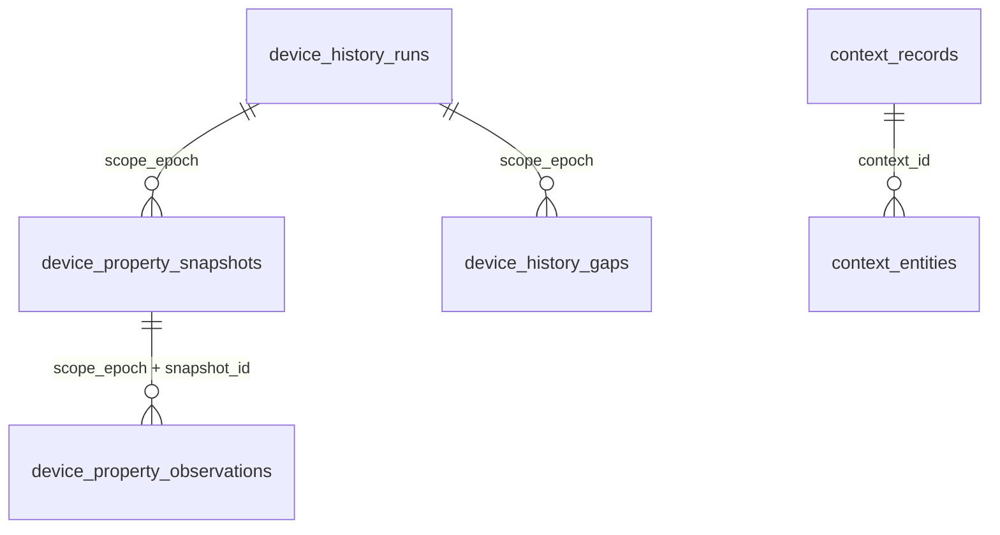

# 设备属性历史：存储与读取实施计划

**状态：待实施。** 本文确定设备属性报告的 PostgreSQL 表结构、采集接入、保存与清理、历史查询及交付步骤。Agent 综合入口由[数据交付计划](household-automation.md)维护。以下新增表、字段与模块均为实施目标，尚未写入生产代码或完成数据库验收。

[返回计划总览](README.md)

## 目标与保存口径

Backend 持续保存当前家庭已经接纳的设备属性报告。Agent 收到空调开启或设定温度变化后，能按设备、属性和时间取回报告序列，并通过综合历史入口查找同期环境温度、成员出现及整体音视频材料。Backend 提供原值、来源、时间、处理依据与缺口；语义关联由 Agent 处理。

保存范围为采集通路实际接纳的全部 `property` 和成功 `read` 观测，包括同值报告、读取候选、合法迟到与重放报告。不增加逐属性 `history_enabled` 名单，也不依据规则使用资格决定是否保存。底层使用无损压缩保存报告，默认历史查询把连续同值报告合并为一条；调查需要逐次时间时再读取原始点。物理存储、历史表达与模型上下文选取分别处理。

历史保存随 Backend 启动，不依赖页面或 Agent 在线，不增加云端订阅、周期读取或设备动作。数据库未配置或暂不可用时，停止历史写入且不暂存报告；当前采集按原有规则运行，恢复后只保存新报告。没有采集、没有接纳或已经丢失的材料无法由历史接口补造。

历史表达“Backend 收到了哪些报告，以及当时怎样处理”。两次同值报告之间没有新记录，不证明物理状态一直相同；报告变化不证明操作发起者。首次交付完成属性保存与 Agent 读取，页面属于后续消费者。

## 已有实现与接入边界

| 代码入口                                                                                                                                                            | 已有事实                                                                                                 | 本次接入                                             |
| ------------------------------------------------------------------------------------------------------------------------------------------------------------------- | -------------------------------------------------------------------------------------------------------- | ---------------------------------------------------- |
| [`db/schema.ts`](../../apps/backend/src/db/schema.ts)                                                                                                               | `context_records` 带 summary、certainty、data、evidence；`context_entities` 关联对象。没有设备属性历史表 | 在同一 Drizzle schema 中增加下述四表                 |
| [`identity/activity-repository.ts`](../../apps/backend/src/household/identity/activity-repository.ts)                                                               | 当前 `context_records` 的业务写入者保存、修订 `member_sighting`                                          | 成员记录继续由身份模块维护，综合查询按类型调用原仓库 |
| [`collection.ts`](../../apps/backend/src/household/collection.ts)、[`observations.ts`](../../apps/backend/src/household/observations.ts)                            | 采集覆盖当前家庭可订阅设备；接纳结果保留同值报告，也包括部分不改变当前值的报告                           | 提取历史，补充明确处理结果及缺口通知                 |
| [`runtime.ts`](../../apps/backend/src/household/runtime.ts)                                                                                                         | `subscribeFacts` 提供当次接纳观测、前后状态和可信变化；没有持久队列                                      | 历史服务独立订阅，固定数据后在提交上限内异步写入     |
| [`collection-policy.ts`](../../apps/backend/src/household/collection-policy.ts)、[`source-profiles.ts`](../../apps/backend/src/mijia/properties/source-profiles.ts) | 本机策略和来源契约已存在；米家读取为云缓存，来源采样时间未知                                             | 冻结当次适用说明，不把当前值期限当作历史过期时间     |
| [`binding-repository.ts`](../../apps/backend/src/household/binding-repository.ts)、[`homes/store.ts`](../../apps/backend/src/mijia/homes/store.ts)                  | 查询持共享绑定锁；重绑持排他绑定锁，同一事务清理业务数据并保存新绑定                                     | 历史读写与清理进入同一锁定和资格校验机制             |
| [`compose.yaml`](../../compose.yaml)、[`扩展迁移`](../../apps/backend/drizzle/0000_enable-timescaledb.sql)                                                          | 部署定义为 PostgreSQL 18 / TimescaleDB 2.30.1，迁移已声明启用扩展；尚无设备 hypertable                   | 只把属性观测建成按时间分区的 hypertable              |

上述版本是仓库部署定义，不代表已经检查正在运行的数据库版本。实施迁移前核对 `server_version`、`pg_extension.extversion` 与迁移状态。

## 存储决策

### 按写入、读取与删除方式建模

设备历史的基本单位是一条来源报告：属于具体属性，具有接收时间、原值和处理结果，只追加、不修订。主要读取是“这些属性在这个时间段的报告”，主要删除是保留期到期后的整段清理。

成员出现记录具有不同语义：同一记录随跟踪和身份归因被修订，关联多个对象，具有文字摘要和依据。让每个温度点都进入 `context_records`，会引入无实际用途的摘要、通用确定性字段和实体关联行，还会把两类数据的保留与修订机制绑在一起。

因此，**设备属性观测使用专用事实表；成员出现继续使用 `context_records/context_entities`；统一发生在访问校验和查询服务层。** 不为同一报告同时写两份记录。Agent 综合入口按 kind 调用对应仓库，不要求不同来源共享物理表。

### PostgreSQL 与 TimescaleDB 的分工

`device_property_observations` 使用 TimescaleDB hypertable，即由扩展自动按时间划分数据块的 PostgreSQL 表。时间键为 Backend 原始 `received_at`，因为它必有值，且查询与保存期限都以收到报告为依据；不能用可空或不可信的设备采样时间分区。

运行、属性说明快照和缺口使用普通 PostgreSQL 表。观测通过外键引用普通表。本次启用时间分块、列式无损压缩和保留策略，并用数据库查询形成同值报告段。连续聚合用于预先计算重复查询的统计或状态聚合，不能与物理压缩混为一谈，具体适用范围见下节。

相比普通表逐行删除，时间分块让到期清理直接删除旧块；相比自行维护 PostgreSQL 分区调度，复用已部署扩展减少运维代码。该选择依据持续追加和按时间淘汰的工作负载，不表示扩展一定能让小数据查询更快。[TimescaleDB 分区接口](https://github.com/timescale/Tiger-Data-Docs/blob/main/src/content/docs/reference/timescaledb/hypertables/create_hypertable.mdx)、[保留策略](https://github.com/timescale/Tiger-Data-Docs/blob/main/src/content/docs/reference/timescaledb/data-retention/add_retention_policy.mdx)。

### 无损压缩、同值合并与连续聚合

| 能力               | 实际作用                                     | 本项目的用法                                                         |
| ------------------ | -------------------------------------------- | -------------------------------------------------------------------- |
| Hypercore 列式压缩 | 改变物理存储，查询仍可恢复逐条记录           | 原始报告进入冷数据块后自动压缩，保留原始时刻与来源                   |
| 连续同值报告合并   | 把相邻重复报告表达为一段，不重复返回相同值   | 默认历史输出，使用 PostgreSQL 窗口函数完成                           |
| 连续聚合           | 自动维护按时间桶计算的聚合结果，减少反复扫描 | 环境温度的长时间趋势适合 count/min/max/avg；离散状态可评估 state_agg |
| 降采样             | 用较少摘要替代更细的数据，可能丢失细节       | 温度趋势可以按时间桶汇总；开关变化不能用平均值或只取桶末值代替       |

例如 `10:00 开、10:01 开、10:02 开、10:03 关`，默认返回“开，首次 10:00，最后上报 10:02，共 3 次”和“关，首次／最后 10:03，共 1 次”。合并的是收到的相邻报告，不能把 10:02 到 10:03 没有采样的部分伪装成被持续观测过。

本次同时减少物理存储和返回冗余：底层无损压缩，查询返回合并段。仅持久保存变化点及次数、删除中间报告也可实现，但它会丢失中间采样时间，属于有损保留策略，不是开启 columnstore 的效果；本计划不把两者等同。原始记录仍受保留期限限制。

历史同值合并由数据库计算：按逻辑属性、运行内 input_sequence 排序，使用 LAG 比较相邻行，再累计分段标记并 GROUP BY，输出首末时间、首末记录引用和 count。JSONB 比较使用原类型和值，不能把数字 1、字符串 "1" 和布尔 true 当作相同值。不能直接 GROUP BY value，把“开→关→开”的两段开合成一段。

值、说明快照、来源、采集代次、delivery_kind、disposition 或 reason 改变均新建段；两条报告之间有匹配采集／保存缺口时也断段。时钟不确定的运行暂逐点返回。缓存候选和重放不并入实时报告段。Backend 负责提供这些边界和访问资格，SQL 负责排序、比较与汇总，不在 TypeScript 里维护另一套历史合并状态机。[PostgreSQL 窗口函数](https://www.postgresql.org/docs/18/functions-window.html)。

TimescaleDB Toolkit 的 state_agg 能保存离散状态变化并通过 state_timeline 展开，但不是仅启用 timescaledb 扩展就已安装的能力。当前迁移只声明 timescaledb，没有 Toolkit。state_agg 的时间线也不会自动识别本项目的断连、缓存候选和来源质量边界；需要先按这些边界划分输入。它适合离散状态，不能把高变化率温度值都当离散状态。若采用它做持久聚合，应使用保留变化时刻的 state_agg，而不是只保留各状态时长的 compact_state_agg。[状态聚合文档](https://docs.timescale.com/api/latest/hyperfunctions/state-tracking/state_agg/)。

连续聚合与原始数据清理必须配套：需要独立保留聚合结果时，刷新窗口不能重新覆盖已经删除原始数据的区间，否则已有聚合可能被刷新为空；近期未物化尾部、迟到数据和桶边界也需参与读取。当前同值合并先用原生 SQL，不能因为连续聚合带有“连续”二字，就把它当成自动相邻去重开关。[连续聚合与保留](https://www.tigerdata.com/docs/learn/data-lifecycle/data-retention/data-retention-with-continuous-aggregates)。

### 查询字段用关系列，变化的说明用 JSONB

属性地址、时间、外键、处理结果用明确类型的列，供约束、连接、过滤和排序。属性值采用受限 JSONB 标量，保留数字、布尔、字符串和 JSON null；不存在属性时不插入一条“空值”观测。说明及本机策略采用有共享 schema 的 JSONB 对象。

单位、枚举、设备名和接纳时设备清单中的房间归属存入不可变快照，由多条观测复用。不依赖当前设备清单解释历史，也不复制整份 MIoT 规格或家庭设备清单。JSONB 不作万能载荷容器，不建立整列 GIN 索引，不同时维护多个值类型列或数值副本。JSON null 是合法报告值，SQL NULL 在 value 列禁止。[PostgreSQL JSON 类型](https://www.postgresql.org/docs/18/datatype-json.html)。

## 表关系与结构



设备历史与已有 `context_records/context_entities` 之间没有逐点外键。四张新表各自回答一个问题：

| 表                             | 一行代表                               | 数据性质                     |
| ------------------------------ | -------------------------------------- | ---------------------------- |
| `device_history_runs`          | 当前家庭的一轮采集运行及结束状态       | 运行期间更新，关闭后固定     |
| `device_property_snapshots`    | 一轮运行中某属性使用过的一份说明与策略 | 不可变，多条观测复用         |
| `device_property_observations` | 一次被采集通路接纳的属性报告           | 不可变，按接收时间分块与删除 |
| `device_history_gaps`          | 一个已知采集、保存或时间异常范围       | 可扩大、闭合；不改变原报告   |

`scope_epoch` 沿用现有运行标识，不另发采集会话 ID。它用于隔离旧运行，不是家庭身份或模型业务概念。账号、家庭身份保存在 runs；查询同一绑定跨重启的历史时连接所有对应运行，不要求记录的 scope 等于当前 scope。

快照按运行隔离：新运行需要某属性时重新固定说明；同一运行仅在说明、房间归属、策略或来源契约改变时新建快照。正常每个属性、每类来源、每轮运行只保存一份说明，重复量与报告数量无关。无需额外设备主数据表、全局规格版本库或全局内容去重服务。

### 字段与约束

以下 SQL 是结构契约。实现时由 `db/schema.ts` 唯一定义列、约束和索引，Drizzle 生成建表迁移；随后配置 hypertable 与保留任务，不维护第二份手写建表实现。

```sql
CREATE TABLE device_history_runs (
    scope_epoch uuid PRIMARY KEY,
    provider text NOT NULL,
    account_id text NOT NULL,
    home_id text NOT NULL,
    started_at timestamptz NOT NULL,
    closed_at timestamptz,
    close_reason text,
    clock_uncertain boolean NOT NULL DEFAULT false,
    CHECK (length(provider) > 0 AND length(account_id) > 0 AND length(home_id) > 0),
    CHECK ((closed_at IS NULL) = (close_reason IS NULL)),
    CHECK (close_reason IS NULL OR close_reason IN ('shutdown', 'revoked', 'interrupted'))
);

CREATE TABLE device_property_snapshots (
    scope_epoch uuid NOT NULL REFERENCES device_history_runs(scope_epoch),
    snapshot_id uuid NOT NULL,
    device_id text NOT NULL,
    siid integer NOT NULL CHECK (siid > 0),
    piid integer NOT NULL CHECK (piid > 0),
    room_id text,
    metadata jsonb NOT NULL CHECK (jsonb_typeof(metadata) = 'object'),
    source_kind text NOT NULL CHECK (source_kind IN ('push', 'read')),
    source_contract_id text NOT NULL,
    source_contract_version integer NOT NULL CHECK (source_contract_version > 0),
    read_semantics text,
    policy_version text NOT NULL,
    policy jsonb NOT NULL CHECK (jsonb_typeof(policy) = 'object'),
    captured_at timestamptz NOT NULL,
    PRIMARY KEY (scope_epoch, snapshot_id),
    CHECK (length(device_id) > 0 AND length(source_contract_id) > 0 AND length(policy_version) > 0),
    CHECK (
        (source_kind = 'push' AND read_semantics IS NULL) OR
        (source_kind = 'read' AND read_semantics IS NOT NULL AND length(read_semantics) > 0)
    )
);

CREATE TABLE device_property_observations (
    received_at timestamptz NOT NULL,
    observation_id uuid NOT NULL,
    scope_epoch uuid NOT NULL,
    snapshot_id uuid NOT NULL,
    input_sequence bigint NOT NULL CHECK (input_sequence >= 0),
    observed_at timestamptz,
    read_started_at timestamptz,
    source_id text NOT NULL,
    collection_generation text NOT NULL,
    delivery_kind text NOT NULL CHECK (delivery_kind IN ('live', 'baseline', 'replayed', 'unknown')),
    value jsonb NOT NULL CHECK (jsonb_typeof(value) IN ('number', 'boolean', 'string', 'null')),
    disposition text NOT NULL CHECK (disposition IN ('applied', 'candidate', 'ignored')),
    reason text NOT NULL CHECK (length(reason) > 0),
    applied_at timestamptz,
    stored_at timestamptz NOT NULL DEFAULT now(),
    PRIMARY KEY (received_at, observation_id),
    FOREIGN KEY (scope_epoch, snapshot_id)
        REFERENCES device_property_snapshots(scope_epoch, snapshot_id),
    CHECK (length(source_id) > 0 AND length(collection_generation) > 0),
    CHECK ((disposition = 'applied') = (applied_at IS NOT NULL))
);

CREATE TABLE device_history_gaps (
    id uuid PRIMARY KEY,
    scope_epoch uuid NOT NULL REFERENCES device_history_runs(scope_epoch),
    scope_kind text NOT NULL CHECK (scope_kind IN ('run', 'source', 'device', 'property')),
    source_id text,
    device_id text,
    siid integer CHECK (siid > 0),
    piid integer CHECK (piid > 0),
    started_at timestamptz NOT NULL,
    ended_at timestamptz,
    reason text NOT NULL CHECK (length(reason) > 0),
    dropped_count bigint CHECK (dropped_count >= 0),
    updated_at timestamptz NOT NULL,
    CHECK (ended_at IS NULL OR ended_at >= started_at),
    CHECK (
        (scope_kind = 'run' AND source_id IS NULL AND device_id IS NULL AND siid IS NULL AND piid IS NULL) OR
        (scope_kind = 'source' AND source_id IS NOT NULL AND device_id IS NULL AND siid IS NULL AND piid IS NULL) OR
        (scope_kind = 'device' AND device_id IS NOT NULL AND siid IS NULL AND piid IS NULL) OR
        (scope_kind = 'property' AND device_id IS NOT NULL AND siid IS NOT NULL AND piid IS NOT NULL)
    )
);
```

外键默认禁止删除仍被引用的父记录，不按父行级联删除海量观测。复合外键保证观测不能引用另一轮运行的属性说明，家庭归属沿外键唯一确定。不对 `household_directories` 建外键：它是当前设备清单缓存，不是历史身份主表。跨表完整性使用外键，不能用跨表 CHECK 代替。[PostgreSQL 约束](https://www.postgresql.org/docs/18/ddl-constraints.html)、[TimescaleDB 外键支持](https://github.com/timescale/docs/blob/latest/use-timescale/schema-management/about-constraints.md)。

字段说明：

- `metadata` 从已有设备和规格 schema 派生，包含 device_name、room_name、model、spec_id，以及该属性的名称、类型、单位、枚举、范围和 readable。未取得规格时 property 说明为 null，仍保留属性地址与原值。room_id/name 表达接纳时设备清单归属；迟到报告不能据此推断采样时房间。
- `metadata.spatial` 保存接纳时已取得的[空间观测绑定](../../apps/backend/README.md#空间关系资料)：只包含该设备适用的启用绑定及其目标空间、通道和端点说明，从空间共享 schema 派生。属性报告没有镜头通道，只匹配 `channel=null` 的绑定，不套用镜头专属说明。它与设备清单的 room_id 独立；未接入或未取得资料时为 null，已读取且无匹配绑定时为空集合。保存必要的 ID、名称、关联与说明，不复制整份空间配置，不对当前空间表建立外键。
- `policy` 保存已解析的属性策略，包括未配置时的默认 unknown 新鲜度含义；policy_version 沿用现有配置版本。来源契约取适配器实际 profile。说明是接纳依据，不会因新鲜度到期而使历史记录失去价值。
- `disposition=applied` 表示更新 Backend 当前值，不表示物理现实得到验证；candidate 表示读取候选；ignored 表示合法接纳但未采用。applied/candidate 的 reason 使用实际接纳原因；ignored 区分 replayed、unknown_delivery、baseline_after_value、older_observation。受限值从共享契约派生，不存任意错误字符串。
- `applied_at` 沿用已有术语；候选和忽略报告为 null。`stored_at` 是数据库事务内的写入时间，不冒充精确 COMMIT 时间或来源时间。
- `input_sequence` 是原采集处理序号，其中还包含非属性输入，不能用序号跨度计算丢失数量，也不作为 Agent 消费确认位置。
- `closed_at` 是确认结束或发现上次运行中断的时间。异常退出的准确发生时间未知。时钟跳变后把对应 run 的 clock_uncertain 标为 true，保留原时间，不要求墙上时钟永远递增。

### 索引、分块和记录身份

```sql
CREATE INDEX device_history_runs_binding_idx
    ON device_history_runs (account_id, home_id);
CREATE INDEX device_property_snapshots_property_idx
    ON device_property_snapshots (scope_epoch, device_id, siid, piid);
CREATE INDEX device_property_observations_property_time_idx
    ON device_property_observations (scope_epoch, snapshot_id, received_at, observation_id);
CREATE INDEX device_history_gaps_run_time_idx
    ON device_history_gaps (scope_epoch, started_at);

SELECT create_hypertable(
    'device_property_observations',
    by_range('received_at', INTERVAL '1 day'),
    create_default_indexes => false
);
ALTER TABLE device_property_observations SET (
    timescaledb.enable_columnstore = true,
    timescaledb.segmentby = 'scope_epoch,snapshot_id',
    timescaledb.orderby = 'received_at ASC,observation_id ASC'
);
CALL add_columnstore_policy(
    'device_property_observations',
    after => INTERVAL '1 day'
);
SELECT add_retention_policy(
    'device_property_observations',
    drop_after => INTERVAL '365 days',
    schedule_interval => INTERVAL '1 hour'
);
```

完整超过一天的数据块转列式压缩，近期块保留行式写入；这不是每条记录恰好满 24 小时即转换。按属性说明分组、按时间排序是初始压缩布局，应以实际每组行数、压缩比及查询计划校准。压缩前后的查询等价、记录身份约束、外键和重绑清理必须在部署版本上验收。[列式配置](https://github.com/timescale/docs/blob/latest/api/hypercore/alter_table.md)、[自动压缩策略](https://github.com/timescale/docs/blob/latest/api/hypercore/add_columnstore_policy.md)。

主键已有时间前缀，可扫描行式区间并分页；列式块的扫描同时受 segmentby/orderby 布局影响，不能把普通 B-tree 的计划直接当成列式计划。属性时间索引处理选定快照的等值查找加时间范围；快照索引把逻辑属性解析为跨运行、跨说明版本的全部快照。数据库按选择性决定先过滤属性或先扫描时间范围，不由应用先下载历史再过滤。[PostgreSQL 多列索引](https://www.postgresql.org/docs/18/indexes-multicolumn.html)。

接纳时已有 observation_id，历史写入直接使用它和原 received_at。时间分区上的唯一约束必须包含分区列，因此持久记录身份是 `(received_at, observation_id)`，不是单列 UUID 唯一约束。不额外保存一份全局 UUID 索引表。来源没有可验证事件 ID，不能以“时间相同＋值相同”消除供应商重复上报。[PostgreSQL 分区约束](https://www.postgresql.org/docs/18/ddl-partitioning.html#DDL-PARTITIONING-DECLARATIVE-LIMITATIONS)。

跨来源引用需要定位设备报告时，使用 kind、原接收时间与 observation_id。普通引用不阻止原始记录到期；长期保留依据须由具体消费者明确保存范围。

## 接纳与写入

### 固定原报告与解释依据

1. 在 `HouseholdRuntime` 启动采集前登记历史监听。运行进入可采集状态时固定账号、家庭、scope 和启动时间，数据库可用时创建运行记录；未能提交的报告不暂存。
2. 扩展 `reduceFacts` 的接纳结果，直接给出该报告的 disposition、reason、applied_at，以及实际使用的设备／属性说明与策略。来源契约 ID、版本和 read_semantics 由米家适配器放入类型化观测边界，领域函数只传递这些依据，不导入厂商 profile。现在 ignored 分支只返回原 event，不能靠读取稍后的 latest 还原原因。沿实际分支产生数据，历史模块不重新实现接纳算法。
3. 只保存非空接纳结果中的 property/read。非法值、过期运行、无资格设备等拒收不写成合法观测；可确认的拒收数量与原因通过缺口或采集诊断表达。connection、subscription、online 和显式 gap 用于覆盖说明，不能塞成虚构属性值。
4. 当前属性、来源契约与说明未变化时复用快照 ID；变化时生成新 ID。空间模块提交后刷新相关说明，历史接纳固定当时已取得的内容，不在延迟写入或查询时补读当前配置。相关绑定的修改、停用、删除或目标说明变化产生新快照，同值报告随之分段。未取得空间资料不阻塞属性保存。比较已解析的小对象，可用现有 `isDeepStrictEqual`。写入使用已固定的快照 ID、内容与 captured_at。
5. 提交内容不再变化。快照缓存只保留当前属性／来源及在途调用需要的项，归档版本由数据库持有；设备撤销和运行结束时释放缓存。

当前值仍由家庭状态机单独维护。历史保存失败不改变正常采集的当前值，当前值通知不等待数据库。

### 直接提交与失败丢弃

数据库可用时，通过已有 Drizzle / Postgres.js 连接池提交报告，在一个事务中保存所需运行、说明快照、观测与缺口。事务先保存父行再保存观测。当前读写边界使用 `createHouseholdBindingAccess`，复用绑定锁与数据库超时；不增加历史专用写入锁或提交结果确认流程。

历史采用尽力保存：数据库不可用时停止提交，不缓存报告、不重试失败记录、不补写故障期间的数据。故障恢复后只保存新报告。COMMIT 确认丢失时，原事务可能已经成功，按结果未知表达，不为了查明结果重放数据。

连接复用与重新连接交给现有驱动。故障期间借后续新报告低频尝试一次当次写入，初始最多每 5 秒一次；成功后恢复正常提交。这是探测连接是否恢复，不是重新提交旧报告，也不另设探测定时器。[Postgres.js 连接池与断连行为](https://github.com/porsager/postgres/tree/v3.4.9#the-connection-pool)。

应用只限制已提交但尚未结束的历史调用，初始最多 128 条或 4 MiB，超限跳过并记录缺口。统计包括驱动中等待连接的调用与其持有的说明数据；连接池的 max=10 只限制连接数，不限制排队数据量。正常报告直接提交，不为凑批增加等待；已有采集批次可使用多行 INSERT 减少往返。[Postgres.js 多行写入](https://github.com/porsager/postgres/tree/v3.4.9#multiple-inserts-in-one-query)。

发现断连或家庭资格失效后，使尚未执行写入的旧调用失效；驱动分配连接后、事务继续执行前都检查资格，避免连接恢复后发送旧报告。已经发送的请求等待数据库结果，失败或结果未知均不重放。停止服务沿用 Backend 现有关闭期限与连接池关闭流程，不另设历史排空阶段。

运行和不可变说明快照按固定键插入，已存在时使用 `ON CONFLICT DO NOTHING`；快照 ID 只对应固定内容。主键／外键保证记录身份和关联；JSON null 使用数据库 JSON 参数保存，不能写成 SQL NULL。输入先经共享 schema 校验，数据库仍拒绝的记录或已有采集批次报告错误并丢弃。缺口只保留原因、时间范围和计数等摘要，不保留待补写载荷。

## 缺口、重启与历史健康

`device_history_gaps` 区分来源不可用、订阅不确定、采集输入丢弃、历史提交超限、写入错误、非法值拒收、时钟跳变与异常退出。reason 使用共享 schema 的安全枚举。设备明确离线、来源中断与数据库故障分别表达。

scope_kind 为 run、source、device 或 property。device/property 缺口可进一步限定 source_id；未知影响范围扩展为 run。缺口保存已知时间边界，未知结束为 null。点状故障允许 started_at=ended_at；查询按闭区间证据与请求半开区间相交判断：`started_at < end AND (ended_at IS NULL OR ended_at >= start)`。

连续同原因、同范围故障可以合并；能排除重叠且准确计数时才相加，不能确认的 dropped_count 为 null。时钟回拨时保存覆盖已知时间点的最小／最大边界并标记 run 时间不确定，不制造负区间。

现有显式 gap 输入只更新计数与当前状态，接纳结果中没有完整缺口对象。本次需在同一次事实提交中传出原 gap 的原因、时间和可知范围；来源断开、订阅变化由该次 transitions 取得。计数器差值可核对数量，不能虚构精确起止时间或具体属性。

运行开始先登记监听，再固定已有 source_health/device_coverage，建立尚未确认的初始覆盖说明。确认连接或订阅恢复只能关闭对应技术缺口，不证明断开期间没有变化。保存恢复后继续接纳全部新报告，不合成缺口内的值。

首次可用写入保存 runs，退出时尽力更新结束状态。启动时在绑定访问事务中把当前绑定未关闭的旧 run 标为 interrupted，并保存运行级可能缺口。最后提交时间不是所有报告已保存的时间边界，仍可能存在尚未结束或已丢弃的提交。因此采用该运行开始至重新启动、与保留范围相交的保守区间，标明可能丢失且数量未知；时钟异常时扩大到已知时间边界，不冒充准确停机时刻。已保存观测仍然有效。

正常关闭先停止新提交；只有在途调用结果已明确且结束标记成功保存时才写 shutdown，否则保留未确认结束状态。访问撤销后不再提交旧报告，后续有资格的事务仅可补充运行结束与缺口摘要。数据库从未保存成功的运行可能没有运行记录，查询保持覆盖未知。单个本地部署仍只运行一个 Backend 写入进程，不引入多进程采集租约。

历史查询附带当前是否可写、在途数量、最近成功时间和安全错误原因，从实际提交结果派生，不维护独立健康状态机或“已保存”事件流。数据库断开期间仅在内存保留有界的故障起止与跳过数量摘要，恢复后保存为缺口；进程退出丢失这些摘要时，仍按运行中断或覆盖未知表达。

## 家庭生命周期与访问

查询和写入同时遵守当前家庭资格与数据库绑定。复用 [`accessHousehold`](../../apps/backend/src/household/access.ts) 和共享绑定访问；HTTP 处理时捕获当前运行校验闭包，事务内和响应前重新核验。查询同一账号、家庭的旧运行记录，不用旧记录的 scope 授权当前请求。

重绑沿用[清空数据并重新绑定](../household-runtime.md#切换家庭与清理数据)：

1. `homes/store.ts` 取得现有排他绑定锁。正在执行的历史事务先结束；之后旧绑定不能再启动合法写入。
2. 在保存新绑定的同一事务中清空四张历史表和原有家庭业务数据。历史表使用一次显式 `TRUNCATE device_property_observations, device_property_snapshots, device_history_gaps, device_history_runs`，不使用 CASCADE 扩大范围；保留表结构、索引、扩展与保留任务。
3. 事务确认后现有运行切换，尚未执行写入的旧调用失效，不得恢复已清空的数据。新家庭重新创建运行与快照。
4. 切换失败保留原绑定与数据。A→B→A 同样拒绝 A 的旧回调，不能只检查 account_id/home_id，捕获的运行资格也必须有效。

TRUNCATE 适用于本项目“整个本地部署只有一个家庭、切换即清空”的生命周期，会取得表级排他锁；不能复用为未来按家庭局部删除。实施时核对实际 TimescaleDB 上的事务回滚、外键与保留任务行为。[PostgreSQL 锁](https://www.postgresql.org/docs/18/explicit-locking.html)。

设备从当前设备清单移除不级联删除已保存报告，但立即停止接收其新报告。查询先确认家庭可访问，再按当前设备资格过滤；显式请求已撤销设备返回不可访问，不能用旧快照恢复资格。退出或家庭撤权期间不交付历史；恢复相同合法绑定后能查询仍保留的记录。数据清理沿用实际重绑行为，不把退出登录误写成已清空全部业务记录。

## 历史查询契约

首次对外接入 `POST /api/agent/context/history` 的 `kind=device_reports`，直接调用设备历史内部 query，只读本地数据库。

| 输入                | 约定                                                                                 |
| ------------------- | ------------------------------------------------------------------------------------ |
| account_id、home_id | 预期稳定绑定身份；与当前绑定不符返回 409，未授权拒绝                                 |
| representation      | 默认 runs 返回同值报告段；observations 返回原始报告点                                |
| properties          | 必填、最多 20 个 `{ device_id, siid, piid }`；从实际规格或历史说明识别能力           |
| start、end          | UTC `[start,end)`，按 received_at；单次跨度最多 7 天                                 |
| limit、cursor       | 默认 500 条、最多 2,000 条；基于排序键分页，不使用 OFFSET                            |
| include_preceding   | 默认 false；需要变化前背景时，每个属性额外取 start 之前最近一条仍保留的 applied 报告 |

返回 records、单独的 preceding、next_cursor、请求与实际保留范围、匹配缺口、覆盖限制和历史健康。每条报告展开所属快照的必要说明、稳定设备身份、原值、原时间、来源与 disposition/reason。内部运行标识与序号供程序校验，不要求进入模型默认上下文。

observations 模式的区间记录按 `(received_at, observation_id)` 升序。游标保留数据库时间精度，绑定账号、家庭、属性列表、区间、representation、include_preceding 和排序键。数据库时间经字符串传输，不能先转 JavaScript Date 丢失微秒后再生成游标。运行内先后可参考 input_sequence，跨运行排序不证明物理因果。

原始点查询连接关系：

```sql
SELECT o.*, s.device_id, s.siid, s.piid, s.room_id,
       s.metadata, s.source_kind, s.source_contract_id,
       s.source_contract_version, s.read_semantics, s.policy,
       r.account_id, r.home_id, r.clock_uncertain
FROM device_history_runs r
JOIN device_property_snapshots s USING (scope_epoch)
JOIN device_property_observations o USING (scope_epoch, snapshot_id)
WHERE r.account_id = $1 AND r.home_id = $2
  AND (s.device_id, s.siid, s.piid) IN (/* 已校验、参数化的属性条件 */)
  AND o.received_at >= $3 AND o.received_at < $4
  AND (o.received_at, o.observation_id) > ($5, $6)
ORDER BY o.received_at, o.observation_id
LIMIT $7;
```

首屏不带游标条件。传入属性与当前可访问设备求交，保留期条件同样进入 SQL。查询覆盖属性的所有运行与说明版本，不能只取最新快照 ID。include_preceding 使用同样访问过滤，在保留范围内倒序找 applied 点，保留原时间，不合成区间起点值。

runs 模式在数据库内对请求区间分段之后才分页，不能先 LIMIT 原始点再宣称拿到了完整段。段包含 first_received_at、last_received_at、first/last_observation_id、first/last_input_sequence、report_count 和共同值／来源说明；只描述本次请求范围内的报告，不声称覆盖完整生命周期。段按 `(first_received_at, scope_epoch, first_input_sequence, first_observation_id)` 排序，游标使用同一键且绑定 representation。聚合扫描仍受查询范围和 5 秒语句超时约束，超时要求缩小范围，不在应用中下载全量分段。

响应最多 4 MiB，包含记录、说明、preceding 和缺口。按完整行截断，以实际返回的最后一条生成游标，不跳过未返回行；单行或必要 preceding 无法容纳时返回容量错误，要求缩小范围。缺口最多 128 条，超限返回 `gaps_truncated=true`，不能宣称完整覆盖。

覆盖说明至少区分：历史尚未开始、存储不可用、当前尚在写入、已知缺口、超过保留期、来源未确认，以及成功但没有匹配记录。第一条现存记录不是采集起点；运行在线不证明来源完整。没有证据时 completeness 为 unknown。

分页不持有跨请求数据库快照。在途事务稍后提交或保留任务清理都可能改变后续页，响应明确非冻结读取。数据库故障期间没有保存的报告保持缺失；重新查询不能恢复它们。

实时推送与历史保存分别运行，共用原 observation_id。快照推送可能合并中间变化，历史写入必须逐条接收原接纳结果；“历史可查”不等于“每个变化都实时通知 Agent”。实时通路保证由数据交付计划定义。

## 保留、清理与容量

初始按接收时间保留 365 天、按天分块，完整超过一天的块进入列式压缩，每小时检查到期清理。Backend 环境配置新增 `DEVICE_HISTORY_RETENTION_DAYS`，默认 365，校验为正整数，重启生效。历史仓库在启动时核对并同步唯一 TimescaleDB 保留任务；修改失败公开错误，并使用数据库中最后确认的配置，不让查询口径与清理任务分叉。调整只改变仍有数据的范围，不恢复已删除记录。

保留截止时间按数据库当前时间和确认生效的保留天数计算。查询执行该边界，写入事务也拒绝已过期观测，不能只用进程时钟预检。TimescaleDB 仅删除整个已过期块，正常情况下物理存储可能多保留一个块及调度间隔，清理失败时可能更久。物理残留不能作为对外延长保留期的承诺。

元数据清理由迁移定义的 SQL 过程执行，并通过 TimescaleDB `add_job` 每小时调度；复用数据库任务的运行时限、失败重试与 job_stats，不在 Backend 增设维护定时器。过程取得现有共享绑定锁，删除超过保留范围且无观测引用的快照、已结束且不再解释保留区间的缺口，最后删除已关闭且无子记录的 run。每次有限量删除，用 `NOT EXISTS` 与外键保护关联；当前 run 不删除，写入始终确保所需快照存在。[TimescaleDB 任务调度](https://github.com/timescale/docs/blob/latest/api/jobs-automation/add_job.md)、[任务控制](https://github.com/timescale/docs/blob/latest/api/jobs-automation/alter_job.md)。

跨越保留边界的缺口整条保留，未闭合缺口先依据终止或恢复证据处理。清理不能制造孤儿，也不能让缺口先于它解释的、对外仍可读取的观测消失。

诊断按需读取 TimescaleDB 的 jobs/job_stats，展示压缩、保留与元数据清理结果，不另维护一份任务状态或轮询服务。磁盘占用、写入速率和执行计划由运维诊断查看，高频查询不执行全表精确 COUNT。保留天数不保证固定磁盘容量；资源不足时停止历史写入、公开故障，不暗中按值去重或缩短保留口径。

## 实施顺序与完成条件

### 1. 结构与迁移

在 `db/schema.ts` 定义四表及索引，从已有 schema 派生 `packages/api/src/contracts/device-history.ts`。已有 propertyPolicySchema／freshnessSchema 若需跨项目引用，移入 `packages/api` 并更新原导入，历史契约从中 pick 所需字段，不复制一份定义。历史时间列使用 Drizzle 的字符串模式，保留 PostgreSQL 时间精度。新增 `apps/backend/src/household/history/`，由该模块拥有快照固定、写入、缺口、维护与查询。Drizzle 生成建表迁移后追加 hypertable、列式压缩、保留策略及元数据清理过程与任务 SQL，避免重复时间索引。

完成条件：在隔离数据库核对四表、外键、时间分块、唯一键及清理任务；合法 JSON null 可保存，跨运行引用被拒绝，并发复用同一说明快照不导致报告写入失败。没有实际迁移验证前不标为可部署。

### 2. 接纳信息与历史写入

在 `observations.ts/runtime.ts` 补齐处理结果、说明和缺口的提交数据；在 `main.ts` 于采集启动前装配历史服务。接入现有连接池与绑定访问，完成提交上限、失败丢弃、运行记录与关闭处理。接纳算法仍属于家庭事实模块，SQL 属于历史仓库，协议转换由米家适配器负责。

完成条件：首次值、同值、候选、迟到和重放正确保存；改变名称、规格、单位、房间或相关空间绑定后，旧记录仍按旧快照解释；空间资料缺失不阻塞保存，数据库断开时不暂存、不重放，恢复只保存新报告；当前值提交继续运行，缺口摘要有界。

### 3. 生命周期与清理

将四表接入 `homes/store.ts` 重绑事务；完成锁次序、旧运行撤销、异常启动识别、保留任务状态与元数据清理。重绑继续复用既有事务结果确认能力，历史报告不增加重放或确认协议。

完成条件：重启可查相同绑定历史；正常与异常退出分别表达；清理与写入并发不产生孤儿；切换失败不清空原数据，成功切换后包括 A→B→A 的旧调用都不能恢复已删除记录。

### 4. Agent 只读查询

在综合 history 路由的 device_reports 分支注入内部仓库，接通同值段／原始点两种表达、属性筛选、时间区间、preceding、游标、字节预算、缺口和健康。类型从共享 schema、Drizzle schema 和实现推导，不维护平行 DTO 或手写返回类型。

完成条件：围绕真实空调开关和设定温度报告取得前后序列及同期环境温度；通过综合入口另取成员出现和整体音视频窗口中的转写。属性地址以真实规格为准，缺少环境温度传感器时明确说明。材料可用于调查，不承诺证明语音造成设备变化。

同时核对“开、开、开、关”合并为两段、“开、关、开”保持三段、断连前后同值不合并、压缩前后原始查询等价、跨说明版本／跨重启查询、相同时间多点、合法 null、空结果、过期记录、断库期间无缓存及恢复后仅保存新报告、前值已过期、响应裁减和访问撤销。用实际查询的 `EXPLAIN (ANALYZE, BUFFERS)` 检查区间与属性索引，依据规模校准预算；不以表已创建代替读取验收。

四步完成即交付设备历史能力。遵守[共同检查](README.md#每项交付的检查)：只运行受影响的最小现有测试，编写或修改测试、增加故障注入脚本须先取得明确许可。纯文档阶段不运行应用测试或修改数据库。实施后把实际配置、用法与未验证边界更新到设备事实及 Backend 文档，从本计划移除完成步骤。

## 后续消费者

历史页面复用同一查询服务，按绑定、属性、时间缓存，默认展示同值报告段，按需展开原始记录点，并保留处理原因、时间和缺口。请求取消和迟到响应按当前访问范围处理；不将空白插值成持续状态，不把历史响应写回当前值。页面不阻塞上述四步。

独立设备事件在来源真正提供 `siid/eiid`、事件参数和交付语义后再设计接入。本次不创建空的 device_events 表或事件路由。音视频、成员出现和后续 Agent 分析结果仍由各自拥有者管理，综合查询按时间与对象协调读取。
