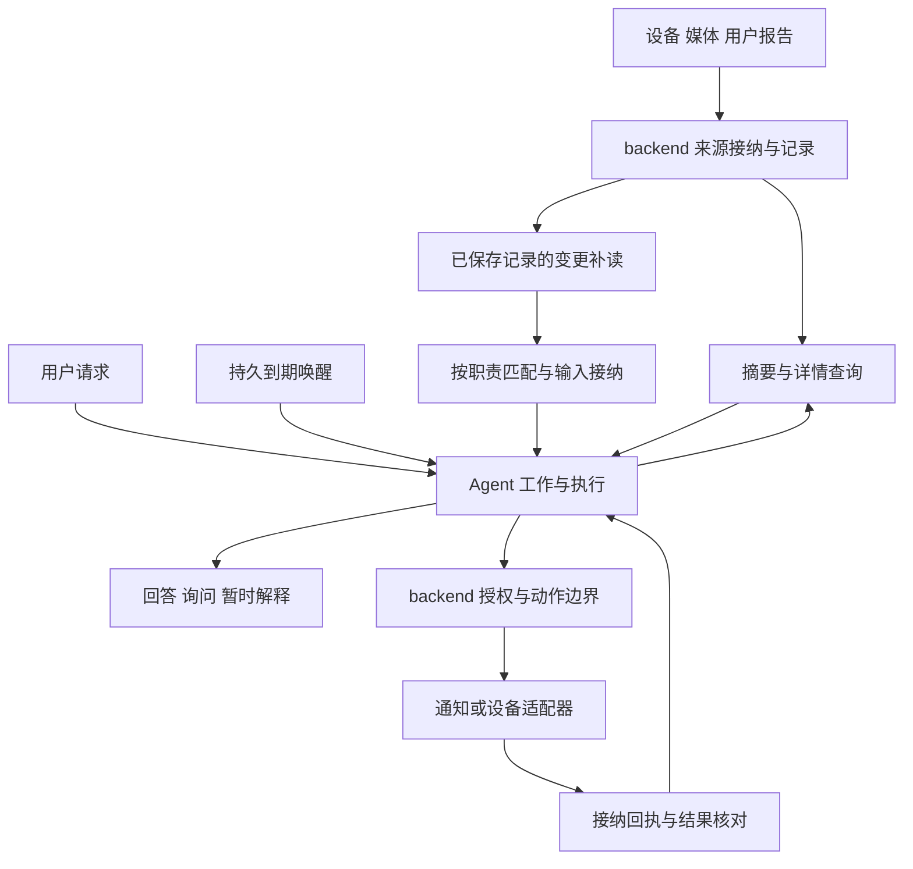

# 家庭观察与 Agent 工作协作设计

**状态：待实施设计。** backend 提供有来源、可查询的记录和有界材料，Agent 围绕用户职责解释、补查和请求动作。本计划按可用能力贯通生产者与消费者，不设统一的 backend 先行阶段；本地感知仍可独立交付。

信息含义与状态所有权见[家庭助手的信息边界与状态归属](household-model.md)，新增字段、事务、索引和清理唯一维护在[存储设计](household-storage.md)。本计划唯一维护功能交付顺序，不承诺建设通用活动合拆、占用重建或全家庭判断平台。

## 当前实现与缺口

| 链路与源码入口                                                                                                                              | 已有产物、保存和消费                                                                                                | 尚缺的能力                                                             |
| ------------------------------------------------------------------------------------------------------------------------------------------- | ------------------------------------------------------------------------------------------------------------------- | ---------------------------------------------------------------------- |
| [设备运行时](../../apps/backend/src/household/runtime.ts)                                                                                   | 当前属性及质量由内存状态维护；已有只读家庭工具，`subscribeFacts` 是内存通知                                         | 持久历史按设备计划接入；通知不是可恢复变化流                           |
| [成员出现](../../apps/backend/src/household/identity/activity.ts)、[写入](../../apps/backend/src/household/identity/activity-repository.ts) | `member_sighting` 保存到 `context_records`，当前实体关联写入 `context_entities`；按归因修订原地更新，保留原发生时间 | Agent 历史查询、可靠变更交付；不能从摄像头房间推断成员位置             |
| [数据库浏览](../../apps/backend/src/household-context/repository.ts)                                                                        | 已按表、文字及实体查询，记录按 `occurredAt/id` 分页，单行过大明确拒绝                                               | 面向任务的摘要、详情和最近出现排序；现有浏览接口不是直接可用的取证工具 |
| [窗口](../../apps/backend/src/perception/window/store.ts)、[装配](../../apps/backend/src/perception/service.ts)                             | 视觉变化或非空转写形成候选，通知接入媒体编码；摘要、转写及帧事实在内存                                              | Agent 窗口查询、持久材料接纳、非人声筛选；旧窗补转写会改变修订         |
| [窗口媒体](../../apps/backend/src/perception/media/window-media.ts)                                                                         | 原始输入默认 12 秒，压缩片段最多 30 分钟；容量可提前限制，重启不恢复旧引用                                          | 被持续工作接纳的必要材料保留与恢复；文本查询不等于模型实际收到媒体字节 |
| [房间分析](../../apps/backend/src/room-analysis/service.ts)                                                                                 | 设备变化合并、冷却和模型观测描述，调度状态在内存                                                                    | 不能复用为通用持久工作；房间总结不作为动作依据                         |
| [语音交付](../../apps/backend/src/conversation/speech-inbox.ts)                                                                             | 内存短时收件箱、去重及调用频率，Agent 仅判断是否完整助手请求                                                        | 不回复、不执行设备动作、不确认说话人，也不恢复持续职责                 |
| [聊天工具](../../apps/agent/src/household/tools.ts)、[Agent 存储](../../apps/agent/src/db.ts)                                               | 概览、设备清单、设备状态、成员资料四个只读工具；检查点及会话摘要已保存                                              | 记录与媒体工具、可靠输入、工作、动作均须接入；检查点不是工作账本       |
| [米家家庭选择](../../apps/backend/src/mijia/homes/store.ts)                                                                                 | 改绑清理上下文和成员，Agent 会话也有切换清理边界                                                                    | 稳定本地家庭与来源绑定分离；现行行为仍见家庭运行时文档                 |

当前使用方法及实景验证范围见[感知说明](../perception.md)、[设备事实契约](../contracts/device-facts.md)、[房间分析契约](../contracts/room-analysis.md)和各应用 README。上述缺口须经源码和实际链路交付，不能只修改文档中的名称。

## 系统结构与状态所有权

backend 拥有来源资格、材料、已接纳身份、记录修订和动作结果；Agent 应用层拥有职责、调查、工作进度和记忆。有限计时和明确条件由普通代码执行，模型只处理实际需要的解释。队列用于恢复相应业务操作，不额外拥有业务状态。

共享契约放在 `packages/api`，跨应用继续通过受控 HTTP 交互，不跨库读取内部业务表或建立联合事务。单个家庭仍运行一份 backend 和一份 Agent，不增加第三个后台服务。当前本机访问边界继续有效。

## 家庭生命周期

目标本地家庭独立于来源登录。backend 保存稳定家庭身份和来源绑定身份；Agent 工作、会话和材料保存该家庭身份。`scope_epoch` 继续隔离一次来源运行，不能用于判断历史属于另一个家庭。

- 来源暂时断开：历史仍带原时间，媒体按原期限与访问资格处理；依赖新观察的工作等待、降级或到期，不填补停机区间。
- 明确解绑或更换来源：先撤销旧来源读取与动作资格、终止对应在途访问，再按新绑定接入；本地成员、用户报告、工作及笔记不随之删除。历史来源记录是否可读由保存的授权范围决定，不能凭旧引用访问已撤权媒体。工作不能自动把另一个米家家庭当成原目标的来源。
- 明确重置家庭：持久记录重置请求，阻止新的工作和动作接纳，通知 Agent 清理旧家庭工作、检查点与记忆并取得稳定回执，再清理 backend 记录与自有媒体。完成后才启用新家庭身份；故障时恢复同一次重置，旧动作不得因重试复活。

修改现有 `mijia/homes`、Agent 家庭范围与重置接口、Web 登录门禁和清理提示时，须同步[家庭运行时契约](../contracts/household-runtime.md)及使用说明。这里是目标生命周期；当前切换家庭仍按[现行清理行为](../household-runtime.md#切换家庭与清理数据)执行。

## 记录查询

首批复用 `context_records` 与 `context_entities`，只接入真实已有的成员出现及窗口文字／事实。数据库浏览保留诊断用途，Agent 使用独立的有界业务查询：先摘要，后按编号补详情。

成员出现查询以当前归因过滤，以 `data.lastObservedAt` 选最近观察；现有 `occurredAt` 是首次观察，不能拿现有浏览排序直接回答“最后看到”。返回归因依据、修订、观察区间、来源摄像头、时间质量和位置未知。不同来源时间不可比较时并列说明。媒体过期或从未形成媒体不影响保存记录的文字解释，但工具必须明确媒体不可用。

窗口查询返回窗口身份与修订、实际覆盖、筛选依据、转写及紧凑帧事实。没有窗口可能是被筛掉、已淘汰或没有采集，不能说没有活动；迟到转写可能只剩文字。窗口查询不持久保存全部候选，也不保证用户以后还能重读。需要跨执行恢复时，再由材料接纳流程保存本次所需快照。

设备查询保留现有来源质量及新鲜度，不因新查询工具而主动触发云端读取。新增持久记录类型须有实际用途；设备原始历史按[设备历史](device-history.md)另行交付，不是成员出现查询的前提。

## 记录变化与唤醒选择

变化流只描述已保存记录的新增、修订或撤销，覆盖当前实体关联变化前后，供 Agent 发现旧记录纠正。它不命名“完成遛狗”或“饥饿”等现实含义。写入与变更登记在同一 backend 事务完成，按提交顺序补读；SSE 只加速通知，重启后依靠持久位置补读。

Agent 对每页变更确定性匹配工作关注的记录、主体和来源；纠正使用变更前后范围，避免记录被移出原主体后漏掉原消费者。接纳输入、安排处理和推进位置在同一 Agent 事务完成。没有匹配工作也推进扫描位置，但所引用记录被修订的笔记须标待复核。默认不为每条变化调用模型。

新职责“从现在开始”以 backend 已提交边界和注册时间定义，不从滞后的 Agent 消费位置起算。注册流程见[变更消费存储](household-storage.md#变更消费)。之前的积压可供显式历史查询；注册后才到的旧观察标为历史补充，不能直接当作新异常通知。

暂未接纳的密集线索可按工作、来源和有界时段合并；已接纳输入保留身份及实际内容。执行中到达的新输入留给下一次处理，不能覆盖冻结输入。若已知当前执行的依据被纠正，结果只能解释当时输入，须标明已过时或重新取证，不能继续作为当前建议发布。通知频率按职责、用途与目标限制，传输去重不承担现实活动关联。

变更已超保留边界时明确返回缺口。Agent 先持久阻止依赖完整消费的工作提交新动作，并登记对已登记及登记中执行许可的撤销交接；取得 backend 全部撤销回执后才确认自动派发已停止。交接未完成显示修改中，派发先提交的效果保留真实结果或未知，不能宣称撤回。随后重查当前依赖，记录无法恢复的部分后再从新边界继续；恢复动作须重新核验职责、依据与授权并取得新许可，不恢复旧许可。具体事务与恢复见[变更消费存储](household-storage.md#变更消费)。不可复原的过去输入不能补造为已处理。来源中断、历史补报、记录纠正与消费缺口分别记录。

## 用户报告与持续工作

首个持续职责是用户确认时间锚点后的一次到期提醒。它需要持久恢复与通知渠道，不需要媒体理解、通用活动实体或模型每次计时。

1. 保存用户请求的稳定输入身份、原文与时间解释。含糊时间先澄清；首个入口使用有明确会话与用户操作的文本请求，不把现有语音判断直接视为授权。
2. backend 以同一输入身份接纳用户报告；Agent 保存报告编号、修订、确认的锚点、间隔、时区、截止及通知目标。跨服务失败恢复同一输入，不重复创建报告或职责。
3. Agent 完成通知授权接纳与到期任务登记后才显示已启用；尚未取得通知渠道或稳定接纳回执时显示设置中或失败。
4. 到期处理读取当前工作、报告修订、授权和期限。仍合格则以该提醒槽的稳定动作身份交给 backend。提醒写明记录依据，完成后不自动开始下一轮；重复策略须另行明确。
5. 修改锚点或取消先阻止旧版本继续派发，再保存新状态及对应到期任务。已经派发或结果未知的通知保留原效果身份，不因新修订盲目重发。

工作可以随后扩展为有期限的观察职责：关注具体成员和已接入来源，按变化或定时查询材料，有必要时调用模型，选择回答、问询、等待或结束。首个观察职责只使用已验证的输入，不以静止猫叫等尚缺来源能力的场景充当验收。

等待保存问题、预期输入及截止，不保持长 HTTP 请求或占模型执行名额。用户回答按问题身份接纳；取消与新目标分别处理。无回答、材料不足或预算用尽时记录未解决结果，必要通知须已有授权；不能为了结束等待自动宣称现实问题消失。

## 材料交接与模型执行

文本快照与媒体字节分别保存。对一次执行，先确定材料是否必要、是否已准备、可读期限和总量，再接纳恢复责任。短期查询允许只得到文字或明确缺失；承诺排队后读取的媒体必须先取得持久保留回执，单独保存 URL 不足以恢复。

调查保存实际使用的文字快照，原记录的保留期不因 Agent 引用而延长。后续补查或动作核验发现原记录已清理时，历史解释可说明当时输入，依赖当前依据的操作须重新取证；具体清理交接见[保留与清理](household-storage.md#保留与清理)。

跨窗口前后媒体仅按明确问题申请。触发前材料须实际存在，触发后等待不得越过工作期限；来源失败或容量不足返回缺口。取得补查结果后新增不可变输入，保留各自查询时间；既有快照不变。文件落盘、数据库登记与失败清理见[材料存储](household-storage.md#材料与执行输入)，不假定文件与数据库同事务。

Agent 的模型适配把真正需要的图片／音频／视频转成端点支持的消息。返回媒体 URL 的工具不等于模型已收到媒体。具体型号与端点的模态能力须查官方资料并以真实素材验证；转写文字不能证明模型听过声音，稀疏帧不能证明连续活动。媒体来源与非人声能力见[媒体计划](media-perception.md)。

本地采集、房间分析与语音判断继续按各自已实现的入口和资源限制运行。新增观察执行单独声明每次最大调用数、时间和输入输出限额，并为每项职责设置每小时／每日自动调用上限；初次启用必须给出可见预算，缺少预算不启用后台模型工作。按实际调用预留并结算用量，可能已提交而结果未保存时保守记为未知，不借 SDK 重试、补查或新执行编号刷新额度。

查询工具和确定性提醒不依赖全入口迁移。只有新增可恢复模型执行使用相应持久调用记录；当前聊天、房间分析、语音判断不因此被称为已统一调度或共用全局预算。单一模型队列、三档优先级和所有入口统一账本不作为建设承诺；以后确有跨入口资源争用再据实设计，不能绕过各入口已有约束。

恢复先查输入和已保存结果，再决定继续处理。调用发送前保存身份和提交状态；重启后无法确定供应商结果的调用不自动重发，需要记录未解决结果或按明确的新请求策略处理。收到重复输入只返回原接纳结果，不能因此再次调用模型。后台工作故障不停止本地感知。

### 调查并发准入

C/D 新增的后台调查共用 Agent 进程内一个模型执行名额，由调查执行应用层统一接纳，所有调查工作合计最多一个在途模型请求。该上限只覆盖此路径；当前聊天、房间分析和语音判断保持各自限制，不声称服务整体只有一个调用。首批沿用单 Agent 实例部署边界。

待执行运行保留在 pg-boss 的持久任务中，由单个串行消费者推进，不预取到另一条内存等待队列；输入容量沿用存储设计的上限。创建运行时固定原截止，排队计入总期限；领取后先核对取消、修订、材料期限和预算，过期则保存未解决结果，不调用模型。无名额时不发送请求，也不把工作标为已开始调用。取消、到期处理和确定性提醒使用独立的短任务处理器，不等待模型名额。

名额覆盖一次请求的实际存活期，补查后的下一次调用重新准入；SDK 自动重试关闭。网络超时或取消必须等待底层请求实际结束后才能释放，无法确认结束时停止领取新模型调用并显示执行受阻，不能因 job 租约到期另开并发。重启后先按调用记录处理 `submitted/uncertain`，不重发可能已提交的调用；旧进程退出后，新进程才可接管本机名额，预算中的未知预留继续保留。

## 动作接纳与恢复

首个动作是到期通知，设备控制在型号写入与回执能力验证后接入。backend 独占动作状态；所有调用者提供稳定效果身份、家庭、授权引用、预期工作版本、期限与必要依据。普通接纳中，相同身份内容冲突拒绝，内容一致复用已有结果。提醒改期另走带预期动作修订的命令，在旧许可撤销、该效果从未派发时绑定新许可和新时间，保留原效果身份；细节见[执行许可与动作](household-storage.md#执行许可与动作)。

派发任务携带预期动作修订，旧修订任务结束而不发送。派发前重新核对来源资格、工作执行许可、明确禁令、最早及最晚派发时间和所依赖记录修订；尚未到用户确认的提醒时间不能发送，队列领取不代替时间核验。Agent 的工作状态不跨数据库事务读取；backend 持有最小执行许可，停用或变更先撤销旧许可并取得回执，再使新版本生效。该许可只控制副作用，不能成为第二份职责与调查状态。并发派发与撤销在 backend 同一许可锁下确定先后：派发已获准则可能产生效果，后到取消须如实说明。

backend 在同一短事务内登记派发状态、许可核对结果与必要输入，然后调用渠道。进程中断留下的已派发状态按结果未知处理；队列重试只核对状态，有供应商查询能力才查询，不能再发送一次。保存回执后 Agent 可按动作身份查询，不依赖一次可能丢失的回调。

记录纠正与依赖它的待派发动作阻断在 backend 同事务完成；Agent 后续再调整职责。对尚未提交的旧请求，派发前核对记录修订同样拒绝。已经生效的动作不因纠正从历史消失。

通知按用途、渠道和目标去重，不用接收人的互斥锁阻塞独立消息。设备控制的写规格、来源回执、冲突及确认能力按实际设备另行交付，不能承诺外部效果恰好一次；结果未知期间不盲目重复喂食等操作。

## 接口与工具

以下是待实现入口；共享 schema 随对应生产者与消费者一并交付，不创建空 API。现有四个聊天工具及数据库浏览保持当前契约。列表默认摘要，详情按需读取；初始新查询预算为每页 20 条、最多 50 条、响应 128 KiB、单次 5 秒，超出时返回继续读取入口或明确限制，不静默截断证据。数字是待验证的工程上限。

| 拟交付入口                                  | 用途与主要边界                                             | 消费者                           |
| ------------------------------------------- | ---------------------------------------------------------- | -------------------------------- |
| `POST /api/household/queries/records`       | 按主题、成员／来源、观察区间检索；稳定分页，返回来源与修订 | 聊天与工作工具                   |
| `POST /api/household/queries/record`        | 指定记录详情及当前修订；不可读与不存在分别说明             | 聊天、调查、执行前核对           |
| `POST /api/household/queries/last-sighting` | 读取当前归因下最后观察，返回位置依据或未知                 | 聊天、成员页                     |
| `POST /api/household/queries/windows`       | 对当前短期窗口提供精简查询，不承诺历史覆盖                 | 聊天；需要恢复时转材料接纳       |
| `GET /api/household/record-changes`         | 从提交位置补读，返回扫描水位、保留下界和缺口               | Agent 固定消费者                 |
| `POST /api/household/reports`               | 稳定输入身份、用户原文与确认时间；修订携带预期版本         | Agent 用户请求处理               |
| Agent 工作命令，经 backend 转发             | 创建、澄清、改期、暂停、取消、恢复及查询；请求身份稳定     | 聊天工具与工作页面               |
| backend 材料接纳与读取                      | 窗口／记录引用、所需表示、准备与保留期限；按回执读取       | 可恢复调查；不是首批只读查询前提 |
| backend 执行许可与动作接口                  | 许可登记／撤销、稳定动作接纳、结果查询                     | 工作处理器，后续设备控制入口     |

后三类写入协议在对应交付批次确定具体路径及 schema，不能作为当前客户端接口使用。其身份、事务和数据要求见存储设计。自然语言只能选择已实现的命令种类，禁止任意触发 JSON 或任意厂商 URL。家庭身份与访问资格由 backend 独立核对，不能相信模型传入的家庭编号。

页面随能力交付查询来源、工作状态、下次期限、等待原因、预算与动作结果；失败和缺失需要可见。无需先提供完整规则、户型或活动编辑器。

## 执行设施与选型

继续使用现有 Bun、PostgreSQL、backend 的 Drizzle/postgres.js 及 Agent 的 pg 与 LangGraph 检查点。首次需要持久唤醒时采用 pg-boss 12.36.0，分别在所属应用进程运行；查询工具不依赖该库。官方提供现有事务内入队与 Drizzle 适配，支持 postgres-js；接入本项目的事务与运行环境仍须验证。[事务适配依据](https://pgboss.io/api/adapters)、[数据库与 Bun 支持](https://pgboss.io/database-backends)。

业务写入与本应用唤醒使用同一数据库事务；跨应用通过稳定身份及回执恢复。队列表、领取、重试与迁移由库管理，不复制内部实现。延迟任务承载已承诺期限，处理器醒来后仍检查期限和业务资格；库的 job 身份不替代记录、工作或效果身份。[任务 API](https://pgboss.io/api/jobs)。

通知首个适配器可沿用既有选型 ntfy；实际端点、投递回执及失败语义须在通知批次验证。设备写入复用米家适配边界。媒体转换沿用现有 FFmpeg、sharp 等能力，声音分类候选及其资源限制由媒体计划维护，不因文档调整安装依赖或升级运行框架。

## 实施顺序与改动位置

| 批次                 | 交付与依赖                                                                               | 改动位置与完成条件                                                                                                                  |
| -------------------- | ---------------------------------------------------------------------------------------- | ----------------------------------------------------------------------------------------------------------------------------------- |
| A 已有材料查询       | 记录摘要／详情、最近出现、短期窗口文字与事实；不依赖持久任务或新模型                     | backend 记录查询、现有 `household-context` 与身份记录，`packages/api`、Agent `household/tools.ts`；真实材料可查、引用准确、缺失可见 |
| B 用户报告与一次提醒 | 稳定本地家庭、报告接纳、工作与到期唤醒、通知许可与结果；各层按该闭环同时接入             | `mijia/homes`、家庭记录与动作、Agent 工作／存储、Web 门禁与工作入口；确认时间→到期通知→纠正／取消可恢复，不要求活动识别             |
| C 记录变化驱动调查   | 已有记录生产者的修订变更、Agent 消费进度与一次有限文字调查；依赖 B 的工作及恢复基础      | 记录写入事务、变更查询、Agent 输入接纳／执行；选一个成员出现相关职责，重复、迟到和纠正不误触发                                      |
| D 媒体理解           | 可恢复媒体调查依赖 B 的家庭与工作基础、C/D 共用的运行和调用存储；不依赖 C 的记录变更消费 | backend 感知／材料、Agent 媒体适配与执行；排队过期、重启、撤权和真实模态效果分别验证，非人声另验                                    |
| E 按需设备动作与复用 | 已获授权的具体设备动作或重复稳定流程；须有真实写入与结果依据                             | backend 动作与厂商适配、必要共享契约和页面；不以新增通用活动、规则或记忆平台作为前提                                                |

媒体适配与真实模态验证可以同 B/C 并行开发，但不代表已交付可恢复调查。C/D 共用的运行、调用存储及调查并发准入由先交付的消费者带入，D 还须完成材料保留和恢复；不能只完成模型媒体输入就标记 D 完成。已有材料的即时文字查询仍属于 A。

每批只新增实际使用的文件与表。A 可先在现行绑定范围交付；B 才承诺来源切换后保留本地职责，须完成生命周期迁移。B 的通知是其完成条件，不等待 E 的设备控制。C 不要求媒体、自动声音识别或长期经验平台；笔记仅在有实际复用需求时接入。保留的本地感知校准与实景验收按所属计划独立推进。

新增职责必须明确来源、所有者、保存位置、查询、恢复、材料期限和缺失结果；这些要求由上文流程和存储设计共同落地。交付后用法进入当前功能说明，完成事项从计划移除，未完成能力继续保持待实施状态。

## 场景验收

| 场景                           | 必须核对的结果                                                                                                      |
| ------------------------------ | ------------------------------------------------------------------------------------------------------------------- |
| 查询某成员最近出现             | 按最后观察和当前归因检索，摄像头房间不冒充成员位置，原媒体缺失明确                                                  |
| 用户确认八点并要求八小时后提醒 | 用户报告、十六点期限和通知授权可追踪；无新观察也能醒来；不是证明未再遛狗                                            |
| 改为九点或取消                 | 未派发旧效果被阻止，同效果按新许可与动作修订重新排期；十六点改至十七点后旧 job 不提前发送，已发或未知结果不盲目重发 |
| 旧记录被修订、移出某成员       | 旧与新关联消费者都能发现；在途输入保留原样，动作核对当前依据                                                        |
| 重复交付、消费越过保留下界     | 稳定接纳，缺口可见；已交付及登记中的许可都撤销，回执丢失可恢复，确认前不显示已停止；不把漏读说成无变化              |
| 工作排队期间媒体过期或重启     | 已接纳材料按承诺恢复；未保留或已到期材料明确缺失，不换新画面冒充                                                    |
| 调查引用的原记录达到清理边界   | 历史快照仍可解释，原记录缺失明确；待派发动作被阻止，不能以快照代替当前依据                                          |
| 多项调查同时唤醒、排队超期     | 调查路径合计最多一个在途调用，超期不发送；取消和提醒不等待模型名额                                                  |
| 静止画面出现猫叫               | 当前入口缺口不被隐藏；新增声音能力单独验收，无证据不宣称识别成功                                                    |
| 来源解绑或明确家庭重置         | 撤权、工作降级与数据删除分别执行；旧请求不能跨家庭复活                                                              |
| 通知或设备请求回执丢失         | 保留未知与原效果身份，不通过重新分析重复派发                                                                        |
| 无人关灯缺少来源依据           | 拒绝启用该语义，不用超时策略替换用户要求                                                                            |

按本次能力运行最小相关验证；未经用户明确许可不新增测试。源码检查、模拟输入与真实设备结果分别标注，文档设计闭合不代表功能或实景验收已通过。
