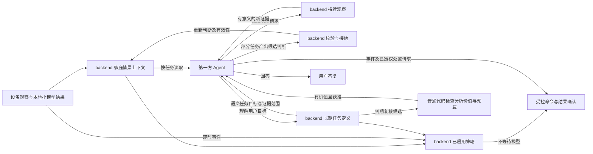

# 家庭领域模型：实体、观察、判断与行为约束

**状态：领域设计，尚未实现。** 本文定义家庭领域的实体、信息语义、状态所有权及业务不变量，不是数据库迁移或接口已交付的说明。字段名称表达所需语义，具体数据结构与校验规则（schema）、大小上限和实现模块在对应实施计划中确定。

本文的“设备清单”包括家庭、房间、设备及其归属。“公共状态”是后台已确认、供页面读取的数据，Agent 读取同一份数据；协议中的 `projection` 字段保存设备公共状态。`scope_epoch` 是当前账号和家庭这一轮运行的标识，下文的“作用域”指这轮运行。

**层次边界：** backend 的家庭领域负责家庭实体、空间、来源观察、已接纳判断、事件历史和生效中的行为约束，统一维护家庭情景上下文。backend 的感知处理只做采集、本地小模型判断与确定性前置筛选；全部 LLM（大语言模型）画面/声音理解、身份推断、上下文融合及需要推理的新决策由本项目第一方 Agent 负责；明确条件的即时响应由 backend 使用已有情景与已启用策略确定性执行，不等待 LLM；开放语义触发由 Agent 识别后请求处置。Agent 的 harness（管理任务、上下文、工具、模型调用和执行记录的运行框架）统一承载这些能力，让提示词、工具、上下文策略与模型选择共同演进。backend 校验并接纳 Agent 提交的带证据判断，管理有效性，并核对设备命令的执行条件、完成协议调用与结果确认。Agent 的长期记忆另行设计，不代替 backend 的权威家庭状态。

各能力的实施职责见[计划入口](README.md)，场景只依赖实际使用的能力。当前状态足以支持的分析不等待历史库，家庭语义不等待全部设备基础完成；需要历史、手机或视觉证据时分别接入。涉及物理动作时须先落实权限与执行边界。设备协议不自动扩大为人物、视觉或长期记忆协议，契约变化同步全部相关引用。

Agent 家庭任务可以暂缓：摄像头 P2–P4 的跟踪、音频、本地筛选及候选证据读取独立交付，设备属性采集、所需历史和页面也不反向依赖 Agent。此时不交付新的 LLM 语义或身份判断；候选无人消费时按限额过期。P5 才接入 Agent 消费与最小判断接纳，P6 再增加人物身份；不提前建设完整家庭语义数据库、长期记忆或设备控制作为前置条件。

具体实施以[第一方家庭 Agent 协作计划](household-automation.md)为准：基础维护持续提供家庭情景，长期任务直接消费；明确条件由 backend 本地执行，开放语义由同一 Agent harness 判断后提交事件及处置请求，两条路径共用执行边界。临时观察用于补充证据，不代替长期任务。该计划统一定义接口、人物位置、费用与交付顺序。

## 目标与范围

系统逐步理解家庭的成员、空间、设备和当前活动，回答：谁或什么，在什么位置，发生了什么，依据是什么，现在是否仍然成立，以及系统被允许做什么。

家庭构成可配置，不把人数、物种或数量写进类型。两位人类成员、一只狗、两只猫是一个实例；模型也允许访客、未识别的人或动物，以及暂时无法归属的占用证据。身份、布局和设备位置既可由用户预设，也可从观察中提出待确认信息，再逐步确认。

卧室和卫生间不部署摄像头，这些空间的判断与验收不依赖视觉输入。手机主动上传的亮屏／息屏事件、已有灯光与其他实际可用传感器可作为辅助证据；手机上报能力需单独验证，不视为现有接入已支持。视觉来源仅用于实际允许部署摄像头且覆盖明确的其他空间。

主要目标场景：

- 人来灯亮、人走灯灭：家庭层提供在场判断、场景语义与有效要求，Agent 提前参与理解要求和提出策略，backend 根据已有情景及已启用策略及时决定操作、执行命令并确认结果。
- 卧室已有可能休息的证据时，新的进入／存在信号不会单独触发主灯；没有成员定位证据时，不强行认定谁在床区或谁刚进入。
- 静止、手机没有新事件、传感器盲区或短暂失联不被直接解释为人员离开；单次异常存在信号也不直接构成可靠占用事实。
- 描述门的变化、人员通行方向，以及设备被调整的经过；只有证据足够时才归因到操作者和渠道。
- 将环境读数转换成有时间范围、覆盖说明和上下文的趋势或事件。
- 保存可解释的观察和事件历史，供 Agent 查询和提炼长期记忆；历史存储本身不承担记忆提炼。

## 实现位置与 schema 边界

沿用现有 backend 与第一方 Agent 两个本机进程，通过 HTTP 交换任务证据、上下文和受控提交。进程隔离使 Agent 重启或模型调用故障不停止采集；第一方身份由代码、harness 与上下文的统一所有权决定，不要求同进程。共享契约放在根目录 `packages/`，不跨应用直接导入实现，不为同进程运行预建另一套部署方案。下面是后续交付的职责位置，只按启用场景创建所需模块与数据结构。

| 位置                                   | 职责                                                                                                                            |
| -------------------------------------- | ------------------------------------------------------------------------------------------------------------------------------- |
| `apps/backend/src/household/`          | 实体与关系、设备观察、已接纳情景判断、有效要求、依赖失效、受控提交、查询与执行条件核对；复用现有家庭作用域与提交约定            |
| `apps/backend/src/perception/`         | 采集、检测、跟踪、音频能量/VAD、窗口与前置筛选；向 Agent 提供候选证据及有限期媒体引用，不调用 LLM                               |
| `apps/backend/src/household/identity/` | 已接纳身份、成员参考资料版本、确认计数与样本资格；通过确定性规则校验 Agent 证据并保存                                           |
| `apps/backend/src/mijia/`              | 复用现有账号与设备接入，按命令完成设备能力和授权检查、协议执行及结果确认                                                        |
| `apps/backend/src/db/schema.ts` 及迁移 | 保存档案、要求、选定判断与领域事件历史；复用数据库，不把全部语义塞入设备时序表                                                  |
| `apps/agent/src/household/`            | 在统一 harness 内组织媒体与家庭上下文、执行语义和身份推理、提交候选判断、提出策略及需要推理的新操作；后台任务不混入用户聊天记录 |
| `packages/api/src/contracts/`          | 前后端及 Agent 共用的类型化 schema；设备契约按实际依赖实现，家庭语义契约按具体场景增加                                          |

语义 schema 分为实体／关系、来源观察、待校验判断／已接纳判断、领域事件和有效要求。先为首个场景定义所需的具体判别类型、字段与校验，不建立任意 JSON 事实袋，不一次实现全部人物、视觉或记忆结构。名称不是身份；观察、推断和要求不能互相代替。新增类型需要公开哪些数据、如何编号版本，以及数据大小、保留时间和访问权限，都随该功能一并定义。

各生产者提交的待校验判断至少表达目标实体、判断维度与值、证据引用、适用时间、所用依赖版本和不确定性；backend 家庭领域校验后分配正式判断身份、版本与接纳时间，并决定有效期。模型不能自行赋予正式版本、延长证据寿命或获得控制权限。schema 校验和接纳成功表示符合系统接纳规则，不证明推断在物理世界中必然正确。

backend 是已接纳状态的唯一所有者，Agent 只保留本任务使用的上下文快照与推理记录。身份确认次数、样本资格和判断有效性等确定性领域规则归 backend；模型识别、证据解释与候选选择归 Agent。带相同任务/结果身份的重复提交不重复累计确认次数或刷新证据时间，接纳回执与模型完成状态分别表达；具体去重保留范围随首个场景定义，不把 checkpoint 当作 backend 已接纳的证明。

### 状态归属与上下文组合

backend 是家庭状态的权威边界，各领域模块分别拥有自己的状态，不把所有数据合并进一个 XState actor 或设备公共快照：

| 状态                                     | 所属模块与协作方式                                                           |
| ---------------------------------------- | ---------------------------------------------------------------------------- |
| 家庭运行资格、设备清单与设备当前值       | 家庭运行时；当前值随设备采集计划接入，沿用设备状态的原子提交                 |
| 原始视觉／音频观测、轨迹、媒体与筛选证据 | perception；家庭领域通过证据引用使用，不再维护一份可独立修改的检测结果       |
| 已接纳情景判断及其有效性                 | household 中的判断模块；按目标对象与判断维度维护                             |
| 身份确认、成员参考资料及样本资格         | household/identity；感知轨迹只提供关联证据，不拥有正式成员身份               |
| 生效要求及冲突                           | household 中的要求模块；按明确目标、权限和期限维护                           |
| 长期任务、领域事件及动作记录             | backend 对应领域保存定义、发生经过、期限和执行结果，不交给设备历史尽力写入器 |
| 任务输入快照与执行记录                   | Agent；不成为另一份权威家庭状态                                              |

上下文查询组合各所有者的已提交数据，保留实际依赖和版本；已有判断可保存不可变的必要证据摘要，但不另建持续更新的原始观测镜像。跨领域变化通过明确的提交与失效入口协调，不承诺多个独立存储自动构成同一事务。查询发现依赖尚未核对时返回待重评或缺失，不能把过渡状态用于动作。只随实际场景拆分模块，不为每种实体预建状态机或事件总线。

## 信息分层

| 类别     | 内容                                                 | 更新依据与边界                                   |
| -------- | ---------------------------------------------------- | ------------------------------------------------ |
| 家庭档案 | 成员、宠物、设备、空间和稳定关系                     | 用户登记、设备清单、经确认的发现；名称不是身份键 |
| 来源观察 | 设备上报、手机状态事件、视觉观察、语音输入、控制日志 | 保留来源、采集时间、覆盖与质量；不改写原始证据   |
| 当前判断 | 成员位置与活动、区域占用、房间综合状态               | 从观察推导，带支持与冲突证据、有效性和版本       |
| 事件经过 | 状态变化、通行、行为、控制与结果                     | 保留当时的参与者、地点、证据和未知项             |
| 行为要求 | 已接纳的临时指令、持续规则、可执行偏好设置           | 谁提出、约束什么、何时有效、如何结束和冲突处理   |

长期记忆位于 Agent 层。记忆中的“某成员可能偏好较暗灯光”只是推理背景；只有经授权转换为具体、可校验的配置或要求后，才作为有效要求进入家庭上下文并参与 backend 执行条件核对。

来源有效不等于推断正确。例如摄像头连接正常且画面时间可信，只证明图像来源可用，不证明模型把两只猫分对了。设备读数质量、识别把握程度和派生判断的有效性分别表达，不能共用一个“可信”布尔值。

## 实体与关系

### 成员与可观察对象

人和动物使用稳定的实体身份，种类、名称、角色和外观描述作为属性。首期成员登记与身份／位置维护须覆盖人、猫、狗；统一使用 `member_id`，物种是明确属性，不以人物专用键承载宠物身份。物种、姓名和轨迹编号分别表达，不能把“检测到猫”当作识别出某只猫。已登记成员身份与摄像头临时跟踪 ID 分开；同一个对象跨镜头出现不能仅凭临时编号合并。

观察到未知对象时允许建立临时观察对象，记录待确认的身份，而不强行命名。重复看见可以帮助聚类和提出待确认的身份，但不能据此认定是家庭成员、确定手机属于谁或取得控制权限。身份合并、拆分与纠错保留依据；历史保留当时识别结果，并能关联后来的修正，不悄悄重写过去。

成员当前状态按维度表示：位置、活动、姿态或休息迹象、最近确认时间及当前可见性。不要把“在卧室、躺着、可能休息、被遮挡”塞进一个互斥枚举；也不要把没有观察到等同于不在家。睡眠相关表达默认是休息迹象或推断，不宣称仅凭息屏、关灯、静止或画面确认真实睡眠；无对应来源的姿态、可见性与精确位置保持未知。

### 人宠出现记录与最后出现房间

首期人宠位置能力回答“已登记成员最后被看见在哪个房间、什么时候”，不承诺现在仍在那里，不要求还原跨房间路径。每路画面可独立核验身份，再按 `member_id` 汇总；局部连续跟踪用于选择代表画面及减少重复核验，不是出现记录的必要条件。连续身份延续、跨镜头匿名对象关联和通行事件属于后续目标。

出现记录是家庭领域接纳的带证据判断，不是原始检测，也不等于设备观测规则。`household/identity` 拥有成员匹配依据与纠正，`household/presence` 拥有出现记录及最近位置视图；媒体像素、原始检测和轨迹仍归 perception。以下是批次 C 的数据边界，具体共享 schema 随该功能交付，不提前创建空接口。

| 对象与字段                                  | 含义与约束                                                                                                                                                                          |
| ------------------------------------------- | ----------------------------------------------------------------------------------------------------------------------------------------------------------------------------------- |
| 出现记录 `sighting_id / revision`           | 正式记录及纠正版本；保留稳定家庭身份、提交时 `scope_epoch`、原始证据引用和接纳时间。运行 epoch 用于接纳资格，不作为跨重启历史的家庭身份                                             |
| `species / member_id`                       | `human / cat / dog`；未能确认已登记身份时 `member_id` 为空。未知猫的记录不能更新指定宠物的位置，不要求创建全局匿名身份                                                              |
| `area_id / coverage_revision`               | 目标实际所在区域及所用覆盖映射版本；区域未知时为空。摄像头安装位置不能代替覆盖判断                                                                                                  |
| `observed_at / time_basis / uncertainty_ms` | 证据对应时间、来源拍摄时间或宿主接收时间的依据、已知误差上限；误差未知用空值，不当作零。当前 P1 只有本机接收时间，不能冒充拍摄时间                                                  |
| `source_ref / evidence_refs`                | 来源适配器可核对的原记录与证据身份；当前本地来源包含设备、通道、运行和帧序号。供应商编号只在对应来源作用域内唯一                                                                    |
| `identity_assessment_ref / status`          | 所依赖身份判断及版本；记录为 `accepted / disputed / retracted`，接纳不等于物理世界中绝对正确                                                                                        |
| 汇总 `member_id / revision`                 | 每成员一份派生视图；backend 普通代码从适用记录计算，不由模型直接覆盖                                                                                                                |
| `latest_sighting`                           | 最近被看见的记录引用、时间与可为空的区域；未知房间也保留，因此不会掩盖更新的观察                                                                                                    |
| `last_located_sighting`                     | 最近能确定房间的记录引用、区域及原时间；可能早于 `latest_sighting`，不因新观察刷新旧房间的时间                                                                                      |
| `resolution / candidate_refs`               | `resolved / unknown / conflicted`；可比较且有唯一最近观察为 resolved，无可用观察为 unknown，无法合理排序或存在不能消解的冲突为 conflicted。冲突时保留候选，不按结果返回顺序任选一个 |

例：10:00 在客厅确认团子，10:02 在覆盖未知的镜头再次确认团子。`latest_sighting` 指向 10:02 且区域为空，`last_located_sighting` 仍为 10:00 的客厅。回答应为“最后确定房间是客厅，10:00；10:02 又被看见，但房间不明”。`resolution` 为 resolved 只表示最近记录已确定，不表示最新房间已知或现在仍在客厅。

同源同运行可用帧序号检查先后；跨源结合时间依据及误差比较。不能用模型完成时间、HTTP 接收顺序、不可比时钟或未知误差推造严格先后。重复原证据不新增独立确认、不刷新时间；迟到但仍可接纳的结果补入对应历史区间，不能覆盖更新观察。新一帧实测可在经过验证的身份延续规则下成为新证据，预测框不能。

首期同宿主来源可以按完整画面的接收时间汇总“最近收到的有效观察”，但查询须保留 `time_basis`，不将该顺序宣称为严格拍摄顺序或移动路径。宿主时钟回退、不同来源时间不可比或证据相互矛盾时保留候选与限制；不能把未知传输延迟当作零误差。接纳结果的 HTTP 到达时间与上述画面接收时间是不同字段。

身份或覆盖纠正触发依赖记录与汇总重评；原始观察和纠正依据保留。断流、空检测、记录变旧不产生离开事件，也不让最后出现的历史事实自动失效；当前仍在的判断另有新鲜度和覆盖要求，自动化不能把历史位置直接当当前位置。保存已接纳记录的必要证据摘要与版本，原始媒体按自己的期限释放；首期提供有界查询和明确保留策略，不建设逐帧永久历史。重启可恢复最后已知记录，家庭改绑不得串用。

以后接入 Frigate 时由来源适配器转换其摄像头、事件、时间与可用媒体引用，仍通过同一证据与判断接纳入口；事件标签和外部编号本身不证明已登记身份。将来轨迹引用、跨源对象关联、活动和通行事件均引用已有出现记录及判断版本，不改变最后出现位置的含义。首期不预建插件体系或 Frigate 专用真值表。观察到的活动使用 `activity`，系统执行的控制／通知使用 `action`。

### 空间、布局与覆盖

空间支持家庭、楼层、房间和区域，例如卧室内的床区、门口与走道。连接关系表示哪些空间通过哪扇门相连，包含明确的两侧与方向基准；“内／外”必须指明相对于哪扇门或哪个空间，未知时不猜。

户型图是布局的输入与参考附件，不是必须存在的前置条件。没有精确尺寸时可以只有拓扑关系；有图纸时保存其版本、坐标基准及标注关系，不能把图片像素直接当真实距离。识图或运行观察得到的房间连通、区域边界先作为待确认的布局信息。

设备关系至少区分安装位置、测量范围、视觉覆盖、遮挡区域和作用范围。摄像头位于客厅不代表能看到整间客厅；空调的作用区域也不必等于安装点。设备属于哪位成员、手机归属和设备控制权限分别建模，不从物理位置推断权限。

布局和覆盖发生变化时，应重评依赖它们的当前判断；历史仍引用采集时的布局版本。

### 与供应商设备清单的关系

一个本地实例长期绑定一个实际住家；首次设置从供应商账号下选择家庭，重新绑定先可靠保存新绑定，成功后撤销旧运行并初始化新家庭；保存失败保留原家庭。供应商账号不是家庭成员，供应商房间也不是完整的空间布局模型。成员、局部区域和本地关系使用自己的稳定身份，设备与房间通过显式来源引用连接供应商设备清单，不把成员伪装成设备或编造 siid/piid。

供应商名称和规格保持原语义，本地别名、布局和用户确认信息单独维护。断网或设备清单同步暂时失败不会删除本地家庭知识；明确访问撤销立即停止相关来源与动作资格。未来若接入多个供应商，需要独立定义家庭映射与权限，不能按名称自动合并。不交付多账号或多家庭同时守护，也不为维护改绑要求热切换。

## 观察与当前判断

设备观察沿用设备采集计划；手机状态事件、视觉、语音与操作日志需新增各自的判别类型及来源契约，不强套 MQTT 订阅、设备属性新鲜度或数值采样规则。

每份观察须能说明：来源、所在家庭与空间、采集时间或区间、接收时间、数据覆盖、处理版本，以及可引用的证据。视觉结果额外记录摄像头、布局／覆盖版本和识别依据；媒体留存与访问策略另定，不承诺永久保存原始画面。

人及猫狗的身份关联与位置维护的具体范围见[身份与位置处理](household-automation.md#4-身份与位置的本地处理)：backend 持续维护关联与有效性，Agent 按需核验；轨迹消失不证明离开，摄像头所属房间不等于目标区域。

原始媒体可读取期限、单帧检测新鲜度、模型运行期限与判断有效期互不替代，具体媒体边界见[摄像头计划](media-perception.md#媒体与判断的期限)。缓存淘汰只表示不能重新取得原媒体，不抹掉已接纳的过去观察；晚返回的历史窗口判断不能因此冒充当前状态。当前判断是否仍适用由证据时间、连续性及领域规则决定，不按最后一次查询或模型返回时间续期。

当前判断表达“系统根据证据认为”：主体、判断维度和值、成立时间范围、支持与冲突证据、推导方式及版本、最近评估时间和失效条件。至少可区分有支持、暂定、冲突和未知；最终枚举在语义实施阶段统一确定，不由自然语言生成任意新状态。

具体规则：

- 缺少传感器活动、画面没看到人，只有结合覆盖和遮挡条件才可能构成离开证据。
- 有既往位置证据但当前传感器无法确认时，可保留“最后确认在该区域、现在无法确认”，不能无限保留为已确认占用。
- 依赖失效时降级判断并终止不再成立的持续计时；backend 按已启用策略、当前上下文与有效要求处理即时照明行为，不把保守行为写成事实。
- 冲突不靠“最后收到的覆盖一切”解决。保留各来源陈述，由明确的融合策略选择结论或保持未知。
- 模型输出的自评概率不直接视为已校准准确率；未建立校准依据时使用定性判断和证据说明。

### 无摄像头空间的辅助判断

手机亮屏／息屏只描述该手机的状态。来源契约须验证平台权限、后台上报、延迟／补发和断连行为，区分事件发生时间与 backend 接收时间；久未收到消息不表示持续息屏。手机与成员由用户明确绑定，设备归属不证明当前操作者，也不证明该成员正在卧室。

卧室休息判断可结合已验证的手机事件、主灯／床头灯状态及变化、已有存在／门磁等来源和时间情境。各证据必须具有适用空间与有效期；没有定位证据的手机事件只能作为成员层面的辅助信息，不能自行定位到卧室或床区。卫生间同样只使用该空间实际可用的非视觉证据。

- 主灯关闭、床头灯随后关闭、相关手机息屏且存在证据支持有人，可支持“卧室可能有人准备休息”；组合仍是推断，不等于确认睡眠。
- 一部手机亮屏不否定其他人仍在休息，也不直接构成自动开主灯的授权；关灯状态不证明是谁操作。
- 手机失联、延迟补发或证据冲突时，不刷新为新的休息／醒来事实。照明策略的处理结果与休息判断、用户禁开要求分别记录。

### 房间综合状态与受控冗余

允许保留成员状态之外的房间／区域综合状态，供页面展示及 Agent 判断照明、音箱、窗帘等设备操作使用。它是带依据的派生结果，由一个模块统一更新，并记录所依赖的证据、计算版本与失效规则；其他消费者只读，不各自改一份。

例如已有证据支持“卧室可能有人休息”，随后出现新的进入／存在信号，不能自动清除原休息判断；只有存在相应身份与位置证据时，才进一步描述为“A 可能在床区休息、B 进入”。房间占用还可包含未识别人员证据，因此不能只统计已命名成员的位置。

依赖变化时重算或先标记待评估；异步模型还没返回时，不把旧综合状态标成与新事实完全同步。自然语言说明由结构化判断生成，不充当独立事实库。重启后档案可恢复，动态判断必须重新核验，不把保存的旧状态自动标为实时。

## 事件与归因

设备状态初值、恢复值与边沿沿用设备采集计划/6 的区分：收到“开”只证明收到该状态，满足连续基线与边沿条件后才记录“观察到关→开”，不能从恢复快照补造变化。

领域事件回答谁／什么、何时、在哪里、发生了什么，附带前后状态、相关实体与证据。参与者、地点、方向和渠道允许未知或尚待确认；不为生成流畅句子填补缺失信息。

区分三种记录：来源观察、整理后的领域事件、需要唤醒 Agent 的任务触发。领域事件不必每条都唤醒 Agent；同一个领域事件也不能仅因重新摘要或展示就变成新事件。[设备事件输入](household-automation.md#设备事件输入)中的 semantic_event 是规则触发传输协议，不等于已经具有完整的家庭事件历史。

| 场景                | 可直接记录           | 额外结论需要的证据                                                                       |
| ------------------- | -------------------- | ---------------------------------------------------------------------------------------- |
| 门磁报开            | 收到该门为开的状态   | 谁打开、从哪侧开、谁通过，需要身份、两侧布局、轨迹或其他关联来源；开门人不一定是通过的人 |
| 空调设定改变        | 设定从某值变为另一值 | 操作者及语音、手机、遥控器、自动化等渠道，需要相应命令／审计链路；仅时间接近不能证明因果 |
| 听到调整空调的语音  | 某条请求被识别       | 是否送出命令、设备是否执行、是否达到目标，必须分别确认                                   |
| 多人进入后 CO₂ 上升 | 两类事件的时间关联   | 关联可以提供解释线索，不能仅凭先后顺序认定因果                                           |

系统自己的动作应关联任务、指令、发出渠道、设备响应和状态验证；供应商未暴露外部操作日志时，外部操作者与渠道保持未知。重新识别后的事件修正保留关联，不再次触发原物理动作。

## 环境语义与触发

保留原始单位、读数质量、有效覆盖和空间范围，在其上计算当前水平、趋势、持续时长及措施后的变化。房间内某个传感器的读数不能无依据扩展成全屋状态。

事件策略按能力、房间和用途配置，首期考虑的策略包括持续越界、变化速率、偏离历史基线和恢复。每条策略需要明确窗口、最低有效覆盖、进入／退出阈值、持续时间、重复提醒间隔和缺口处理；具体参数由实测与用户偏好确定，本篇不预设温度或 CO₂ 的通用健康阈值。

离线、过期或数据不足时返回未知，不能计算成稳定、正常或恢复。异常判断的历史基线要区分时段和使用情境；不能让持续异常自动训练成正常。设备历史计划的观测记录不证明任意区间内持续成立。趋势与条件时长按该场景的实际来源、缺口和算法另行计算，不把点记录连成完整经过。

开窗、空调调整等事件可用来观察后续效果；没有可比较的前后覆盖时，效果标为未知，不据此形成可靠经验。趋势与基线检测超出设备事件模板的标量比较范围，必须独立实现计算与验收。

## 用户要求与动作决策

用户要求是独立的规范信息，不是观察结论。至少记录提出者、目标空间／设备／成员、允许或禁止的行为、生效时间、结束条件、来源和确认状态。临时要求按明确时区解释并给出实际截止时间；含糊的“今晚”等需采用可见约定或澄清，不能悄悄变成永久规则。

“A 在卧室休息”可以支持勿扰判断；“卧室接下来一小时不要自动开主灯”即使无人也继续有效。不要用同一个 room_mode 字段同时表达事实和要求。

明确有效的禁止约束不能被自动学习的偏好覆盖。同级明确要求发生冲突时，标记冲突并暂停受影响的自动动作或请求澄清；不能只按最后一段模型文本覆盖。撤销、到期和成员权限变化均需要触发重评。手动关灯可作为推测用户意图的一条线索，其自动抑制范围与期限须由明确策略决定，不能从一次关灯推断永久偏好。

家庭情景独立于具体业务持续维护。Agent 异步理解证据、提出或修正身份、位置和活动判断，backend 接纳并维护其有效性；已确认身份沿可靠本地跟踪持续更新，不逐帧调用 LLM。提醒到期或规则触发时直接消费已有情景，不临时请求识别人宠身份和位置；无有效位置按任务的未知分支处理。

用户要求可转换为 backend 保存的长期任务。明确条件使用已实现模板形成确定性规则，创建或修改后条件求值无需 LLM；动作计划也可确定性描述且所需情景仍有效时，本次规则执行不需要模型；模糊条件由第一方 Agent 对合格证据判断，可通过工具直接提交事件及已授权处置请求。两者共用 backend 动作入口，检查权限、去重并保存执行结果，不要求模糊事件先变成长期情景再启动另一轮推理。具体契约、四类场景及交付顺序统一见[长期任务与持续情景](household-automation.md#3-长期任务与持续情景)。

运行时能用普通代码、本地能力和已有有效情景确定的部分直接执行，只有仍需语义理解或开放推理的部分才调用 LLM。创建规则时的语言理解、提前生产情景和具体业务执行分别记录；输入曾由模型推断，不要求消费它的规则再次调用模型。缺少确定性模板不能自动归为模糊语义，未知输入也不能靠即时模型调用替代已约定的处理分支。

条件判断和动作决策是两个独立维度：本地条件可以触发 Agent 动作决策，Agent 语义条件也可以接确定性动作。按已知位置选择音箱等步骤虽读取上下文，仍由普通代码执行。本项目的规则运行器归 backend 任务领域，不向米家云端部署规则；供应商仅执行经适配的设备请求。运行器消费家庭情景而不拥有另一份情景，动作领域统一管理执行结果。详细模块职责和装配过程见[本地规则运行器](household-automation.md#backend-本地规则运行器)。

长期任务的启停意图、依赖生产能力的健康和具体情景的质量分别表达；启用时核对实际运行，依赖变化时重新评估资格，不以一次未知值或备用渠道掩盖维护已经停止。事件接纳到规则更新须有可恢复交接，不能只保证已生成动作的投递恢复。具体机制与验收见[依赖启用](household-automation.md#依赖启用与运行健康)和[事件交接](household-automation.md#情景事件与统一执行)。

家庭事件记录发生经过，当前情景记录现在的判断，两者不互相替代。“上次遛狗时间”从已接纳且未被纠正的遛狗事件推导；没有事件不证明没有遛狗。开放危险识别无需 backend 穷举识别逻辑，但疑似事件、证据、任务关联和处置仍由 backend 管理。仅 LLM 能识别的条件存在识别延迟，不能承诺事件发生即响应；本地已可确认的条件无需等待模型。

策略限定目标、触发条件、允许操作、权限、期限和冲突优先级，并明确上下文未知、冲突、过期时的处理。策略只能使用已实现的条件与动作，Agent 提议经受控接纳和授权后才生效，不执行模型生成的任意代码。带不确定性的情景可以作为策略输入；确定性规则不意味着输入判断绝对正确。策略判断与实际命令分开，backend 在执行前再次核对当前条件、权限、有效要求、设备能力和命令期限，完成协议调用及结果确认。事件到处理决定的延迟与设备命令确认延迟分别测量，具体目标随场景确定，不宣称物理设备有硬实时保证。

第一方 Agent 同时负责理解音视频和根据家庭上下文作任务判断；自动音视频任务先经 backend 本地筛选，再由 harness 决定是否调用模型及使用哪些上下文，遵循[摄像头计划 P4/P5](media-perception.md#p4-窗口前置筛选与裁切)。筛选通过只产生候选，不强制一次模型调用。Agent 可以在同一任务内结合媒体、设备观察、既有判断与用户要求分析，不必先等待 backend 生成一份 LLM 场景结论。统一 harness 不等于所有任务共用同一个聊天会话或模型；缺少、过期或裁减的信息如实表达。Agent 停止时，本地采集、筛选、确定性派生及已有判断的过期处理继续，新 LLM 语义、身份推断及需要模型的新决策暂停；已启用策略仍由 backend 执行，所需判断失效时按该策略的未知／过期分支处理；媒体按限额过期，不积压等待 Agent 恢复。

自动候选的去重、合并、过期和预算准入先由普通代码完成，不为筛选再调用一个 LLM。用户明确要求查看当前画面时，可按任务范围读取静止画面，不受自动变化筛选限制；设备事件任务的视觉补证须在场景中明确启用。两者仍受来源资格、媒体期限和 Agent 总预算约束，不能把全部被筛掉的窗口转换成按需任务。未知、未过闸与“没有活动”分别表达。

需要 Agent 决定动作的规则先可靠登记决策请求，决策接纳后才生成动作；事件身份、获准触发变化与提交重试身份分开，允许同一事件的有效升级触发而不把普通更新当新提醒。交接与去重的唯一实施契约见[规则到 Agent 动作决策](household-automation.md#规则到-agent-动作决策的交接)及[事件与统一执行](household-automation.md#情景事件与统一执行)。

设备命令与通知共用动作阶段的可靠意图登记、去重、期限和结果管理；供应商适配负责实际投递及确认，超时结果不明时不盲目重发。动作、事件及长期任务按需保存到 backend 数据库，Agent checkpoint 不承担执行账本。设备基础与仅分析阶段不交付这些能力。

## 自动建模与 Agent 长期记忆的边界

家庭模型的自动建立与 Agent 长期记忆是两件事。前者发现可能的新成员、形成空间标注、设备覆盖和当前活动等领域数据；后者从经历中提炼偏好、习惯和经验，辅助后续推理。两者可以使用模型计算，但不能因此合并两层的管理职责。

初始化支持手动登记、导入户型或设备清单，以及运行中发现。发现结果先作为待确认信息保存，并附上证据；自动确认的范围须有明确策略。反复出现的未知对象不自动变成家庭成员，模型估计的设备布局不自动覆盖用户确认位置。涉及 LLM 的待确认信息由第一方 Agent 的观察或交互任务提出，backend 负责验证、接纳、版本和纠错。

backend 向 Agent 提供有来源的当前判断和事件；需要历史的场景使用已实现的有界查询。事件重传和同一观察的多次摘要保留关联，不能伪装成多个独立经历；证据被修正或删除时须可被消费者识别，证据过期则明确不可获取。Agent 如何提炼、检索、遗忘和修正长期记忆，另写 Agent 层设计，不由设备历史写入模块或家庭状态机实现。

两层通过以下边界协作：

| 信息或操作                   | 负责确认与维护的模块                   | 跨层规则                                                                                                              |
| ---------------------------- | -------------------------------------- | --------------------------------------------------------------------------------------------------------------------- |
| 成员登记、房间连接、设备覆盖 | backend 家庭模型                       | Agent 可提出待确认信息，通过受控命令确认；不能只写一条记忆就改变身份或布局                                            |
| 当前观察、活动判断与事件历史 | backend 各所属领域模块                 | Agent 按任务读取；模型转述不成为新证据，也不刷新观察时间                                                              |
| 成员偏好、习惯和经验的推测   | Agent 记忆层                           | backend 不将其直接当事实或规则；Agent 使用时保留不确定性                                                              |
| “接下来一小时不要开主灯”     | backend 生效要求                       | Agent 理解语言后提交明确目标、期限和来源，backend 接纳后才生效；不依赖 Agent 持续在线记住它                           |
| 根据记忆提出的行为建议       | Agent 提出，backend 接纳明确要求或配置 | 明确权限、条件、作用对象和有效期，供任务推理使用；获准并启用的具体策略可由 backend 确定性执行，单条记忆不直接触发命令 |

原始媒体、领域事件和身份样本由相应 backend 模块确定保留与访问范围；Agent 记忆单独定义保留策略。身份样本不因 Web 能看设备状态就全部广播。历史可支撑记忆，但不保证 Agent 自动获得全部历史或断线期间的事件。

## 家庭情景上下文的生产、接纳与消费

第一方 Agent 具有双重角色：它消费 backend 提供的证据与家庭情景上下文，也产出其中一部分情景判断。设备观察和确定性派生可由 backend 直接形成；需要语义理解或跨来源推断的判断由 Agent 提出。Agent 可只消费上下文回答问题或完成任务，不要求每次调用都产出新判断；其候选经 backend 接纳后，才成为后续可消费的家庭上下文。接纳不会把同一份推断变成新的独立证据，也不自动触发下一轮模型调用。

分析入口包含设备／家庭事件、媒体候选和定期家庭情景综合；定期综合主动读取有界概览与近期经过，不必先有已识别的语义事件或提醒任务。定时唤醒先由普通代码检查分析价值和预算；时间条件改变也可触发复核，不能只看设备值有没有变化。调度配置归 backend 长期任务模块，理解与上下文选择归第一方 Agent，具体机制见[三种分析入口](household-automation.md#三种分析入口与定期情景综合)。

来源与语义层次分别表达：设备报告、本地规则派生及 Agent 推断共用家庭接纳边界；观察说明收到什么，判断说明系统认为怎样，事件说明某个时段发生或发现了什么。出粮不等于进食，靠近食盆不等于确认饥饿；“猫可能饥饿”保留为带依据的判断，“发现饥饿迹象”可按场景规则形成事件。观察、判断和事件身份相互引用；重复总结不成为独立证据，不重复制造提醒事件，过期不等于状态相反。详见[多来源判断与事件](household-automation.md#多来源判断与事件猫可能饿了)。

例如，Agent 消费“客厅有人、灯已关闭、过去曾有休息迹象”等证据后，可以只回答用户问题，也可以提出“客厅可能有人休息”的候选判断。backend 接纳后，该判断可供之后的照明任务使用；它仍是带原始证据与有效期的推断，不会因为被再次读取而变成实测事实。用户答复、情景判断提交和设备命令是不同输出，完成其中一项不表示其余两项也已完成。

backend 家庭领域维护已提交的设备事实和家庭模型，向页面与第一方 Agent 提供家庭情景上下文，并为命令通路提供执行条件。backend 接纳基础观察、确定性派生及 Agent 候选判断时，校验家庭作用域、输入证据、实际依赖版本与结果年龄。失效结果不能覆盖新状态，可按历史策略留作过去的观察；家庭其他无关字段更新不应使全部模型结果失效。接纳过程不再调用 LLM 复判。

模型计算按职责归属：backend 的 `perception` 执行本地小模型与前置筛选；Agent 的 `household` 任务在统一 harness 中执行所有语义 LLM 调用、上下文融合和动作推理。媒体接入、筛选与 Agent 证据交付见[摄像头感知与推理接入计划](media-perception.md)。耗时推理不进入[家庭状态机](../household-runtime.md#领域职责与状态)的同步提交或设备采集计划的规则回调；返回值作为新的、有来源的输入，模型不可直接修改整个家庭对象。轻量确定性派生可以同步计算，房间综合状态由家庭领域统一接纳并维护。

backend 提供候选证据、有限期媒体引用、家庭概览、相关判断、成员资料与有效要求；Agent 按任务需要取得这些材料，与可用记忆一起组装上下文，并可继续按需查证。媒体读取仍由 backend 核对范围、运行资格和期限，引用失效时明确缺失，不能用新画面冒充旧窗口。提示词、模型能力验证、调用预算、重试与执行记录由 Agent harness 统一管理；backend 不持有另一套语义提示词或模型供应商客户端。全屋概览帮助发现跨房间关联，全部原始媒体、规格和无限历史不默认进入提示词。上下文不足或裁减须明确表示，不能因没带某实体就推断它不存在。

设备状态版本不自动涵盖另外存储的布局与要求。backend 返回的家庭上下文至少标明生成时间、`scope_epoch`、设备 `state_version` 以及实际使用的各领域版本；引用关系应可核对。Agent 另行标记本次使用的记忆来源，不把记忆检索结果冒充同一家庭状态版本。版本变化提示重新核对实际依赖，不直接等于证据被推翻；无法核对或前提已失效时标为待重评或失效，不作为动作前提。具体接纳规则见下节，列出版本号本身不能代替一致性校验。这只是系统已知信息的一致组合，不证明所有传感器在物理同一时刻采样。

### 判断接纳与并发更新

首个语义场景一并定义可提交证据的描述、校验期限和保存上限；设备 latest 被后续上报替换后，仍须能核对原任务证据。backend 保存必要的不可变依据，不仅凭 Agent 自报的值或 checkpoint 接纳；媒体的具体交付与保留方式见[证据期限](media-perception.md#媒体与判断的期限)。这不要求永久保存所有观测。

接纳时区分三个用途：

- **过去窗口的解释**：保留原证据区间和处理版本。后来出现新观测不抹掉过去；媒体已删除时只能说明已保留的依据，不能声称仍可回放。是否保存此类结果由场景历史策略决定，不能将其自动发布为当前判断。
- **当前适用的判断**：核对来源资格、证据年龄、连续性、实际依赖及冲突。新帧到达、同值上报或展示字段更新不单独否定旧证据；新位置证据、覆盖变化、证据修正或相关要求变化则按该判断的依赖规则处理。无法确定影响时降级或拒绝当前接纳，不靠反复调用模型强行追平版本。新观测也不自动延长旧判断的有效期。
- **动作执行前提**：执行入口重新核对当前权限、要求、设备能力和命令依赖条件。判断曾被接纳不等于之后的动作仍可执行。

每个语义场景定义“目标对象＋判断维度”的更新规则，提交包含所依据的该维度版本和证据引用。同源顺序执行不能解决不同来源任务同时判断同一房间的问题；接纳入口在同一次领域提交中核对目标版本并更新。目标已变化时按明确规则合并仍适用的证据、保留冲突或拒绝更新，不按响应到达顺序覆盖。重复结果沿用原提交身份，不重复累计确认或延长有效期；关联同一底层观察的多个推断不算多份独立证据。没有定义融合规则的场景保持未知或冲突，不临时用另一个 LLM 仲裁。

### 共用 Agent 执行边界

任务来源、工具、预算、取消、重试与输出契约统一见[协作实施计划](household-automation.md#7-第一方-harness-的执行路径与费用)。家庭领域只拥有已接纳状态及其有效性，不持有 Agent 执行队列；模型任务结束、checkpoint 保存和领域接纳是不同结果。

### 生成与消费闭环

1. backend 接纳设备、手机或基础感知等来源观察，维护来源时间、质量与作用域。
2. 相关证据变化、明确要求变化或判断到期触发所属模块重评：确定性状态派生直接计算，自动音视频候选先经 backend 对应任务的本地筛选（场景变化或身份问题与证据质量），再由 Agent harness 按上下文与预算准入；其他 Agent 任务按实际场景触发。重评不直接等于模型调用；判断到期可先标为过期，不为刷新有效期绕过筛选发送静止视频。各自限制任务数量，不对每条重复上报调用模型。
3. 对应生产者读取任务需要的证据、既有判断和要求，产生结构化的待校验判断；未知身份与位置保持未知，不直接改写家庭对象。Agent 可只消费上下文完成任务，不要求每次消费都提交新判断。
4. backend 家庭领域校验提交权限、作用域、引用证据、实际依赖版本及结果年龄，接受这份判断或返回拒绝原因。相关输入已过时的结果不覆盖当前判断。
5. backend 发布已接纳判断并提供家庭情景上下文，供页面与 Agent 按需消费；依赖实质失效、过期、被修正或无法核对时，由 backend 降级或失效，不依赖下一次聊天才更新。
6. 即时事件由 backend 使用已有情景、有效要求和已启用策略直接处理；异步 Agent 可以继续补证和更新后续判断，不阻塞当次响应。需要推理的新操作由 Agent 另行提出。两类命令共用 backend 执行条件核对和结果确认，执行记录反馈到家庭上下文；迟到判断不自动重放已处理动作。

派生结果保留原始证据关联。重复提交、模型转述及同一观察的多次摘要不构成独立新证据，不刷新有效期，也不单凭自身发布再次触发同一评估循环。评估调度、提交身份与重复处理在首个语义场景的实施契约中确定，沿用既有作用域机制，并随首个场景接入上述共用执行入口。

### 设备副本与语义上下文

沿用现有第一方 Agent，按场景复用只读设备状态订阅与事件流；传输范围按实际消费决定。Agent 按任务使用触发证据及相关当前状态，不以全量副本追平作为所有任务的前提。副本只读不禁止 Agent 经受控命令提交待校验的语义判断；最终状态仍由 backend 接纳并发布。

Agent 按任务从 backend 的已提交状态读取有界的家庭情景上下文，与设备副本的证据及版本关联。新增家庭语义不自动进入设备公共状态，不扩大原有完整快照的 8 MiB 大小上限；如需新增订阅实体，在语义实施阶段定义明确的访问范围与同步契约。设备数据继续走已定通路，不并行维护第二套设备镜像。backend 负责家庭情景上下文的组织与查询，Agent 负责选取其中与自身任务相关的内容并组装任务输入；既不把全部家庭资料默认放入模型提示词，也不把模型 token 窗口当作网络快照大小上限。

## 场景实施与验收

交付顺序、首个客厅情景的维护规则、只记录结果的即时策略，以及设备事件接入统一见[协作实施计划](household-automation.md)。设备采集、历史与页面各自的依赖见[实施入口](README.md)，不维护另一套阶段顺序。

无摄像头卧室先验证真实灯光、存在等来源，形成有依据的暂定休息判断；缺少成员与区域定位时保持未知。手机事件需单独验证后才参与，手机归属不证明操作者和位置。已有休息证据不因新的进入信号自动清除；明确禁开要求不因无人而失效。判断、要求及策略处理分别保存，不通过伪造占用维持禁令。

每个实际场景沿用本文的来源、推断、要求和动作边界，并定义该判断的支持、冲突、过期及未知处理。Agent 暂停时本地维护和已启用策略继续；未经真实命令通路验收，策略只记录处理结果。长期习惯、未知人物建档和自动样本积累按需求另行设计；通知渠道按协作计划的动作阶段落实，不当作已实现能力。
