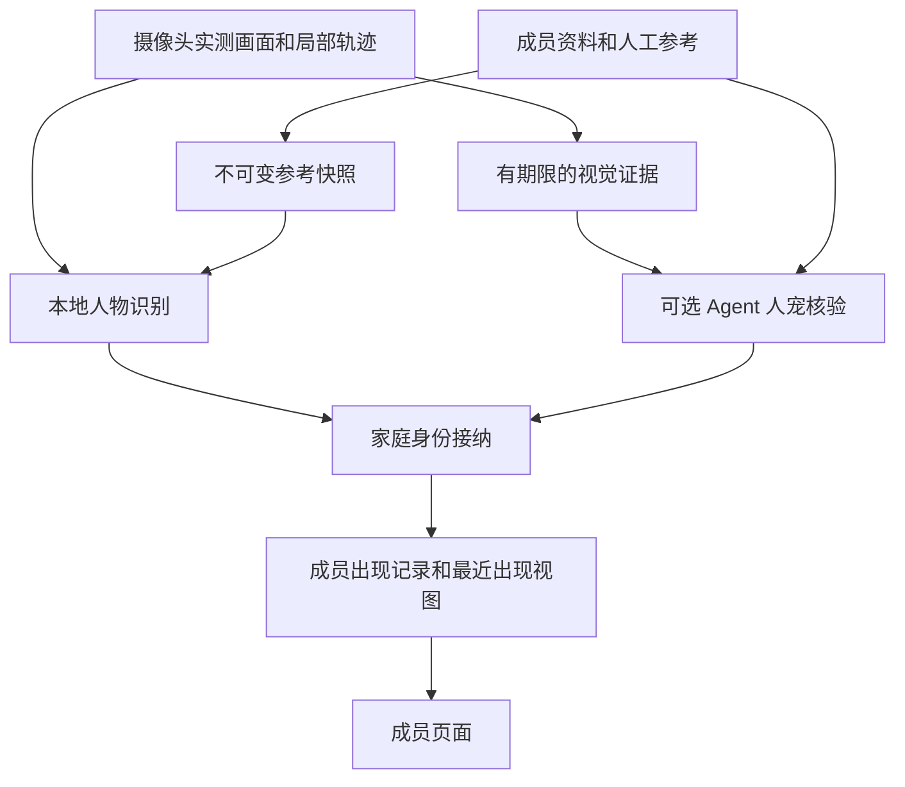

# 成员身份关联方案对比与落地建议

**状态：待实施建议。** 本文基于 2026 年 10 月 4 日核对的本项目源码、MiLoCo 固定提交及社区官方资料，回答现有成员如何与摄像头身份分析关联。建议复用已有 YuNet＋SFace 本地人物识别，优先补齐成员参考资料、版本化身份接纳和最近出现记录；借鉴 Frigate 的登记与纠错体验、MiLoCo 的参考资料管理和冲突重审。多模态模型核验作为独立可选路径，由第一方 Agent 执行。

本文负责方案比较与选型建议，不新增一套接口或交付顺序。正式领域语义归[家庭模型](household-model.md)，候选、接纳接口、预算和主实施顺序归[家庭情景与自动化](household-automation.md)，视觉输入和人宠能力边界归[媒体计划 P6](media-perception.md#p6-人宠参考与身份识别)。本文中的模块、数据对象和交互建议均不表示已经实现。

## 当前基础与缺口

| 能力 | 已有实现 | 接入成员仍需完成 |
| --- | --- | --- |
| 成员资料 | `household_subjects` 保存人物与宠物的稳定 UUID；成员页面支持增删改，允许重名 | 参考图片、登记状态、识别启停及参考版本 |
| 局部跟踪 | 人体外观跟踪，猫狗位置跟踪 | 跟踪编号与成员身份的有期限关联；编号本身不能作为成员 ID |
| 人物身份分析 | YuNet 检测人脸、OpenCV 对齐、SFace 提取特征；按相似度和第一第二名分差匹配参考标签 | 把参考绑定到成员 ID；通过家庭领域核验并接纳结果 |
| 连续证据 | 同标签多次支持后确认，冲突撤回，证据过期；历史窗口冻结当时判断 | 正式家庭身份的纠正与失效；当前匹配不能直接成为成员位置 |
| 最近活动 | 成员页能读取关联的家庭上下文记录 | 身份出现记录的生产者和去重策略；一次检测不等于活动总结 |

依据：[成员契约](../../packages/api/src/contracts/household-members.ts)、[成员存储](../../apps/backend/src/household/members/repository.ts)、[身份分析](../../apps/backend/src/perception/identity/analysis.ts)、[参考文件加载](../../apps/backend/src/perception/identity/gallery-file.ts)、[当前感知说明](../perception.md#持续人物身份分析)。

现有识别参考是外部生成的文件，按标签保存特征；不是成员数据库的派生视图。运行时读取后不会因文件替换自动更新。项目没有配套的参考登记、校准和评估命令，不能只加一个“绑定成员”下拉框就宣称闭环完成。身份配置默认关闭；实际运行是否启用以该实例生效配置和健康状态为准。

还需处理三个实际约束：

- **容量不同。** 成员资料最多 500 位，当前本地参考库最多 32 个标签、每标签 10 份特征。建议显式区分“登记成员”和“启用本地识别的成员”，满额时拒绝新增识别对象并解释原因，不静默只取前 32 位。[容量定义](../../packages/api/src/contracts/identity-capacity.json)
- **画面细节可能不足。** 身份输入固定缩放为 848×480，再要求人脸短边达到 56 像素。远处人脸可能在匹配前已被拒绝；应先测质量拒绝分布，再决定是否调整原帧裁切和输入策略，不能只降低匹配阈值。[模型适配](../../apps/backend/src/perception/identity/opencv-worker.py)
- **当前能力限于人物。** 猫狗位置跟踪不能确认具体宠物；人物子步骤完成后，仍不能把完整 P6 人宠身份能力标为完成。

## 外部方案对比

以下描述的是各方案公开实现或文档能力，没有在本项目机器上做同素材性能对比。表中的采用建议是针对本项目现有基础的判断，不是社区准确率排名。

| 方案 | 如何关联身份 | 可借鉴之处 | 对本项目的采用建议 |
| --- | --- | --- | --- |
| MiLoCo | 本地人体跟踪组织目标，多模态模型对照成员参考图输出身份，本地状态机接纳及重审 | 稳定成员 ID、参考版本变化处理、冲突撤回、人工与自动样本分离 | 借鉴业务规则；LLM 路径放入 Agent，保持我们已有的感知与家庭领域边界 |
| Frigate 原生人脸识别 | 对已检测人物进行人脸匹配，结果作为人物对象的 `sub_label`，用于界面与筛选 | Face Library 登记、查看识别尝试、人工纠正和补充参考 | 最适合作为成员页交互参考；暂不为登记功能再引入完整录像系统 |
| Double Take | 统一图片处理界面和多个识别服务，通过 Frigate 事件取图，经 API／MQTT 发布结果 | 识别后端适配、训练与撤销样本、结果查看 | 适合已有 Frigate／MQTT 的独立部署；直接引入会增加本项目不需要的中间服务 |
| CompreFace | 用 `subject` 管理参考图片和特征，通过 REST API 返回候选与相似度 | 对象与样本分别管理、样本 ID、单份删除 | 可作为后续外置识别服务候选；`subject` 应映射成员 UUID，家庭判断仍由本项目接纳 |
| Home Assistant Person | 将设备追踪实体关联到人物，按来源规则汇总状态 | 人物实体与观察来源分开管理 | 仅借鉴状态归属；手机连接不能直接证明画面中的人是谁 |
| OpenCV YuNet＋SFace | 人脸检测、对齐、特征提取和匹配的基础组件 | 复用官方算法实现，保留本地部署 | 当前首选；补产品与领域环节，不重写模型内部算法 |

来源：[MiLoCo 固定提交参考](../references/miloco-perception.md)、[Frigate 人脸识别](https://docs.frigate.video/configuration/face_recognition/)、[Double Take 项目说明](https://github.com/skrashevich/double-take)、[CompreFace API](https://github.com/exadel-inc/CompreFace/blob/master/docs/Rest-API-description.md)、[Home Assistant Person](https://www.home-assistant.io/integrations/person/)、[OpenCV 官方教程](https://docs.opencv.org/4.13.0/d0/dd4/tutorial_dnn_face.html)。

### MiLoCo 的关键做法

源码核对范围为提交 `cad239dca9b7a2dd3bf0e6565a26cf9eef6581b8`，不把本地 checkout 等同于上游最新版本。

1. **资料与轨迹分开。** 成员使用 `person_id`，识别库按该 ID 组织参考。改名属于展示资料变化，不应清空轨迹身份；人工参考变化则触发重新判断。[参考库](https://github.com/XiaoMi/xiaomi-miloco/blob/cad239dca9b7a2dd3bf0e6565a26cf9eef6581b8/backend/miloco/src/miloco/perception/engine/identity/library.py)、[引擎参考变化处理](https://github.com/XiaoMi/xiaomi-miloco/blob/cad239dca9b7a2dd3bf0e6565a26cf9eef6581b8/backend/miloco/src/miloco/perception/engine/identity/engine.py)
2. **ReID 不直接命名。** ReID 是用人体外观特征辅助判断目标是否相同，主要服务局部跟踪和漂移检查；具体登记成员由模型对照参考图核验。当前目标的旧猜测不直接放进该目标核验问题，降低模型沿用旧答案的倾向。[候选及重审说明](../references/miloco-perception.md#人体身份核验与重审)
3. **显示确认与自动入库分开。** 人工参考 `tier_a` 与按摄像头积累的自动参考 `tier_c` 有不同资格；默认自动保存还有连续一致要求及额外同人核验。自动参考不应随每次写入触发全量重判，否则会反复自我触发。[样本策略](../references/miloco-perception.md#参考样本与额外模型请求)
4. **场景调用与身份重审是两种频率。** 默认 fused 将身份问题并入场景请求。即使本窗没有待核验身份，场景模型仍可能运行；按四秒放行窗口推算可达每路约 15 次主请求／分钟，不是实际吞吐或硬限额。[请求机制](../references/miloco-perception.md#主模型请求频率)

对本项目的推论：应采用稳定 ID、参考变更失效和纠错机制；保留按“身份问题与实质新证据”准入的现行计划。不要复制固定重审频率来填补未知，也不要首期启用自动参考积累。模型自报分数不是经过本家庭验证的正确概率。

### 社区方案提供的补充

Frigate 把人脸参考管理放进可操作的界面：先录入清晰照片，再从实际识别尝试中挑选并人工归属；文档强调参考质量与多样性。它还区分单张脸的匹配结果与人物对象多次识别的综合标签。这支持我们把“样本管理、识别结果和正式成员判断”分开设计，而非只展示一个姓名。[Frigate 使用与训练说明](https://docs.frigate.video/configuration/face_recognition/#usage)

Double Take 通过事件取图，允许多次尝试直至满足匹配条件或达到重试上限，并提供训练与撤销训练操作。可借鉴其可见的识别结果和适配边界；本项目已有准确帧关联与过期检查，不能改成反复读取 `latest.jpg` 后仍沿用最初事件的时间。[Double Take 集成说明](https://github.com/skrashevich/double-take#integrations)

CompreFace 的 `subject` 可以是任意字符串；图片样本有独立 ID。其重命名到已有 subject 会合并样本，所以若日后接入，应把 UUID 作为服务标识，避免把成员改名转成服务端身份合并。[CompreFace 对象与样本接口](https://github.com/exadel-inc/CompreFace/blob/master/docs/Rest-API-description.md)

采用外部服务前还需核对部署：CompreFace 官方常规安装说明列出 x86／AVX 要求，不能据此保证当前 macOS arm64 环境可直接运行。InsightFace 可以作为模型候选，但其代码和预训练模型的许可不同，官方说明下载模型受非商业研究使用条件约束；选型须核对具体权重，不能只看代码 MIT 许可。这些是选型约束，不构成本项目已完成的部署或许可审查。[CompreFace 要求](https://github.com/exadel-inc/CompreFace#requirements)、[InsightFace 说明](https://github.com/deepinsight/insightface#license)

## 推荐的关联方式

### 以成员 ID 为中心管理参考

复用 `household_subjects.id` 作为 `member_id`，不创建第二套人物主档案。家庭身份模块拥有参考资料、样本资格和识别启停；感知模块仅持有用于推理的不可变参考快照。名字、外观描述和宠物物种保留在现有成员资料中，改名不改变身份。

建议在现有 `household/identity` 规划内管理以下信息；最终表名和共享 schema 在对应实施批次定义一次：

| 信息 | 建议保存内容 | 用途 |
| --- | --- | --- |
| 人工参考样本 | 样本 ID、成员 ID、图片资源引用、来源、登记时间、质量结果、是否启用 | 用户能逐份查看、删除；明确是谁把样本登记给该成员 |
| 模型派生特征 | 样本 ID、模型及处理版本、特征维度和向量 | 相同样本可重新提取；不同模型特征不能混比 |
| 参考快照 | 版本、启用成员集合、样本版本及匹配策略版本 | 一次执行使用同一份参考；接纳时能发现过时结果 |
| 身份判断 | 成员或未知、证据引用、目标范围、生产者与参考版本、判断及失效时间 | 区分模型建议、正式接纳和历史记录 |

图片保存在受控本地文件中，元数据保存在数据库；不把图片或大向量塞进成员 `details`。小规模参考仍可在内存中匹配，当前容量下没有引入向量数据库的必要。注册时和在线时必须复用同一人脸检测、对齐与特征提取实现；上传照片通过登记适配进入该实现，不要求伪造摄像头轨迹。

建议生产路径直接消费数据库生成的版本化参考快照，不把人工编辑 `galleryFile` 作为成员功能入口，也不引入按姓名猜测成员的兼容映射。参考更新先完成图片与派生特征准备，再提交可用版本；失败时不发布半份参考。图片写入与数据库事务不能假定天然原子，需有限临时文件、失败清理和可重试的残留清理。

新增成员参考会改变候选排序，因此首期可在全局参考版本改变后撤销依赖旧版本的在途接纳资格，清空相应活动匹配证据并重新采样。仅改显示名不需要重新提取特征。删除样本、停用识别、删除成员或重新绑定家庭时，先撤销读取和推理使用资格，再清理文件及派生特征；旧进程迟到结果不能恢复已删除身份。

### 从识别证据到出现记录

本地分析的 `confirmed` 只表示其采样规则满足，不直接写入正式成员状态。应用协调把匹配结果转换为[现行计划的共同身份提交](household-automation.md#6-具体接口与工具)，家庭领域核对成员存在、类型适用、运行范围、证据期限、参考版本和目标版本后才接纳。感知适配器不直接查询或写入成员表。

局部目标关联至少需要当前家庭运行、设备／通道、视频运行和轨迹身份；裸 `trackId` 在重启或跨镜头时会重复。重复帧、同帧裁切和多次模型处理不能被算成多个独立观察。本地和 Agent 同看一帧，也不能简单“各投一票”抬高可信度。

首个用户可见结果应是“某成员最后于某时被某摄像头看见”，有用户确认的区域覆盖后才能汇总“最后出现房间”。设备清单中的摄像头安装房间不能自动当作全部画面的覆盖区域。到期显示“最近出现于……”，断流显示来源不可用，不推断离家。按成员 ID 汇总不同摄像头独立接纳的出现记录，无需先完成跨镜头轨迹拼接；来源时间精度不足或位置冲突时保留不确定性。

出现判断由规划中的 `household/presence` 拥有。`context_records` 可以承载成员活动页的历史呈现，但不是当前身份状态的另一位所有者；首次出现、证据充分的新位置和纠正才形成适当的历史记录，不把每秒匹配都写成活动。历史窗口保留当时识别快照，后续纠正单独关联，不能倒改为仿佛当时已经识别正确。

### 成员页面的最小交互

建议在现有成员详情增加“识别参考”和“最近出现”区域，不另建一套成员列表：

1. 用户选定成员，上传少量清晰照片，系统检查目标数量、清晰度和尺寸；多人照片要求明确选择目标或拒绝，不默认把最大脸当作该成员。
2. 用户确认参考归属后保存，页面显示已登记、待处理或失败原因；“保存了照片”与“识别已启用”分别反馈。首期建议每人先选 3–5 张有差异的清晰照片，仍遵守当前每成员 10 份特征上限；这不是准确率保证。
3. 开启合格摄像头的成员观察，显示来源、参考状态和最近结果；未知说明是未匹配、质量不足或能力不可用，不把内部相似度展示为正确百分比。
4. 提供“这不是该成员”的纠正入口，撤销当前关联并记录修正；纠正不自动把该画面加入另一个成员参考库。人工确认和模型判断保留各自来源。
5. 后续允许从仍可读取的识别画面选取参考，由用户明确归属；画面过期后提示重新采集，不用低清缩略图冒充原始登记证据。

## 模型与运行策略

### 本地人物识别先交付

继续使用已有 OpenCV 官方检测、对齐与 SFace 实现。先解决原始输入质量、参考样本和阈值校准，再判断是否换模型。校准要包含未登记人物及同家庭易混淆成员，不能只在登记照片之间计算相似度；单成员参考库也必须设置有效绝对阈值，不能因为缺少第二名就认定匹配可靠。

现有多次支持和证据期限可作为实验起点，不是已验证的家庭识别指标。如果远处脸持续不达标，优先比较原帧中有界目标裁切与当前整帧缩放；调整处理策略时同步更新参考生成、处理版本和校准，不能继续使用不匹配的参考文件。人脸不可见时允许未知，衣服外观只辅助短时连续性。

首期本地匹配不需要按次调用云模型，但有 CPU、内存、模型装卸和媒体采样开销，应与检测、跟踪、音频同时测量。只有当相同样本集证明更换模型带来足够收益，且目标平台和权重许可可满足时，再评估 ArcFace／InsightFace 或 CompreFace；不先部署多个识别引擎再寻找用途。

### 多模态核验独立启用

LLM（大语言模型）路径适合需要参考图片对照的宠物个体识别或有足够视觉细节的复杂目标，由 Agent 统一管理调用。本地失败不自动转交 LLM；只有启用该生产者、有待解决问题、参考适用且出现实质新证据时准入。两条路径都引用同一家庭成员身份，并分别保留处理版本和依据。

沿用[协作计划的模型输入与预算](household-automation.md)，不在这里另设定时调用策略。同一帧反复返回未知、只有背影、参考缺失或预算不足时保持未知。必要时用“候选次数 × 实际调用率 × 单次输入成本”估算费用；在模型和目标摄像头实测前不填写金额或承诺延迟。

宠物使用人工登记的面部、全身和可区分花纹参考；人体 SFace 和人体 ReID 不确认宠物身份。同物种、同毛色不足以命名，画面无足够差异时返回未知。人物本地路径可先作为批次 C 的子步骤交付，但猫狗识别及其独立验收仍属于该批次范围，不能因人物完成而删去。

## 在现行计划中的落地范围

以下是[主实施顺序中的批次 C](household-automation.md#9-实施顺序与改动位置)的建议拆解，具体顺序仍由该计划维护。本地路径不要求先完成 Agent 场景分析。

| 工作包 | 修改入口 | 完成时应可观察的结果 |
| --- | --- | --- |
| 成员参考登记 | 现有 `household/members`、规划中的 `household/identity`、成员页和根目录 `packages/api` | 样本可登记、逐份删除和停用；重名成员不混库；失败不发布部分参考 |
| 本地匹配接纳 | 现有 `perception/identity` 与家庭身份应用边界 | 参考更新生效且拒绝旧结果；本地标签被转换为有证据的成员或未知判断 |
| 最近出现闭环 | 规划中的 `household/presence`、覆盖配置和成员详情 | 能看来源、时间、最后出现房间及限制；断流、到期不会伪造离家 |
| 纠正与样本复核 | 身份接纳、成员参考页、历史读取 | 撤销错误关联；历史能看到修正；用户确认前不自动加入参考 |
| 人宠可选模型路径 | 现有 Agent 执行设施、P6 视觉证据入口 | 人物与猫狗分别验证；调用受实际证据和既有预算约束 |

HTTP 负责输入转换，家庭领域负责身份规则，数据库与模型是适配器；避免为本地和 Agent 各建一套正式身份状态机。新增共享契约放根目录 `packages/api`，从 schema 推导类型，不复制成员字段。准确路由、输入上限和错误结构沿用主计划，实际实施时补齐参考查询、删除及识别状态需要的契约。

跨摄像头匿名目标重识别、完整通行路径、自动积累参考、长期活动总结和自动控制，都不作为此次最小闭环的前提。它们需要各自证据与验收，也不能通过保留最后一个姓名来伪装实现。

## 验收与决策门槛

本节是拟议验收范围；本文没有新增测试、执行实机识别或证明外部系统的准确率。实施时按仓库规则取得新增测试的明确许可，仅运行相关最小范围。

先用已配置工作室摄像头取得有明确人工标签的真实素材，登记样本、阈值校准素材和最终验证素材分开；同一段视频的相邻帧不能同时分到登记和验证集合。包含不同日期、距离、角度、光照、遮挡、多人交错、未知访客和相似外观；宠物单独组织数据，不复用人物结论。

| 验收维度 | 应记录或验证的内容 |
| --- | --- |
| 命名是否正确 | 按独立出现片段统计误认率、未知率和已登记成员识别覆盖率；标明样本数量，不能只报命中样本的准确率 |
| 识别是否及时 | 首个合格画面到接纳的延迟、冲突发生到撤回的延迟；分别看中位数和较慢样本 |
| 证据为何不足 | 无脸、脸太小、模糊、候选相近、参考缺失分别计数，定位画面或参考问题 |
| 生命周期 | 改名、重名、删除参考、删除成员、切换家庭、进程重启、迟到结果和乱序提交都不串身份 |
| 位置与历史 | 同成员跨镜头可汇总独立出现；冲突显示未知；无画面不推断离家；纠正不篡改当时记录 |
| 运行成本 | 多路联合运行的 CPU、内存、推理耗时、丢弃率；LLM 路径另记录调用与输入量 |

建议先发布仅用于查看的“最近出现”功能，校准目标偏向减少错误命名，接受一部分未知。若独立验证出现误认，先定位质量或参考问题、收紧条件并重新验证，不以增加重试强行降低未知率。即使验证集中零误认，也只能报告该样本范围，不能宣称零风险或直接解锁身份驱动的自动动作；数值上线目标应在实际素材基线和用途明确后制定。

**首个可交付结果：** 用户在现有成员页登记参考并启用观察后，系统能够显示“某成员最后在何处、何时被看见”，支持未知和纠正；参考更新、删除、断流及家庭切换都有可解释的行为。该结果能复用已有识别基础，同时为后续宠物、多源判断和 Agent 核验保留同一套成员身份。
