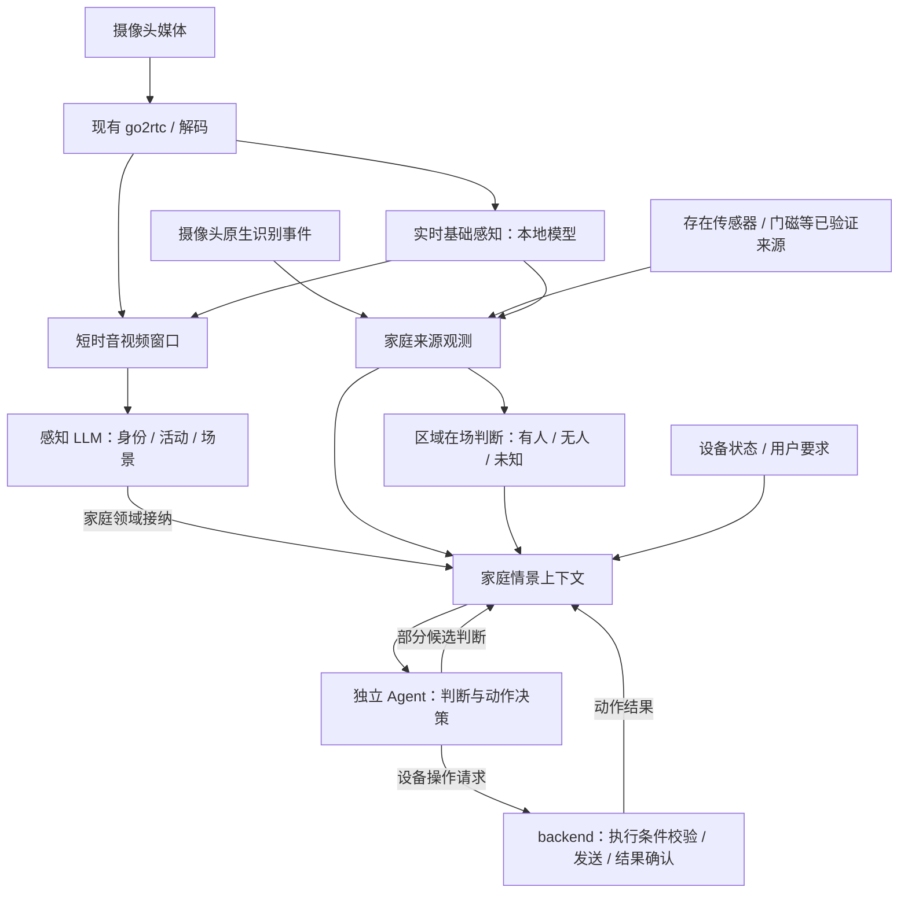

# 实时感知、家庭情景上下文与 Agent 决策执行方案

> 状态：待实施方案。本文中的模块、接口、文件和行为均为计划，不表示已经实现或通过实机验证。
>
> 参考核对日期：2026-09-28。MiLoCo 提交：`cad239dca9b7a2dd3bf0e6565a26cf9eef6581b8`。参考 checkout 由 `AGENTS.local.md` 指定并保持只读。`MiLoCo:` 路径相对于该 checkout，其余代码路径相对于 home-agent 仓库。

## 1. 目标与架构决定

整体链路是：**感知层生产信息 → 家庭领域维护情景上下文 → 独立 Agent 判断并操作设备。** “人来灯亮、人走灯灭”由独立 Agent 决定。

backend 感知层有两条时效不同的生产链路，共享设备来源和媒体输入：

1. **基础感知**：本地检测模型持续处理新帧和音频，及时输出人物、宠物、声音等观测，作为虚拟传感器。基础结果不等待大语言模型（LLM）或音视频窗口收满。
2. **感知语义理解**：使用音视频片段、轨迹、人物参考和已有家庭上下文，通过多模态 LLM 推导身份、活动与场景等更详细的语义，输出带证据的候选判断。这条链路包含窗口等待和模型调用耗时。

**家庭领域**接纳基础观测和语义结果，结合设备状态、区域在场、用户要求等信息，维护家庭情景上下文。区域在场可以用确定性规则从实际来源推导为“有人 / 无人 / 未知”；它描述当前情况，供 Agent 使用。

**独立 Agent**消费家庭情景上下文，决定是否、何时以及如何操作设备，再调用 backend 的设备控制通路。它也可以按任务生产部分候选判断，交给家庭领域接纳。backend 负责命令的执行条件校验、协议发送与结果确认。

例如，基础感知发现客厅有人，家庭上下文随即更新；Agent 结合灯光状态、已有语义和用户要求决定开灯或保持不变。感知 LLM 随后得到“某成员正在看电视”等更详细结果，也进入上下文，供 Agent 后续判断。基础更新不必等新一轮感知 LLM；Agent 根据任务需要使用已有有效语义或等待补充信息。

感知层 LLM 负责理解所观察到的情况，独立 Agent 负责消费上下文、推理与动作决策。Agent 未运行时，感知和上下文更新可以继续，但不会由 backend 的照明规则接替 Agent 作出动作决定。用户看到的开关灯响应包含 Agent 的判断和设备执行耗时。



### 1.1 感知层两条生产链路的区别

| 维度     | 实时基础感知                   | 语义理解                         |
| -------- | ------------------------------ | -------------------------------- |
| 目标     | 及时提供当前可见/可听到的证据  | 解释身份、活动和场景             |
| 处理单位 | 新帧、短音频块                 | 一段音视频与上下文               |
| 模型     | 本地 ONNX 与确定性算法         | 多模态 LLM，配合本地证据处理     |
| 输出时机 | 每次有效结果立即发布           | 窗口就绪并完成模型调用后发布     |
| 依赖     | 媒体、检测模型；可选跟踪补充   | 媒体窗口、参考资料、provider     |
| 失败影响 | 对应来源变为未知或不可用       | 当前语义分析不可用，基础感知继续 |
| 消费者   | 家庭领域接纳、在场推导与上下文 | 家庭领域接纳、上下文与事件查询   |

“实时”首先描述基础感知及时更新的目标；Agent 操作设备的整体响应还取决于任务触发、判断和执行时间，需分别测量。具体目标随部署硬件、摄像头、采样频率和 Agent 配置确定，不承诺未经测量的响应期限。

### 1.2 范围与约束

- 应用逻辑使用 TS；本地模型由 `onnxruntime-node` 执行，编解码由 FFmpeg 承担，摄像头连接复用 go2rtc。无需 Python 生产服务。
- 覆盖 MiLoCo 当前本地模型、音频筛选、跟踪、身份、智能裁切、多模态理解与事件去重能力。**算法对齐保留；生产调度有意分成实时与语义两条链路。**
- 对比摄像头原生识别事件与本地结果的到达时间，按人物、宠物、声音等类别及语义分别比较。
- 固定家庭、设备清单和授权继续由现有 household/mijia 管理，遵守[家庭感知总计划](backend-household-perception.md)与[家庭语义模型](household-model.md)。重新绑定沿用设置页和家庭运行时的既有流程。
- 本文设计 Agent 照明决策与设备执行的接入边界。感知阶段产出观测与上下文；Agent 接入后先核对其决策，设备写入与结果确认按 P4 单独交付和验收。
- 不新增通用规则语言、工作流平台或通知系统。卧室、卫生间等无摄像头空间继续依靠实际可用的非视觉来源。

## 2. 来源事实与术语

### 2.1 摄像头原生识别事件

本文以“摄像头原生识别事件”统称人物、宠物、声音检测等设备原有识别结果。这是业务名称，协议可能使用属性变化或独立事件消息，逐项核实。

用户截图中的小米智能摄像机 4 展示了 `prop.8.30`“AI检测 人数”的 `1` 和 `1 → 0`。它是已观察到的具体上报示例，不定义全部摄像头能力，不证明完整值义、更新周期、计算芯片或镜头范围。C700、C500 双摄版在该截图中暂未上报，也不说明不支持。人物、宠物、声音按实际规格和报文接入，不猜协议地址。

小米摄像机隐私政策描述了设备本地识别与触发录像上传云端的行为；识别位置和事件传输途径需要区分。当前 home-agent MQTT 连接小米云端，不能由此断言所有原生识别都在云端计算。[小米摄像机隐私政策](https://privacy.mi.com/CameraPrivacyPolicy/zh_CN/)

### 2.2 现有工程基础

| 已有能力                               | 本方案复用方式                                     |
| -------------------------------------- | -------------------------------------------------- |
| Bun backend、XState 5、公共 API schema | 复用运行环境、源生命周期和类型边界                 |
| 家庭运行时与设备清单                   | 订阅已提交设备变化，不保存第二份设备真值           |
| `CameraSourceManager` 与 go2rtc 私有流 | 同一视频源增加分析消费者；不重新登录或另建相机连接 |
| 双摄共享物理 MISS 连接                 | 本地检测按通道分别处理，物理重连仍统一管理         |
| MQTT 属性与在线消息                    | 复用已接通的观察，新的独立事件形式验证后再扩展     |
| `DevicePushLogs`                       | 保留诊断职责；原生事件比较直接订阅来源             |
| 数据库、telemetry、前端查询与 SSE      | 沿用已有机制，按新领域增加实际需要的数据           |

### 2.3 观测不是在场判断

“画面检测到人”“区域有人”“房间无人”“某人在家”具有不同证据要求。摄像头安装在客厅，不代表覆盖整个客厅。声音、宠物检测也不直接等于有人。

基础观测只描述来源证据；在场判断显式使用覆盖范围、证据新鲜度和规则；语义理解给出可过期的解释。来源中断一律不解释成目标消失。

## 3. MiLoCo 参考与对齐范围

参考代码主体位于 `MiLoCo:backend/miloco/src/miloco/perception/`，第 3 节参考文件均写相对此目录的完整路径；目录外的配置文件使用完整的 `MiLoCo:` 路径。

| 环节       | 参考文件                                                                                                                                                                                                               | 实际职责                                       | home-agent 模块                                      |
| ---------- | ---------------------------------------------------------------------------------------------------------------------------------------------------------------------------------------------------------------------- | ---------------------------------------------- | ---------------------------------------------------- |
| 调度       | `runner.py`、`processor.py`、`inference_worker.py`                                                                                                                                                                     | 设备同步、窗口触发、推理编排和常驻推理线程     | `perception/service` + `scene-understanding/service` |
| 采集       | `collect/camera_adapter.py`、`collect/collector.py`、`collect/stream_buffer.py`                                                                                                                                        | 媒体订阅、音视频窗口、积压处理                 | `mijia/media` + `perception/media`                   |
| 视觉筛选   | `engine/gate/visual_gate.py`、`engine/gate/gate.py`                                                                                                                                                                    | 灰度帧差、跨窗比较、首次放行、持续放行         | `scene-understanding/gate`                           |
| 音频筛选   | `engine/gate/audio_gate.py`、`engine/gate/speech_vad.py`                                                                                                                                                               | 能量筛选与人声判定                             | `perception/audio` + `scene-understanding/gate`      |
| 目标检测   | `engine/identity/tracker/detector.py`                                                                                                                                                                                  | 检测框、类别与置信度                           | `perception/detection`                               |
| 人体特征   | `engine/identity/tracker/human_reid.py`                                                                                                                                                                                | 人体外观向量及相似度                           | `perception/detection`                               |
| 跟踪       | `engine/identity/deep_sort.py`、`engine/identity/tracker/tracker.py`、`engine/identity/tracking_service.py`                                                                                                            | 位置预测、匹配、轨迹确认及失效                 | `perception/tracking`                                |
| 身份编排   | `engine/identity/engine.py`、`engine/identity/state.py`、`engine/identity/dispatcher.py`                                                                                                                               | 候选派发、确认、重审、误检抑制、漂移处理       | `scene-understanding/identity`                       |
| 人物资料   | `engine/identity/library.py`、`engine/identity/gallery_composite.py`、`engine/identity/registration_session.py`、`engine/identity/registration_filter.py`、`engine/identity/tier_u.py`、`engine/identity/meta_sync.py` | 参考图片、登记、派生样本、陌生人聚类、资料同步 | `scene-understanding/identity`                       |
| 智能裁切   | `engine/omni/crop_enhance.py`、`engine/omni/prompt_builder.py`                                                                                                                                                         | 目标区域与全景参考、视频编码、坐标转换         | `scene-understanding`                                |
| 多模态理解 | `engine/omni/omni.py`、`engine/omni/omni_client.py`、`engine/omni/provider.py`、`engine/omni/response_parser.py`、`engine/omni/field_registry.py`                                                                      | 输入组织、供应商协议、结构化输出与回流         | `scene-understanding`                                |
| 模型可用性 | `engine/omni/circuit_breaker.py`、`engine/omni/probe.py`、`engine/omni/error_classifier.py`                                                                                                                            | 请求失败隔离与恢复探测                         | `scene-understanding`                                |
| 事件输出   | `engine/api.py`、`event_classifier.py`、`event_text_builder.py`、`events_service.py`、`snapshot_writer.py`                                                                                                             | 事件合并、证据、查询和输出                     | `scene-understanding/events`                         |
| 文本去重   | `engine/omni/dedup_embedder.py`                                                                                                                                                                                        | 事件文本向量、持续事件相似度                   | `scene-understanding/events`                         |

### 3.1 模型清单

| 原始资产名                         | 用途                                       | 运行约束                                             |
| ---------------------------------- | ------------------------------------------ | ---------------------------------------------------- |
| `det_4C.onnx`                      | 目标检测；代码定义 human/cat/dog/head/face | 不根据文件名猜类别数量，读取实际输出并按参考实现解释 |
| `human_body_reid_v2.onnx`          | 人体外观特征                               | 文件名中的 `v2` 是资产原名；不因此维护历史实现分支   |
| `silero_vad.onnx`                  | 语音活动检测                               | 显式传递音频块状态；不同窗口不混用                   |
| `bge-small-zh-v1.5-int8.onnx`      | 中文事件文本向量                           | 与 tokenizer、截断规则、CLS 向量提取和归一化共同对齐 |
| `bge-small-zh-v1.5-tokenizer.json` | BGE 分词资产                               | 先核对 token ID、mask，再判断向量差异                |

登记资产来源、SHA-256、输入输出元信息、适用许可证和参考提交。使用已有资产，不重新训练或替换成“类似模型”。模型文件由明确的安装步骤取得，运行时不隐式联网下载；启动缺模型应报告具体不可用能力。

人体 ReID（重识别）反映外观相似，不直接输出家庭成员身份。人脸检测框也不代表身份已识别。当前身份流程结合参考图、Omni 输出与时序规则；不能用一个未核对的“人脸识别库”替代。

### 3.2 必须对齐的处理细节

**MiLoCo 参考窗口**：参考随包配置为 4 秒窗口、最多 3 个待处理窗口、500 ms 慢轨道宽限、`full_action: clear`；检测/跟踪输入 3 fps，Omni 视频 1 fps。配置文件位于 `MiLoCo:backend/miloco/src/miloco/config/settings.yaml`。这些是随包值，不代表用户实例的最终生效值。核对参考结果时记录实际参数、媒体格式和模型执行后端。home-agent 的生产基础感知按帧输出，不继承这个 4 秒等待；语义理解使用对应窗口。

**视觉筛选（用于语义理解触发）**：对齐 448×448 缩放、灰度转换、像素差阈值、变化像素比例、窗口内与跨窗口比较、冷启动放行以及最近变化后的 hold。Gate（筛选器）不通过只影响语义窗口处理，不停止基础人体/宠物检测，也不产生“无人”。

**音频筛选完整对齐**：

1. 对齐 16 kHz、单声道、`int16` PCM 输入与音频窗口边界。
2. 按 30 ms 块计算均方根能量，取块能量峰值；不足一块和尾部不足块的处理遵循参考代码。
3. 只有能量通过才调用 Silero；每块 512 点，前接上一块尾部 64 点，首块上下文补零。
4. 每次音频窗口调用初始化模型状态，同一窗口内逐块传递；按过阈块数量判定人声，并保留峰值概率。
5. 无人声时抑制 `speeches` 字段；能量通过的环境声音仍可送 Omni。不得把无语音误解为无音频、无事件或无人。
6. 对齐关闭 VAD、模型缺失、音频过短等分支：参考实现关闭或不可用时允许下游人声字段，过短音频判为未检测到人声。保留其当前路由行为，同时单独输出 `vad_status` 与原因，区分“未执行人声筛选”和“检测到人声”；不能把路由放行当成真人声证据。语义音频对齐验收要求 VAD 实际可用，不用放行行为冒充模型正常；它的可用性不影响视频基础检测。

**检测与特征**：对齐插值方式、等比补边、通道顺序、张量布局、浮点类型、置信度计算、分类过滤、NMS（重叠框过滤）、坐标还原、人体裁切以及特征归一化。JS 图片库默认值不能代替 OpenCV 参数。ReID 的输入颜色顺序与检测模型分别按源码核对。

**跟踪**：以当前随包选用的 DeepSORT 为算法参考，对齐 Kalman 位置预测、匹配代价与顺序、轨迹初始化、失配保留、特征更新、静止目标跳过 ReID 的 fast 策略。帧数与秒的换算必须使用实际配置。纯 SORT 不是本次默认并行实现。

**身份**：移植 pending/confirmed/unknown 与 `no_person` 的实际状态语义，包含置信度投票、周期重审、身份变化、漂移检查、写入参考库的资格和冷却、陌生人外观聚类。登记和派生样本不能成为两份独立人物身份；人物稳定 ID 与某次轨迹 ID 分开。

**Omni**：对齐主调用合并身份结果的 fused 方式、输出字段启用条件、视频抽帧末帧锚点、参考图、裁切坐标、音视频长度及结果回流。未启用或未实现的 separate/track-free 路径不预建。`engine/identity/identity.py` 当前注明停用的旧 cropper/frame_selector/motion_analyzer 不能当作必经模块。

**事件**：区分场景描述、语音、建议和匹配规则。按参考调用链移植语义去重与持续事件管理，保留来源设备、房间、证据窗口和身份置信度。不能仅保存大模型自由文本再让前端猜字段。

### 3.3 已核对的参考参数

以下来自随包配置和代码默认值，用于对应模块实施时建立参数清单，不能覆盖未经读取的用户实际配置。

| 参数                       | 参考值或规则                                               | 来源                                                                          |
| -------------------------- | ---------------------------------------------------------- | ----------------------------------------------------------------------------- |
| 检测置信度 / NMS IoU       | `0.5` / `0.7`                                              | `engine/identity/tracker/detector.py`                                         |
| ReID 输入                  | 高 192、宽 96，BGR；输出 128 维并归一化                    | `engine/identity/tracker/human_reid.py`                                       |
| 视觉筛选采样               | `check_fps = 1`                                            | `engine/config.py`                                                            |
| 帧差像素 / 比例阈值        | 像素差 `> 25`；变化比例 `>= 0.005`                         | `engine/gate/visual_gate.py`、`engine/config.py`                              |
| 视觉 hold                  | 90 秒                                                      | `MiLoCo:backend/miloco/src/miloco/config/settings.yaml` 的 perception 配置    |
| 音频能量阈值               | `0.015`                                                    | `engine/config.py`                                                            |
| VAD 概率 / 过阈块数        | `0.4` / 至少 3 块                                          | `engine/config.py`                                                            |
| DeepSORT 初始化 / 丢失保留 | `n_init = 1` / `max_age_sec = 2.0`                         | `engine/identity/default_config.yaml` 的 deep_sort 段                         |
| DeepSORT 模式              | `fast`，静止特征更新间隔参数 `human_reid_skip_windows = 4` | 同上；单位与实际执行路径一起核对                                              |
| Omni 视频                  | 1 fps，抽样包含窗口末帧                                    | `MiLoCo:backend/miloco/src/miloco/config/settings.yaml`、`engine/pipeline.py` |
| BGE 文本长度 / 向量提取    | 最多 64 tokens，CLS 向量后 L2 归一化                       | `engine/omni/dedup_embedder.py`                                               |

身份投票、重审、样本积累、写库冷却、陌生人区分、漂移和 `no_person` 参数较多，直接由参考 `engine/identity/default_config.yaml` 与实际覆盖配置生成一次清单，不手抄到多个模块。

## 4. 实时基础感知的处理方式

### 4.1 视频关键路径

```text
摄像头 → go2rtc → 解码/采样 → 目标检测 → 发布基础观测
                                      ↓
                           跟踪/ReID 补充 → 发布轨迹观测
```

1. 解码器持续读流，按配置采样新帧。每帧保留媒体时间、尺寸和颜色格式。
2. 到达可处理的新帧后提交目标检测，完成即发布人物/猫/狗等结果。不等待 4 秒窗口、音频能量筛选、VAD、ReID 或大模型。
3. 同一路跟踪按顺序更新，ReID 按参考 DeepSORT 规则参与匹配。检测和跟踪各自最多一个在途步骤，通过帧序号/时间关联；跟踪等待特征期间仍可发布后续基础检测。轨迹输出单独标明本帧实测或预测延续。
4. 在场判断可消费检测结果，是否要求短暂确认由区域规则决定；不默认等待身份识别。
5. 如果跟踪/ReID 比目标检测慢，允许跳过尚未进入跟踪的旧帧，保留明确时间间隔。跟踪仍按顺序运行，不让特征任务无限堆积或拖住后续目标检测。

DeepSORT 中依赖帧数的参数需要按实时输入间隔解释。规则连续采样时与 MiLoCo 同输入核对；实际丢帧时记录时间间隔，按明确的时间推进或重建轨迹，不能把隔了几秒的两帧当作连续等间隔帧。该适配是实时调度差异，需单独验证。

### 4.2 静止、丢帧和筛选

基础目标检测不能被“画面没有变化”完全关闭。人静坐时仍需定期产生有效观测，才能支持在场状态的维持和消失判断。

视觉帧差、MiLoCo hold 和音频 Gate 用于筛选语义分析窗口；它们不是基础检测的前置闸门。未来若降频，应继续满足证据新鲜度，并把实际采样周期计入延迟，不以静止替代无人。

实时检测每路最多一个正在执行的检测任务和一个待处理最新帧；新帧覆盖尚未开始的旧帧，避免积压历史画面。因过载产生的间隔和缺口记录到来源健康，在场判断据此判断连续性。语义窗口采用自己的有界时间缓冲，两者不共用待处理队列。

### 4.3 音频基础结果

音频能量、语音活动检测可以作为独立基础观测，但必须保留各自语义。能量上升不代表有人，人声检测不等于哭声或犬吠分类。

Silero 的模型、采样、context/state 和块阈值按参考代码对齐。MiLoCo 的窗口级语音判断用于语义窗口；若需要更早发布短音频结果，应定义独立的短块聚合规则，记录与参考窗口输出的差异，不把长窗口确认延迟加到视频检测路径。

音频或视频缺失时分别表达其可用性。视频有帧不等于音频正常，音频有能量也不证明视频覆盖区域有人。

### 4.4 基础感知输出

输出为带来源的观测，至少包含：

- 摄像头、通道/音轨、观察类别、实际覆盖区域引用。
- 检测值、框、置信度，或者音频能量/人声结果。
- 来源媒体时间（已知时）、backend 接收时间、实际采样时间或区间。
- 来源是否有效、观测是否新鲜、是否存在丢帧/断流。
- 输出阶段：检测、轨迹或音频分析；轨迹是否来自当前实测。

配置、模型哈希和运行环境记录在所属运行中，不随每帧重复传递。协议边界使用一次 schema，内部函数类型从实现推导。

## 5. 在场上下文与 Agent 照明决策

### 5.1 在场判断归家庭领域

`household/presence.ts` 接收基础感知、原生识别事件和已接通的真实传感器观测，负责某个明确区域的在场判断。它不拉流、不运行模型、不直接控制灯。

每个区域维护：`present / absent / unknown`、当前判断依据、适用范围、最近有效证据，以及必要的确认/离开计时。计时是内部状态，不需要为每个计时阶段增加公共枚举或独立状态机。

融合规则随实际配置明确：哪些来源能提供正向证据，哪些来源有资格提供无人证据，覆盖是否足够，冲突时如何处理。首个场景可只配置一个可靠且覆盖明确的来源，不先建设通用传感器融合引擎。

### 5.2 进入和离开的规则不同

| 情况                               | 在场判断                                   | 供 Agent 判断的信息                                |
| ---------------------------------- | ------------------------------------------ | -------------------------------------------------- |
| 新鲜、可靠的有人证据               | 快速确认 present；需要时使用短确认窗口     | 及时提供有人依据，Agent 决定是否开灯               |
| 连续有效的无人证据，且覆盖满足规则 | 完成离开确认后变为 absent                  | 提供无人依据及持续时间，Agent 决定是否及何时关灯   |
| 人静坐、短暂漏检/遮挡              | 按证据保持或转 unknown，避免单帧否定       | 保留此前证据与当前不确定性，避免据一次漏检关灯     |
| 媒体/传感器失联、证据过期          | unknown，停止无依据的连续无人计时          | 明确来源失效，不能作为离开依据                     |
| 多来源冲突                         | 使用明确定义的来源规则，无法判定则 unknown | 提供冲突证据与未知原因                             |
| 启动/恢复时已经有人                | 可形成当前 present，但不伪造“刚进入”事件   | Agent 根据当前上下文决定是否操作，不按新进入补动作 |

“人走灯灭”中的感知确认时间与 Agent 决定的动作时机分别记录。家庭领域负责何时有足够依据认定无人；是否继续等待、何时关灯由 Agent 根据上下文和用户要求决定。

纯计时器到期不能证明期间持续无人。到期处理应先接纳此前已经到达的观测，再核对来源健康、证据连续性及当前条件；发生缺口则重新建立依据。

摄像头原生事件若只有“发现人”的触发，没有无人状态或结束语义，就只能提供正向证据，不能因它安静一段时间而判无人。

### 5.3 独立 Agent 决策，backend 执行

在场或相关语义变化通过场景触发入口交给独立 Agent。Agent 读取家庭情景上下文，包括区域在场、灯光状态、有效语义、用户要求和已有动作结果，决定开灯、关灯、保持不变或稍后重评。首个场景只接入实际区域、灯具与所需信息，复用现有 Agent 任务能力。

执行链路：

```text
基础观测 / 感知语义 → 家庭情景上下文更新 → 触发独立 Agent
                  → Agent 判断与动作请求
                  → backend 校验执行条件 → 设备命令 → 结果确认
                  → 更新动作结果，供 Agent 后续使用
```

backend 命令通路核对设备能力、授权、当前有效要求和请求是否仍适用，处理重复命令并确认执行结果。动作意图由 Agent 提出；backend 执行条件校验不承担另一套照明决策。Agent 将手动操作及其上下文纳入后续判断，避免反复抢控制。

Agent 如选择稍后重评，由其任务调度承接，到时读取新的上下文。有人重新出现或用户要求变化时，原来的关灯依据可能不再成立。请求已发出但结果未知时如实记录，后续决策使用该结果；源恢复不补执行已经过时的请求。

Agent 决策、命令已发送、设备确认已执行分别记录。实际灯光控制需验证写通路后接入；最初可只记录 Agent 决策并由人工核对，此时尚未交付设备执行。独立 Agent 不可用时，感知与上下文继续更新，backend 不自行生成照明决策。

### 5.4 感知 LLM 与独立 Agent 的关系

感知 LLM 可以产生“可能在休息”“正在看电视”等候选判断，家庭层按证据和有效期接纳后进入情景上下文。Agent 把这些语义与基础在场、灯光状态及“禁止开主灯”等有效要求一起用于决策。语义结果保留自己的证据和不确定性，不改写原始观测。

感知 LLM 不可用时，基础观测和在场判断继续更新；Agent 使用仍有效的上下文判断是否足够支持动作，缺少语义的信息保持未知。独立 Agent 自身的模型或任务失败则意味着本次动作决策未完成。两类故障分别在感知状态和 Agent 任务状态中报告。

## 6. 语义理解链路

```text
短时音视频窗口 + 基础检测/轨迹 + 人物参考 + 家庭上下文
        → 窗口 Gate → 智能裁切/编码 → 多模态模型
        → 身份与场景结果 → 家庭接纳/事件整理
```

- 语义服务订阅基础观测，并从共用媒体缓存读取对应片段，不另开摄像头连接。
- 使用 MiLoCo 参考窗口、筛选和提示组织；图像采样包含参考末帧锚点，裁切框必须对应同一帧和时基。
- 参考输入缺帧或被覆盖时，记录实际证据完整性；不能将实际只收到的几帧伪装成完整参考窗口。
- 身份确认、周期重审、陌生人聚类、`no_person` 与漂移检查在此链路维护。基础轨迹通过稳定的本次源运行/轨迹引用关联身份。
- 大模型的 `no_person` 判定可以影响语义身份与描述，不直接删除基础人体检测或抑制实时在场观测。若以后需要反向校正，应单独设计作用范围和有效期。
- 输出包括证据窗口、识别身份、活动/场景描述、语音/环境声音与建议等参考实现支持的字段，标明置信或不确定性。
- BGE 用于持续事件文本去重，不参与实时在场判断或照明决策。
- 人物资料变化、轨迹消失或源运行失效后，迟到结果不更新当前状态；仍可作为原证据窗口的历史结果保存。

**每个源的语义主流程按窗口串行，不同源可以并行。** 这里的源指具有独立轨迹/身份状态的摄像头通道；串行范围从窗口取材、身份候选生成、fused 派发、主 LLM 调用/流式回调，到身份投票、样本资格判断、候选快照入队和主流程收尾。前一窗口完成或失败清理结束后，才能生成和派发下一窗口的身份候选。基础检测继续独立运行。

MiLoCo 的 `engine/identity/dispatcher.py::FusedDispatcher` 仅保存一份 `_pending` 候选。每路在 `scene-understanding/service.ts` 内保留一个在途主流程 Promise，按证据时间顺序接续；候选和参考图固定到该窗口。主请求超时/取消后关闭其回流入口，迟到的主调用回调不再更新身份或创建样本候选。尚未开始的窗口使用有界缓冲，超载可以丢弃并记录缺口。

样本候选在入队时保存本窗口的图片和特征快照；后续同人校验与保存沿参考流程以低并发异步执行，不阻塞下一语义窗口。主流程正常收尾不取消已移交的样本任务，其结果仍遵守来源与人物资料的有效性规则。

同一份检测结果可被实时在场与语义理解消费，但消费者各有输出语义。当前家庭状态的接纳规则仍归 household，不在语义服务内维护第二份“全屋真值”。

## 7. 运行时、线程与资源

### 7.1 技术选型

| 职责       | 选型与落地方式                                           |
| ---------- | -------------------------------------------------------- |
| 应用代码   | TS，优先现有 Bun backend                                 |
| 模型推理   | `onnxruntime-node`，复用参考 ONNX 资产                   |
| 源生命周期 | 每路 XState actor；普通服务对象管理源集合                |
| CPU 任务   | 优先验证 Piscina，使用其现有队列、并发和 worker 复用能力 |
| 媒体       | go2rtc 私有流消费者 + FFmpeg 解码/编码                   |
| 大模型请求 | 按需使用 `p-queue` 限制请求并发，独立于 CPU 池           |
| 数据与页面 | 复用 Zod、Drizzle、现有查询/SSE 和 telemetry             |

P0 只验证目标检测模型在当前运行时/池中的真实推理、返回和正常释放。后续模型随功能接入验证。Piscina 面向 Node，Bun 的 Worker 兼容性不能只靠 import 成功判断。[Piscina](https://github.com/piscinajs/piscina)、[Bun Workers](https://bun.sh/docs/runtime/workers)

若遇到实际运行时阻碍，再选由 backend 托管单个 Node 感知进程，仍使用同一套 TS 模块；选定后维护单一路径。无需提前准备两套启动入口或通用 IPC 框架。

### 7.2 实时任务优先于语义任务

这是功能要求，不推迟到“后期性能优化”：

- 实时检测使用独立的受限计算资源，语义编码/BGE 等长任务不能排在同一个 FIFO 队列前面挡住它。
- 先只有基础感知时只创建一个池。接入语义重计算时，使用独立、低并发的计算 worker/池；两个池的总预算统一配置。无需自建优先级调度器。
- ReID 与检测共享基础资源时限制其在途任务，检测不等待其完成才发布；若测得特征提取明显阻塞检测，减少特征提取频率或在总预算内隔离执行。
- 大模型请求、数据库写入、证据保存和慢页面客户端都不能阻塞基础结果发布。
- 语义过载时延后或丢弃过期语义窗口，保留基础采集；记录语义缺口。不能通过无限堆积换取“一个窗口都不丢”。

线程隔离不等于 CPU 隔离。用 `os.availableParallelism()` 估计并行度，配置 worker 上限、ORT 原生线程和解码线程，给实时链路留出运行空间；单核/弱设备仍需要实测资源竞争。[Node OS API](https://nodejs.org/api/os.html#osavailableparallelism)、[ONNX 线程管理](https://onnxruntime.ai/docs/performance/tune-performance/threading.html)

不按摄像头数量一比一开模型进程，也不同时把 JS worker 与每个模型线程数开满核。静态保守配置先运行，依据排队时间和资源使用调整，不提前做自动伸缩。

### 7.3 状态与清理

| 状态/资源                      | 唯一所有者                 |
| ------------------------------ | -------------------------- |
| 家庭/设备清单/授权             | 现有 household/mijia       |
| 物理连接、双摄重连             | 现有 mijia/media 与 go2rtc |
| 本路最新帧、轨迹、观测顺序     | 基础感知源对象             |
| 区域在场和连续计时             | household presence         |
| 动作决策、稍后重评与操作请求   | 独立 Agent 的任务运行时    |
| 设备命令执行与确认状态         | backend 设备控制通路       |
| 人物库、身份确认、语义窗口任务 | scene-understanding        |
| 模型 session                   | 对应计算 worker            |
| 对比记录                       | comparison 采集对象        |

同源语义主流程的串行范围与后台样本任务见第 6 节。复用家庭 `scope_epoch` 和源当前运行实例拒绝旧结果。池 Promise 用于计算请求关联，配置修改重启相关运行；配置哈希记录在运行清单，不逐帧建设版本提交协议。

跟踪/身份的轻量领域状态在所属对象内顺序更新，重计算进入池。只有实测领域计算成为瓶颈时才迁移，不预先传完整轨迹状态往返线程。

### 7.4 现有媒体管理与推理 worker 的接入边界

保留当前 `MediaSession`、`CameraSourceManager`、`Go2RtcAdapter` 和 `RetryTimer` 的媒体管理职责，不为接入推理池整体重写成另一套资源管理框架。现有实现已有账号媒体代际、源集合核对、创建/退休、取消和重试；推理接入需要补充的是分析消费关系与失效通知。

| 层次         | 实现选择                                           | 拥有的资源                                 |
| ------------ | -------------------------------------------------- | ------------------------------------------ |
| 媒体管理     | 现有 TS 类、Promise、AbortController 与 RetryTimer | go2rtc 会话、物理视频源及其重建/退休       |
| 每路感知编排 | 现有 XState 5                                      | 分析读取、解码、本路待处理帧和轨迹生命周期 |
| 重计算       | 验证后的 Piscina + ONNX Runtime                    | worker、模型 session、有限任务队列         |

XState 管感知任务的状态，Piscina 管计算线程；actor、摄像头通道和 worker 数量不一一对应。实现采用项目已安装的 XState 5 API，不因上游文档更新而升级状态库。[XState actors](https://stately.ai/docs/actors)、[Piscina](https://github.com/piscinajs/piscina)

`mijia/perception-source.ts` 提供窄接入边界：取得当前源的分析流、观察其可用性/失效、关闭本次读取。复用既有通知和取消信号，确有缺口时补回调，不建立通用事件总线。具体要求：

- `prepared` 只代表 go2rtc 接受源配置，不代表已有媒体或解码帧；感知就绪以实际帧/音轨为准。
- 源退休、替换、账号撤权和媒体会话失效要关闭关联分析读取，使该源感知结果失效。仅在设备清单移除时处理不够；`pauseForLogout`、`revokeDevices`、`invalidateMedia` 等现有入口也要覆盖分析消费者。
- 因取消而结束的分析读取不自行重连；仍有有效采集需求时，由既有媒体状态和感知启停入口重新取得可用流。物理相机重连仍只有媒体所有者负责。
- 解码后帧提交给计算池；worker 不接触摄像头凭据、源创建/删除或重连。任务失败与源连接失败分开处理。
- 媒体创建/退休不等待模型任务结束。worker 池满时按最新帧策略处理，不能堵住 go2rtc 接收、媒体控制队列或浏览器预览。
- 停止一个感知 actor 只释放其分析消费和任务资格，保留仍被预览或其他消费者使用的源。

先补齐上述边界。只有媒体管理本身出现难以维护的状态转换或实际缺陷时，才考虑把其内部重构为状态机；那是独立的实现改进，不是推理接入前置条件。

## 8. 摄像头生命周期和媒体接入

### 8.1 内部分析出口

在已有 `/api/home-agent/mijia/` 下新增 `POST analysis`，携带 `sessionId/sourceId`，返回持续媒体流。一个请求拥有一个分析 consumer，连接结束、源退休或 session 关闭时移除，复用现有租约。

优先使用固定 go2rtc 版本已有封装组件；按实际 codec 确认视频、音频和 PTS 可用后固定出口格式。流式写出不持有全局锁，慢消费者不能阻塞浏览器预览和相机连接。

无需独立 analysis ID、DELETE API 或额外心跳。backend 通过关闭流式响应停止分析，go2rtc 清理 consumer。源级与请求级清理可以重复调用。

### 8.2 音频源端、分发与解码

**当前私有媒体链路尚未接通音频，仅新增分析出口不能取得 PCM。** 已核对的限制包括：

- `docker/go2rtc/overlay/internal/xiaomi/home_agent_camera.go` 创建源 URL 时固定 `audio=0`。
- `docker/go2rtc/overlay/pkg/xiaomi/miss/dual_camera.go::prepare` 使用 `enableaudio:0`，探测循环只接受 H.264/H.265。
- 同文件 `run` 丢弃非视频包，`producer` 只声明视频 media，`Start` 按视频 Annex-B 与 90 kHz 时钟转换数据；只改启用参数仍不能传出正确音频。

音频交付需要沿全链路完成：

1. **源端启用**：把硬编码禁用改为由已配置的音频采集需求决定；确认单摄和双摄的实际启用方式、codec 与参数。音频需求变化由现有媒体所有者协调，不为音频新建第二条物理相机连接。
2. **协议探测与分发**：双摄会话识别真实音频包、取得 codec/采样率/声道/时间基，声明对应 audio media，并按音频格式传给 receiver。视频的镜头 flags、Annex-B 转换和 90 kHz 时钟不能套用到音频。
3. **共享音轨所有权**：物理双摄会话提供共享音轨，连接的持有与释放继续由现有摄像头源和账号会话管理。音频只进入一份解码/PCM 缓存，两个镜头的语义窗口引用它，VAD 与语音事件避免重复计算/发布。关闭一路分析或退休一个镜头源时，其余有效通道源仍可使用共享音轨；该摄像头的全部通道源退休或账号退出时，按现有生命周期关闭连接并清理音频资源。
4. **分析出口**：消费者明确请求所需视频/音轨，封装保留各自时间戳与 codec 信息；在相机侧没有音频或格式尚不支持时返回实际能力状态，不用空 PCM 冒充静音。
5. **解码与健康**：FFmpeg 把真实音轨解码并重采样为 16 kHz 单声道 PCM。视频和音频的新鲜度分别判断，音频包不能掩盖视频断流。音频缺失不阻塞基础视频检测，也不让视频首帧就绪等待音频探测。

同一次媒体采集提供最新视频帧给实时检测、短时帧/PCM 缓存给语义窗口。缓存设时间和字节上限，窗口引用释放后可回收；不因语义请求缓慢持续占用全部帧。默认不保存持续录像。

PTS 是媒体时间，不自动等于拍摄 UTC。裸帧管道缺时间戳时必须补充可靠对应，不用读取时间或帧号假造拍摄时间。具体输出封装/元数据办法在媒体接入阶段核实。[FFmpeg 文档](https://ffmpeg.org/ffmpeg.html)

**音频完成条件**：在实际单摄与双摄设备上分别确认源端已开启、音频包到达、audio media 可消费、分析出口包含音轨、PCM 采样正确且与视频时间对应；双摄共享音轨只解码一次，关闭一路分析或退休一个镜头源不影响其余有效源，重连后可恢复。无音轨或音轨中断时视频仍可工作；摄像头源和账号会话结束时资源按现有生命周期释放。

### 8.3 生命周期行为

| 变化               | 基础感知与在场                                            | 语义理解与其他资源                      |
| ------------------ | --------------------------------------------------------- | --------------------------------------- |
| 新增设备/通道      | 按启用配置创建源，收到有效帧后开始观测                    | 按语义启用范围纳入窗口                  |
| 删除或撤权         | 停止观测、失效来源证据，取消依赖其连续无人计时            | 取消相关等待任务并释放引用              |
| 云端离线但仍有帧   | 保留有效视频观测，分别报告状态                            | 媒体可用则继续                          |
| 首帧未到或断流     | 当前视觉不可用/过期；不生成无人事件                       | 窗口注明缺口，媒体层负责恢复            |
| 恢复               | 新源运行，重建帧差/轨迹和连续证据；已有在场不能冒充新进入 | 旧结果不更新新源，人物资料保留          |
| MQTT 断连          | 只影响对应原生/设备来源，本地视觉可继续                   | 不触发摄像头重连                        |
| 仅改名/房间        | 更新元数据；覆盖变化时重评区域判断                        | 历史保持原上下文，名称变更不作废身份    |
| 双摄单路异常       | 独立记录该路可用性                                        | 物理重连仍由共享连接所有者协调          |
| 感知 LLM 超时/限流 | 继续检测和在场更新，Agent 按仍有效的上下文判断            | 当前语义分析失败/等待，使用有界恢复策略 |
| 独立 Agent 不可用  | 基础观测、在场和家庭上下文继续更新，不产生新的 Agent 决策 | 已启用的感知语义链路继续运行            |
| worker/解码错误    | 通知来源与在场模块，恢复后重新建立证据                    | 不拖停健康来源                          |
| 服务停止/退出账号  | 先撤销新动作和结果资格，再关闭读取、worker 和观察         | 取消请求、释放窗口，最后关闭存储        |

MiLoCo 参考中有设备同步和断流恢复：有活跃源时 10 秒同步，无活跃源时 1 秒同步；已出帧后静默 30 秒、首帧等待 90 秒、同物理设备重连冷却 5 分钟。home-agent 复用已有媒体恢复机制，不照抄这些时长作为在场新鲜度。**在场证据可以先过期，媒体重连仍按自己的策略进行**，避免等几十秒才告知当前观测已失效。

## 9. 输出契约与家庭上下文

### 9.1 三类输出分开

| 输出                             | 所有者与用途                       | 关键字段                                               |
| -------------------------------- | ---------------------------------- | ------------------------------------------------------ |
| 基础观测 `PerceptionObservation` | perception，作为来源证据           | 来源、类别、值/框、证据时间、新鲜度、检测阶段          |
| 区域在场 `PresenceState`         | household，进入上下文供 Agent 使用 | 区域、present/absent/unknown、依据、成立时间、失效原因 |
| 语义结果 `SceneInterpretation`   | scene-understanding，供家庭接纳    | 证据窗口、身份/活动/场景、模型与不确定性、适用时间     |

动作意图由独立 Agent 产生，设备执行结果由 backend 命令通路确认，两者与以上感知输出分开表达，并关联任务和所用上下文。接口与类型命名是计划，具体 schema 在对应阶段定义一次并推导类型。

### 9.2 原生识别事件

原生与本地结果保留 `origin`，人物/宠物/声音保留 `category`，一次触发、状态更新、计数和分类保留实际语义。声音活动不能强塞 `count`，触发消息没有后续消息也不自动结束。

属性载荷保留已知 siid/piid；独立事件仅在真实通路验证后定义地址和参数。未知类型先保留原始名称与载荷，不猜类别。设备级事件没有镜头范围时通道为空，不能随意与一个镜头配对。

### 9.3 时间与有效性

- 基础观测标明媒体时间与到达时间；在场基于当前有效证据，不以“最近收到过”无限延长状态。
- 语义结果明确描述哪个窗口，可晚到但不能伪装成当前实时检测。
- backend 对家庭上下文接纳语义判断时核对证据范围和有效性；模型自评置信度不等于已校准准确率。
- 新鲜度、识别置信和在场判断是不同维度，不合并成一个可信布尔值。
- 已过期来源和语义判断查询时如实标明。该边界与[家庭语义模型](household-model.md)一致。

## 10. 代码落点与文件清单

按下面责任落地，随阶段创建文件，不预建空壳。普通领域函数不依赖 HTTP、数据库或小米协议；状态机管理生命周期，算法和规则保持可独立阅读。

### 10.1 修改现有文件

| 文件                                                                              | 计划修改                                                                     |
| --------------------------------------------------------------------------------- | ---------------------------------------------------------------------------- |
| `apps/backend/src/main.ts`                                                        | 组装基础感知、在场、比较、语义服务与设备执行通路；明确启动/关闭顺序          |
| `apps/backend/src/app.ts`                                                         | 挂载感知、比较和语义查询接口；动作阶段接入 Agent 使用的设备命令与结果接口    |
| `apps/backend/src/environment.ts`                                                 | 模型、感知配置、数据目录与 FFmpeg 路径                                       |
| `apps/backend/src/mijia/service.ts`                                               | 复用账号/来源观察，提供分析流读取与原生识别事件观察                          |
| `apps/backend/src/mijia/media/go2rtc-adapter.ts`                                  | 内部分析流读取、取消和长流错误处理                                           |
| `apps/backend/src/mijia/media/session.ts`                                         | 分析读取纳入现有会话资源；退出、设备撤权和媒体失效时同步关闭                 |
| `apps/backend/src/mijia/media/camera-source-manager.ts`                           | 补齐源退休/替换对分析消费者的失效通知，保持物理源唯一所有权                  |
| `apps/backend/src/mijia/protocols/miot/mqtt.ts`、`messages.ts`                    | 对已验证的原生事件通路扩展订阅/解码，不猜协议                                |
| `docker/go2rtc/overlay/internal/xiaomi/home_agent.go`、`home_agent_camera.go`     | 注册分析出口，源/session 清理分析消费者                                      |
| `apps/backend/src/household/runtime.ts`、`machine.ts`                             | 按现有家庭提交机制接纳在场结果及实际采用的语义判断；不把逐帧媒体塞进设备清单 |
| `apps/backend/src/db/schema.ts`、`apps/backend/drizzle/`                          | 后续人物、事件和动作记录按实际持久化需求增加表                               |
| `apps/backend/package.json`、`bun.lock`                                           | 按阶段加入推理/池依赖，构建 worker 独立入口                                  |
| `packages/api/package.json`、`src/contracts/index.ts`                             | 导出对应领域的公共契约                                                       |
| `apps/web/src/router.tsx`、`navigation.ts`                                        | 感知页面入口；语义与联动状态按交付逐步展示                                   |
| `scripts/setup-local.ts`、`scripts/go2rtc-runtime.ts`、`docker/go2rtc/Dockerfile` | 模型/FFmpeg 检查及 go2rtc 扩展构建                                           |
| `.gitignore`                                                                      | 排除本地媒体、模型安装目录和采集记录                                         |

音频源端改造还必须覆盖以下文件：

| 文件                                                                                                  | 计划修改                                                                              |
| ----------------------------------------------------------------------------------------------------- | ------------------------------------------------------------------------------------- |
| `apps/backend/src/mijia/media/camera-source-spec.ts`、`camera-source-manager.ts`、`go2rtc-adapter.ts` | 传递实际音频需求，并在源配置变化时交由现有媒体生命周期协调                            |
| `docker/go2rtc/overlay/internal/xiaomi/home_agent_camera.go`                                          | 替换固定 `audio=0`，按采集需求配置源；视频存活检查不被音频包刷新                      |
| `docker/go2rtc/overlay/pkg/xiaomi/miss/dual_camera.go`                                                | 音频启动、codec 探测、音频包分发、audio media/receiver 与正确时间基；保留视频分镜逻辑 |
| `docker/go2rtc/overlay/internal/xiaomi/home_agent_dual_camera.go`                                     | 共享音轨归属物理会话，复用现有摄像头通道源的持有与释放，保持其余有效源可用            |
| `docker/go2rtc/overlay/internal/xiaomi/home_agent_analysis.go`（新增）                                | 暴露视频/共享音轨给分析消费者，保留各轨格式与时间信息                                 |
| `apps/backend/src/perception/media/decoder.ts`、`buffer.ts`（新增）                                   | 音轨去重消费、PCM 解码/重采样、共享缓存与独立音频健康                                 |

单摄路径同时核对固定 go2rtc 上游的音频支持；确有缺口时修改对应 overlay/runtime patch，不能假定打开参数即已交付。

代码接入家庭提交时沿用现有作用域和订阅机制，不重写家庭运行时。若已有设备采集计划已实现同一观测入口，则直接复用，避免另建总线。

### 10.2 实时基础感知：新增文件

前缀 `apps/backend/src/perception/`：

| 文件                                  | 职责                                           |
| ------------------------------------- | ---------------------------------------------- |
| `service.ts`                          | 源集合、实时结果发布、媒体订阅与统一关闭       |
| `source.ts`                           | 每路 XState 生命周期、最新帧处理和本路轨迹状态 |
| `config.ts`                           | 基础采样、模型、线程、缓冲和来源范围配置       |
| `observations.ts`                     | 检测、音频和轨迹的规范化观测                   |
| `routes.ts`                           | 基础状态、实时结果订阅与比较入口               |
| `media/decoder.ts`                    | FFmpeg 会话、拼帧、重采样与 PTS 对应           |
| `media/buffer.ts`                     | 最新帧与有界音视频缓存，供实时/语义分别读取    |
| `compute/pool.ts`                     | 基础池创建、并发上限、等待时间统计与关闭       |
| `compute/worker.ts`                   | 检测、特征和音频计算入口                       |
| `compute/models.ts`                   | ONNX session 加载、缓存与释放                  |
| `detection/detector.ts`               | 检测前处理、推理、NMS、坐标还原                |
| `detection/body-embedding.ts`         | ReID 前后处理                                  |
| `tracking/deep-sort.ts`               | 匹配流程、轨迹生命周期、实际时间间隔处理       |
| `tracking/kalman.ts`、`assignment.ts` | 对应数值与匹配算法                             |
| `audio/energy.ts`、`speech-vad.ts`    | 能量和 Silero 计算，供基础观测及语义窗口复用   |
| `comparison.ts`                       | 两路到达计时、有限时长采集、记录和导出         |

基础模块不引用 LLM client、人物参考库或语义事件去重。媒体和所需本地模型可用时，它可以独立运行；未启用的音频或跟踪能力不阻塞目标检测。

另增 `apps/backend/src/mijia/perception-source.ts` 提供第 7.4 节的分析流/有效性/关闭边界，`apps/backend/src/mijia/recognition.ts` 适配原生识别事件；新增 `docker/go2rtc/overlay/internal/xiaomi/home_agent_analysis.go` 实现随请求清理的媒体消费者。

### 10.3 家庭上下文、Agent 决策与设备执行

| 文件                                     | 职责                                                                         |
| ---------------------------------------- | ---------------------------------------------------------------------------- |
| `apps/backend/src/household/presence.ts` | 区域在场规则、来源适用性、进入/离开确认与未知处理                            |
| `apps/agent/src/household/`              | 按已有家庭计划接入上下文消费、照明决策任务和设备操作工具；具体文件随功能创建 |
| `apps/backend/src/mijia/commands.ts`     | 实际验证后接入设备写入与结果确认，复用已有凭据和协议                         |

场景变化复用已有家庭触发与 Agent 任务入口；触发条件决定何时通知 Agent，具体动作由 Agent 根据上下文决定。设备操作工具调用 backend 的受控命令入口，复用家庭领域的有效要求和执行条件校验。`mijia/commands.ts` 是待交付边界，具体下层调用在核实设备控制通路后确定。

### 10.4 语义理解：新增文件

前缀 `apps/backend/src/scene-understanding/`：

| 文件                                         | 职责                                                                         |
| -------------------------------------------- | ---------------------------------------------------------------------------- |
| `service.ts`                                 | 订阅基础观测/媒体窗口；按第 6 节串行每源主流程，管理后台样本任务，不同源并行 |
| `config.ts`                                  | 窗口、Gate、provider、身份和保存参数                                         |
| `window.ts`                                  | 按时间顺序选择媒体与基础检测，有界等待窗口，记录缺失/丢弃                    |
| `gate.ts`                                    | MiLoCo 视觉帧差、hold、音频筛选的窗口组合                                    |
| `compute.ts`                                 | 语义重计算的低并发资源，接入时与基础池统筹预算                               |
| `worker.ts`                                  | 裁切、编码辅助和文本向量的重计算入口                                         |
| `identity/engine.ts`、`state.ts`             | 候选派发、身份确认、重审、误检和漂移规则                                     |
| `identity/library.ts`、`registration.ts`     | 参考资料与人物登记                                                           |
| `identity/stranger-pool.ts`、`repository.ts` | 陌生人聚类及身份资料存储                                                     |
| `crop-enhance.ts`、`evidence-encoder.ts`     | 智能裁切、全景参考、视频音频编码与坐标                                       |
| `prompt.ts`、`output.ts`                     | 提示组织、输出字段和校验                                                     |
| `client.ts`、`providers.ts`                  | 多模态请求、超时/限流、实际供应商协议与回流                                  |
| `events/service.ts`、`event-chain.ts`        | 语义事件构造、持续事件和重复抑制                                             |
| `events/embedding.ts`                        | BGE/tokenizer，与基础检测没有执行依赖                                        |
| `events/repository.ts`、`evidence-store.ts`  | 事件和证据保存/查询                                                          |
| `routes.ts`                                  | 人物资料、语义结果、事件和证据查询                                           |

参考模型的正常算法保持对齐，基础检测独立运行。感知语义服务关闭时，基础接口和在场上下文继续更新；Agent 使用可用信息决定动作或等待补充依据。

### 10.5 公共契约、页面和部署

| 文件                                                           | 职责                                                    |
| -------------------------------------------------------------- | ------------------------------------------------------- |
| `packages/api/src/contracts/perception.ts`                     | 基础观测、来源健康和比较                                |
| `packages/api/src/contracts/presence.ts`                       | 已接纳的区域在场状态；与 household 已有契约复用范围身份 |
| `packages/api/src/contracts/scene-understanding.ts`            | 身份/场景结果与语义事件                                 |
| `apps/web/src/pages/PerceptionPage.tsx`                        | 基础状态和比较，后续显示在场与独立的语义区域            |
| `apps/web/src/modules/perception/api.ts`、`use-perception.ts` | 复用 RPC/query/SSE，不重复家庭状态所有权                |
| `apps/web/src/modules/perception/ComparisonPanel.tsx`         | 来源/类别选择、采集、两路时间线、下载                   |
| `apps/web/src/modules/perception/PresencePanel.tsx`           | 在场值、依据和实时链路耗时                              |
| `apps/web/src/modules/scene-understanding/ScenePanel.tsx`     | 语义窗口、解释、证据和模型状态                          |
| `apps/web/src/modules/scene-understanding/IdentityPanel.tsx`  | 身份资料和登记，随对应功能创建                          |
| `config/perception.example.json`                               | 基础配置及明确的来源范围                                |
| `config/scene-understanding.example.json`                      | 感知语义配置；未配置感知 LLM 不影响基础感知启动         |
| `config/perception-models.json`                                | 分能力登记参考资产，基础启动不要求 BGE/语义依赖全部存在 |
| `scripts/prepare-perception-models.ts`                         | 正式资产准备入口                                        |
| `docs/perception.md`、`docs/scene-understanding.md`            | 实现后分别记录实时基础与语义能力                        |

在场来源与 Agent 场景触发使用本机家庭场景配置，复用总计划的加载方式；照明要求进入家庭情景上下文供 Agent 决策，不新增配置管理平台。所有函数类型从 schema、参数和实现推导，不为模块边界手写重复返回类型。

## 11. 接口、保存与可观测性

### 11.1 接口按职责交付

| 接口/出口                                        | 用途                                                |
| ------------------------------------------------ | --------------------------------------------------- |
| `GET /api/perception`                            | 基础来源、健康、模型和最新观测摘要                  |
| `GET /api/perception/stream`                     | 基础结果订阅；浏览器订阅不是采集运行条件            |
| `POST/DELETE /api/perception/comparison`         | 开始/停止一次按设备和类别限定的比较                 |
| `GET /api/perception/comparison`、`.../download` | 最近采集及原始记录导出                              |
| 现有家庭状态查询/订阅                            | 交付在场模块时加入其公共投影，不建立第二份家庭状态  |
| `/api/scene-understanding`                       | 后期语义状态、人物资料、事件和证据查询              |
| Agent 决策与设备执行结果出口                     | 动作阶段增加必要的任务/命令状态，保留决策与执行关联 |

基础感知、感知语义和 Agent 任务的错误分别展示。感知 LLM 未配置不影响基础观测，Agent 不可用则明确显示动作决策不可用。家庭上下文通过后台通路供 Agent 消费，前端 SSE 可合并刷新，页面是否打开及刷新频率不决定 Agent 何时收到更新。

### 11.2 保存范围

- 基础检测、轨迹和在场当前状态以运行内存为主，帧不逐条写库；后台重启重新建立当前证据。
- 比较使用 `data/perception/comparisons/<run_id>/manifest.json` 与 `observations.jsonl`，记录参数、两路观测、来源健康和缺口。
- 人物资料、已接纳语义事件按需要使用现有数据库；媒体证据以文件引用保存，设置容量和保留期限。
- 照明交付时记录 Agent 使用的上下文、决策、动作请求、发送和确认结果。数据库写入不阻塞每帧感知；记录失败与执行状态分别表达。
- 来源授权失效停止当前任务；历史仍属于原范围，不能被新的运行误当作当前状态。

### 11.3 分段计时

| 计时                                    | 解释                             |
| --------------------------------------- | -------------------------------- |
| 解码后帧龄、检测排队/预处理/推理/后处理 | 基础感知计算与积压               |
| 基础观测 → 在场确认                     | 在场规则引入的确认时间           |
| 上下文更新 → Agent 任务开始             | 触发、传递与任务排队             |
| Agent 任务开始 → 动作请求               | 上下文读取、推理与决定的等待时间 |
| 动作请求 → 命令发出                     | backend 执行条件校验与协议发送   |
| 动作发出 → 设备结果确认                 | 设备控制通路与确认时间           |
| 语义窗口等待/编码/感知 LLM/发布         | 感知语义链路独立耗时             |

首轮确定目标设备后，为进入响应和离开响应分别记录期望值，再用测量判定是否达到。记录实际采样周期、在场确认时间、Agent 任务排队和推理耗时，以及 Agent 决定的等待时间；基础感知延迟与最终灯光响应分别报告。

两路比较以同一 backend 接收处的单调时钟计时；不同进程的 `performance.now()` 不直接相减。缺可靠拍摄时钟或外部物理标记时，不计算伪精确的物理端到端耗时。设备回执只证明协议接受时，不能把它当作灯已经亮/灭。

## 12. 验证：算法对齐与实时行为分别核对

### 12.1 MiLoCo 算法对齐

按相同素材逐层核对，模型和参数清单随所测模块保存：

1. 颜色、尺寸、PCM 与媒体时间。
2. 检测前后处理、框、类别与计数。
3. ReID 特征、VAD 状态/概率/过阈块、文本 tokenizer 和向量。
4. 相同连续帧序列的 DeepSORT 关联与状态转换。
5. 固定相同 Omni 回流时的身份确认、重审、样本写入与去重规则。
6. 语义窗口、裁切参考、提示输入、输出字段与事件结构。

数值容差在对应核对前确定；大模型在线文本不要求逐字相同。比较 Python/TS 计算速度时注明实际 ORT 后端，不能把 CoreML 与 CPU 的差异归因于语言。

### 12.2 与 MiLoCo 有意不同的部分

| 部分          | MiLoCo 参考           | home-agent 生产设计      | 验收依据                                                |
| ------------- | --------------------- | ------------------------ | ------------------------------------------------------- |
| 基础结果时机  | 主流水线按窗口处理    | 新帧检测完成即发布       | 新帧到结果延迟及结果正确性                              |
| 视觉 Gate     | 位于参考流水线前段    | 只筛语义窗口             | 静坐时基础观测继续更新                                  |
| 音频等待      | 音视频窗口参与 Gate   | 不阻塞视频基础检测       | 音轨失效或 VAD 慢时视频仍正常                           |
| 身份/语义处理 | 与主调用结果关联      | 独立异步生产语义上下文   | 感知 LLM 不可用时基础在场仍更新，Agent 按可用上下文判断 |
| `no_person`   | 参与参考身份/语义抑制 | 不直接抹掉基础检测       | 原始观测与语义意见可分别追溯                            |
| 实时丢帧      | 参考窗口积压规则      | 基础检测保留最新待处理帧 | 有界帧龄，缺口不被算成连续无人                          |

这张表定义调度差异，不能再声称整条生产流水线与 MiLoCo 的时延/跳过行为完全等价。参考窗口仍用于语义输入和离线算法核对，不建立第二套长期运行的基础感知实现。

### 12.3 人来灯亮、人走灯灭场景

先核对独立 Agent 的决策，再核对实际设备执行。场景中配置期望的照明要求，动作结果应能关联所用上下文和 Agent 任务：

| 场景                         | 应有结果                                                                                 |
| ---------------------------- | ---------------------------------------------------------------------------------------- |
| 人进入有效覆盖区域           | 基础观测和 present 及时进入上下文，Agent 综合灯光、语义及要求决定开灯或保持不变          |
| 人静坐、短暂遮挡             | 不因无画面变化或一次漏检立即关灯                                                         |
| 人真正离开                   | 无人依据进入上下文，Agent 决定是否及何时关灯，操作请求经 backend 执行                    |
| 摄像头断电、断网、解码失败   | unknown，不把故障当离开                                                                  |
| 感知 LLM 不可用              | 基础上下文继续更新，Agent 根据仍有效的信息决定动作或等待补充依据                         |
| 独立 Agent 或其模型不可用    | 感知和上下文继续更新，不由 backend 自动生成照明决策                                      |
| 语义编码/请求繁忙            | 检测排队与在场更新时间不被长任务拖住                                                     |
| Agent 准备稍后关灯时重新有人 | 新证据进入上下文，Agent 重评；失去依据的旧请求不直接执行                                 |
| 手动开关灯                   | 遵守已选手动操作策略，不反复抢控制                                                       |
| 命令失败/结果未知            | 正确报告，不宣称执行成功、不盲目重复动作                                                 |
| 同源连续窗口、前窗慢或超时   | 后窗等待前窗主流程收尾，不等待后台样本校验与保存；迟到主回调不串窗，其他源和基础检测继续 |
| 设备移除、退出、后台重启     | 不执行失效来源或旧运行产生的延迟动作                                                     |

在场覆盖不足时以明确区域验收，不把“摄像头没看到”当成整个房间清空。物理命令闭环在写通路交付后验证；仅观察动作意图的阶段标明未验证执行。

## 13. 原生识别事件与本地结果比较

### 13.1 比较口径

| 对象                         | 可比条件                                           |
| ---------------------------- | -------------------------------------------------- |
| 人物触发、人物计数或在场状态 | 区分触发/计数/持续状态，明确视野及阶段             |
| 宠物识别                     | 核实一般宠物或猫/狗分类，比较相同范围与类型        |
| 声音、人声或具体声音类别     | 能量、VAD 和声类分类分别配对；VAD 不代替哭声/犬吠  |
| 离开/结束                    | 原生侧确实具有结束或否定状态语义；沉默不算结束事件 |

首先比较原生事件与对应基础观测；另行比较最终在场状态变化时，明确多出的确认规则。不能把大模型解释完成时间当作本地检测时间。

### 13.2 首轮采集

1. 选择已核实来源的设备和类别，打开两路观测及同一时钟记录。
2. 清晰地执行一次动作，人工记录对应观测序号，查看两路首次可比结果。
3. 把重放、首次基线、重复值、断流和语义不明记录单列，未配对不能丢弃。
4. 计算 `delta_ms = camera_received_ms - local_received_ms`；正值表示本地先到。
5. 先报告逐次差值与未配对原因，样本增加后再汇总中位数、P95 和先到比例。自动配对需要时再实现。

冷启动与稳态分组，记录实际采样、确认、窗口和资源配置。绝对物理延迟需要外部参考时刻；只有接收时间时报告相对到达差。没有真值不能把未观察到直接叫漏检。

对比不要求 MiLoCo 与 home-agent 同时拉同一摄像头并争抢资源。算法对齐用同一录制素材；原生/本地实测只需当前本地实现。比较期间也应观察语义服务开启/关闭时的基础延迟，验证两条链路确实解耦。

## 14. 实施顺序与交付条件

| 阶段                | 实施内容                                                            | 完成条件                                                                          |
| ------------------- | ------------------------------------------------------------------- | --------------------------------------------------------------------------------- |
| P0 最小模型运行     | TS 运行时、检测模型、计算池                                         | 实际推理与正常退出可用，其他模型不作为前置                                        |
| P1 媒体与实时检测   | 分析出口、解码、最新帧、检测发布、源生命周期                        | 无 LLM、无 4 秒窗口等待也能持续产生有效基础观测                                   |
| P2 基础上下文与比较 | 基础/原生来源适配、区域在场、最小上下文查询/触发、两路比较          | 基础观测与在场可供 Agent 消费；初步相对延迟可解释                                 |
| P3 本地能力对齐     | 音频源端/分发/共享 PCM、ReID/DeepSORT、音频筛选、人物/宠物/声音观测 | 音频满足第 8.2 节完成条件；算法与实时调度分别核对，基础检测不被跟踪/音频阻塞      |
| P4 Agent 照明闭环   | Agent 上下文消费与决策、设备操作工具、backend 写入与确认            | Agent 决定动作，决策与执行均验收并分段计时；在写通路明确后单独实施                |
| P5 感知语义理解     | 窗口 Gate、身份、参考库、Smart Crop、感知 LLM、家庭语义接纳         | 语义进入上下文供 Agent 使用；同源主流程串行、后台样本不阻塞后窗，基础链路持续运行 |
| P6 语义事件与历史   | BGE、事件链、事件及证据保存/查询                                    | 当前上下文与历史事件分别可查询，供 Agent 按任务使用                               |
| P7 测量后的优化     | 根据实际瓶颈调整采样/线程/编码等                                    | 改善目标时延且不破坏准确性和来源生命周期                                          |

P1 可先交付视频链路；音频的源端到 PCM 改造必须在 P3 音频模型核对之前完成，不能把分析出口或 VAD 单独可用视为音频接入成功。实时输出和资源隔离从 P1/P5 的对应接入阶段落实。原生事件调查可提前；P2 可从人体检测开始，宠物/声音随对应能力补齐。P4 依赖独立 Agent、该场景所需上下文和设备写通路；已有基础上下文足够的场景可先验收，需要详细感知语义时接入 P5。P5 的当前语义接纳不等待 P6 的历史与去重，物理控制也不成为感知语义对齐的前置。

逐阶段补齐前端和参考文档，不提前搭建试次管理、通用调度器或所有未来接口。既有家庭场景/来源模块若已实现相关能力，优先接入其入口。

## 15. 验证方式与完成判据

遵守根目录 `AGENTS.md`：编写测试、基准或故障注入代码前需用户明确许可。本计划不替代该授权；类型检查、lint、构建、正式功能入口和人工实机操作用于各阶段核对。纯文档修改只检查文档。

完整交付应满足：

- 基础感知独立于 LLM、语义窗口和数据库保存发布结果。
- 在场判断能解释覆盖、正/负证据和未知，进入与离开延时可配置、可测量。
- 已交付的照明动作由独立 Agent 根据家庭情景上下文决定，经 backend 校验、执行并确认；未知状态不等同于关灯依据。
- 语义结果用于家庭情景理解，保留证据和有效性，不直接覆盖实时传感器观测。
- MiLoCo 模型与算法逐项核对，生产调度差异明确记录。
- 摄像头增删、断流、恢复、双摄和授权失效能正确清理来源及旧结果。
- 原生事件比较覆盖实际可用类别，保留未配对、重放和缺口。
- worker、原生线程、队列、帧/窗口缓存及保存数据有明确限制；用实测判断时效，不承诺未经测量的毫秒数。

## 16. 参考入口与文档协作

- [家庭感知总计划](backend-household-perception.md)：固定家庭、来源观察和场景按依赖交付。
- [家庭语义模型](household-model.md)：观察、当前判断、有效要求及家庭上下文的所有权。
- [Agent 场景分析计划](household-steps/06-agent.md)：复用场景触发与任务入口；该步骤仅交付分析记录，设备动作按本方案 P4 单独接入。
- [家庭运行时](../household.md)、[米家接入](../mijia.md)、[来源契约](../reference/mijia-source-contract.md)。
- [go2rtc 扩展](../../docker/go2rtc/README.md)：私有流、共享连接和现有租约。
- MiLoCo 参考入口见第 3 节；基础参数位于 `MiLoCo:backend/miloco/src/miloco/config/settings.yaml`，身份参数位于其 `perception/engine/identity/default_config.yaml`。

本文补充实时感知与语义理解的边界，不改变现有已实现行为。实际实施时同步相关计划与当前功能参考，避免把尚未交付的设备写入、在场融合或语义接纳描述成现成功能。共享文档不写个人绝对路径，实测记录保存到本地数据目录。
