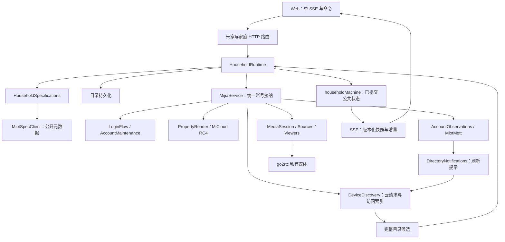

# 设备接入代码职责参考

本文说明[米家接入](../mijia.md)与[家庭运行时](../household.md)的当前目录、文件、函数、状态所有者及异步交付边界。协议保证和实机适用范围以[来源契约](mijia-source-contract.md)为准；函数行为以链接的源码为准。

导航：[范围与所有权](#1-范围与所有权) · [家庭运行时](#2-家庭运行时) · [账号协调](#3-账号协调) · [目录与读取](#4-目录与属性读取) · [MQTT](#5-账号观察与-mqtt) · [云协议](#6-micloudoauth-与公开规格协议) · [媒体](#7-后端媒体) · [Go 扩展](#8-go2rtc-扩展与构建) · [契约和基础能力](#9-共享契约存储与装配) · [Web](#10-浏览器状态与界面) · [调用链](#11-关键调用链与失败范围) · [边界](#12-能力与证据边界)。

## 1. 范围与所有权

### 1.1 阅读范围

完整覆盖 `apps/backend/src/mijia/`、`apps/backend/src/household/`、`apps/web/src/features/mijia/` 和 `docker/go2rtc/overlay/` 中的代码文件；另外说明直接支撑它们的共享契约、HTTP 工具、凭据仓库、数据库、应用装配和页面入口。构造器、getter/setter、私有方法、返回对象方法及有独立生命周期的嵌套函数均列出。普通 map/filter、Promise finally 等回调的责任归所属函数；HTTP、MQTT、SSE 回调按入口单列。

通用配置编辑、聊天、Agent、UI 基础组件、遥测导出器、第三方库内部实现不展开。go2rtc 上游只解释仓库 `runtime.patch` 改动的责任；MiLoCo 作为协议参考，不是本项目运行模块。

| 依据文档 | 内容 |
| --- | --- |
| [米家与摄像头](../mijia.md) | 账号接入、家庭范围、属性入口与媒体使用。 |
| [家庭运行时](../household.md) | 已提交目录、规格、作用域、状态版本与 SSE。 |
| [米家来源契约](mijia-source-contract.md) | 协议、读取和推送语义、失败范围、实机适用条件。 |

### 1.2 目录责任

下面 `mijia/`、`household/` 均相对 `apps/backend/src/`；`overlay/` 相对 `docker/go2rtc/`。

| 目录                                                  | 所有权／责任                                                   | 协作边界                                                              |
| ----------------------------------------------------- | -------------------------------------------------------------- | --------------------------------------------------------------------- |
| `mijia/`                                              | 当前完整账号、凭据接纳、跨模块生命周期、HTTP 边界。            | 家庭公共状态交 household；供应商原始秘密不进入投影。                  |
| `mijia/account/`                                      | 扫码候选、恢复／续期任务、账号共享 MQTT 观察。                 | 候选由 service 持久化并接纳；不另存 token。                           |
| `mijia/homes/`                                        | 账号家庭选择的存储适配。                                       | 在途切换目标由家庭 actor 持有，存储成功后才修改供应商访问选择。       |
| `mijia/devices/`                                      | 云目录请求、原始接入资料、已接纳访问索引、候选转换、目录通知。 | 完整候选交 household 保存；确认撤销先取消资格，新增成员须保存后接纳。 |
| `mijia/properties/`                                   | 同步 readable 预检、全服务串行读取、来源配置。                 | 只输出指定属性观测，不维护 latest、availability 或自动采集集合。      |
| `mijia/protocols/micloud/`                            | 扫码、Cookie、RC4、云目录、属性请求、公共规格编解码。          | MiCloud 不拥有家庭规格缓存，公开规格客户端不接收账号凭据。            |
| `mijia/protocols/oauth/`                              | 同次扫码的后台 OAuth 授权与 token 交换。                       | 不创建第二个用户登录入口。                                            |
| `mijia/protocols/miot/`                               | 单代 MQTT 连接、topic 对账、消息规范化。                       | 跨代 watches 和重连由 AccountObservations 持有。                      |
| `mijia/media/`                                        | 媒体绑定、共享镜头源、独立观看和远端清理。                     | 从统一账号取得凭据；只有家庭可运行才新绑定；清理不等待新家庭就绪。    |
| `household/`                                          | 已提交公共目录／规格、scope_epoch、版本、状态提交和 SSE。      | actor 同步决策，网络／数据库在 runtime 的异步效果中执行。             |
| `credentials/`、`db/`、`apps/backend/drizzle/`        | 加密授权、密钥读取、数据库连接、表与迁移。                     | 不决定哪个候选账号可被接纳。                                          |
| `packages/api/src/contracts/`                         | 共享 schema、命令／快照／增量协议、错误与预算。                | 不拥有运行状态或供应商连接。                                          |
| `packages/api/src/http/`、`errors/`                   | 本机访问限制、响应大小、Retry-After、安全错误和校验。          | 不决定账号、家庭及观看所有权。                                        |
| `apps/web/src/features/mijia/`                        | 每标签页单 SSE、公共投影、命令、扫码材料、设备／播放 UI。      | 命令响应不写公共快照；属性 MQTT 不直连浏览器。                        |
| `apps/web/src/pages/`、`components/StateProvider.tsx` | 页面装配和应用级订阅生命周期。                                 | 页面切换不重复创建家庭订阅。                                          |
| `docker/go2rtc/`                                      | 固定上游构建、补丁、overlay、来源和许可。                      | 内存媒体会话不替代 backend 持久账号。                                 |
| `overlay/internal/xiaomi/`                            | 私有会话、镜头源、viewer、双镜头共享所有权。                   | 源不进入全局 streams 注册表或 YAML。                                  |
| `overlay/internal/streams/`、`internal/webrtc/`       | 私有 dialer、重连观察、只读 WebRTC 协商。                      | 不接纳业务家庭或保存凭据。                                            |
| `overlay/pkg/webrtc/`                                 | 可取消的完整 ICE answer。                                      | 不实现管理 HTTP 接口。                                                |
| `overlay/pkg/xiaomi/`、`miss/`、`diagnostic/`         | 媒体 token 登录、双镜头物理连接与分流、安全诊断。              | 不从型号名称猜双摄，不打印原始供应商报文。                            |

### 1.3 状态与身份

| 状态／身份                                      | 所有者                                                  | 用途和失效条件                                                                               |
| ----------------------------------------------- | ------------------------------------------------------- | -------------------------------------------------------------------------------------------- |
| 当前 MiCloud＋OAuth／账号实例 ID                | MijiaService                                            | 同次完整接纳；扫码替换、退出、整会话认证失败、关闭撤销。                                     |
| 账号存储键                                      | service.accountKey                                      | `JSON.stringify([region,userId])`，按账号隔离选择和目录；不等于浏览器账号实例 UUID。         |
| 已提交目录、spec、scope_epoch、sequence         | household actor／runtime                                | 切家、账号替换、失去家庭访问换 epoch；同 epoch 公共变化才递增 sequence。                     |
| input_sequence、effects                         | householdMachine                                        | 区分一次输入与公共变化；无公共变化的已接纳 refresh 仍要执行效果。                            |
| accessHomeId、catalogConfirmed、scopeRevision   | DeviceDiscovery                                         | 保存成功后的供应商访问范围及原始资料；suspend/reset 取消确认，完整清单确认撤销立即剔除资格。 |
| 待保存完整候选                                  | DeviceDiscovery.pendingCatalog                          | 至多一份，用于保存重试；不是另一份已提交业务状态。                                           |
| model/URN 组、活动规格任务                      | HouseholdSpecifications                                 | 仅保留活动设备引用；成功后按最终 URN 共享，失败保留原能力和版本。                            |
| readScope／readGeneration                       | MijiaService                                            | 同账号 MiCloud 续期也中止旧读取；source_id 和限流门不变。                                    |
| watches／rejectedTopics                         | AccountObservations                                     | 目录与属性共享；断线保留，凭据更新清拒绝，scope 关闭清全部。                                 |
| MQTT generation／逐 topic 确认                  | MiotMqtt                                                | 每连接新 UUID；关闭后所有旧消息、ACK 均不可复活。                                            |
| media revision／sessionId／sourceId／playbackId | MediaSession／adapter／source manager／playback manager | 分别表示浏览器媒体资格、远端租约、镜头源和单观看者，不能互换。                               |
| householdSnapshotAtom                           | 浏览器订阅                                              | 仅 SSE 写入公共快照；断流可保留旧显示但标未同步。                                            |

## 2. 家庭运行时

### 2.1 [household/runtime.ts](../../apps/backend/src/household/runtime.ts)

`HouseholdRuntime` 组合 actor、repository、规格所有者和 MijiaService，保存切换／退出标记、最新已保存候选、刷新合并状态及版本缓存。`running` 表示账号与完整目录已保存接纳，不要求所有规格已经准备完成。

| 方法／回调                   | 功能责任与边界                                                                                                                                                                                                                  |
| ---------------------------- | ------------------------------------------------------------------------------------------------------------------------------------------------------------------------------------------------------------------------------- |
| `constructor`                | attachHousehold：提供持久目录 restore、候选 commit、ready 和同步 specification 回调。规格 changed 回调触发 publishSpecs；capacity 回调检查目录＋规格合计并发布容量降级。                                                        |
| `start`                      | actor 启动前注册订阅；公共版本变化通知 listeners；按 input_sequence 只处理一次 effects。select 效果先清旧规格／候选／刷新状态、suspend 接入，再保存目标选择；最后同 epoch 才解除 switching。注册 service.subscribe 后同步初态。 |
| `epoch`、`projection` getter | 从 actor 当前快照取作用域和公共投影。                                                                                                                                                                                           |
| `ready` getter               | 家庭 status=running，且未 leaving/stopped。临时同步 error 不必改变 running。                                                                                                                                                    |
| `snapshot`                   | 同 `{scope_epoch,sequence}` 复用经 snapshotSchema 校验的快照对象。                                                                                                                                                              |
| `changes`、`version`         | 返回本次提交变更和同一 actor 的公共版本。                                                                                                                                                                                       |
| `subscribe`                  | 添加状态变化 listener，返回删除该 listener 的闭包。                                                                                                                                                                             |
| `publish`                    | 未停止时向 actor 发送带当前 epoch 的 projection；newScope 请求换作用域。                                                                                                                                                        |
| `assertEpoch`                | 停止或 epoch 不同抛 stale_session。                                                                                                                                                                                             |
| `selectHome`                 | 校验 epoch、家庭归属和 authenticated，再发 select command；返回接纳后的 state_version。HTTP 接纳不代表选择保存／云初始化完成。                                                                                                  |
| `requestRefresh`             | 校验 epoch、账号且非切换中。selection 阶段失败时 directory/all 重试保存原目标，specs 拒绝；其他情况发 refresh command。                                                                                                         |
| `refresh`                    | 同时只有一个刷新任务，后续目录／规格请求用两布尔合并；必要时 loadDevices，再同 epoch 刷新对应活动 specs；失败发布 directory error，finally 只执行本 epoch 累积的下一轮。                                                        |
| `restore`                    | 读取同账号／家庭持久目录，检查 epoch，标 cached，发布 initializing/account/unsynced 展示；没有给 service 供应商访问确认或媒体资格。                                                                                             |
| `commitDirectory`            | 捕获 epoch，构造白名单 publicDirectory，校验在途选择目标与容量，保存目录；失败发布 storage/capacity degradation 并抛出。成功返回同步提交闭包，供 service 完成原始访问索引接纳后调用。                                           |
| `commitDirectory.assert`     | 合并 epoch、供应商任务断言；selection 阶段要求候选账号／家庭等于 actor 目标，旧家庭不得覆盖失败切换。                                                                                                                           |
| `commitDirectory` 返回闭包   | 再断言，清 cached、记录 savedCandidate、更新活动规格，发布目录／引用及 running 或 waiting_for_home，重置成功同步／健康状态。                                                                                                    |
| `withSpecifications`         | 将规格 references 接到设备 spec_id/category，按能力推导 readable/writeable/notify/action/event 标签；不启动属性采集。                                                                                                           |
| `publishSpecs`               | 只有未停止且有已保存候选时发布规格与设备关联，不写原始 cloud 目录。                                                                                                                                                             |
| `syncService`                | 投影账号、公共扫码、连接操作和媒体；检测账号实例／稳定身份变化，清旧目录／规格／运行空域；按访问索引剔除已撤销设备与失去引用的 spec；保留选择失败目标，转换目录同步错误。失去家庭访问清旧状态并换 epoch。                       |
| `fail`                       | 仅当前 epoch 发布 selection/directory 阶段安全错误与 sync_status=error。                                                                                                                                                        |
| `specification`              | 通过账号＋did 的实体 key 读取已接纳 spec；不存在／未 ready 且无旧能力时拒绝；有旧能力的 loading/error 规格仍可供预检；返回 MijiaDeviceSpec 形状。                                                                               |
| `reservePlayback`            | epoch、ready、公共成员存在都满足后交 service 做原始访问与媒体 revision 校验。                                                                                                                                                   |
| `logout`                     | 先标 leaving、清家庭目录／规格及运行空域、换 epoch，再 await service.logout；失败发布错误；finally 解除 leaving 并同步实际账号状态。                                                                                            |
| `close`                      | actor 收 stop，再标 stopped、取消规格与 service 订阅，await service.close，停止 actor 并清 listeners。                                                                                                                          |

### 2.2 [household/machine.ts](../../apps/backend/src/household/machine.ts)

| 函数／动作                        | 责任                                                                                                                                                                                                                                                       |
| --------------------------------- | ---------------------------------------------------------------------------------------------------------------------------------------------------------------------------------------------------------------------------------------------------------- |
| `initialContext`                  | 新 epoch、sequence=0、initialProjection、input_sequence=0、空 effects/changes。                                                                                                                                                                            |
| `transition`                      | 同步处理 stop/publish/command。停止或错误 epoch 的普通输入原样拒绝；select 清家庭实体及未来空域、换 epoch、sequence=0、记录目标与 selection 阶段，产生 select effect；refresh 只产生 effect。publish 检查容量并计算 changes，只有有公共变化才增 sequence。 |
| `householdMachine.actions.commit` | XState assign 调 transition，网络与存储不在 action 内执行。                                                                                                                                                                                                |
| 各状态 `always.guard`             | 从 projection.household.status 同步 unbound/waiting_for_home/initializing/running/stopping 的 XState 状态节点。不是独立第二套业务状态更新。                                                                                                                |

容量超限保留旧投影并设 capacity_degraded。`input_sequence` 用于效果去重，`sequence` 用于外部连续版本，两者不能混用。

### 2.3 [household/projection.ts](../../apps/backend/src/household/projection.ts)

| 函数                | 责任                                                                                                                                                               |
| ------------------- | ------------------------------------------------------------------------------------------------------------------------------------------------------------------ |
| `initialProjection` | 创建 schema 验证过的账号、公共扫码、connection、media、household、health 固定 key 及空 home/room/device/spec/latest/source_health/rule_status。                    |
| `publicDirectory`   | 候选→所选家庭白名单目录，entityKey 编码账号／归属；赋 last_seen_at/archived=false；设备 availability=unknown、read_enabled_properties=[]、spec/category/alias 空。 |
| `projectionChanges` | 遍历实体，生成 remove 和变化的 upsert；先比较引用再比较 JSON 值，逐项验证 changeSchema；一次提交只计算一次。                                                       |

### 2.4 [household/repository.ts](../../apps/backend/src/household/repository.ts)

`storedDirectorySchema` 只保存公共目录字段，去 category/capability_tags/spec_id/availability/read_enabled_properties/alias，不保存协议凭据或运行任务。

| 函数／方法                  | 责任                                                                                                                                 |
| --------------------------- | ------------------------------------------------------------------------------------------------------------------------------------ |
| `createHouseholdRepository` | 创建绑定 Database 的 read/save 对象。                                                                                                |
| `read`                      | 按 accountId/homeId 查询，校验持久结构，过滤 archived；规格引用／类别／可用性／采集字段重新初始化，返回 directory 和 savedAt。       |
| `save`                      | 当前目录 schema 化，事务锁定原记录；缺失 home/room/device 保留为 archived，合并后≤4 MiB；断言当前 scope，upsert 完整目录并返回时间。 |
| `save` 事务回调             | statement/lock/transaction timeout 均 5 秒；读取用 FOR UPDATE，写前后 assertCurrent。                                                |
| `save` 提交不确定处理       | catch 后重读持久行，重验当前 scope；与目标含归档数据 deep-equal 才承认成功，否则抛原错误。不能把 COMMIT 响应丢失当作必定回滚。       |

### 2.5 [household/specifications.ts](../../apps/backend/src/household/specifications.ts)

`HouseholdSpecifications` 是活动规格缓存的所有者；Map 保存设备引用、controller、running/done、result，aliases 将输入 model/spec_type 映射到已成功取得的 URN。共享一个无账号秘密的 MiotSpecClient。

| 方法          | 责任                                                                                                                                                                        |
| ------------- | --------------------------------------------------------------------------------------------------------------------------------------------------------------------------- |
| `constructor` | 注入公共变化和容量接纳回调。                                                                                                                                                |
| `update`      | 按 spec_type 或 model 收集引用；移除失去引用的 aliases/groups 并 abort；显式刷新对已完成组重新解析型号，保留旧 result 标 loading；正在运行组不重复启动；最后 pump。         |
| `snapshot`    | 输出按 result.id 的 specs 与 did→spec_id references；未有 result 的组输出 loading 空能力。                                                                                  |
| `clear`       | abort 全部组、清 groups/aliases；在途 load 的 finally 负责释放 active 计数。                                                                                                |
| `pump`        | 最多三组并发；跳 running/done，load 完成后减 active 并继续泵。                                                                                                              |
| `load`        | 解析 URN，优先复用该最终 URN 的 ready 组，否则读能力；每步重验 signal／组身份。恢复类错误额外等 2s、10s 重试；最终失败保留原 result 能力／URN／版本，标 error/done 并通知。 |
| `commit`      | 选择最终 URN owner，临时放入结果检查总容量，拒绝则恢复原结果；成功合并 devices 与 alias，迁移 key 到 URN，终止被合并组并通知。只有能力成功才改变能力版本身份。              |

显式刷新按组进行，不因其他组仍运行而忽略已失败组。普通重复目录更新不会把 done 错误组重置成无限重试。

### 2.6 [household/config.ts](../../apps/backend/src/household/config.ts)

`householdLimits`：事务 5s；metadata 2 MiB；目录＋spec 4 MiB；快照 8 MiB；非快照排队 2 MiB／256 条；最多16 SSE 连接；心跳15s；写入期限15s；规格并发3、重试等待2s/10s。`jsonBytes(value)` 按 JSON 序列化后的字节计量。共享快照／心跳值来自 householdStreamPolicy，不能另配不一致的浏览器期限。

### 2.7 [household/stream.ts](../../apps/backend/src/household/stream.ts)

| 函数／闭包              | 责任                                                                                                                 |
| ----------------------- | -------------------------------------------------------------------------------------------------------------------- |
| `noop`                  | 初始化可安全调用的 detach/finish。                                                                                   |
| `serialize`             | 编码一个 event/data SSE 帧，记录实际 bytes、是否 snapshot、发送后是否结束。                                          |
| `createHouseholdStream` | 创建路由 handler，闭包保存连接计数与一个公共版本的惰性编码缓存；超过16连接返回503/Retry-After=30。                   |
| `prepare`               | 捕获 snapshot/version/changes/stopping；返回 snapshot/change/heartbeat/resync 四个惰性缓存函数，多个连接复用同一帧。 |
| `current`               | 当前 runtime 版本不同才换 prepare 结果；不触发 cloud 请求。                                                          |
| 返回 HTTP handler       | 设禁代理缓冲，建立 Hono stream；每连接独立 FIFO、字节／数量计数、last version、计时器和 detach。                     |
| `close`                 | 幂等减连接数、退订、清 heartbeat/deadline、清队列，abort stream、resolve done。                                      |
| `pump`                  | 单写者按 FIFO await stream.write；在途帧仍占预算；每次15s deadline，发送后扣预算；end 帧、异常或超时 close。         |
| `enqueue`               | 每帧≤8 MiB；非 snapshot 的排队＋在途总数≤256、总 bytes≤2 MiB；越界直接 close；否则入队启动 pump。                    |
| runtime 订阅回调        | 忽略相同版本，epoch 变化／stopping 发 resync_required，当前 epoch 增序发 change；更新 last。                         |
| 初始化与 heartbeat 回调 | 同步注册 listener 后取完整快照，中间无 await；再每15s入队 heartbeat，所有写入共用 FIFO；finally close。              |

新连接总取完整快照，没有 Last-Event-ID 历史补发。慢连接不阻塞其他连接或触发云刷新。

### 2.8 [household/routes.ts](../../apps/backend/src/household/routes.ts)

`createHouseholdRoutes(runtime)` 注册 `GET /state`（纯快照）、`GET /events`（SSE）、`PUT /scope/homes`（epoch/home_id）、`POST /devices/refresh`（epoch/target）。命令验证后返回202 `{state_version}`。它由米家父路由挂载，继承本机访问、body limit 与安全 headers。

## 3. 账号协调

### 3.1 [mijia/service.ts](../../apps/backend/src/mijia/service.ts)

`MijiaService` 持有完整账号、唯一凭据仓库接纳队列、读／观察取消范围、media、discovery、maintenance、DirectoryNotifications。`snapshot()` 是服务内部组合状态，HTTP `/state` 返回的则是家庭公共快照。

| 方法／getter                           | 责任与边界                                                                                                                                                                                         |
| -------------------------------------- | -------------------------------------------------------------------------------------------------------------------------------------------------------------------------------------------------- |
| `constructor`                          | 装配媒体、供应商目录、维护回调；目录 commit 经 serial 调 commitCatalog；onScopeChanged 撤销访问并准备媒体重绑；只有 household.ready 才把设备交媒体。                                               |
| `attachHousehold`                      | 接入家庭 restore/commit/ready/specification 四个明确回调，避免协议层反向持有 actor。                                                                                                               |
| `subscribe`                            | 注册 service 状态通知，返回 unsubscribe。                                                                                                                                                          |
| `changed`                              | 微任务合并状态通知，同轮多次修改只排一个回调。                                                                                                                                                     |
| `flushChanges`                         | 立即通知 listeners；在 HTTP 命令响应或确认撤销时使家庭投影同步到实际状态。                                                                                                                         |
| `identity`、`accountKey`               | 当前账号稳定 `[region,userId]` 键或 null；accountKey 从 MiCloud 凭据读取。                                                                                                                         |
| `directoryCandidate`                   | raw catalog＋账号键＋当前持久访问家庭→deviceDirectory。                                                                                                                                            |
| `directorySnapshot`                    | 将当前已接纳原始目录投影成候选形状，供 runtime 核对访问撤销。                                                                                                                                      |
| `commitCatalog`                        | 断言→discovery.revoke→flushChanges→retain 最新候选；若没有保存过选择且账号恰有一个家庭，先持久化默认家庭。await household.commit 保存，之后 discovery.set 并调用返回提交闭包，协调目录通知／媒体。 |
| `loginMaterial`、`loginPublic`         | 分别取当前尝试的私有材料与无材料公开状态。                                                                                                                                                         |
| `suspendHousehold`                     | 撤销读取／观察、暂停并取消目录任务、revokeAccount 媒体资格；发布变化。                                                                                                                             |
| `requireHomeStore`、`requireStore`     | 缺配置存储分别抛 home_storage／credential_storage。                                                                                                                                                |
| `homes`、`validateHome`                | 前者要求活动账号后返回选择快照；后者检查给定非空家庭在 catalog 中。                                                                                                                                |
| `selectHome`                           | 捕获账号、禁默认选择，serial 内反复核验账号和 actor assertCurrent，事务保存选择后 acceptHome；队列外 loadDevices，再尝试媒体绑定。                                                                 |
| `invalidateDeviceAccess`               | 关闭目录通知，摘除账号观察 owner，close Promise 汇入 mqttClosing；abort 观察 scope 并换 controller，然后撤销读取。                                                                                 |
| `invalidatePropertyReads`              | abort 旧 readScope，创建新 controller/generation。                                                                                                                                                 |
| `accountObservations`                  | 复用或创建账号级 MQTT owner，提供动态当前 OAuth getter、认证拒绝维护回调、权限拒绝目录刷新回调。闭包核验账号键及观察 scope，不把旧对象凭据用于新连接。                                             |
| `syncDirectoryNotifications`           | 等旧 MQTT 关闭后重验账号／scope，为账号目录所有 did 更新精确目录 topic；不按所选家庭裁剪通知覆盖。                                                                                                 |
| `directoryPushStatus`                  | 仅返回脱敏目录推送统计。                                                                                                                                                                           |
| `observeDevices`                       | 要求 household.ready、完整账号；复制去重明确 did，接纳前和串行出队后校验家庭、catalogConfirmed、成员。复用账号观察 owner；返回 cancel/snapshot/retry。                                             |
| `observeDevices.assertCurrent`         | 组合调用／观察取消信号、活动账号、同 scope signal 和 discovery revision。                                                                                                                          |
| `observeDevices.assertDevices`         | 在上述基础上核验有效家庭、已确认访问目录、所有 did 存在；临时目录 error 不单独否决已确认范围。                                                                                                     |
| `observeDevices` 交付与 retry          | 数据和确认先重验 scope；closed/cancelled 控制事件仍可解释覆盖丢失，但调用方已取消则不交付。retry 也先断言。                                                                                        |
| `readProperties`                       | 要求运行家庭、活动 MiCloud、有效家庭与 catalogConfirmed；复制地址并捕获设备关键字段，preparePropertyRead 同步查已准备规格，唯一 reader 执行；最终断言，认证类逐项失败后台续期但不重发。            |
| `readProperties.assertCurrent`         | 调用取消、精确 MiCloud 对象、readGeneration、确认目录、did 存在及 home_id/model/spec_type 不变。                                                                                                   |
| `requestConnection`                    | 合并 running 连接操作；拒绝提交／初次恢复冲突，创建 operation UUID/时间并后台 reconnect；仅当前 operation 写终态。                                                                                 |
| `isConnectionOperationCurrent`         | operation ID/running 且未 stopped/loggingOut。                                                                                                                                                     |
| `cancelConnectionOperation`            | running→cancelled 并通知。                                                                                                                                                                         |
| `connectionFailure`                    | 账号→媒体→目录顺序返回当前安全错误；不代表每个 MQTT topic 健康。                                                                                                                                   |
| `reconnect`                            | 局部 assertCurrent 贯穿配置协调、无账号恢复、失败账号续期、媒体重绑、目录加载；按需执行而不盲目重置正常资源。                                                                                      |
| `cancelRestore`                        | 清 initialRestorePending 并取消维护恢复任务。                                                                                                                                                      |
| `activeAccount`                        | 对象相同且未停止／退出。                                                                                                                                                                           |
| `stopAccountMaintenance`               | 暂停目录 timer／保存重试，停止账号续期调度。                                                                                                                                                       |
| `startAccountMaintenance`              | profile 加载、续期、5分钟目录调度及目录通知协调。                                                                                                                                                  |
| `loadAccountProfile`                   | 异步昵称头像，只有当前 authenticated 账号写回；失败不影响授权或设备。                                                                                                                              |
| `commitRenewed`                        | serial 检查同 userId/region，先保存完整凭据；撤销旧读取、替换并 dispose 旧 MiCloud。提交候选目录失败单列目录 error，已接纳账号保留；按 passToken／媒体状态重绑，accessToken 改变重建 MQTT。        |
| `commitRestored`                       | 无当前账号时读取选择（区分无记录和显式 null），保存完整候选、发布账号、acceptHome、commitCatalog、启动维护；目录保存失败不假装家庭 running。                                                       |
| `expireAccount`                        | 维护确认认证失败后 serial 撤销整个账号、目录、读取、观察和媒体资格，标 reauth_required；尝试远端清理，保留原持久记录等待重新认证处理。                                                             |
| `logout`                               | 提前停止接纳／撤销读观察，serial 先删持久授权再清内存目录账号，revokeAccount 后 await 远端清理。删除存储失败保留账号并恢复维护；媒体清理失败不复活已删除授权。                                     |
| `serial`                               | Promise 队列；自身错误返回调用者，tail 消化失败后允许后续提交。                                                                                                                                    |
| `initialize`                           | 先从严格会话记录和家庭选择恢复公共缓存展示；再 media.initialize/reset，maintenance.restore 续期接纳；finally 启配置检查。缓存恢复失败交正式账号状态报告。                                          |
| `snapshot`                             | structuredClone 内部账号、home、media revision/binding、扫码 state 和目录展示；包含扫码材料，不能直接当 SSE payload。                                                                              |
| `startLogin`                           | 校验可工作／存储，取消连接操作／恢复，启动独立候选；保留当前可用账号。                                                                                                                             |
| `cancelLogin`、`verifyLogin`           | 按尝试 ID 和允许阶段取消／提交验证码，返回内部快照供内部调用。                                                                                                                                     |
| `commitLogin`                          | prepareCommit 后完成 OAuth，serial 读取选择并保存完整凭据；成功撤销旧接入／媒体、换账号实例、adopt 候选和维护；再 loadDevices。新家庭未运行也要清旧远端资源。                                      |
| `getDeviceSpec`                        | 同步检查 signal、household.ready，返回 household.specification；不触发 miot-spec.org 网络请求。                                                                                                    |
| `loadDevices`                          | 显式 discovery.load 后返回内部快照。                                                                                                                                                               |
| `reservePlayback`                      | 家庭 ready、有效选择和供应商成员校验后交 media。                                                                                                                                                   |
| `offer`、`playbackSnapshot`、`release` | 分别委托媒体协商、观看状态和释放；释放不依赖旧家庭仍活动。                                                                                                                                         |
| `close`                                | 停接纳、维护、扫码、目录、读观察、MiCloud；关闭媒体；finally 等维护、serial 和 mqttClosing 排空，保留持久授权。                                                                                    |

没有选择记录且恰好一个家庭才自动选择；明确保存的 null 表示不接入，不被默认选择覆盖。多家庭不能自动取第一个。

### 3.2 [account/login-flow.ts](../../apps/backend/src/mijia/account/login-flow.ts)

| 方法                  | 责任                                                                                                               |
| --------------------- | ------------------------------------------------------------------------------------------------------------------ |
| `constructor`         | 注入候选 commit 和 onChange。                                                                                      |
| `state` getter/setter | 持有私有 currentState；每次设值通知 service。                                                                      |
| `publicSnapshot`      | id/status/error/material_version 白名单；按 id、二维码、verificationUrl 指纹变化递增材料版本，不把材料送公共状态。 |
| `material`            | 仅匹配当前活动尝试 ID；返回版本、可选二维码／验证 URL／expiresAt。                                                 |
| `active`、`isCurrent` | 分别判断候选存在，或精确候选且 controller 未取消。                                                                 |
| `start`               | dispose 旧候选，创建 cn MiCloud/controller/UUID，creating 后后台 prepareLogin。                                    |
| `dispose`             | 清过期 timer、abort、dispose 未接纳 cloud，回 idle。                                                               |
| `prepareCommit`       | 当前候选才能清扫码 expiry timer、标 completing。                                                                   |
| `adopt`               | 转交 cloud，清 timer、abort 候选流程、脱离 attempt，标 completed；不 dispose 已接纳 cloud。                        |
| `cancel`、`finish`    | 按 ID 取消；finish 清资源后保存指定终态。                                                                          |
| `prepareLogin`        | 取得 QR 并挂过期 timer，循环 pollLogin；authenticated commit，安全挑战暂停，过期失败；每步检查候选身份。           |
| `loginFailed`         | 只对当前候选安全映射错误，进入 expired/error 并清资源。                                                            |
| `verifyLogin`         | 仅匹配 security_required；提交数字验证码。拒绝验证码可保留挑战重试，其余失败销毁候选。                             |

### 3.3 [account/session.ts](../../apps/backend/src/mijia/account/session.ts)

`accountSessionSchema` 严格要求一份 `{micloud,oauth}`。`renewAccountSession` 创建隔离 MiCloud 候选、读取验证 catalog、refreshOAuth；任一步失败 dispose 候选。`restoreAccountSession` 读取 `mijia` 记录，校验完整结构，临时 restoreSession 后经同一 renew 流程，finally 释放临时实例；不把过期 token 直接当恢复成功。

### 3.4 [account/maintenance.ts](../../apps/backend/src/mijia/account/maintenance.ts)

| 方法                               | 责任                                                                                                                                                                                      |
| ---------------------------------- | ----------------------------------------------------------------------------------------------------------------------------------------------------------------------------------------- |
| `constructor`                      | 注入当前账号／OAuth、接纳条件、存储、提交和失败回调。                                                                                                                                     |
| `acceptsWork`、`activeAccount`     | 自身 stopped 与 service 条件／账号身份合并。                                                                                                                                              |
| `track`                            | 保存 pending Promise，结束移除，shutdown 可等待。                                                                                                                                         |
| `renewalFailed`                    | 判断给定账号是否为失败账号。                                                                                                                                                              |
| `currentRestore`、`currentRenewal` | 当前 task 对象＋未 abort＋接纳条件，renewal 还要求原账号活动。                                                                                                                            |
| `cancelRestore`                    | 清恢复 timer，abort task 并清引用。                                                                                                                                                       |
| `retryRestore`                     | 遵守 restoreRetryAfterAt，未到不请求；否则 cancel 退避后 restore。                                                                                                                        |
| `restore`                          | 合并在途任务；账号已存在、扫码中、停止或期限未到则跳过。准备完整候选，经 assertCurrent 提交；认证→reauth_required，其余 restore_error；仅恢复类失败自动重试，finally dispose 未接纳候选。 |
| `stopRenewal`                      | 清周期／重试 timer；持久写入未开始时可 abort；提交中的候选须完成持久与内存 owner 一致性。                                                                                                 |
| `scheduleRenewal`                  | 遵守失败账号 Retry-After；按 MiCloud/OAuth 最早期限提前最多5分钟或剩余一半，至少1秒；MiCloud 无期限按6小时再验证策略。                                                                    |
| `rejectOAuth`                      | 保存当前被拒 token，并 join/启动 renew；在途普通续期不抹掉拒绝事实。                                                                                                                      |
| `renew`                            | 按账号合并、限流门控制；准备候选后若仍用被拒 token，force refresh，仍相同则认证失败。认证错误由 service 撤销整会话，临时错误保留账号并重试；finally 处理提交期间到来的拒绝及候选清理。    |
| `shutdown`                         | 标 stopped、停止续期／恢复，allSettled pending。                                                                                                                                          |

### 3.5 [mijia/routes.ts](../../apps/backend/src/mijia/routes.ts)

`createMijiaRoutes(port,runtime)` 使用本机访问校验、70,000 字节 body limit、no-store/no-referrer 和统一错误处理，挂 household routes。内部 `commandResult` 先 service.flushChanges 再返回 runtime.version。

| `/api/mijia` handler          | 责任                                                                                   |
| ----------------------------- | -------------------------------------------------------------------------------------- |
| `GET /state`、`GET /events`   | 家庭快照／SSE；不触发云刷新，不返回内部 MijiaState。                                   |
| `PUT /scope/homes`            | `{scope_epoch,home_id}` 接纳选择，202 state_version。                                  |
| `POST /devices/refresh`       | `{scope_epoch,target:directory/specs/all}`，202只表示接纳。                            |
| `GET /directory/push`         | 脱敏连接、topic计数、通知次数及时间；无原始 topic／载荷。                              |
| `GET /login/:id/material`     | 校验当前尝试材料响应 schema；独立 no-store 读取。                                      |
| `POST /login`                 | 创建候选，202 state_version。                                                          |
| `DELETE /login/:id`           | 取消对应候选，返回 state_version。                                                     |
| `POST /login/:id/verify`      | 校验 ticket，await 验证，返回 state_version。                                          |
| `POST /connection/retry`      | 启动／复用连接操作，202 state_version。                                                |
| `DELETE /session`             | await runtime.logout，返回 state_version；清理失败仍报错。                             |
| `POST /playback/reservations` | schema 校验 scope_epoch/revision/deviceId/channel；经 runtime 预约，201 ID＋Location。 |
| `GET /playback/:id`           | 返回 validated reserved/negotiating/active。                                           |
| `PUT /playback/:id`           | revision/SDP 验证；预取消拒绝，接纳后观看资源拥有期限与取消。                          |
| `DELETE /playback/:id`        | await release，204；可以重试远端未完成清理。                                           |

属性读取／观察和规格查询是内部入口。公共目录和规格从 projection 获取；没有独立 `/home`、`/homes` 或 `/devices/:did/spec` handler。

### 3.6 错误、操作与重试

| 文件／函数                                                                               | 责任                                                                                                                                                                          |
| ---------------------------------------------------------------------------------------- | ----------------------------------------------------------------------------------------------------------------------------------------------------------------------------- |
| [errors.ts](../../apps/backend/src/mijia/errors.ts) / `MijiaError.constructor`、`toPayload` | reason→mijia_ 静态错误及共享 payload。                                                                                                                                        |
| `safeMijiaError`                                                                         | 映射取消、超时、存储、MiCloud、go2rtc；只转安全 HTTP／上游整数码／Retry-After，不转原始消息、URL 或 cause。                                                                   |
| `isRecoverableMijiaError`                                                                | 仅已知类型的 network/timeout/go2rtc_unavailable/request_timeout/session_expired 可自动恢复；配置／存储／协议／未知不由 fallback 误判。目录存储重试由 discovery 明确另行处理。 |
| `mijiaRetryAfter`                                                                        | 安全错误参数中的绝对 deadline，无效为0。                                                                                                                                      |
| [operation.ts](../../apps/backend/src/mijia/operation.ts) / `mijiaOperation`                | 静态 mijia.* span，先映射后抛错；onError 对取消标记，其他记录安全错误。                                                                                                       |
| [retry-timer.ts](../../apps/backend/src/mijia/retry-timer.ts) / `RetryTimer.schedule`       | 5/10/20/40/60s＋0—1s抖动，和 notBefore 取较晚值；同 timer 可延后 deadline。                                                                                                   |
| `schedule.arm`                                                                           | 超长等待分段≤2,147,483,647ms；到期前重挂，最终执行最新 run；ROOT_CONTEXT/unref。                                                                                              |
| `RetryTimer.cancel`                                                                      | 清 timer/run/失败计数/deadline；不是 MQTT 的1—120秒策略。                                                                                                                     |

## 4. 目录与属性读取

### 4.1 [devices/discovery.ts](../../apps/backend/src/mijia/devices/discovery.ts)

| 方法／getter                       | 责任                                                                                                                                                                                                                                     |
| ---------------------------------- | ---------------------------------------------------------------------------------------------------------------------------------------------------------------------------------------------------------------------------------------- |
| `constructor`                      | 注入账号、提交、状态变更、范围撤销、媒体目录和续期回调。                                                                                                                                                                                 |
| `state` getter/setter              | 目录请求显示状态，设值通知；不等同于访问资格。                                                                                                                                                                                           |
| `catalogConfirmed`、`revision`     | 已接纳访问目录标记和范围UUID。                                                                                                                                                                                                           |
| `devices`、`selectedHome`          | 当前派生索引数组及 accessHomeId 对应家庭。                                                                                                                                                                                               |
| `indexSelectedDevices`             | 只从已接纳 raw catalog 按访问家庭重建 did Map。                                                                                                                                                                                          |
| `homeSnapshot`                     | 持久访问选择及 unselected/selected/unavailable、家庭白名单。                                                                                                                                                                             |
| `requireHome`、`validateSelection` | 前者拒绝未选／不可用家庭；后者非null要求目录有该家庭，不以临时 loading/error 拒绝选择。                                                                                                                                                  |
| `acceptHome`                       | 保存成功后的 homeId 接纳，重建索引、换 revision、触发撤销及媒体目录更新。                                                                                                                                                                |
| `catalogSnapshot`                  | 内部读取原始 catalog，不输出到浏览器。                                                                                                                                                                                                   |
| `retain`                           | 清旧 pending，再检查 raw catalog≤4 MiB，保存唯一最新完整候选及账号。                                                                                                                                                                     |
| `suspend`                          | pause、confirmed=false、清待保存、abort 当前加载，换 scopeRevision，显示 loading 空 items。                                                                                                                                              |
| `revoke`                           | 对完整新清单确认原设备存在且 home/model/spec 一致；只保留仍合法原设备／家庭，必要时 set 缩减目录。在数据库失败前也先取消被撤销资格。                                                                                                     |
| `list`、`find`                     | 当前访问设备数组和 O(1) did 查找。                                                                                                                                                                                                       |
| `stateSnapshot`、`snapshot`        | 前者内部显示状态；后者用 describeMijiaDevice 重投影当前访问列表。                                                                                                                                                                        |
| `pause`                            | 清5分钟发现 timer及保存重试。                                                                                                                                                                                                            |
| `reset`                            | pause、abort、清 confirmed/pending/catalog/选择/索引/失败/task，换 revision，idle。                                                                                                                                                      |
| `fail`                             | 显示安全错误、保留 items；home_storage 对当前账号安排候选保存重试。                                                                                                                                                                      |
| `schedule`                         | 活动且无永久发现故障才挂5分钟；醒来续期失败则不发目录请求；background load后重挂。                                                                                                                                                       |
| `set`                              | 接纳原始目录、confirmed=true、清重试；重建索引，对选定家庭／原成员关键字段撤销换 revision；显示 ready、通知媒体并调度。                                                                                                                  |
| `load`                             | 同账号在途合并且置 refreshAgain；续期失败前台可 renew。每次有 controller/assertCurrent；保存重试可复用最新候选，其他读取云目录；经依赖 commit 接纳。认证交续期，恢复类／home_storage安排重试，永久故障停自动发现；结束可补一次合并刷新。 |
| `load.assertCurrent`               | controller 未取消、精确账号、未停止；作为异步读取和持久提交栅栏。                                                                                                                                                                        |

普通刷新错误可保留 confirmed 的有效索引；首次未保存、切换或撤销的资格不能借显示缓存取得。

### 4.2 [devices/directory.ts](../../apps/backend/src/mijia/devices/directory.ts)、[mapping.ts](../../apps/backend/src/mijia/devices/mapping.ts)

| 函数                  | 责任                                                                                                                  |
| --------------------- | --------------------------------------------------------------------------------------------------------------------- |
| `deviceDirectory`     | raw catalog 转含 accountId/homeId、所有可选家庭／房间白名单和选中家庭设备候选；附 spec_type，不传私有 localip/token。 |
| `isCamera`            | model 独立 camera/cateye 段判断分类，不承诺可取流。                                                                   |
| `cameraChannels`      | 能力表1/2通道映射，其余数量不静默截断；非摄像头为空。                                                                 |
| `describeMijiaDevice` | 单设备字段白名单：id/name/model/归属、目录 online、camera/channels；无 retainedChannels 派生状态。                    |

### 4.3 [devices/directory-notifications.ts](../../apps/backend/src/mijia/devices/directory-notifications.ts)

| 方法              | 责任                                                                                                                                                               |
| ----------------- | ------------------------------------------------------------------------------------------------------------------------------------------------------------------ |
| `constructor`     | 注入现有 discovery.load(true) 刷新入口。                                                                                                                           |
| `update`          | 生成排序 topic key；同 owner/key 无操作；创建新 controller、先 observeTopics 再 abort 旧绑定，避免共享连接短暂无 owner。重置确认／失败集合。                       |
| `update` listener | 只处理当前 controller；directory 计数／更新时间并防抖；connected 安排同步，其余连接状态清确认；逐 subscription 更新 confirmed/failed。通知载荷不直接修改业务目录。 |
| `schedule`        | 5秒尾沿防抖，捕获 controller，醒来同代才调用 refresh；ROOT_CONTEXT/unref。                                                                                         |
| `snapshot`        | 返回连接状态、重连／认证标志、topic/confirmed/failed数量、刷新待执行、通知次数／时间，不返回标识。                                                                 |
| `close`           | 清timer、abort绑定、清owner/key/集合及统计。                                                                                                                       |

### 4.4 [homes/store.ts](../../apps/backend/src/mijia/homes/store.ts)

`createHomeSelectionStore` 返回 `read(accountKey)` 与 `write(accountKey,homeId,assertCurrent)`。read 返回 undefined 表示没有记录，`{homeId:null}` 表示明确不接入。write 在5秒锁／语句／事务期限内断言、upsert、再断言；非业务异常后核对持久行，目标值一致才确认成功，否则 home_storage。不会把失败切换退回旧家庭运行。

### 4.5 [properties/read-request.ts](../../apps/backend/src/mijia/properties/read-request.ts)

`preparePropertyRead` 同步复制请求、按did分组，每设备只取一次已准备 MijiaDeviceSpec，要求 siid/piid 为正安全整数且 `prop.siid.piid.readable`；前后检查取消与 assertCurrent，按原输入顺序返回。它不联网、不调度三组并发、不读取当前属性值。

### 4.6 [properties/reader.ts](../../apps/backend/src/mijia/properties/reader.ts)

| 函数／方法             | 责任                                                                                                                                                           |
| ---------------------- | -------------------------------------------------------------------------------------------------------------------------------------------------------------- |
| `propertyKey`          | did/siid/piid JSON元组键。                                                                                                                                     |
| `classifyRow`          | 普通整数负码 failure，豁免-702000000/-702010000；非失败仍须显式合法JSON标量，缺值value_missing、非法invalid_value，不补null。                                  |
| `requestFailure`       | MiCloudError 转 unavailable/request_failed，只保留安全kind、HTTP/code/deadline。                                                                               |
| `propertyObservations` | 按请求顺序加入契约/source/generation、baseline/cloud_cache、observed_at=null、起始／接收时刻；缺响应response_missing。                                         |
| `PropertyReader.read`  | 每批≤150，逐批共用唯一串行队列；认证失败停止后续HTTP，将未发送项标 read_started_at=null，保留先前成功。                                                        |
| `enqueue`              | tail串行；取消立即拒绝调用方，但传输实际结束才释放名额；abort／完成回调清监听。                                                                                |
| `readBatch`            | 入队后检查source限流门；期限内不发请求，沿用原失败接收时间。实际请求精确匹配本批地址，成功优先于重复失败；MiCloud错误逐项归类，真实Retry-After保存为source门。 |

取消与scope撤销会拒绝旧整次调用。reader不sleep、不隐藏重试；30秒是单HTTP含body预算，不含排队、多批次总耗时。

### 4.7 [properties/source-profiles.ts](../../apps/backend/src/mijia/properties/source-profiles.ts)

`miotCloudCacheProfile` 保存cn／扫码RC4／所选家庭readable适用条件、datasource=1、150/30s/串行预算、baseline语义与四型号十三属性证据。`miotCloudPushProfile` 保存MQTT5/TLS、topic/确认/重连参数、普通live/retained baseline、订阅和实收分离的证据。`miotSourceId`、`miotPushSourceId` 对账号／区域／通路确定性哈希；同账号换token或重连不换来源，读取与推送通路不共用ID。配置中的业务自动重连不等于启用MQTT.js内建重连。`reconnect_owner` 当前字符串为 `device_observations`，它是描述标签；实际运行所有者是 `AccountObservations`，不是可解析的类名或模块路径。

## 5. 账号观察与 MQTT

### 5.1 [account/observations.ts](../../apps/backend/src/mijia/account/observations.ts)

`AccountObservations` 跨连接保存设备／精确topic两种 watch、永久拒绝记录、唯一重连timer、退避和认证暂停。目录通知也算一个观察者，因此取消最后一个属性观察不一定关闭账号MQTT。

| 方法／闭包                 | 责任                                                                                                                                                                                   |
| -------------------------- | -------------------------------------------------------------------------------------------------------------------------------------------------------------------------------------- |
| `constructor`              | 注入稳定sourceId、动态凭据getter、认证与新权限拒绝回调。                                                                                                                               |
| `closed`                   | stopped状态，不等于普通网络断线。                                                                                                                                                      |
| `schedule`                 | stopped、认证暂停、无watch或已有timer时不排；1/2/4…120秒、无抖动，ROOT_CONTEXT。                                                                                                       |
| `connect`                  | 防并发；await旧连接关闭，重验观察与认证状态，清旧timer后读取最新凭据建MiotMqtt，逐watch重新绑定。取消/stale关闭owner，认证暂停交维护，其余close并退避；finally处理同步取消／替换竞态。 |
| `bind`                     | 根据selection选择observe或observeTopics；注册局部listener，返回后再次检查watch／signal／连接身份，同步取消时立刻cancel新binding。                                                      |
| `bind.listener`            | 只当前连接和watch可交付；新永久拒绝跨代保存，0x87只通知目录复核；connected复位退避，认证closed暂停并交owner，其他closed调度。                                                          |
| `observe`、`observeTopics` | 分别复制ids／topics，委托统一watch。                                                                                                                                                   |
| `watch`                    | 注册引用及abort监听，复用活动连接或按需connect；返回cancel/snapshot/retry。                                                                                                            |
| `watch.cancel`、`detach`   | 移除监听和watch／binding；无任何观察才清timer并close连接，保留当前scope永久拒绝。                                                                                                      |
| `watch.snapshot`           | 当前连接快照＋重连待执行／认证失败／初始化错误／观察者数。                                                                                                                             |
| `watch.retry`              | 非停止／认证暂停时只委托当前连接重试临时订阅失败。                                                                                                                                     |
| `credentialsUpdated`       | 清认证错误和拒绝；空闲不建连，有观察则关旧连接并调度。                                                                                                                                 |
| `close`                    | 永久停止owner、清timer、await连接close、detach全部并清集合。                                                                                                                           |

### 5.2 [protocols/miot/messages.ts](../../apps/backend/src/mijia/protocols/miot/messages.ts)

| 函数                      | 责任                                                                                                                                                      |
| ------------------------- | --------------------------------------------------------------------------------------------------------------------------------------------------------- |
| `deviceTopics`            | `device/{did}/up/properties_changed/#` 与 `device/{did}/state/#`。                                                                                        |
| `directoryTopics`         | 合法uid的user bind/unbind及去重合法did的device rename/hr_change精确主题；范围覆盖账号可见设备，以发现跨家庭移入。                                         |
| `subscribableDevice`      | 拒绝空、slash、MQTT通配符、空格和NUL；不猜转义。                                                                                                          |
| `decodePush`              | 精确目录topic只转directory提示，不保留载荷；在线只online/offline叶子；属性验证method、params对象/数组、did和显式标量，单项交叉验证topic地址；非法返回空。 |
| `pushObservations`        | 为解码项加topic/source/generation/received_at；retain→baseline，其余live，observed_at/source_event_id/source_sequence=null。同值保留。                    |
| `connectionObservation`   | connecting/connected/closed、reason、来源代次和接收时刻控制事件。                                                                                         |
| `subscriptionObservation` | pending/confirmed/failed/cancelled、topic/reason/code和代次控制事件。                                                                                     |

`MiotObservation` 从返回值派生。目录事件仅提示重新读取权威清单；在线推送也没有在这里写入公共availability。连接／订阅控制事件不伪造属性数据字段。

### 5.3 [protocols/miot/mqtt.ts](../../apps/backend/src/mijia/protocols/miot/mqtt.ts)

| 函数／方法／事件回调               | 责任                                                                                                                                                                                                                 |
| ---------------------------------- | -------------------------------------------------------------------------------------------------------------------------------------------------------------------------------------------------------------------- |
| `isMqttAuthenticationFailure`      | connack_134/135/138及server_disconnect_135才判明确认证拒绝。                                                                                                                                                         |
| `entry`                            | topic listeners、subscribed/granted/pending、继承永久失败初始化。                                                                                                                                                    |
| `MiotMqtt.constructor`             | 新generation，MQTT5/TLS、cn:8883、miloco UUID、固定应用username、OAuth password；clean/keepalive60/connectTimeout15s，resubscribe=false/reconnectPeriod=0，manualConnect，TLS校验，关闭QoS0排队。先挂回调后connect。 |
| `connect`事件                      | 标connected、广播、reconcile；不代表topic已确认。                                                                                                                                                                    |
| `message`事件                      | connected才解码；目录按精确topic，属性／在线按设备filter定位listeners；合法早到包可交付，逐listener重验；计received/delivered/discarded。                                                                            |
| `packetreceive`事件                | 失败CONNACK以数值组成静态reason关闭。                                                                                                                                                                                |
| `disconnect`、`error`、`close`事件 | 分别server_disconnect_code、connection_failed、connection_closed结束本代。                                                                                                                                           |
| `closed`、`snapshot`               | 本代终态，以及generation/status/reason/in_flight、计数、逐topic desired/confirmed/granted_qos/pending/failure。                                                                                                      |
| `emit`                             | 捕获业务listener抛错，仅增加callback_errors。                                                                                                                                                                        |
| `broadcast`、`report`              | 前者广播连接，后者单topic订阅；复制集合后逐项核验，允许同步取消。                                                                                                                                                    |
| `observe`                          | 合法设备转topics交observeTopics；不合法did逐设备发unsupported_device_id，检查取消／关闭后不继续。                                                                                                                    |
| `observeTopics`                    | 去重精确filter，注册callback／abort监听，立即交付连接和topic当前状态；共享引用，之后reconcile。                                                                                                                      |
| `observeTopics.callback`、`cancel` | signal保护交付；取消从observers、detach及各topic删除引用并对账。返回snapshot/retry绑定本连接。                                                                                                                       |
| `retry`                            | 仅清临时failure，永久subscription_rejected不自动重试。                                                                                                                                                               |
| `reconcile`                        | connected时按desired和subscribed对账，skip pending／期望但失败项；SUB/UNSUB共用16名额，无消费者无订阅则移除entry。                                                                                                   |
| `update`                           | 每操作10秒ACK期限，SUB请求QoS2；读原始packet.granted，0/1/2成功；0x80/83/91/97临时，其余≥128永久。UNSUBACK错误同样处理。                                                                                             |
| `update.finish`                    | finished防双结算，清timer、释放在途；closed不写回；成功发布确认／取消，失败发布独立错误。任何ACK超时或退订失败关闭整代，释放SDK未确认请求；明确单SUBACK拒绝可保留其他topic。                                         |
| `update` timer／ACK回调            | 超时finish(ack_timeout)，迟到回调被finished/closed挡住；异常同失败结算。                                                                                                                                             |
| `close`                            | 幂等closing Promise，立即closed、清timer／在途、撤销所有确认、广播closed、detach并清集合，强制endAsync。                                                                                                             |

## 6. MiCloud、OAuth 与公开规格协议

### 6.1 [protocols/micloud/client.ts](../../apps/backend/src/mijia/protocols/micloud/client.ts)

MiCloud只拥有一份账号身份、Cookie传输、当前会话和扫码临时材料。业务接纳归service；规格生命周期由household管理。

| 函数／方法                      | 责任                                                                                                                                   |
| ------------------------------- | -------------------------------------------------------------------------------------------------------------------------------------- |
| `object`、`text`、`identifier`  | 分别校验未知对象、非空字符串、安全整数／字符串标识。                                                                                   |
| `parseJson`                     | 去小米前缀或JSONP，要求JSON对象；失败静态invalid-response。                                                                            |
| `randomCharacters`              | crypto.randomInt生成clientId／UA片段。                                                                                                 |
| `seconds`                       | 解析秒数，限制最小最大值，非法用指定默认。                                                                                             |
| `constructor`                   | 只cn，生成实例clientId/UA与独立transport，pragma回调交captureCredentials。                                                             |
| `createLogin`                   | 一次性请求loginUrl、验证URL与PNG/JPEG二维码；设置1—600秒扫码期、2—10秒轮询间隔，返回data URL。                                         |
| `pollLogin`                     | 防并发；总期内长轮询timeout仍pending；处理完整凭据→STS、安全挑战、expired；每步验证实例和扫码期限。                                    |
| `submitSecurityCode`            | 同次挑战4—10位数字；identity/list判断短信／邮件、要求identity_session；仅同origin提交，成功继续STS。                                   |
| `exportSession`                 | 活动且完整才输出严格持久schema，包括serviceToken绝对期限、身份和UA。                                                                   |
| `restoreSession`静态            | 校验并重建同身份Cookie；不恢复二维码，不保证旧token可用。                                                                              |
| `renewSession`                  | 新隔离实例用同账号passToken换会话，处理轮换、验证用户一致；组合原实例和调用signal，失败dispose候选，成功返回给owner。                  |
| `#installSession`               | 清登录Cookie；设备API `/app`限定Cookie和绝对期限；保存秘密字段，passToken不发设备API。                                                 |
| `getCredentials`                | 输出服务器媒体专用userId/passToken/region，不能序列化给Web。                                                                           |
| `getProfile`                    | 10秒usersCard，核对userId，昵称与HTTPS头像投影；其他profile字段不外发。                                                                |
| `getHomes`                      | RC4委托readHomes，账号生命周期＋调用取消＋30秒。                                                                                       |
| `getCatalog`                    | 家庭／房间归属→明确did批次≤150详情分页，批内去重、拒循环游标／超过100游标；保留原始localip供媒体，整体30秒。                           |
| `getProperties`                 | 校验单批地址／≤150，空不发；同会话RC4 `/miotspec/prop/get` datasource=1，30秒，返回未知行数组。                                        |
| `#deviceRequest`                | 要求有效serviceToken，nonce＋分钟时间＋ssecurity派生SHA256密钥；两次SHA1签名、RC4表单、解密响应；外层0成功，±3认证拒绝，其他协议失败。 |
| `#deviceRequest.signature`      | 当前参数排序后与方法／路径／密钥计算阶段签名。                                                                                         |
| `dispose`                       | abort全部传输并清会话、token、扫码URL及临时材料。                                                                                      |
| `#assertLoginActive`、`#expire` | 检查已开始／未过期／未取消；过期清Cookie和临时验证并返回expired。                                                                      |
| `#requireSecurity`              | 只接纳account.xiaomi.com挑战URL，保存security-required。                                                                               |
| `#captureCredentials`           | 从body/pragma提取临时凭据，cUserId转受限STS Cookie。                                                                                   |
| `#completeSession`              | 同次扫码材料转STS，处理body／Cookie轮换，核验四项材料、用户／字符／token期限，安装设备会话后清登录临时态。                             |
| `#requestJson`                  | transport完整取body后parseJson。                                                                                                       |

### 6.2 [protocols/micloud/transport.ts](../../apps/backend/src/mijia/protocols/micloud/transport.ts)

| 函数／方法                         | 责任                                                                                                                                                                   |
| ---------------------------------- | ---------------------------------------------------------------------------------------------------------------------------------------------------------------------- |
| `trustedUrl`                       | 仅HTTPS、443／默认端口、无用户信息、mi.com/xiaomi.com及子域，解析失败统一静态错误。                                                                                    |
| `MiCloudTransport.constructor`     | 保存身份与pragma回调，持有CookieJar、写入次序和controller。                                                                                                            |
| `signal`、`assertActive`           | 实例取消与调用signal；区分timeout/cancelled。                                                                                                                          |
| `clearCookies`、`dispose`          | 清jar/写序；dispose先abort。                                                                                                                                           |
| `cookie`                           | 对目标URL匹配Cookie，同名按最近写入选凭据，避免种子token掩盖轮换值。                                                                                                   |
| `#cookieKey`、`#recordCookieWrite` | domain/path/key元组和单调写序。                                                                                                                                        |
| `setCookie`                        | 检查协议值字符后交CookieJar，统一库错误防秘密泄漏。                                                                                                                    |
| `request`                          | 默认15秒／传入预算覆盖每跳和body，最多10次fetch；每跳匹配Cookie/UA，先收Cookie/pragma再跳转；首次fetch回调记录起始，HTTP错误映射并保留合法Retry-After，成功body≤4MiB。 |
| `#cookieHeader`                    | 静态sdkVersion、实例deviceId和目标匹配jar。                                                                                                                            |
| `#storeCookies`                    | Set-Cookie解析，Max-Age按接收时固定绝对期限，记录写序。                                                                                                                |
| `redirectOptions`                  | 301/302 POST、303非GET/HEAD转GET并清body headers；307/308保留可重放表单；跨origin移除Authorization。验证码路径另禁止跨origin。                                         |

### 6.3 [protocols/micloud/homes.ts](../../apps/backend/src/mijia/protocols/micloud/homes.ts)

`homeEntry` 把验证过的家庭变成内部id/name/shared/deviceIds/rooms。`readHomes` 请求自有／共享家庭，拒重复home，分页补成员，校验未知家庭／游标循环／100页上限，最终去重。`homeLocation` 投影家庭房间缺失为null；`deviceLocations` 先home再room细化did归属，不推测位置。

### 6.4 [protocols/micloud/spec.ts](../../apps/backend/src/mijia/protocols/micloud/spec.ts)

协议客户端只合并同URL在途请求；活动规格缓存和刷新归HouseholdSpecifications。一次resolve与read共用30秒requestSignal，调用方取消独立管理。

| 函数／方法                                  | 责任                                                                                                                                                                |
| ------------------------------------------- | ------------------------------------------------------------------------------------------------------------------------------------------------------------------- |
| `typeName`                                  | URN第四段类型名，非法spec-invalid-response。                                                                                                                        |
| `MiotSpecClient.constructor`                | 接收maxResponseBytes，不接受账号凭据。                                                                                                                              |
| `resolve`                                   | 用合法spec_type或查询model→URN，建立30秒组合预算，返回 `{urn,requestSignal}`。                                                                                      |
| `read`                                      | acquire实例请求→等待并校验instance/结构→剩余预算取可选zh_cn翻译→parseSpec。翻译失败不丢能力，parent取消仍终止；实例lease保留到翻译完成，晚解析到同URN的调用可加入。 |
| `assertActive`                              | 信号原因映射timeout/cancelled。                                                                                                                                     |
| `request`                                   | 获取URL共享lease，独立等待，finally释放。                                                                                                                           |
| `acquireRequest`                            | URL编码路径和参数，复用／创建request，增加waiters，返回key/request。                                                                                                |
| `releaseRequest`                            | waiter减至0才删Map并abort传输，不撤销其他等待者。                                                                                                                   |
| `waitForRequest`                            | 每调用独立abort监听、Promise等待、前后signal核验，finally清监听。                                                                                                   |
| `startRequest`                              | 创建controller、fetchMetadata promise和waiters=0。                                                                                                                  |
| `fetchMetadata`                             | 公共fetch credentials omit/redirect error；404规格不存在，其余非ok为network含HTTP status；有限JSON读取，body错误协议分类，finally释放body。                         |
| `pad`                                       | 三位翻译地址序号。                                                                                                                                                  |
| `parseSpec`                                 | 过滤非MIoT／device-information，校验重复iid/key及动作／事件引用；输出属性、动作、事件能力元数据。                                                                   |
| `parseSpec.translate`、`description`、`add` | 翻译为空用原文；组合服务与能力描述避免重复；重复key拒绝。                                                                                                           |
| 属性／action／event循环回调                 | 属性保存read/write/notify、值域／单位；action核验输入属性并生成in_params；event核验arguments，format保存带piid/name/format的JSON，notify=true只表示规格元数据。     |

规格保留事件不表示已经实现独立事件订阅；读前也不根据notify声明过滤整个设备属性子树。

### 6.5 [protocols/oauth/client.ts](../../apps/backend/src/mijia/protocols/oauth/client.ts)

| 函数                  | 责任                                                                                                                                                                        |
| --------------------- | --------------------------------------------------------------------------------------------------------------------------------------------------------------------------- |
| `request`             | manual redirect、信号贯穿body、≤4MiB；302只用Location；安全分类认证／网络／无效响应，保留Retry-After，不泄原文。                                                            |
| `decode`              | 去小米前缀，将超JS安全整数的client_id原始数字改字符串后解析，避免授权签名精度丢失。                                                                                         |
| `accountUrl`          | origin限小米账号站、当前阶段白名单路径、无URL用户信息。                                                                                                                     |
| `exchange`            | 固定get_token端点授权码／refresh_token交换，校验200与响应，按请求开始＋expires_in算有效期，保留同UUID。                                                                     |
| `refreshOAuth`        | 非force且距到期>5分钟复用；否则30秒组合信号刷新。                                                                                                                           |
| `authorizeOAuth`      | 60秒总预算，生成32位UUID、mico.deviceId和state；逐步serviceLogin/STS OAuth/authorize/userAuthorization；核验应用、redirect、deviceId/state与最终callback code，再exchange。 |
| `authorizeOAuth.send` | raw userId/passToken只发指定初始路径，其余OAuth CookieJar；表单Origin/Referer；不把回环callback当实际导航。                                                                 |

`oauthSessionSchema` 校验UUID、token长度和expiresAt。当前使用固定MiLoCo应用参数，不能写成Home Agent自有应用已准入。

### 6.6 其余云协议文件

| 文件                                                                                                                            | 导出与责任                                                                                                                                      |
| ------------------------------------------------------------------------------------------------------------------------------- | ----------------------------------------------------------------------------------------------------------------------------------------------- |
| [session.ts](../../apps/backend/src/mijia/protocols/micloud/session.ts)                                                            | savedSessionSchema：cn、数字userId、token危险字符／长度、base64 ssecurity、nullable期限、clientId/UA；refine拒NUL；只有数据边界，无持久化函数。 |
| [properties.ts](../../apps/backend/src/mijia/protocols/micloud/properties.ts)                                                      | miotPropertyAddressSchema及派生类型、150批上限和30秒预算常量。                                                                                  |
| [rc4.ts](../../apps/backend/src/mijia/protocols/micloud/rc4.ts) / `cryptRc4`                                                       | 256字节置换、丢弃1024字节密钥流后异或，同函数加解密。                                                                                           |
| [errors.ts](../../apps/backend/src/mijia/protocols/micloud/errors.ts) / `MiCloudError.constructor`                                 | 静态code及可选安全HTTP/upstreamCode/retryAfterAt，无body/cause。                                                                                |
| [camera-capabilities.ts](../../apps/backend/src/mijia/protocols/micloud/camera-capabilities.ts) / `cameraChannelCount`             | 查固定型号通道表，未列型号默认1；不证明媒体兼容。                                                                                               |
| [camera-capabilities.json](../../apps/backend/src/mijia/protocols/micloud/camera-capabilities.json)                                | 固定MiLoCo来源revision/path/hash与七款双摄事实；运行时不请求GitHub。                                                                            |
| [index.ts](../../apps/backend/src/mijia/protocols/micloud/index.ts)                                                                | MiCloud／错误／类型正式导出，无转发到旧实现的兼容层。                                                                                           |
| [README](../../apps/backend/src/mijia/protocols/micloud/README.md)、[LICENSE](../../apps/backend/src/mijia/protocols/micloud/LICENSE) | 协议改编来源与MIT许可；运行责任以当前源码及本表为准。                                                                                           |

## 7. 后端媒体

### 7.1 [media/session.ts](../../apps/backend/src/mijia/media/session.ts)

`MediaSession` 持有媒体revision、当前adapter、源管理器、观看管理器、目录投影、绑定任务和独立cleanupRetry。revoke同步禁止使用旧授权；远端DELETE排在service串行队列中。

| 方法／getter                                             | 责任                                                                                                                                                            |
| -------------------------------------------------------- | --------------------------------------------------------------------------------------------------------------------------------------------------------------- |
| `constructor`                                            | 注入账号、URL、canBind/acceptsWork/canReconfigure、onChange和serial；观看准备回调指本模块。                                                                     |
| `state` getter/setter                                    | 持有binding显示态并通知service。                                                                                                                                |
| `binding`、`mediaRevision`、`bindingPending`             | 对外读绑定态、媒体UUID、是否有task。                                                                                                                            |
| `needsRebind`                                            | ready且凭据变、installing或有恢复错误时需重装。                                                                                                                 |
| `prepareRebind`                                          | cancelBinding、invalidateMedia、unbound；旧adapter立即revoke停止心跳，queueCleanup，不等待新家庭。                                                              |
| `revokeAccount`                                          | prepareRebind后清设备投影，可选清恢复错误。                                                                                                                     |
| `failInstalling`                                         | 仅installing置指定安全错误。                                                                                                                                    |
| `pauseSources`、`resumeAfterLogout`                      | 退出中暂停源；失败恢复时按旧绑定取消／账号变化决定重绑或恢复重试，resume源并告知是否需刷目录。                                                                  |
| `updateDevices`                                          | 保存service提供的目录投影并对账源；不独立发现。                                                                                                                 |
| `retryBinding`                                           | 清绑定退避后显式startBinding。                                                                                                                                  |
| `initialize`                                             | serial内读配置、建adapter、reset本应用残留，错误只标媒体故障。                                                                                                  |
| `startConfigurationChecks`、`scheduleConfigurationCheck` | 每3秒协调动态配置，finally重挂，停止不再挂；ROOT_CONTEXT。                                                                                                      |
| `serviceUrl`                                             | 读取当前配置URL并去末尾slash。                                                                                                                                  |
| `newAdapter`                                             | onLost校验当前实例→invalidateMedia/bindingFailed；心跳旧viewer ID→forgetEnded，再retryReleases。                                                                |
| `invalidateMedia`                                        | 换revision并通知、dispose源管理器、撤销所有viewer。                                                                                                             |
| `queueCleanup`                                           | 不await正在使用的serial队列，排清理闭包；只有同adapter且未停止才clearAdapter，成功且unbound/配置可用才尝试startBinding。                                        |
| `clearAdapter`                                           | await旧adapter.close；失败保留adapter、cleanupFailureState并独立调cleanupRetry；成功forgetAdapter清待释放，清timer及匹配引用，符合条件才把清理错误复原unbound。 |
| `reconcileConfiguration`                                 | 合并在途applyConfiguration。                                                                                                                                    |
| `applyConfiguration`                                     | 在允许阶段读URL；首次配置失效撤销媒体并尝试清原adapter；URL变化／恢复时撤销旧revision，当前账号存在才尝试绑定。                                                 |
| `currentBinding`、`cancelBinding`                        | 判断task／账号／接纳资格；取消task和重试，installing标cancelled。                                                                                               |
| `bindingFailed`                                          | 安全错误分类，仅恢复类按同账号／同失败state调度；其他等显式修复。                                                                                               |
| `startBinding`                                           | 必须账号活动、acceptsWork且household canBind；同账号task合并，撤销本地媒体、installing，serial执行installAccount。                                              |
| `installAccount`                                         | 先清旧adapter，再读URL／创建／安装同账号凭据；仍当前才ready，建源管理器并update；清理失败阻止新绑定。                                                           |
| `requireReady`                                           | revision一致、可工作、当前账号、ready adapter与sources，否则拒绝。                                                                                              |
| `reservePlayback`                                        | requireReady＋camera.validate，再viewer预约。                                                                                                                   |
| `preparePlaybackCamera`                                  | 先共用续租，再准备镜头；前后revision、取消和adapter身份校验。                                                                                                   |
| `offer`、`playbackSnapshot`、`release`                   | 前者校验ready后交观看协商，后两者查看／释放具体ID。                                                                                                             |
| `close`                                                  | 清配置和清理timer、取消绑定、清设备、撤销媒体及adapter，serial清远端。                                                                                          |

### 7.2 [media/camera-source-manager.ts](../../apps/backend/src/mijia/media/camera-source-manager.ts)

每did:channel一个CameraSourceEntry，含sourceId、规格、pending、prepared/retiring/error和独立RetryTimer。目录online不作为建源／播放禁令，连接可用性由实际媒体决定。

| 方法              | 责任                                                                                                          |
| ----------------- | ------------------------------------------------------------------------------------------------------------- |
| `constructor`     | 注入adapter、PlaybackManager、清理失败回调。                                                                  |
| `update`          | 更新派生设备Map后reconcile，不维护独立云目录。                                                                |
| `pause`、`resume` | 停止源重试；恢复时对恢复类错误排队并reconcile。                                                               |
| `dispose`         | 永久关本地owner，pause并清资源Map；远端由会话清理。                                                           |
| `validate`        | 检查未关、设备存在／camera、支持channel；生成内部CameraSourceSpec含channelCount/model/localIp；不检查online。 |
| `prepare`         | 暂停拒绝，ensure指定镜头并显式重试失败，返回adapter/sourceId。                                                |
| `ensure`          | 无源／退休／model/count/IP变化则retire旧源后新UUID；复用pending或按需retry，完成检查current/error。           |
| `current`         | Map仍对应同entry且未closed/retiring。                                                                         |
| `retry`           | 当前且未暂停才换UUID，清prepared/error，重新prepareStream。                                                   |
| `prepareStream`   | 等旧源移除再PUT；PUT不确定失败也DELETE；成功prepared，失败安全记录、仅恢复类调RetryTimer。                    |
| `remove`          | DELETE源；失败通知媒体清理边界并抛安全错误。                                                                  |
| `retire`          | 幂等退休、停timer、释放关联viewers，等准备结束再清远端并删除同entry。                                         |
| `reconcile`       | 所有当前摄像头channels为desired，ensure/retire并行allSettled，各源失败隔离。                                  |

### 7.3 [media/playback-manager.ts](../../apps/backend/src/mijia/media/playback-manager.ts)

| 方法                             | 责任                                                                                                                          |
| -------------------------------- | ----------------------------------------------------------------------------------------------------------------------------- |
| `constructor`                    | 注入准备镜头函数。                                                                                                            |
| `reserve`                        | entries＋releases≤32；新UUID、30秒预约期，不触媒体。                                                                          |
| `activeIds`                      | 某adapter已active的IDs，心跳开始前捕获。                                                                                      |
| `forgetEnded`                    | 只移除仍匹配adapter和active的旧ID，abort controller，不误删新协商。                                                           |
| `forgetAdapter`                  | 整session已确认删除后清其所有待删除记录。                                                                                     |
| `retryReleases`                  | 成功心跳后重试对应adapter未完成DELETE。                                                                                       |
| `invalidate`、`releaseForSource` | 前者全部可见观看释放；后者释放已绑定指定源的非reserved观看。                                                                  |
| `snapshot`                       | 无entry为404；active必须有answer，其余phase；待清理项不恢复本地资格。                                                         |
| `offer`                          | 拒预取消／错revision；同ID同SDP SHA256复用结果，不同SDP conflict；预约转negotiating，70秒资源期限，接纳后HTTP断开不终止资源。 |
| `negotiate`、局部`assertActive`  | controller和entry身份贯穿准备源、发offer、发布answer；成功active，失败触release，finally清协商timer。                         |
| `release`                        | 立即删entry/清timer/abort；保留远端target到releases；并发DELETE共用pending，成功删除记录，失败保留并清pending供重试。         |

### 7.4 [media/go2rtc-adapter.ts](../../apps/backend/src/mijia/media/go2rtc-adapter.ts)

| 函数／方法                      | 责任                                                                                                                                                       |
| ------------------------------- | ---------------------------------------------------------------------------------------------------------------------------------------------------------- |
| `Go2RtcError.constructor`       | 静态协议错误。                                                                                                                                             |
| `go2rtcSpanOptions.onError`     | 取消标记，其他只记录安全错误类别。                                                                                                                         |
| `Go2RtcAdapter.constructor`     | 一个URL及会话丢失／viewer查询／结束回调。                                                                                                                  |
| `reset`                         | 停心跳，DELETE reset:true清本应用残留，确认后清sessionId。                                                                                                 |
| `install`                       | 先存新sessionId防半安装失去清理目标，PUT完整媒体凭据45s；成功按请求开始计60s租约，启动15s心跳并立即续一次。                                                |
| `prepareCamera`、`removeCamera` | 有效session下PUT镜头字段／DELETE sourceId。                                                                                                                |
| `offer`                         | owner＋SDP POST，55s；验返回ID相同、answer长度，转{id,sdp}。                                                                                               |
| `release`                       | DELETE viewer；无session无事，session_expired等同已释放，其他失败传播。                                                                                    |
| `renewSessionLease`             | 同session合并probe；单viewer的onAbort只拒其等待，不撤销共享心跳。                                                                                          |
| `probeSession`                  | 发送前捕获active IDs，校验回包≤32UUID；有效租约内才renewLease并通知消失viewer。临时网络可等租约，其余／超期loseSession。                                   |
| `revoke`                        | 同步stopHeartbeat、ready=false，保留sessionId以供排队DELETE。                                                                                              |
| `close`                         | revoke后DELETE自身session，成功／session_expired才清ID，失败仍可重试。                                                                                     |
| `requireSession`                | 同步复查单调租约，必要时loseSession；非ready拒绝。                                                                                                         |
| `stopHeartbeat`                 | 清interval/lease timer、abort共享controller、清pending和租约状态。                                                                                         |
| `renewLease`                    | sentAt＋60s，不以迟到响应延长有效性；清故障并调到期检查。                                                                                                  |
| `scheduleLeaseExpiry`           | 同session仍ready时按剩余时间重查，到期loseSession。                                                                                                        |
| `loseSession`                   | 同一ready session只失效一次、停心跳、通知owner。                                                                                                           |
| `request`                       | 固定私有API、X-Home-Agent/JSON、禁redirect、组合deadline/callerSignal；204空、404adapter_unavailable，其他校验JSON及安全错误码，≤128KiB，finally撤销传输。 |

### 7.5 [media/camera-source-spec.ts](../../apps/backend/src/mijia/media/camera-source-spec.ts)

内部输入边界CameraSourceSpec：deviceId、channel1/2、channelCount、model、可选localIp。无函数、无秘密和HTTP字段编码责任。

## 8. go2rtc 扩展与构建

这些Go文件没有数据库或家庭actor。它们只管理backend授权的内存媒体资源；视频直接由go2rtc到浏览器，不经过TypeScript backend。

### 8.1 [internal/xiaomi/home_agent.go](../../docker/go2rtc/overlay/internal/xiaomi/home_agent.go)

homeAgentSession保存私有cloud alias、id、region、原子期限、camera/retired/dualCamera集合；homeAgentCurrent与homeAgentMu守护所有权。

| 函数                              | 责任                                                                                                                                |
| --------------------------------- | ----------------------------------------------------------------------------------------------------------------------------------- |
| `initHomeAgent`                   | 注册私有API，后台每5秒清过期会话和墓碑。                                                                                            |
| `homeAgentLocalRequest`           | 真实peer为loopback/private、无Origin/Sec-Fetch-Site、X-Home-Agent=mijia且无query；接受Docker私网转发。                              |
| `homeAgentError`、`homeAgentRead` | 静态JSON错误；application/json、128KiB、拒未知字段及多JSON／尾杂质。                                                                |
| `homeAgentAPI`                    | session/camera/playback/heartbeat分发。心跳锁内续60s租约并列viewer；管理操作拿锁后复查请求取消；camera DELETE先写两分钟墓碑再关源。 |
| `homeAgentRequireSession`         | 当前ID一致且未过期，否则session_expired，调用方持锁。                                                                               |
| `homeAgentInstall`                | 校验UUID/userId/token/cn，先清旧媒体，再新Cloud token登录；请求仍活跃才发布私有alias与新session。                                   |
| `homeAgentCloudErrorCode`         | timeout、临时网络、ErrCloudUnavailable与credentials_rejected安全区分。                                                              |
| `homeAgentClear`                  | 原子摘除session，关各源和双摄，删私有cloud alias，不清用户配置源。                                                                  |

### 8.2 [internal/xiaomi/home_agent_camera.go](../../docker/go2rtc/overlay/internal/xiaomi/home_agent_camera.go)

| 函数／方法                         | 责任                                                                                                                                                               |
| ---------------------------------- | ------------------------------------------------------------------------------------------------------------------------------------------------------------------ |
| `homeAgentCamera`                  | 校验session/source UUID、墓碑、≤32源、数字did、camera/cateye型号、私网IPv4、1/2镜头；重复source幂等，构造audio=0私有stream，启动resident capture，不等待首帧。     |
| `homeAgentCloseCamera`             | cancel镜头owner／共享源引用，异步拿gate后Close，避免与AddConsumer竞态及阻塞心跳。                                                                                  |
| `homeAgentNewConsumer`             | 建H264/H265 packet-only resident consumer。                                                                                                                        |
| `homeAgentSourceConsumer.AddTrack` | RTP sender handler只记原子包活动时间，不解码／存储视频。                                                                                                           |
| `homeAgentRestartStalled`          | 拿gate重查恢复包／producer重连；仍停滞才退役viewers，锁外Close私有stream供重拨。                                                                                   |
| `homeAgentCapture`                 | goroutine持续持有resident，10秒检查：首包90秒、已出包后静默30秒；尊重底层重连。持续媒体一分钟才复位5—60秒退避，最多减25%抖动；取消退出，每attachment独立activity。 |

### 8.3 [internal/xiaomi/home_agent_playback.go](../../docker/go2rtc/overlay/internal/xiaomi/home_agent_playback.go)

| 函数／闭包                     | 责任                                                                                                                                       |
| ------------------------------ | ------------------------------------------------------------------------------------------------------------------------------------------ |
| `homeAgentPlaybackOwner.valid` | sourceId/playbackId UUID。                                                                                                                 |
| `homeAgentPlayback`            | 验SDP≤96KiB、session/source、墓碑／重复和≤32viewers；camera子owner、50秒协商deadline；成功前复查所有权，将连接寿命转交ownerCtx后写answer。 |
| `releaseGate`、`cleanup`       | Once保证gate只放一次；cleanup锁内退役，另goroutine拿gate移除consumer，不阻塞会话锁。                                                       |
| `homeAgentRelease`             | 验owner，写两分钟墓碑，若viewer存在则退役；DELETE可早于迟到POST。                                                                          |
| `homeAgentRetirePlayback`      | 只移除同对象并写墓碑/cancel，不关闭resident。                                                                                              |

### 8.4 [internal/xiaomi/home_agent_dual_camera.go](../../docker/go2rtc/overlay/internal/xiaomi/home_agent_dual_camera.go)

`homeAgentDualStream` 在会话内以去channel的私有URL（含账号alias／设备／地址）作key，共享miss.DualCamera；resolveURL回调动态查云取流参数，每镜头私有dial回调调用Open(channel)。返回`release`为OnceFunc，最后镜头引用消失才Close物理源并删Map。共享只限同进程同账号。

### 8.5 [pkg/xiaomi/miss/dual_camera.go](../../docker/go2rtc/overlay/pkg/xiaomi/miss/dual_camera.go)

| 函数／方法                    | 责任                                                                                                      |
| ----------------------------- | --------------------------------------------------------------------------------------------------------- |
| `NewDualCamera`               | 创建物理源ctx/cancel和URL resolver。                                                                      |
| `DualCamera.Close`            | 取消源、关闭当前session。                                                                                 |
| `DualCamera.Open`             | 仅通道1/2，mutex串行云key交换／初始拨号，复用活动session；prepare两codec后启动run；取消／失败关session。  |
| `dualSession.closed`、`close` | done检查；Once标stopping、关transport唤醒读取并关done。                                                   |
| `dualSession.prepare`         | 同命令启动videoquality/videoquality2、禁音频；15秒内按Flags高字节0/1探测H264 SPS/H265 VPS，非法通道拒绝。 |
| `dualSession.producer`        | 独立镜头codec、100包队列、done；不另拨物理连接。                                                          |
| `dualSession.run`             | 每读10秒期限，按镜头投包；慢reader队列满结束该reader，不阻塞另一镜头。                                    |
| `dualProducer.finish`         | Once关自身done。                                                                                          |
| `dualProducer.Start`          | 注册reader并finally移除，序号／时间转RTP、AnnexB→AVCC投receivers；自身或session结束EOF。                  |
| `dualProducer.Stop`           | 停自身core.Connection，不关闭其他镜头物理源。                                                             |

### 8.6 其他Go文件

| 文件／函数                                                                                                                   | 责任                                                                                                                                 |
| ---------------------------------------------------------------------------------------------------------------------------- | ------------------------------------------------------------------------------------------------------------------------------------ |
| [internal/streams/home_agent.go](../../docker/go2rtc/overlay/internal/streams/home_agent.go) / `NewHomeAgentStream`             | 私有factory建立stream，静态xiaomi:private，不进全局registry。                                                                        |
| 同文件 / `Stream.HomeAgentReconnecting`                                                                                      | stream锁内读producer原子重连标志，不等网络拨号持有的producer锁。                                                                     |
| [internal/webrtc/home_agent.go](../../docker/go2rtc/overlay/internal/webrtc/home_agent.go) / `HomeAgentOffer`                   | 被动只读consumer，SetOffer后要求服务端sendonly且含视频，AddConsumer、完整answer、静态错误映射；失败／取消cleanup，成功返回明确conn。 |
| 同函数 `closeConnection`／peer监听                                                                                           | 关闭conn并cleanup；ctx协商取消可终止，成功后由外层owner接管寿命。                                                                    |
| [pkg/webrtc/home_agent.go](../../docker/go2rtc/overlay/pkg/webrtc/home_agent.go) / `Conn.HomeAgentCompleteAnswer`               | ICE回调不阻塞，mutex收候选；等待gather或ctx，写第一个媒体SDP并返回。                                                                 |
| [pkg/xiaomi/home_agent_login.go](../../docker/go2rtc/overlay/pkg/xiaomi/home_agent_login.go) / `Cloud.LoginHomeAgentSession`    | 临时RoundTripper观察新Cloud token登录，defer还原，只报安全阶段。                                                                     |
| 同文件 / `homeAgentLoginTransport.RoundTrip`                                                                                 | 首跳token/后续STS，记录scheme/status安全类别，不记录URL/凭据。                                                                       |
| [pkg/xiaomi/diagnostic/diagnostic.go](../../docker/go2rtc/overlay/pkg/xiaomi/diagnostic/diagnostic.go) / `Report`、`ReportHTTP` | 静态stage/reason；HTTP限定status和http/https scheme，禁止原始error/body/host。                                                       |
| 同文件 / `failureReason`                                                                                                     | ready/timeout/DNS/拒连/不可达/权限/EOF/未知failed分类。                                                                              |

### 8.7 [runtime.patch](../../docker/go2rtc/runtime.patch) 与构建文件

表中目标是固定上游应用补丁的位置，只解释本仓库改动。

| 上游目标                                         | 补丁涉及函数责任                                                                                                                                                             |
| ------------------------------------------------ | ---------------------------------------------------------------------------------------------------------------------------------------------------------------------------- |
| `internal/streams/producer.go`                   | factory私有拨号；`dial`选工厂或GetProducer；`worker`、`reconnect`、`stop`维护workerID及原子reconnecting；`logSource`隐xiaomi URL，`logError`静态化错误，各启停日志使用它们。 |
| `internal/streams/stream.go`                     | `Stream.Close`锁内摘consumers、锁外停consumer/producer，调用者与AddConsumer串行。                                                                                            |
| `internal/xiaomi/xiaomi.go`                      | `Init`挂私有API；xiaomi producer handler云解析／Dial错误静态化，不记录秘密URL。                                                                                              |
| `pkg/xiaomi/cloud.go`                            | `cloudResponseError`把408/429/5xx视临时故障；`finishAuth`、`LoginWithToken`检查完整材料与同用户；登录响应和`readLoginResponse`不泄body。                                     |
| `pkg/xiaomi/legacy/producer.go`                  | `Dial`向`probe`传音频开关，仅视频不等待音频，存在音频codec才发布；legacy是供应商原协议目录名。                                                                               |
| `pkg/xiaomi/miss/client.go`                      | `NewClient`鉴权15秒、诊断、启动`startCommandLoop`消耗命令包；`login`静态错误；`StartMedia`共用`videoQuality`。                                                               |
| `pkg/xiaomi/miss/producer.go`                    | `Dial`启动／probe诊断，失败关client。                                                                                                                                        |
| `pkg/xiaomi/miss/cs2/conn.go`                    | `handshake`分阶段诊断；`Conn.worker`验包长/magic/channel；`udpConn.Read`验目标IP/长度；`WriteUntil`发送失败唤醒read并保留发送原因。                                          |
| `pkg/tutk/conn.go`、`pkg/tutk/dtls/conn_dtls.go` | `Conn.worker`不dump未知包；`AVServStart`／`AVSendAudioData`不打印敏感字节。                                                                                                  |

[Dockerfile](../../docker/go2rtc/Dockerfile)固定go2rtc commit、基础镜像摘要，git apply检查后复制overlay，构建原生／容器目标。[README](../../docker/go2rtc/README.md)与[LICENSE](../../docker/go2rtc/LICENSE)保存使用、来源与许可，无运行函数。

## 9. 共享契约、存储与装配

### 9.1 [contracts/household.ts](../../packages/api/src/contracts/household.ts)

| schema／函数                                                        | 责任                                                                                                                                 |
| ------------------------------------------------------------------- | ------------------------------------------------------------------------------------------------------------------------------------ |
| `householdStreamPolicy`                                             | snapshotBytes=8MiB、heartbeatMs=15s、silenceMs=45s，两端共用。                                                                       |
| `stateVersionSchema`                                                | UUID scope_epoch＋非负整数sequence。                                                                                                 |
| `loginPublicSchema`、`loginMaterialSchema`                          | 公共id/status/error/material_version与独立二维码／verification URL／expires_at结构；材料不在投影。                                   |
| `householdSchema`                                                   | account_id/home_id、生命周期和初始化stage、可选家庭、同步状态、云同步／保存时刻、安全错误。                                          |
| `homeSchema`、`roomSchema`、`deviceSchema`                          | 归属、last_seen_at、archived；设备还含spec引用、类别／标签、alias、availability、read_enabled_properties。字段存在不代表采集已实现。 |
| `specSchema`、`directorySchema`                                     | 规格id/URN/version/status/category/capabilities/error；home/room/device实体Map。                                                     |
| `projectionSchema`                                                  | account/login/connection/media/household/health固定key；目录/spec动态key；latest/source_health/rule_status由never-record限定为空。   |
| `entityKey`                                                         | 身份元组JSON编码，避免字符串拼接碰撞。                                                                                               |
| `change`                                                            | schema工厂，构造某实体的upsert结构，不产生业务变化。                                                                                 |
| `changeSchema.refine`                                               | home/room/device key必须与账号／归属身份一致，device.id=device_id；spec key=id，固定域key=entity。remove仅允许目录/spec。            |
| `snapshotSchema.superRefine`                                        | 快照每个动态实体都通过同一upsert身份检查，错误定位实体key。                                                                          |
| `stateChangeSchema`、`resyncSchema`                                 | 同提交changes及resync原因／可选retry提示；协议能表达的原因不表示所有分支都会发送该原因。                                             |
| `commandResultSchema`、`selectHomeSchema`、`refreshDirectorySchema` | state_version结果；严格epoch/home_id选择；严格epoch/target刷新。                                                                     |
| `applyChanges`                                                      | 先复制projection，验证整批changes再应用upsert/remove，最终校验projection；调用方负责连续版本和epoch检查。                            |

### 9.2 其他API契约

| 文件                                                                       | 责任与函数                                                                                                                                                                                |
| -------------------------------------------------------------------------- | ----------------------------------------------------------------------------------------------------------------------------------------------------------------------------------------- |
| [contracts/mijia.ts](../../packages/api/src/contracts/mijia.ts)               | 账号、内部MijiaState、扫码尝试、设备、播放及验证码schema；预约输入含scope_epoch。`isMijiaLoginAttemptActive`判断creating/pending/security_required/completing，可用于内部或公共扫码状态。 |
| 同文件 `mijiaTimeouts`                                                     | control15s、devices20s、verification120s、playback70s、negotiation85s、ICE10s、首帧20s、停帧8s、upstream10s、install45s、signaling55s；按所属层使用，不等于云属性30s。                    |
| [contracts/mijia-spec.ts](../../packages/api/src/contracts/mijia-spec.ts)     | 共享能力结构、单设备规格和家庭形状类型；read/write/notify、单位、值域、枚举、动作输入；schema是数据定义，不自行产生HTTP路由或控制命令。                                                   |
| [contracts/mijia-errors.ts](../../packages/api/src/contracts/mijia-errors.ts) | 静态米家code/status/message含capacity_exceeded；`isMijiaErrorCode`判定义键，`isMijiaFailureReason`判mijia_前缀后reason，`mijiaFailureMessage`取文案。                                     |
| [contracts/operations.ts](../../packages/api/src/contracts/operations.ts)     | 异步操作ID/时间、running/succeeded/cancelled/failed，失败含安全error；无执行器。                                                                                                          |
| [contracts/errors.ts](../../packages/api/src/contracts/errors.ts)             | 公共错误码／params／validation issues／traceId结构；不保留秘密。                                                                                                                          |
| [contracts/index.ts](../../packages/api/src/contracts/index.ts)               | 共享导出、健康及服务配置schema；go2rtc服务根URL约束无用户信息、路径、query、fragment。                                                                                                    |
| [api/package.json](../../packages/api/package.json)                           | household/mijia等正式包子路径导出，决定跨应用import边界；无运行函数。                                                                                                                     |

### 9.3 HTTP和安全错误支撑

| 文件／函数                                                                                      | 责任                                                                                                                                    |
| ----------------------------------------------------------------------------------------------- | --------------------------------------------------------------------------------------------------------------------------------------- |
| [http/local-access.ts](../../packages/api/src/http/local-access.ts) / `isLoopbackAddress`          | 校验IPv4 127/8、IPv6 loopback和映射loopback。                                                                                           |
| `requireLocalAccess`／局部`isAllowedManagementUrl`                                              | 工厂接收端口；验证真实peer、Host、可选严格Origin、localhost/127.0.0.1/[::1]、http/https、无URL用户凭据；不信转发头；no-store，失败403。 |
| [http/read-body.ts](../../packages/api/src/http/read-body.ts) / `ResponseBodyError.constructor`    | empty_response/response_too_large/invalid_json静态错误。                                                                                |
| `readLimitedBytes`                                                                              | 流式累计实际字节，逐次检查signal与上限；finally cancel reader/releaseLock；传输中止由fetch signal配合。                                 |
| `readLimitedJson`                                                                               | 有限bytes→严格UTF8→JSON，解析失败统一invalid_json。                                                                                     |
| [http/retry-after.ts](../../packages/api/src/http/retry-after.ts) / `parseRetryAfter`              | 整数秒或HTTP日期→非负delay，拒非法格式／非安全绝对期限／超JS Date范围。                                                                 |
| [errors/definitions.ts](../../packages/api/src/errors/definitions.ts)                              | 公共和米家静态code/status/message合并。                                                                                                 |
| [errors/index.ts](../../packages/api/src/errors/index.ts) / `AppError.constructor`、`errorPayload` | 存安全code/operation/params/issues；payload只出静态message和可选traceId，不出cause。                                                    |
| [errors/hono.ts](../../packages/api/src/errors/hono.ts) / `errorResponse`                          | no-store JSON、状态码、当前traceId。                                                                                                    |
| `handleHttpError`                                                                               | 保留AppError，其他转静态HTTP/internal错误；有限diagnostics，HTTPException只透传指定认证／Retry-After／Allow headers。                   |
| `readJsonBody`、`readValidatedJson`、`validateJson`                                             | content-type、JSON解码、schema与安全issues；middleware写validated json，供Hono RPC推导类型。                                            |
| [errors/validation.ts](../../packages/api/src/errors/validation.ts) / `validationIssues`           | Zod错误→字段位置／静态类别／约束，不输出用户值和库自由文本。                                                                            |
| [errors/diagnostics.ts](../../packages/api/src/errors/diagnostics.ts) / `safeIdentifier`           | 限字符／长度的诊断标签。                                                                                                                |
| `sourceLocations`、`errorDiagnostics`                                                           | 最多5个apps/packages相对位置、最多4层去环cause；无stack消息和绝对路径。                                                                 |
| [observability/spans.ts](../../packages/observability/src/spans.ts) / `currentTraceId`             | 活动非零trace ID。                                                                                                                      |
| `recordFailure`                                                                                 | recording才记录；取消标记，其余错误类型／状态，内容依全局策略；米家边界传入前已静态化。                                                 |
| `withSpan`                                                                                      | 建活动span、注册beginOperation；await run，异常交onError，finally结束span及operation。遥测导出器不属于本设备领域。                      |

### 9.4 凭据与数据库

| 文件／函数                                                                                                                                                               | 责任                                                                                                                              |
| ------------------------------------------------------------------------------------------------------------------------------------------------------------------------ | --------------------------------------------------------------------------------------------------------------------------------- |
| [credentials/key.ts](../../apps/backend/src/credentials/key.ts) / `readCredentialKey`                                                                                       | NOFOLLOW/NONBLOCK打开同一文件描述符，普通文件≤128字节且无group/other权限；有界读取并验证32字节base64，finally关闭，静态存储错误。 |
| [credentials/store.ts](../../apps/backend/src/credentials/store.ts) / `CredentialStoreError.constructor`                                                                    | 固定无秘密错误。                                                                                                                  |
| `createCredentialStore`／内部`readKey`                                                                                                                                   | 绑定DB和loadKey；readKey解码并要求32字节。                                                                                        |
| `read`                                                                                                                                                                   | 按key查，AES-256-GCM验证解密，nonce12＋tag16＋密文，key作AAD，JSON为unknown由账号schema解释。                                     |
| `write`                                                                                                                                                                  | 新随机nonce、完整值加密，AAD=key，base64布局upsert；MiCloud/OAuth作为一个mijia记录。                                              |
| `remove`                                                                                                                                                                 | 删除持久授权，失败必须返回给logout。                                                                                              |
| [db/index.ts](../../apps/backend/src/db/index.ts) / `createDatabase`                                                                                                        | postgres池10、idle20s/connect10s、全局statement/lock5s，Drizzle返回db和`close`（end期限5s）。                                     |
| [db/schema.ts](../../apps/backend/src/db/schema.ts)                                                                                                                         | credentials、mijiaHomeSelections、householdDirectories；目录(accountId,homeId)联合主键、JSONB及更新时间，主键回调只描述schema。   |
| [0001_wise_gamma_corps.sql](../../apps/backend/drizzle/0001_wise_gamma_corps.sql)、[0002_chemical_master_chief.sql](../../apps/backend/drizzle/0002_chemical_master_chief.sql) | 完整迁移链建立当前凭据表，当前结构key/ciphertext/updated_at；无运行函数。                                                         |
| [0003_nasty_stingray.sql](../../apps/backend/drizzle/0003_nasty_stingray.sql)                                                                                               | 建账号家庭选择表，nullable homeId。                                                                                               |
| [0004_fixed_chat.sql](../../apps/backend/drizzle/0004_fixed_chat.sql)                                                                                                       | 建household_directories，不存运行spec／凭据。                                                                                     |
| `apps/backend/drizzle/meta/`                                                                                                                                             | 对应生成schema快照与迁移journal，不是独立业务状态或运行函数。                                                                     |

### 9.5 进程装配、RPC和依赖

| 文件／函数                                                                                                                  | 范围内责任                                                                                                                                                             |
| --------------------------------------------------------------------------------------------------------------------------- | ---------------------------------------------------------------------------------------------------------------------------------------------------------------------- |
| [backend/main.ts](../../apps/backend/src/main.ts) 顶层                                                                         | 初始化配置／遥测／DB／密钥与store，创建唯一MijiaService及HouseholdRuntime；先household.start，再后台service.initialize，启动HTTP。读取配置URL／key的回调保持动态边界。 |
| 同文件SIGINT/SIGTERM回调                                                                                                    | 单次停止HTTP与household.close，排空至shutdown deadline后强停；finally关DB和遥测；远端清理失败仅提示租约兜底。                                                          |
| [backend/app.ts](../../apps/backend/src/app.ts) / `createApp`                                                                  | Hono tracing／静态访问日志／安全headers，注入runtime挂/api/mijia，未知API404，已知页面SPA；邻接chat/config/services不归本领域。                                        |
| [backend/client.ts](../../apps/backend/src/client.ts) / `createBackendClient`                                                  | 从createApp返回类型生成hc，类型导入不在浏览器加载服务实例。                                                                                                            |
| [web/lib/api.ts](../../apps/web/src/lib/api.ts) / `RequestError.constructor`、`transportError`                                 | 安全服务器／客户端错误，按signal区分取消与超时、JSON无效与网络。                                                                                                       |
| `createApiClient`／内部`transport`、`execute`                                                                               | 注入no-store RPC，每attempt预算与总caller signal，非2xx验证错误schema，仅按显式policy重试。SSE使用独立长连接入口。                                                     |
| `requestJsonResponse`、`requestJson`、`requestEmpty`                                                                        | schema解码附Retry-After；取data；只接受204。                                                                                                                           |
| `describeError`、`requestErrorMessage`                                                                                      | UI安全错误映射与中文code提示。                                                                                                                                         |
| [backend/package.json](../../apps/backend/package.json)、[web/package.json](../../apps/web/package.json)、[bun.lock](../../bun.lock) | backend锁MQTT.js5.16.0、XState5.33.2；Web eventsource-parser4.1.1；backend client导出生成RPC声明，build:rpc/dev:rpc负责声明产物。不把依赖能力当业务已接入。            |

## 10. 浏览器状态与界面

### 10.1 [household-state.ts](../../apps/web/src/features/mijia/household-state.ts)

`householdSnapshotAtom` 保存经共享schema验证的快照或undefined；`householdSyncedAtom` 表示当前流有效同步；`householdUpdatedAtom` 记录最近有效消息时刻；`householdReconnectAtom` 保存应用级重连闭包。它们是SSE接收状态，不发云请求。

### 10.2 [subscription.ts](../../apps/web/src/features/mijia/subscription.ts)

| 函数／回调            | 责任                                                                                                                                                                       |
| --------------------- | -------------------------------------------------------------------------------------------------------------------------------------------------------------------------- |
| `subscribeHousehold`  | 每应用／标签页一个RPC SSE生命周期；保存controller/timer/退避/最近消息/Retry-After，注册visibility和重连入口；返回完整清理闭包。                                            |
| `connect`             | 新controller，10秒响应头期限；校验2xx、event-stream、body；503读取Retry-After；30秒首快照期限，流式UTF8送eventsource-parser，finally取消reader、清timer/parser并标未同步。 |
| `active`              | 未stopped、controller仍当前且未abort。                                                                                                                                     |
| `resetDeadline`       | 重新设置当前连接的失联timer。                                                                                                                                              |
| parser `onError`      | abort当前连接，含超缓冲／格式错误；parser buffer上限快照预算＋1MiB。                                                                                                       |
| parser `onEvent`      | 单event data≤8MiB、JSON和对应schema验证；只有成功接纳后更新时间／synced并重设45秒无有效消息期限。                                                                          |
| snapshot分支          | 完整替换公共快照，标本连接已取得基线；稳定同步60秒后才把退避重置1秒。                                                                                                      |
| state_change分支      | 必须已有本连接快照、同epoch；重复／旧sequence忽略，下一sequence必须恰好+1；applyChanges后一次写atom，缺口abort。                                                           |
| heartbeat分支         | 已有基线、epoch与sequence均匹配，否则重连；不更新业务实体。                                                                                                                |
| resync_required分支   | 保留retry提示；scope_changed/stopping清旧快照，其余可保留显示；abort转新完整同步。                                                                                         |
| `connect` finally重试 | 只有仍为当前controller才改同步态和挂timer；等待max(Retry-After,1—30秒指数退避＋0—250ms抖动)。不让旧连接finally干扰新连接。                                                 |
| `reconnect`           | 清退避timer、摘旧controller再abort，标未同步并立即connect，旧finally不能重挂timer。                                                                                        |
| `visibility`          | 回到可见且未同步／超过45秒无消息时重连。                                                                                                                                   |
| 返回清理闭包          | stopped、abort、清timer、移除visibility、清reconnect atom，标未同步。                                                                                                      |

短暂断流保留旧显示并标未同步；跨scope、停止或非法跨域消息清快照。没有页面状态轮询，也没有MQTT属性经SSE自动写latest。

### 10.3 [api.ts](../../apps/web/src/features/mijia/api.ts)

| 函数                   | 责任                                                                                                                                                         |
| ---------------------- | ------------------------------------------------------------------------------------------------------------------------------------------------------------ |
| `getLoginMaterial`     | GET当前尝试材料、loginMaterialSchema校验、取消信号；独立于SSE。                                                                                              |
| `executeMijiaCommand`  | 选择/刷新带当前scope_epoch，刷新默认directory且支持specs/all；其他账号命令按对应route；验证120s，其余control15s；统一返回commandResultSchema，不取公共快照。 |
| `reserveMijiaPlayback` | 从appStore取得当前epoch，与revision/device/channel一起POST；15s，schema校验UUID。                                                                            |
| `offerMijiaPlayback`   | 复制SDP/revision PUT同ID；70s/attempt、仅网络／超时额外重试一次，依赖后端同SDP幂等。                                                                         |
| `releaseMijiaPlayback` | keepalive DELETE，只释放viewer；10s，fire-and-forget错误吞掉，不能据此声称远端成功。                                                                         |

### 10.4 [state.ts](../../apps/web/src/features/mijia/state.ts)

这些atom的read/write回调是对应可执行入口，不是第二套后端状态机。

| atom／函数                                                       | 责任                                                                                                                                             |
| ---------------------------------------------------------------- | ------------------------------------------------------------------------------------------------------------------------------------------------ |
| `noop`                                                           | 等待命令公共版本的unsubscribe占位。                                                                                                              |
| `deviceSearchAtom`、`deviceFilterAtom`                           | 本地搜索、all/online/unknown/camera筛选。                                                                                                        |
| `commandStateAtom`、`commandControllerAtom`                      | 当前命令pending/requestId/type/安全错误与取消控制器，不保存验证码。                                                                              |
| `mediaConfirmationAfterAtom`                                     | 退出／切家后恢复播放所需新消息时间阈值。                                                                                                         |
| `mijiaPendingCommandAtom`                                        | pending才返回type。                                                                                                                              |
| `mijiaActionErrorAtom`                                           | 恢复正常不再展示历史failed连接操作；传输错误可由更新消息解除，业务拒绝不无条件抹掉。                                                             |
| `mijiaStateAtom`                                                 | 从唯一householdSnapshot投影账号／公共扫码／媒体／家庭／设备UI形状；devices.status由sync_status映射，不复制维护一份query cache。                  |
| `mijiaLoginAttemptAtom`、`mijiaAccountAtom`、`mijiaBindingAtom`  | 对应片段投影。                                                                                                                                   |
| `mijiaAccountLabelAtom`                                          | 流未同步先“状态不可用”，否则按authenticated/restoring/restore_error/reauth/idle返回准确标签，缓存账号不硬写已登录。                              |
| `mijiaAuthenticatedAtom`、`mijiaConnectionPendingAtom`           | 账号authenticated与连接operation running。                                                                                                       |
| `mijiaFetchingAtom`、`mijiaFetchErrorAtom`、`mijiaUpdatedAtAtom` | 从SSE同步标记／最近消息映射，不再表示轮询请求。                                                                                                  |
| `mijiaCanStartPlaybackAtom`                                      | 已认证、媒体ready、家庭selected/running、更新于确认阈值，非logout/selectHome；普通短断流不直接拆现有viewer。                                     |
| `mijiaReliableAtom`                                              | 有快照且同步、非退出／切家，用于可靠展示与编辑。                                                                                                 |
| `mijiaDeviceCountAtom`、`devicesAtom`                            | ready才给count，设备取projection；无值复用emptyDevices。                                                                                         |
| `filteredDevicesAtom`                                            | 按availability（不是cloud online）筛online/unknown，按camera筛；搜索name/alias/model。                                                           |
| `performMijiaAtom`                                               | 需要有快照且同步；命令串行，取消／重启可打断verify。保存requestId并abort旧；执行后只等待SSE公共版本，不把命令响应写快照；finally只结算当前命令。 |
| `performMijiaAtom.current`                                       | requestId是否仍当前，挡迟到回包。                                                                                                                |
| `performMijiaAtom.check`                                         | appStore订阅等待同epoch且sequence≥返回state_version；立即检查防先到消息；最多5秒，成功／超时清timer和订阅。该确认不是后台目录任务完成证明。      |
| `mijiaCanStartLoginAutomaticallyAtom`                            | 同步且无命令／startLogin失败，账号idle/reauth、无待清理媒体，扫码idle/expired才允许。                                                            |
| `startMijiaLoginAutomaticallyAtom`                               | 派发前再次检查共享状态，防多组件／StrictMode重复创建。                                                                                           |
| `refreshMijiaAtom`                                               | 调householdReconnectAtom，只重建状态订阅，不触发目录云刷新。                                                                                     |
| `mijiaActiveLoginIdAtom`                                         | 仅活动扫码返回非null ID。                                                                                                                        |
| `mijiaConnectionBusyAtom`、`mijiaCanRetryConnectionAtom`         | 统一running/restoring/installing忙态及可重试门，避免各按钮自行定义恢复。                                                                         |

### 10.5 [use-login.ts](../../apps/web/src/features/mijia/use-login.ts)、[use-mijia.ts](../../apps/web/src/features/mijia/use-mijia.ts)

`useLogin` 读取公共扫码状态，以尝试ID＋material_version作为TanStack Query key；仅pending/security_required请求材料，staleTime=Infinity、gcTime=0、不自动重试／焦点重取。`queryFn`传取消signal；显示前再核对id和版本，旧材料不覆盖新尝试。聚合命令／材料／账号／清理错误，返回以下操作：`refresh`在材料失败时refetch并重连状态流；`startLogin`、`cancelLogin`、`verifyLogin`、`logout`分别派发共享命令。验证码只在请求执行中传递。

`useMijia` 组合state/reliable/canPlay/confirming/fetching/errors/action/perform/refresh；不在页面挂载时启动轮询或云发现。实际scope／媒体revision变化负责撤销旧观看。

### 10.6 [use-mijia-playback.ts](../../apps/web/src/features/mijia/use-mijia-playback.ts)

每revision/device/channel的effect拥有独立peer、MediaStream、viewer ID、controller、frame callback、visibility observer和timer。

| 函数／回调                                | 责任                                                                                                                                      |
| ----------------------------------------- | ----------------------------------------------------------------------------------------------------------------------------------------- |
| `gatherIce`                               | 已complete直接返回，否则等状态变化／abort／10秒期限。                                                                                     |
| `gatherIce.finish`、`onChange`、`onAbort` | 清timer/监听；完成resolve，取消reject AbortError，期限reject ice_gathering_timeout。                                                      |
| `useMijiaPlayback`                        | 暴露videoRef/status，effect依赖变化清旧重建。                                                                                             |
| `stop`                                    | 幂等stopped、abort、清全部timer/observer/frame回调，关peer/轨道，清video并DELETE已知viewer。                                              |
| `fail`                                    | 保存错误展示再stop。                                                                                                                      |
| `waitForFrame`                            | 首帧20秒，已经出帧后的恢复可见／停帧8秒，设waiting。                                                                                      |
| `updateVisibility`                        | 文档可见且在viewport才检测；隐藏停画面deadline但保留连接；恢复可见重新等帧。                                                              |
| `onFrame`                                 | 实际可见呈现帧才playing，推进8秒deadline并注册下一帧回调。                                                                                |
| `connect`                                 | 检查WebRTC和帧API；85秒总协商期限，recvonly video、空ICE server；并行预约ID与本地offer/ICE，PUT SDP、setRemoteDescription，启动watchdog。 |
| IntersectionObserver回调                  | 维护inViewport并更新可见性。                                                                                                              |
| peer track／track ended／play失败回调     | 绑定MediaStream播放；轨道结束／播放失败停止。                                                                                             |
| connectionstatechange回调                 | failed即报错释放。                                                                                                                        |
| 预约Promise回调                           | stopped后才收到ID也立即释放；否则保存ID，让DELETE可先于SDP响应。                                                                          |
| watchdog回调                              | 只在可见时检查首帧／连续停帧，过期fail；隐藏标签页不误判源断流。                                                                          |

### 10.7 所有界面文件

| 文件／函数                                                                                                      | 职责与重要回调                                                                                                                                                          |
| --------------------------------------------------------------------------------------------------------------- | ----------------------------------------------------------------------------------------------------------------------------------------------------------------------- |
| [AccountAvatar.tsx](../../apps/web/src/features/mijia/AccountAvatar.tsx) / `AccountAvatar`                         | authenticated profile头像、no-referrer、图标fallback，不直取供应商。                                                                                                    |
| [AccountDialog.tsx](../../apps/web/src/features/mijia/AccountDialog.tsx) / `AccountDialog`                         | 账号名、共享accountLabel、设备数、退出与反馈。                                                                                                                          |
| [AccountGate.tsx](../../apps/web/src/features/mijia/AccountGate.tsx) / `AccountLoading`、`AccountGate`             | 无状态占位，未登录进入扫码；同账号恢复中/恢复错误且有持久目录可显示App缓存；effect跟踪扫码ID决定根路径去settings或devices，并管理弹窗/title。展示缓存不授予读取或播放。 |
| [LoginFlow.tsx](../../apps/web/src/features/mijia/LoginFlow.tsx) / `LoginFlow`                                     | 自动登录effect使用共享门；恢复／QR／验证码／取消／刷新／清理重试；材料实际存在才呈现二维码或验证页。                                                                    |
| [MijiaVerification.tsx](../../apps/web/src/features/mijia/MijiaVerification.tsx) / `MijiaVerification`             | 小米验证页链接、4—10数字表单；submit检查disabled、onVerify、reset。                                                                                                     |
| [HomeSelection.tsx](../../apps/web/src/features/mijia/HomeSelection.tsx) / `HomeSelection`                         | 所管理家庭、初始化失败重试、活动规格loading/error计数、specs刷新、容量降级；change派发homeId，由API带epoch。可编辑归属不因目录显示error简单清空。                       |
| [MijiaView.tsx](../../apps/web/src/features/mijia/MijiaView.tsx) / `MijiaView`                                     | 设备／摄像头共同工具条、家庭初始化／缓存提示、错误与目录刷新，按需加载；CameraWall以scope_epoch为key，切家清观看偏好。                                                  |
| [DeviceGrid.tsx](../../apps/web/src/features/mijia/DeviceGrid.tsx) / `DeviceGrid`                                  | memo列表、搜索、all/online/unknown/camera筛选；使用availability展示在线／离线／未知，不可靠流显示待确认；不执行采集。                                                   |
| [CameraWall.tsx](../../apps/web/src/features/mijia/CameraWall.tsx) / `CameraTile`                                  | 单镜头标题、ready时播放器、否则等待；仍可显示目录online=false的提示，但该提示不控制资格。                                                                               |
| 同文件 / `CameraWall`、`changeEnabled`                                                                          | 名称自然排序，所有camera.channels显示；paused Set复制增删did:channel，跨媒体revision保留、随scope key重建。实际是否可播放由ready和媒体结果决定。                        |
| [MijiaPlayer.tsx](../../apps/web/src/features/mijia/MijiaPlayer.tsx) / `CameraPlayback`                            | hook与video绑定、真实帧playing与错误/hidden/waiting展示。                                                                                                               |
| 同文件 / `MijiaPlayer`                                                                                          | enabled开关与attempt重试key；重新播放先卸载旧hook并释放viewer。                                                                                                         |
| [RetryConnectionButton.tsx](../../apps/web/src/features/mijia/RetryConnectionButton.tsx) / `RetryConnectionButton` | 共享busy/可重试条件，派发retryConnection。                                                                                                                              |
| [mijia.css](../../apps/web/src/features/mijia/mijia.css)                                                           | 设备表／筛选、媒体画布／占位、扫码／验证、账号、家庭选择及移动端样式。选择器存在不表示相应运行状态已启用；无JS函数。                                                    |

### 10.8 应用生命周期与页面

| 文件／函数                                                                                        | 范围内责任                                                                                 |
| ------------------------------------------------------------------------------------------------- | ------------------------------------------------------------------------------------------ |
| [components/StateProvider.tsx](../../apps/web/src/components/StateProvider.tsx) / `MutationLifetime` | useEffect(subscribeHousehold,[])创建应用级状态流，effect清理关闭；配置保存订阅另保持独立。 |
| 同文件 / `StateProvider`                                                                          | 注入同appStore与QueryClientProvider，不按页面重复连接。                                    |
| [App.tsx](../../apps/web/src/App.tsx) / `App`                                                        | 页面壳、账号入口、共享accountLabel、路由title effect和导航开关；不直接持有SSE。            |
| [pages/DevicesPage.tsx](../../apps/web/src/pages/DevicesPage.tsx) / `DevicesPage`                    | MijiaView devices装配。                                                                    |
| [pages/CamerasPage.tsx](../../apps/web/src/pages/CamerasPage.tsx) / `CamerasPage`                    | MijiaView cameras装配。                                                                    |
| [pages/LoginPage.tsx](../../apps/web/src/pages/LoginPage.tsx) / `LoginPage`                          | 登录页壳与LoginFlow。                                                                      |
| [pages/SettingsPage.tsx](../../apps/web/src/pages/SettingsPage.tsx) / `SettingsPage`                 | 家庭选择、服务配置入口、媒体状态与统一重试；“连接就绪”不等于实际视频帧。                   |

## 11. 关键调用链与失败范围

### 11.1 从账号到可运行家庭

1. main创建service与runtime，runtime先start，service.initialize恢复公共目录缓存、初始化媒体残留清理，再恢复完整账号。
2. 新扫码由LoginFlow／MiCloud准备候选，service完成OAuth并统一保存后才接纳。候选失败不能覆盖当前账号。
3. discovery取得完整云catalog，service.commitCatalog先revoke已确认失去权限的成员并flush，再保留新候选。
4. household.commitDirectory检查epoch／目标／容量并持久保存，返回提交闭包；service接纳原始访问索引后调用闭包发布公共目录，达到running，规格可继续后台准备。
5. service协调账号级目录通知；只有家庭ready才把设备交媒体和允许新属性读取／观察／播放预约。

### 11.2 切家与目录错误

选择命令携带epoch。actor同步生成新epoch并清旧目录/spec/空运行域，runtime撤销旧接入，serial保存目标选择后初始化。保存失败保持目标的selection错误；目录刷新会重试该目标，specs刷新不能跳过。不会以旧家庭候选覆盖尚未保存的目标。

普通目录读取／保存错误保留先前确认且未撤销的运行家庭。读取与观察检查household.ready和catalogConfirmed，而不是把目录显示error当一律禁止。完整清单确认的移除／归属／型号／spec引用撤销立即生效，即使后续归档写入失败也不能恢复旧资格。

### 11.3 规格与属性

活动设备→HouseholdSpecifications按model/spec_type分组→MiotSpecClient.resolve/read→能力成功后最终URN共享→actor投影。显式刷新失败保留旧URN、版本和能力，不能给旧能力贴新URN。

内部readProperties→账号／家庭／访问索引断言→同步已准备readable规格→PropertyReader串行150项批次→MiCloud RC4→逐项规范化→最终断言。datasource=1是缓存优先、未命中可能RPC；统一baseline/cloud_cache、observed_at=null，不以HTTP刚完成声明实时采样。

### 11.4 MQTT与目录通知

目录观察和明确设备属性观察→同AccountObservations→单代MiotMqtt→逐topic SUBACK／messages解码。目录通知不采纳载荷，只5秒尾沿防抖触发完整目录读取；新连接成功也安排同步，5分钟发现用于补漏。

合法早到包不等SUBACK，但消息到达不能确认订阅。同值保留。普通断线／ACK超时结束该代，活动watch按1—120秒重连；token明确拒绝暂停普通重试交维护force refresh；ACL拒绝只通知目录复核。订阅恢复没有自动属性补读。

### 11.5 媒体与Web状态

家庭就绪目录→CameraSourceManager→adapter→Go私有resident源；浏览器预约epoch＋revision→SDP协商→viewer→实际帧回调。目录online为诊断，不单独禁止源准备或播放。viewer释放不关resident；双镜头共享物理MISS，保留独立producer／viewer。

范围撤销同步换媒体revision、停旧心跳，远端清理由独立cleanupRetry推进，不能等新家庭ready。viewer DELETE立即移除本地资格；失败记录保留，可显式重试／心跳后重试／session整体确认清除。租约不是主动清理成功证据。

actor公共提交→一次changes计算→每版本共享SSE编码→每连接有界FIFO→浏览器schema与连续版本校验→一次atom写入→派生界面。命令只返回接纳版本，公共状态只从SSE写入；扫码材料另按版本请求。

### 11.6 故障影响范围

| 情况                           | 实际责任边界                                                                                                                |
| ------------------------------ | --------------------------------------------------------------------------------------------------------------------------- |
| 新扫码MiCloud/OAuth/存储失败   | 本次候选失败，原已接纳账号不被替换。                                                                                        |
| MiCloud或OAuth续期确认认证失败 | service撤销整个完整会话，进入reauth_required；不能拿剩余另一类凭据继续部分会话。                                            |
| 续期网络／限流／超时           | 保留当前账号与有效资源，遵守Retry-After重试，目录显示错误；已运行且未撤销范围可继续新读取／观察，未首次提交或已撤销则拒绝。 |
| 读取逐项失败／缺值             | 局部failure/unavailable，不擦成功项；认证批停止后续请求并后台续期，不重播该读取。                                           |
| MQTT临时SUBACK拒绝             | 保留期望项，等待显式retry或重连，不立即循环请求。                                                                           |
| MQTT ACK超时／退订失败         | 关闭整代释放SDK未确认请求，watch owner按既有退避恢复。                                                                      |
| 永久订阅拒绝                   | 跨普通断线保留，凭据条件改变／scope重建才清；0x87提示目录刷新，不据此认定token失效。                                        |
| 翻译失败                       | 原能力保留；parent取消仍终止。                                                                                              |
| 规格刷新失败                   | 旧能力与旧版本保留为error，初次无能力仍不可读；其他组可独立推进。                                                           |
| 目录保存失败                   | 不接纳新增成员，显示storage_degraded；已确认撤销不可复活，最新完整候选有界重试。                                            |
| go2rtc故障                     | 媒体局部失效／恢复，不直接删除云账号。                                                                                      |
| 退出凭据删除失败               | 报失败，账号可保留并恢复维护；不能宣称已退出。                                                                              |
| 退出远端清理失败               | 已撤销授权不恢复，保留清理目标和重试；logout不报告成功。                                                                    |
| SSE慢客户端／失联              | 只断该连接、重取完整快照，不引发供应商读取或阻塞其他客户端。                                                                |

## 12. 能力与证据边界

当前提供完整账号接入、已提交家庭目录、后台共享规格、指定属性读取、属性／在线推送、账号目录通知、媒体资源及家庭公共状态SSE。`running`不表示持续属性采集已启动；公共`latest/source_health/rule_status`为空，availability为unknown、read_enabled_properties为空。

规格保留属性／action／event元数据，不提供设备写属性、动作执行或独立siid/eiid事件消费。后续自动采集、上线补缺、重连补读、状态仲裁、历史和规则只在相应计划定义；不据空字段或框架存在宣称完成。

实现、类型检查、脱网探针、SUBACK、真实消息和浏览器帧分别是不同证据层。[来源契约](mijia-source-contract.md#实机证据与使用限制)限定代表设备、型号、凭据条件及未验证范围，局部实机结果不能证明完整跨通路生命周期已经通过。

本机脱敏报告分别位于忽略的 `data/verification/household-access/<run_id>/report.json`（设备接入）和 `data/verification/household-step-2/<run_id>/report.json`（家庭运行时）。报告要求见[验证规范](mijia-source-contract.md#验证规范)；共享文档不保存真实账号 ID、凭据、完整报文或逐次操作流水。
