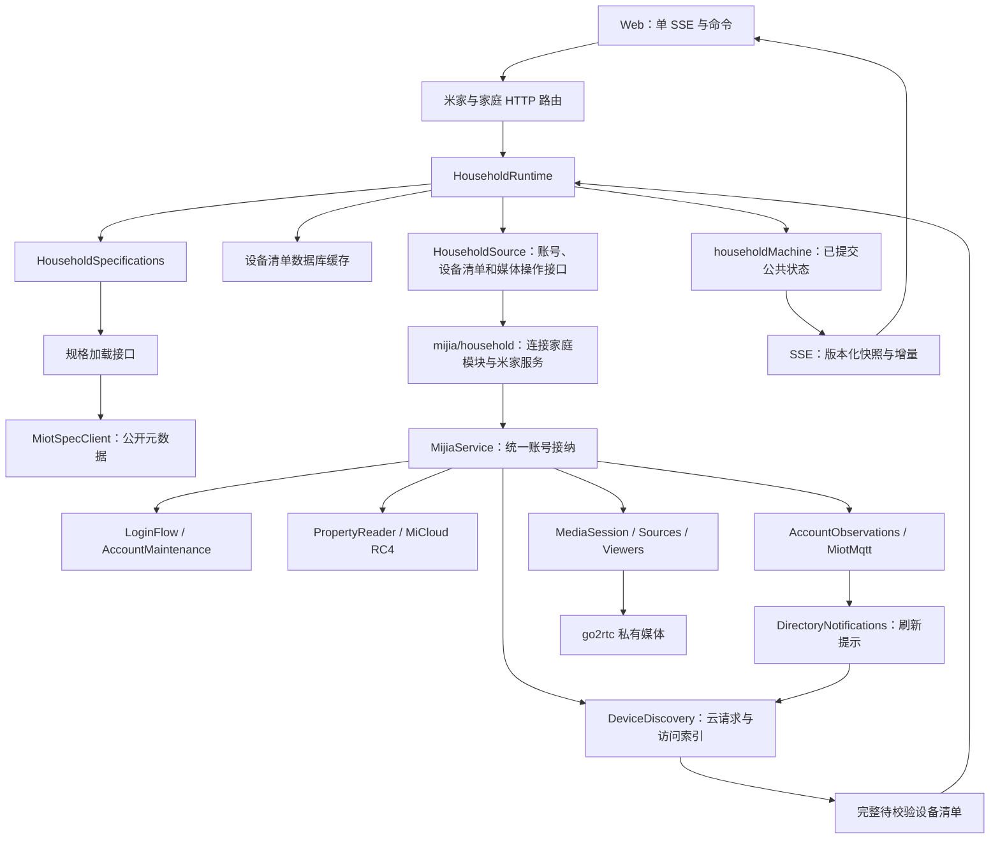

# 设备接入代码职责参考

本文说明[米家接入](../mijia.md)与[家庭运行时](../household.md)的当前代码目录、文件、函数、各状态的负责模块及异步交付边界。协议保证和实机适用范围以[来源契约](mijia-source-contract.md)为准；函数行为以链接的源码为准。

导航：[范围与职责](#1-范围与职责) · [家庭运行时](#2-家庭运行时) · [账号协调](#3-账号协调) · [设备清单与读取](#4-设备清单与属性读取) · [MQTT](#5-账号观察与-mqtt) · [云协议](#6-micloudoauth-与公开规格协议) · [媒体](#7-后端媒体) · [Go 扩展](#8-go2rtc-扩展与构建) · [契约和基础能力](#9-共享契约存储与装配) · [Web](#10-浏览器状态与界面) · [调用链](#11-关键调用链与失败范围) · [边界](#12-能力与证据边界)。

## 1. 范围与职责

### 1.1 阅读范围

完整覆盖 `apps/backend/src/mijia/`、`apps/backend/src/household/`、`apps/web/src/features/mijia/` 和 `docker/go2rtc/overlay/` 中的代码文件；另外说明直接支撑它们的共享契约、HTTP 工具、凭据仓库、数据库、应用装配和页面入口。构造器、getter/setter、私有方法、返回对象方法及有独立生命周期的嵌套函数均列出。普通 map/filter、Promise finally 等回调的责任归所属函数；HTTP、MQTT、SSE 回调按入口单列。

通用配置编辑、聊天、Agent、UI 基础组件、遥测导出器、第三方库内部实现不展开。go2rtc 上游只解释仓库 `runtime.patch` 改动的责任；MiLoCo 作为协议参考，不是本项目运行模块。

本文使用以下名称区分数据、运行对象和数据库保存操作：

| 名称                     | 含义                                                                                                                               |
| ------------------------ | ---------------------------------------------------------------------------------------------------------------------------------- |
| 设备清单                 | 家庭、房间、设备及其归属信息；代码中的 directory/catalog 通常指这份资料。“代码目录”则指文件系统中的目录。                          |
| 公共状态（projection）   | 供页面读取的账号、家庭、设备清单、规格摘要和媒体等状态，只包含允许公开的字段。                                                     |
| 作用域（scope）          | 当前账号和家庭这一轮运行的范围；scope_epoch 标识这一轮，新登录会话或授权失效后旧任务不能写入新一轮状态。                           |
| actor                    | XState 按 householdMachine 规则创建的状态机运行实例。                                                                              |
| 待接纳数据（candidate）  | 尚待校验或保存的数据；接纳前不能替换当前已生效的数据。扫码流程中具体指待接纳会话。                                                 |
| 状态提交／数据库事务提交 | 前者把一次变化同步应用到状态机，成为页面可读取的状态；后者确认数据库写入成功。保存成功后仍须通过当前作用域校验，才能提交公共状态。 |
| 操作接口与协议转换       | HouseholdSource 声明家庭模块需要的账号、设备清单和媒体操作；mijia/household.ts 把这些调用转给米家服务，并转换其数据和错误。        |
| owner／effects           | owner 指负责该资源的模块或运行对象；effects 是状态提交后要执行的后续操作，如请求、保存和清理。                                     |

| 依据文档                                 | 内容                                           |
| ---------------------------------------- | ---------------------------------------------- |
| [米家与摄像头](../mijia.md)              | 账号接入、家庭范围、属性入口与媒体使用。       |
| [家庭运行时](../household.md)            | 已提交设备清单、规格、作用域、状态版本与 SSE。 |
| [米家来源契约](mijia-source-contract.md) | 协议、读取和推送语义、失败范围、实机适用条件。 |

### 1.2 代码目录职责

下面 `mijia/`、`household/` 均相对 `apps/backend/src/`；`overlay/` 相对 `docker/go2rtc/`。

| 代码目录                                              | 负责的资源／职责                                                               | 协作边界                                                                                          |
| ----------------------------------------------------- | ------------------------------------------------------------------------------ | ------------------------------------------------------------------------------------------------- |
| `mijia/`                                              | 当前完整账号、凭据接纳、跨模块生命周期、HTTP 边界。                            | 家庭公共状态交 household；供应商原始秘密不进入公共状态。                                          |
| `mijia/account/`                                      | 待接纳的扫码会话、恢复／续期任务、账号共享 MQTT 观察。                         | 待接纳会话由 service 保存并启用；不另存 token。                                                   |
| `mijia/homes/`                                        | 账号家庭选择的存储适配。                                                       | 部署级锁下保存唯一绑定；拒绝异账号或不同家庭覆盖。                                                |
| `mijia/devices/`                                      | 云端设备清单请求、原始接入资料、已接纳访问索引、待接纳数据转换、设备清单通知。 | 完整设备清单交 household 校验并尝试保存；确认撤销先取消资格，缓存保存失败不阻挡当前有效清单接纳。 |
| `mijia/properties/`                                   | 同步 readable 预检、全服务串行读取、来源配置。                                 | 只输出指定属性观测，不维护 latest、availability 或自动采集集合。                                  |
| `mijia/protocols/micloud/`                            | 扫码、Cookie、RC4、云端设备清单和属性请求。                                    | 原始供应商字段转换为家庭模块待校验的设备清单，MiCloud 不拥有家庭规格缓存。                        |
| `mijia/protocols/spec/`                               | 公开型号／URN 解析与能力编解码。                                               | 无账号秘密，在途 URL 请求按等待者合并；已接纳资料属于家庭规格管理模块。                           |
| `mijia/protocols/oauth/`                              | 同次扫码的后台 OAuth 授权与 token 交换。                                       | 不创建第二个用户登录入口。                                                                        |
| `mijia/protocols/miot/`                               | 单代 MQTT 连接、topic 对账、消息规范化。                                       | 跨代 watches 和重连由 AccountObservations 持有。                                                  |
| `mijia/media/`                                        | 媒体绑定、共享镜头源、独立观看和远端清理。                                     | 从统一账号取得凭据；只有家庭可运行才新绑定；清理不等待家庭恢复运行。                              |
| `household/`                                          | 已提交公共设备清单／规格、scope_epoch、版本、状态提交和 SSE。                  | actor 同步决策，网络／数据库在 runtime 的异步后续操作中执行。                                     |
| `credentials/`、`db/`、`apps/backend/drizzle/`        | 加密授权、密钥读取、数据库连接、表与迁移。                                     | 不决定是否启用待接纳账号。                                                                        |
| `packages/api/src/contracts/`                         | 共享 schema、命令／快照／增量协议、错误、消息大小上限和心跳期限。              | 不拥有运行状态或供应商连接。                                                                      |
| `packages/api/src/http/`、`errors/`                   | 本机访问限制、响应大小、Retry-After、安全错误和校验。                          | 不决定账号、家庭及观看资源由哪个模块负责。                                                        |
| `apps/web/src/features/mijia/`                        | 每标签页单 SSE、公共状态、命令、扫码材料、设备／播放 UI。                      | 命令响应不写公共快照；属性 MQTT 不直连浏览器。                                                    |
| `apps/web/src/pages/`、`components/StateProvider.tsx` | 页面装配和应用级订阅生命周期。                                                 | 页面切换不重复创建家庭订阅。                                                                      |
| `docker/go2rtc/`                                      | 固定上游构建、补丁、overlay、来源和许可。                                      | 内存媒体会话不替代 backend 保存到数据库的账号授权。                                               |
| `overlay/internal/xiaomi/`                            | 私有会话、镜头源、viewer、双镜头共享连接的引用计数。                           | 源不进入全局 streams 注册表或 YAML。                                                              |
| `overlay/internal/streams/`、`internal/webrtc/`       | 私有 dialer、重连观察、只读 WebRTC 协商。                                      | 不接纳业务家庭或保存凭据。                                                                        |
| `overlay/pkg/webrtc/`                                 | 可取消的完整 ICE answer。                                                      | 不实现管理 HTTP 接口。                                                                            |
| `overlay/pkg/xiaomi/`、`miss/`、`diagnostic/`         | 媒体 token 登录、双镜头物理连接与分流、安全诊断。                              | 不从型号名称猜双摄，不打印原始供应商报文。                                                        |

### 1.3 状态与身份

| 状态／身份                                      | 负责模块                                                | 用途和失效条件                                                                                                                                  |
| ----------------------------------------------- | ------------------------------------------------------- | ----------------------------------------------------------------------------------------------------------------------------------------------- |
| 当前 MiCloud＋OAuth／账号实例 ID                | MijiaService                                            | 同次完整接纳；扫码替换、退出、整会话认证失败、关闭撤销。                                                                                        |
| 供应商命名空间                                  | household.provider                                      | 米家为 mijia，无账号时为 null；和稳定账号键一起标明公共家庭来源。                                                                               |
| 账号存储键                                      | service.accountKey                                      | `JSON.stringify([region,userId])`，按账号隔离选择和设备清单；不等于浏览器账号实例 UUID。                                                        |
| 已提交设备清单、规格摘要、scope_epoch、sequence | household actor／runtime                                | 新登录会话、授权失效、失去家庭访问换 epoch；同 epoch 公共变化才递增 sequence。                                                                  |
| input_sequence、effects                         | householdMachine                                        | input_sequence 是进程内递增的提交序号，包含超限错误提交且不随 epoch 变化重置；effects 记录本次提交后的操作，无公共变化的有效 refresh 也会执行。 |
| accessHomeId、catalogConfirmed、scopeRevision   | DeviceDiscovery                                         | 保存成功后的供应商访问范围及原始资料；reset 取消确认，完整清单确认撤销立即剔除资格。                                                            |
| 待保存的完整数据                                | DeviceDiscovery.pendingCatalog                          | 至多一份，用于保存重试；不是另一份已提交业务状态。                                                                                              |
| accepted URN／sources／bindings                 | HouseholdSpecifications                                 | 仅保留活动设备引用；成功后按最终 URN 共享，失败保留原能力和版本。                                                                               |
| readScope／readGeneration                       | MijiaService                                            | 同账号 MiCloud 续期也中止旧读取；source_id 和最早重试时间限制不变。                                                                             |
| watches／rejectedTopics                         | AccountObservations                                     | 设备清单与属性共享；断线保留，凭据更新清拒绝，scope 关闭清全部。                                                                                |
| MQTT generation／逐 topic 确认                  | MiotMqtt                                                | 每连接新 UUID；关闭后所有旧消息、ACK 均不可复活。                                                                                               |
| media revision／sessionId／sourceId／playbackId | MediaSession／adapter／source manager／playback manager | 分别表示浏览器媒体资格、远端租约、镜头源和单观看者，不能互换。                                                                                  |
| householdSnapshotAtom                           | 浏览器订阅                                              | 仅 SSE 写入公共快照；断流可保留旧显示但标未同步。                                                                                               |

## 2. 家庭运行时

完整行为见[家庭运行时](../household.md)，交付与验收见 [Step 2](../plans/household-steps/02-household-runtime.md)。一个部署固定绑定一个家庭；首次设置后禁止在线换家，纠错停机修改绑定再启动。

| 模块                                                                    | 责任与入口                                                                                                                                                                                                                                                               |
| ----------------------------------------------------------------------- | ------------------------------------------------------------------------------------------------------------------------------------------------------------------------------------------------------------------------------------------------------------------------ |
| [runtime.ts](../../apps/backend/src/household/runtime.ts)               | `start/close` 管理实例；`setupHomes/bindHome` 只负责首次设置，保存确认后发 bound 事件；`requestRefresh/refresh` 合并刷新。`commitDirectory` 校验家庭身份和数据大小、尝试缓存并返回用于提交状态的函数；缓存失败只降级。`specification` 从后端规格持有者取得当前适用能力。 |
| [machine.ts](../../apps/backend/src/household/machine.ts)               | XState 管理 unbound/waiting_for_home/initializing/running/stopping。prepareInput 一次准备，内部 commit 原子提交，guard 不产生副作用；status 来自节点。input_sequence 去重操作，sequence 只计公共变化。退出、授权及家庭访问失效换运行标识但保留绑定。                     |
| [source.ts](../../apps/backend/src/household/source.ts)                 | 家庭所需的安全来源状态、账号、清单和媒体边界；米家适配由 mijia/household.ts 装配。                                                                                                                                                                                       |
| [mijia/household.ts](../../apps/backend/src/mijia/household.ts)         | `createMijiaHousehold(service, repository, loader)` 注入米家服务、设备清单缓存和规格加载接口，转换来源状态与错误并连接家庭回调；`createMijiaSpecificationLoader` 把显式传入的 MiotSpecClient 读取接口转换为规格加载接口。                                                |
| [directory.ts](../../apps/backend/src/household/directory.ts)           | `publicDirectory` 用字段白名单生成当前绑定家庭的 home/room/device 记录。                                                                                                                                                                                                 |
| [repository.ts](../../apps/backend/src/household/repository.ts)         | 读取与替换当前完整设备清单缓存，按账号／家庭隔离，不累积已移除条目；事务最多五秒，未确认提交先核对再写。                                                                                                                                                                 |
| [specifications.ts](../../apps/backend/src/household/specifications.ts) | 完整规格独立保存在后端，按 URN 共享；update/refresh/retain/clear 管理任务和引用，isApplicable 核对读取资格。三并发，瞬时失败额外重试两次。新资料独立检查 4 MiB 上限，失败不阻挡任务终态。                                                                                |
| [projection.ts](../../apps/backend/src/household/projection.ts)         | `initialProjection` 构造公共状态初值；`initialProjectionState` 接纳初始不可变状态；`prepareProjection` 校验变化条目的字段和身份，提交独立不可变对象并保留未变化引用。                                                                                                    |
| [capacity.ts](../../apps/backend/src/household/capacity.ts)             | `directoryFits` 检查设备清单的 4 MiB、1024 台限制；`projectionBytes` 按需计算设备清单、元数据和公共状态的字节数，不维护字节账本。                                                                                                                                        |
| [stream.ts](../../apps/backend/src/household/stream.ts)                 | 先订阅再取快照；同版本共享编码，每客户端 FIFO。快照 8 MiB、非快照队列 256 条或 2 MiB、最多16连接；15秒心跳和写入期限，HEAD 不分配订阅。                                                                                                                                  |
| [routes.ts](../../apps/backend/src/household/routes.ts)                 | GET state/diagnostics/events/setup/homes，PUT scope/homes 仅首次保存非空家庭，POST devices/refresh 只安排刷新。命令返回 state_version；无普通 GET 云端刷新。                                                                                                             |

公共快照只有账号、登录、连接操作、媒体、家庭、健康和设备清单记录。完整规格与候选家庭不进入 SSE，设备只发布有界规格标识、状态、错误和分类／标签。latest/source_health/rule_status 在后续步骤接入，不保留空占位。

## 3. 账号协调

### 3.1 [mijia/service.ts](../../apps/backend/src/mijia/service.ts)

`MijiaService` 持有完整账号、唯一凭据仓库接纳队列、读／观察取消范围、media、discovery、maintenance、DirectoryNotifications。`snapshot()` 是服务内部组合状态；家庭来源通知使用不含设备列表和私密登录材料的 `sourceSnapshot()`，HTTP `/state` 返回家庭公共快照。

| 方法／getter                           | 责任与边界                                                                                                                                                                                                                                                                                             |
| -------------------------------------- | ------------------------------------------------------------------------------------------------------------------------------------------------------------------------------------------------------------------------------------------------------------------------------------------------------ |
| `constructor`                          | 装配媒体、供应商设备清单、维护回调；设备清单 commit 经 serial 调 commitCatalog；onScopeChanged 撤销访问并准备媒体重绑；只有 household.ready 才把设备交媒体。                                                                                                                                           |
| `attachHousehold`                      | 接入家庭 restore/commit/revoke/ready/specification 回调；由 mijia/household 装配，协议层不反向持有 actor。                                                                                                                                                                                             |
| `subscribe`                            | 注册 service 状态通知，返回 unsubscribe。                                                                                                                                                                                                                                                              |
| `changed`                              | 微任务合并状态通知，同轮多次修改只排一个回调。                                                                                                                                                                                                                                                         |
| `flushChanges`                         | 立即通知 listeners；在 HTTP 命令响应或确认撤销时使家庭公共状态同步到实际状态。                                                                                                                                                                                                                         |
| `identity`、`accountKey`               | 当前账号稳定 `[region,userId]` 键或 null；accountKey 从 MiCloud 凭据读取。                                                                                                                                                                                                                             |
| `directoryCandidate`                   | 供应商设备清单、账号键和已保存的家庭选择，经 deviceDirectory 转为家庭模块的待校验数据。                                                                                                                                                                                                                |
| `directorySnapshot`                    | 将已接纳的原始设备清单转换为不含凭据的待校验数据格式，不替代家庭已提交公共状态。                                                                                                                                                                                                                       |
| `commitCatalog`                        | 先通过 household.revoke 提交已确认的家庭／设备资格撤销，再停止相关任务；整个家庭丢失时撤销全部作用域，局部移除只调用 revokeDevices。随后保留完整设备清单并保存默认选择／设备清单，成功后提交公共状态、更新原始访问索引，再取消型号／spec_type 已变化设备的旧读取、观察主题和观看，最后协调通知及媒体。 |
| `loginMaterial`、`loginPublic`         | 分别取当前尝试的私有材料与无材料公开状态。                                                                                                                                                                                                                                                             |
| `requireHomeStore`、`requireStore`     | 缺配置存储分别抛 home_storage／credential_storage。                                                                                                                                                                                                                                                    |
| `homes`                                | 要求当前账号有效，返回已保存的家庭选择及可见家庭；首次绑定的候选校验在 bindHome 的账号串行队列内完成。                                                                                                                                                                                                 |
| `bindHome`                             | 捕获账号，在账号串行队列内校验当前运行和候选家庭，可靠保存后启用绑定；默认选择与手动绑定共用账号串行队列，返回后由 runtime 初始化设备清单。                                                                                                                                                            |
| `invalidateDeviceAccess`               | 关闭设备清单通知和账号观察，汇合 MQTT 清理，撤销观察／读取 scope 及全部设备读取控制器；只用于完整作用域失效。                                                                                                                                                                                          |
| `revokeDevices`、`deviceReadSignal`    | 按 did 管理读取控制器；局部撤销只取消对应读取、观察主题和观看，不换全家庭观察代次。                                                                                                                                                                                                                    |
| `invalidatePropertyReads`              | abort 旧 readScope，创建新 controller/generation。                                                                                                                                                                                                                                                     |
| `accountObservations`                  | 复用或创建账号级 MQTT owner，提供动态当前 OAuth getter、认证拒绝维护回调、权限拒绝设备清单刷新回调。闭包核验账号键及观察 scope，不把旧对象凭据用于新连接。                                                                                                                                             |
| `syncDirectoryNotifications`           | 等旧 MQTT 关闭后重验账号／scope，为账号设备清单所有 did 更新精确设备清单 topic；不按所选家庭裁剪通知覆盖。                                                                                                                                                                                             |
| `directoryPushStatus`                  | 仅返回脱敏设备清单推送统计。                                                                                                                                                                                                                                                                           |
| `observeDevices`                       | 要求 household.ready、完整账号；复制去重明确 did，接纳前和串行出队后校验家庭、catalogConfirmed、成员。复用账号观察 owner；返回 cancel/snapshot/retry。                                                                                                                                                 |
| `observeDevices.assertCurrent`         | 组合调用／观察取消信号、活动账号、同 scope signal 和 discovery revision。                                                                                                                                                                                                                              |
| `observeDevices.assertDevices`         | 在上述基础上核验有效家庭、已确认访问设备清单、所有 did 存在；临时设备清单 error 不单独否决已确认范围。                                                                                                                                                                                                 |
| `observeDevices` 交付与 retry          | 接纳时校验所有目标成员；交付和重试核验账号／家庭作用域，设备局部撤销由 watch 精确移除主题，不中止未撤销设备。取消／closed 控制事件仍可解释覆盖丢失。                                                                                                                                                   |
| `readProperties`                       | 要求运行家庭、活动 MiCloud、有效家庭与 catalogConfirmed；复制地址并捕获设备关键字段，preparePropertyRead 同步查已准备规格，唯一 reader 执行；最终断言，认证类逐项失败后台续期但不重发。                                                                                                                |
| `readProperties.assertCurrent`         | 调用取消、设备读取控制器、精确 MiCloud 实例、readGeneration、确认设备清单及 home_id/model/spec_type；某设备撤销取消涉及该设备的整次请求。                                                                                                                                                              |
| `requestConnection`                    | 合并 running 连接操作；拒绝提交／初次恢复冲突，创建 operation UUID/时间并后台 reconnect；仅当前 operation 写终态。                                                                                                                                                                                     |
| `isConnectionOperationCurrent`         | operation ID/running 且未 stopped/loggingOut。                                                                                                                                                                                                                                                         |
| `cancelConnectionOperation`            | running→cancelled 并通知。                                                                                                                                                                                                                                                                             |
| `connectionFailure`                    | 账号→媒体→设备清单顺序返回当前安全错误；不代表每个 MQTT topic 健康。                                                                                                                                                                                                                                   |
| `reconnect`                            | 局部 assertCurrent 贯穿配置协调、无账号恢复、失败账号续期、媒体重绑、设备清单加载；按需执行而不盲目重置正常资源。                                                                                                                                                                                      |
| `cancelRestore`                        | 清 initialRestorePending 并取消维护恢复任务。                                                                                                                                                                                                                                                          |
| `activeAccount`                        | 对象相同且未停止／退出。                                                                                                                                                                                                                                                                               |
| `stopAccountMaintenance`               | 暂停设备清单 timer／保存重试，停止账号续期调度。                                                                                                                                                                                                                                                       |
| `startAccountMaintenance`              | profile 加载、续期、5分钟设备清单调度及设备清单通知协调。                                                                                                                                                                                                                                              |
| `loadAccountProfile`                   | 异步昵称头像，只有当前 authenticated 账号写回；失败不影响授权或设备。                                                                                                                                                                                                                                  |
| `commitRenewed`                        | serial 检查同 userId/region，先保存完整凭据；撤销旧读取、替换并 dispose 旧 MiCloud。保存或提交新设备清单失败单列设备清单 error，已接纳账号保留；按 passToken／媒体状态重绑，accessToken 改变重建 MQTT。                                                                                                |
| `commitRestored`                       | 无当前账号时读取唯一绑定并核对账号，保存待接纳的完整数据、发布账号、acceptHome、commitCatalog、启动维护；清单缓存失败降级，已确认云端清单仍可 running。                                                                                                                                                |
| `expireAccount`                        | 维护确认认证失败后，在账号 serial 队列撤销账号、设备清单、读取、观察和媒体资格，标 reauth_required；队列外等待对应媒体清理，保留数据库记录等待重新认证。                                                                                                                                               |
| `logout`                               | 提前停止接纳并撤销读观察，账号 serial 队列先删除数据库中的授权，再清除内存账号及设备清单；捕获清理任务，队列外等待结果。存储失败保留账号，由家庭运行时立即安排完整设备清单同步以恢复运行；媒体清理失败向调用方报告但不复活已删除授权。                                                                 |
| `serial`                               | Promise 队列；自身错误返回调用者，tail 消化失败后允许后续提交。                                                                                                                                                                                                                                        |
| `initialize`                           | 先从严格会话记录和家庭选择恢复公共缓存展示；再 media.initialize/reset，maintenance.restore 续期接纳；finally 启配置检查。缓存恢复失败交正式账号状态报告。                                                                                                                                              |
| `snapshot`                             | structuredClone 内部账号、home、media revision/binding、扫码 state 和设备清单展示；包含扫码材料，不能直接当 SSE payload。                                                                                                                                                                              |
| `startLogin`                           | 校验可工作／存储，取消连接操作／恢复，启动独立待接纳会话；保留当前可用账号。                                                                                                                                                                                                                           |
| `cancelLogin`、`verifyLogin`           | 按尝试 ID 和允许阶段取消／提交验证码，返回内部快照供内部调用。                                                                                                                                                                                                                                         |
| `commitLogin`                          | prepareCommit 后完成 OAuth，serial 读取选择并保存完整凭据；成功撤销旧接入／媒体、换账号实例、adopt 待接纳会话和维护；再 loadDevices。家庭尚未恢复运行也须清理旧远端资源。                                                                                                                              |
| `getDeviceSpec`                        | 同步检查 signal、household.ready，返回 household.specification；不触发 miot-spec.org 网络请求。                                                                                                                                                                                                        |
| `loadDevices`                          | 显式 discovery.load 后返回内部快照。                                                                                                                                                                                                                                                                   |
| `reservePlayback`                      | 家庭 ready、有效选择和供应商成员校验后交 media。                                                                                                                                                                                                                                                       |
| `offer`、`playbackSnapshot`、`release` | 分别委托媒体协商、观看状态和释放；释放不依赖旧家庭仍活动。                                                                                                                                                                                                                                             |
| `close`                                | 停接纳、维护、扫码、设备清单、读观察、MiCloud；关闭媒体；finally 等维护、serial 和 mqttClosing 排空，保留数据库中的授权。                                                                                                                                                                              |

没有选择记录且恰好一个家庭才自动选择；明确保存的 null 表示不接入，不被默认选择覆盖。多家庭不能自动取第一个。

### 3.2 [account/login-flow.ts](../../apps/backend/src/mijia/account/login-flow.ts)

| 方法                  | 责任                                                                                                               |
| --------------------- | ------------------------------------------------------------------------------------------------------------------ |
| `constructor`         | 注入待接纳会话 commit 和 onChange。                                                                                |
| `state` getter/setter | 持有私有 currentState；每次设值通知 service。                                                                      |
| `publicSnapshot`      | 只公开 id/status/error/material_version；按 id、二维码、verificationUrl 指纹变化递增材料版本，不把材料送公共状态。 |
| `material`            | 仅匹配当前活动尝试 ID；返回版本、可选二维码／验证 URL／expiresAt。                                                 |
| `active`、`isCurrent` | 分别判断待接纳会话存在，或精确待接纳会话且 controller 未取消。                                                     |
| `start`               | dispose 旧待接纳会话，创建 cn MiCloud/controller/UUID，creating 后后台 prepareLogin。                              |
| `dispose`             | 清过期 timer、abort、dispose 未接纳 cloud，回 idle。                                                               |
| `prepareCommit`       | 当前待接纳会话才能清扫码 expiry timer、标 completing。                                                             |
| `adopt`               | 转交 cloud，清 timer、abort 待接纳会话流程、脱离 attempt，标 completed；不 dispose 已接纳 cloud。                  |
| `cancel`、`finish`    | 按 ID 取消；finish 清资源后保存指定终态。                                                                          |
| `prepareLogin`        | 取得 QR 并挂过期 timer，循环 pollLogin；authenticated commit，安全挑战暂停，过期失败；每步检查待接纳会话身份。     |
| `loginFailed`         | 只对当前待接纳会话安全映射错误，进入 expired/error 并清资源。                                                      |
| `verifyLogin`         | 仅匹配 security_required；提交数字验证码。拒绝验证码可保留挑战重试，其余失败销毁待接纳会话。                       |

### 3.3 [account/session.ts](../../apps/backend/src/mijia/account/session.ts)

`accountSessionSchema` 严格要求一份 `{micloud,oauth}`。`renewAccountSession` 创建隔离 MiCloud 待接纳会话、读取供应商 catalog、refreshOAuth；任一步失败 dispose 待接纳会话。`restoreAccountSession` 读取 `mijia` 记录，校验完整结构，临时 restoreSession 后经同一 renew 流程，finally 释放临时实例；不把过期 token 直接当恢复成功。

### 3.4 [account/maintenance.ts](../../apps/backend/src/mijia/account/maintenance.ts)

| 方法                               | 责任                                                                                                                                                                                                     |
| ---------------------------------- | -------------------------------------------------------------------------------------------------------------------------------------------------------------------------------------------------------- |
| `constructor`                      | 注入当前账号／OAuth、接纳条件、存储、提交和失败回调。                                                                                                                                                    |
| `acceptsWork`、`activeAccount`     | 自身 stopped 与 service 条件／账号身份合并。                                                                                                                                                             |
| `track`                            | 保存 pending Promise，结束移除，shutdown 可等待。                                                                                                                                                        |
| `renewalFailed`                    | 判断给定账号是否为失败账号。                                                                                                                                                                             |
| `currentRestore`、`currentRenewal` | 当前 task 对象＋未 abort＋接纳条件，renewal 还要求原账号活动。                                                                                                                                           |
| `cancelRestore`                    | 清恢复 timer，abort task 并清引用。                                                                                                                                                                      |
| `retryRestore`                     | 遵守 restoreRetryAfterAt，未到不请求；否则 cancel 退避后 restore。                                                                                                                                       |
| `restore`                          | 合并在途任务；账号已存在、扫码中、停止或期限未到则跳过。准备待接纳的完整数据，经 assertCurrent 提交；认证→reauth_required，其余 restore_error；仅恢复类失败自动重试，finally dispose 未接纳待接纳会话。  |
| `stopRenewal`                      | 清周期／重试 timer；数据库写入未开始时可 abort；提交中的待接纳会话须保证数据库记录与内存账号一致。                                                                                                       |
| `scheduleRenewal`                  | 遵守失败账号 Retry-After；按 MiCloud/OAuth 最早期限提前最多5分钟或剩余一半，至少1秒；MiCloud 无期限按6小时再验证策略。                                                                                   |
| `rejectOAuth`                      | 保存当前被拒 token，并 join/启动 renew；在途普通续期不抹掉拒绝事实。                                                                                                                                     |
| `renew`                            | 按账号合并、最早重试时间控制；准备待接纳会话后若仍用被拒 token，force refresh，仍相同则认证失败。认证错误由 service 撤销整会话，临时错误保留账号并重试；finally 处理提交期间到来的拒绝及待接纳会话清理。 |
| `shutdown`                         | 标 stopped、停止续期／恢复，allSettled pending。                                                                                                                                                         |

### 3.5 [mijia/routes.ts](../../apps/backend/src/mijia/routes.ts)

`createMijiaRoutes(port,runtime)` 使用本机访问校验、70,000 字节 body limit、no-store/no-referrer 和统一错误处理，挂 household routes。内部 `commandResult` 先 service.flushChanges 再返回 runtime.version。

| `/api/mijia` handler          | 责任                                                                                   |
| ----------------------------- | -------------------------------------------------------------------------------------- |
| `GET /state`、`GET /events`   | 家庭快照／SSE；不触发云刷新，不返回内部 MijiaState。                                   |
| `PUT /scope/homes`            | `{scope_epoch,home_id}` 接纳选择，202 state_version。                                  |
| `POST /devices/refresh`       | `{scope_epoch,target:directory/specs/all}`，202只表示接纳。                            |
| `GET /directory/push`         | 脱敏连接、topic计数、通知次数及时间；无原始 topic／载荷。                              |
| `GET /login/:id/material`     | 校验当前尝试材料响应 schema；独立 no-store 读取。                                      |
| `POST /login`                 | 创建待接纳会话，202 state_version。                                                    |
| `DELETE /login/:id`           | 取消对应待接纳会话，返回 state_version。                                               |
| `POST /login/:id/verify`      | 校验 ticket，await 验证，返回 state_version。                                          |
| `POST /connection/retry`      | 启动／复用连接操作，202 state_version。                                                |
| `DELETE /session`             | await runtime.logout，返回 state_version；清理失败仍报错。                             |
| `POST /playback/reservations` | schema 校验 scope_epoch/revision/deviceId/channel；经 runtime 预约，201 ID＋Location。 |
| `GET /playback/:id`           | 返回 validated reserved/negotiating/active。                                           |
| `PUT /playback/:id`           | revision/SDP 验证；预取消拒绝，接纳后观看资源拥有期限与取消。                          |
| `DELETE /playback/:id`        | await release，204；可以重试远端未完成清理。                                           |

属性读取／观察和规格查询是内部入口。公共设备清单和规格摘要从 projection 获取，完整规格仅供后端读取预检查；没有独立 `/home`、`/homes` 或 `/devices/:did/spec` handler。

### 3.6 错误、操作与重试

| 文件／函数                                                                                  | 责任                                                                                                                                                                              |
| ------------------------------------------------------------------------------------------- | --------------------------------------------------------------------------------------------------------------------------------------------------------------------------------- |
| [errors.ts](../../apps/backend/src/mijia/errors.ts) / `MijiaError.constructor`、`toPayload` | reason→mijia_ 静态错误及共享 payload。                                                                                                                                            |
| `safeMijiaError`                                                                            | 映射取消、超时、存储／结果未确认、MiCloud、go2rtc；只转安全 HTTP／上游整数码／Retry-After，不转原始消息、URL 或 cause。                                                           |
| `isRecoverableMijiaError`                                                                   | 仅已知类型的 network/timeout/go2rtc_unavailable/request_timeout/session_expired 可自动恢复；配置／存储／协议／未知不由 fallback 误判。设备清单存储重试由 discovery 明确另行处理。 |
| `mijiaRetryAfter`                                                                           | 安全错误参数中的绝对 deadline，无效为0。                                                                                                                                          |
| [operation.ts](../../apps/backend/src/mijia/operation.ts) / `mijiaOperation`                | 静态 mijia.* span，先映射后抛错；onError 对取消标记，其他记录安全错误。                                                                                                           |
| [retry-timer.ts](../../apps/backend/src/mijia/retry-timer.ts) / `RetryTimer.schedule`       | 5/10/20/40/60s＋0—1s抖动，和 notBefore 取较晚值；同 timer 可延后 deadline。                                                                                                       |
| `schedule.arm`                                                                              | 超长等待分段≤2,147,483,647ms；到期前重挂，最终执行最新 run；ROOT_CONTEXT/unref。                                                                                                  |
| `RetryTimer.cancel`                                                                         | 清 timer/run/失败计数/deadline；不是 MQTT 的1—120秒策略。                                                                                                                         |

## 4. 设备清单与属性读取

### 4.1 [devices/discovery.ts](../../apps/backend/src/mijia/devices/discovery.ts)

| 方法／getter                       | 责任                                                                                                                                                                                                                                                     |
| ---------------------------------- | -------------------------------------------------------------------------------------------------------------------------------------------------------------------------------------------------------------------------------------------------------- |
| `constructor`                      | 注入账号、提交、状态变更、范围撤销、媒体设备清单和续期回调。                                                                                                                                                                                             |
| `state` getter/setter              | 设备清单请求显示状态，设值通知；不等同于访问资格。                                                                                                                                                                                                       |
| `catalogConfirmed`、`revision`     | 已接纳访问设备清单标记和范围UUID。                                                                                                                                                                                                                       |
| `devices`、`selectedHome`          | 当前派生索引数组及 accessHomeId 对应家庭。                                                                                                                                                                                                               |
| `indexSelectedDevices`             | 只从已接纳 raw catalog 按访问家庭重建 did Map。                                                                                                                                                                                                          |
| `homeSnapshot`                     | 已保存的家庭选择及 unselected/selected/unavailable、家庭的允许公开字段。                                                                                                                                                                                 |
| `requireHome`、`validateSelection` | 前者拒绝未选／不可用家庭；后者非null要求设备清单有该家庭，不以临时 loading/error 拒绝选择。                                                                                                                                                              |
| `acceptHome`                       | 保存成功后的 homeId 接纳，重建索引、换 revision、触发撤销及媒体设备清单更新。                                                                                                                                                                            |
| `catalogSnapshot`                  | 内部读取原始 catalog，不输出到浏览器。                                                                                                                                                                                                                   |
| `retain`                           | 清旧 pending，再检查 raw catalog≤4 MiB，保存唯一最新待接纳的完整数据及账号。                                                                                                                                                                             |
| `revocation`                       | 从完整新清单计算设备移除、转入其他家庭或家庭失去访问权限的结果，返回对应 did 和缩减后的设备清单。自身不提交状态；service 在保存新清单前先提交资格撤销，再用 set 缩减访问索引。型号／spec_type 变化由 definitionChanges 单独处理。                        |
| `definitionChanges`                | 找出仍在同一家庭、但 model／spec_type 已变化的设备；新清单确认并提交后，service 才取消这些设备的旧读取、观察主题和观看。                                                                                                                                 |
| `list`、`find`                     | 当前访问设备数组和 O(1) did 查找。                                                                                                                                                                                                                       |
| `stateSnapshot`、`snapshot`        | 前者内部显示状态；后者用 describeMijiaDevice 重新生成当前可访问设备列表。                                                                                                                                                                                |
| `pause`                            | 清5分钟发现 timer及保存重试。                                                                                                                                                                                                                            |
| `reset`                            | pause、abort、清 confirmed/pending/catalog/选择/索引/失败/task，换 revision，idle。                                                                                                                                                                      |
| `fail`                             | 显示安全错误、保留 items；home_storage 对当前账号安排待接纳数据保存重试。                                                                                                                                                                                |
| `schedule`                         | 活动且无永久发现故障才挂5分钟；醒来续期失败则不发设备清单请求；background load后重挂。                                                                                                                                                                   |
| `set`                              | 接纳已确认原始设备清单、confirmed=true、清重试并更新索引；新账号会话重置 scopeRevision，局部撤销交独立资格收缩流程；发布 ready、协调媒体并调度。                                                                                                         |
| `load`                             | 同账号在途合并且置 refreshAgain；续期失败前台可 renew。每次有 controller/assertCurrent；保存重试可复用最新待保存设备清单，其他读取云端设备清单；经依赖 commit 接纳。认证交续期，恢复类／home_storage安排重试，永久故障停自动发现；结束可补一次合并刷新。 |
| `load.assertCurrent`               | controller 未取消、精确账号、未停止；防止已失效的读取结果或数据库写入继续生效。                                                                                                                                                                          |

普通刷新错误可保留 confirmed 的有效索引；首次未确认、授权失效或撤销的资格不能借显示缓存取得。

### 4.2 [devices/directory.ts](../../apps/backend/src/mijia/devices/directory.ts)、[mapping.ts](../../apps/backend/src/mijia/devices/mapping.ts)

| 函数                  | 责任                                                                                                                                      |
| --------------------- | ----------------------------------------------------------------------------------------------------------------------------------------- |
| `deviceDirectory`     | raw catalog 转含 accountId/homeId、所有可选家庭／房间的允许公开字段，以及所选家庭的待校验设备记录；附 spec_type，不传私有 localip/token。 |
| `isCamera`            | model 独立 camera/cateye 段判断分类，不承诺可取流。                                                                                       |
| `cameraChannels`      | 能力表1/2通道映射，其余数量不静默截断；非摄像头为空。                                                                                     |
| `describeMijiaDevice` | 单设备允许公开的字段：id/name/model/归属、设备清单 online、camera/channels；无 retainedChannels 派生状态。                                |

### 4.3 [devices/directory-notifications.ts](../../apps/backend/src/mijia/devices/directory-notifications.ts)

| 方法              | 责任                                                                                                                                                                   |
| ----------------- | ---------------------------------------------------------------------------------------------------------------------------------------------------------------------- |
| `constructor`     | 注入现有 discovery.load(true) 刷新入口。                                                                                                                               |
| `update`          | 生成排序 topic key；同 owner/key 无操作；创建新 controller、先 observeTopics 再 abort 旧绑定，避免共享连接短暂无 owner。重置确认／失败集合。                           |
| `update` listener | 只处理当前 controller；directory 计数／更新时间并防抖；connected 安排同步，其余连接状态清确认；逐 subscription 更新 confirmed/failed。通知载荷不直接修改业务设备清单。 |
| `schedule`        | 5秒尾沿防抖，捕获 controller，醒来同代才调用 refresh；ROOT_CONTEXT/unref。                                                                                             |
| `snapshot`        | 返回连接状态、重连／认证标志、topic/confirmed/failed数量、刷新待执行、通知次数／时间，不返回标识。                                                                     |
| `close`           | 清timer、abort绑定、清owner/key/集合及统计。                                                                                                                           |

### 4.4 [homes/store.ts](../../apps/backend/src/mijia/homes/store.ts)

`assertCompleteHome` 在清单接纳前检查绑定家庭及房间成员的详情，检查先于撤销和保存。其他家庭缺失详情不阻断账号恢复；供应商设备清单保留成员引用，不能把未返回详情的设备误认成已移除。

`createHomeSelectionStore` 在部署级 `household_binding` 事务锁下读取和保存唯一记录。read(accountKey) 检查账号一致及记录唯一；write 拒绝 null、异账号或不同家庭，已有同值直接确认。事务最多五秒，写入结果不确定时在同一锁下核对，未确认前不继续写入。退出保留绑定；纠错由停机配置完成。

### 4.5 [properties/read-request.ts](../../apps/backend/src/mijia/properties/read-request.ts)

`preparePropertyRead` 同步复制请求、按did分组，每设备只取一次已准备 MijiaDeviceSpec，要求 siid/piid 为正安全整数且 `prop.siid.piid.readable`；前后检查取消与 assertCurrent，按原输入顺序返回。它不联网、不调度三组并发、不读取当前属性值。

### 4.6 [properties/reader.ts](../../apps/backend/src/mijia/properties/reader.ts)

| 函数／方法             | 责任                                                                                                                                                                                           |
| ---------------------- | ---------------------------------------------------------------------------------------------------------------------------------------------------------------------------------------------- |
| `propertyKey`          | did/siid/piid JSON元组键。                                                                                                                                                                     |
| `classifyRow`          | 普通整数负码 failure，豁免-702000000/-702010000；非失败仍须显式合法JSON标量，缺值value_missing、非法invalid_value，不补null。                                                                  |
| `requestFailure`       | MiCloudError 转 unavailable/request_failed，只保留安全kind、HTTP/code/deadline。                                                                                                               |
| `propertyObservations` | 按请求顺序加入契约/source/generation、baseline/cloud_cache、observed_at=null、起始／接收时刻；缺响应response_missing。                                                                         |
| `PropertyReader.read`  | 每批≤150，逐批共用唯一串行队列；认证失败停止后续HTTP，将未发送项标 read_started_at=null，保留先前成功。                                                                                        |
| `enqueue`              | tail串行；取消立即拒绝调用方，但传输实际结束才释放名额；abort／完成回调清监听。                                                                                                                |
| `readBatch`            | 入队后检查 source 的最早重试时间；期限内不发请求，沿用原失败接收时间。实际请求精确匹配本批地址，成功优先于重复失败；MiCloud错误逐项归类，把供应商 Retry-After 保存为该 source 的最早重试时间。 |

取消与scope撤销会拒绝旧整次调用。reader不sleep、不隐藏重试；30秒是单次HTTP请求及响应体读取的超时，不含排队、多批次总耗时。

### 4.7 [properties/source-profiles.ts](../../apps/backend/src/mijia/properties/source-profiles.ts)

`miotCloudCacheProfile` 保存cn／扫码RC4／所选家庭readable适用条件、datasource=1、每批150项、单次HTTP请求30s超时和全服务串行执行限制、baseline语义与四型号十三属性证据。`miotCloudPushProfile` 保存MQTT5/TLS、topic/确认/重连参数、普通live/retained baseline、订阅和实收分离的证据。`miotSourceId`、`miotPushSourceId` 对账号／区域／通路确定性哈希；同账号换token或重连不换来源，读取与推送通路不共用ID。配置中的业务自动重连不等于启用MQTT.js内建重连。`reconnect_owner` 当前字符串为 `device_observations`，它是描述标签；实际负责运行的模块是 `AccountObservations`，不是可解析的类名或模块路径。

## 5. 账号观察与 MQTT

### 5.1 [account/observations.ts](../../apps/backend/src/mijia/account/observations.ts)

`AccountObservations` 跨连接保存设备／精确topic两种 watch、永久拒绝记录、唯一重连timer、退避和认证暂停。设备清单通知也算一个观察者，因此取消最后一个属性观察不一定关闭账号MQTT。

| 方法／闭包                     | 责任                                                                                                                                                                                   |
| ------------------------------ | -------------------------------------------------------------------------------------------------------------------------------------------------------------------------------------- |
| `constructor`                  | 注入稳定sourceId、动态凭据getter、认证与新权限拒绝回调。                                                                                                                               |
| `closed`                       | stopped状态，不等于普通网络断线。                                                                                                                                                      |
| `schedule`                     | stopped、认证暂停、无watch或已有timer时不排；1/2/4…120秒、无抖动，ROOT_CONTEXT。                                                                                                       |
| `connect`                      | 防并发；await旧连接关闭，重验观察与认证状态，清旧timer后读取最新凭据建MiotMqtt，逐watch重新绑定。取消/stale关闭owner，认证暂停交维护，其余close并退避；finally处理同步取消／替换竞态。 |
| `bind`                         | 根据selection选择observe或observeTopics；注册局部listener，返回后再次检查watch／signal／连接身份，同步取消时立刻cancel新binding。                                                      |
| `bind.listener`                | 只当前连接和watch可交付；新永久拒绝跨代保存，0x87只通知设备清单复核；connected复位退避，认证closed暂停并交owner，其他closed调度。                                                      |
| `observe`、`observeTopics`     | 分别复制ids／topics，委托统一watch。                                                                                                                                                   |
| `revokeDevices`、`removeWatch` | 从设备 watch 中精确移除 did 和主题；保留其他设备及账号级设备清单 watch，全部目标被撤销才移除此 watch。                                                                                 |
| `watch`                        | 注册引用及abort监听，复用活动连接或按需connect；返回cancel/snapshot/retry。                                                                                                            |
| `watch.cancel`、`detach`       | 委托 removeWatch 清监听、watch 和 binding；无观察时取消重连并关闭连接。                                                                                                                |
| `watch.snapshot`               | 当前连接快照＋重连待执行／认证失败／初始化错误／观察者数。                                                                                                                             |
| `watch.retry`                  | 非停止／认证暂停时只委托当前连接重试临时订阅失败。                                                                                                                                     |
| `credentialsUpdated`           | 清认证错误和拒绝；空闲不建连，有观察则关旧连接并调度。                                                                                                                                 |
| `close`                        | 永久停止owner、清timer、await连接close、detach全部并清集合。                                                                                                                           |

### 5.2 [protocols/miot/messages.ts](../../apps/backend/src/mijia/protocols/miot/messages.ts)

| 函数                      | 责任                                                                                                                                                          |
| ------------------------- | ------------------------------------------------------------------------------------------------------------------------------------------------------------- |
| `deviceTopics`            | `device/{did}/up/properties_changed/#` 与 `device/{did}/state/#`。                                                                                            |
| `directoryTopics`         | 合法uid的user bind/unbind及去重合法did的device rename/hr_change精确主题；范围覆盖账号可见设备，以发现跨家庭移入。                                             |
| `subscribableDevice`      | 拒绝空、slash、MQTT通配符、空格和NUL；不猜转义。                                                                                                              |
| `decodePush`              | 精确设备清单topic只转directory提示，不保留载荷；在线只online/offline叶子；属性验证method、params对象/数组、did和显式标量，单项交叉验证topic地址；非法返回空。 |
| `pushObservations`        | 为解码项加topic/source/generation/received_at；retain→baseline，其余live，observed_at/source_event_id/source_sequence=null。同值保留。                        |
| `connectionObservation`   | connecting/connected/closed、reason、来源代次和接收时刻控制事件。                                                                                             |
| `subscriptionObservation` | pending/confirmed/failed/cancelled、topic/reason/code和代次控制事件。                                                                                         |

`MiotObservation` 从返回值派生。设备清单事件仅提示重新读取权威清单；在线推送也没有在这里写入公共availability。连接／订阅控制事件不伪造属性数据字段。

### 5.3 [protocols/miot/mqtt.ts](../../apps/backend/src/mijia/protocols/miot/mqtt.ts)

| 函数／方法／事件回调               | 责任                                                                                                                                                                                                                 |
| ---------------------------------- | -------------------------------------------------------------------------------------------------------------------------------------------------------------------------------------------------------------------- |
| `isMqttAuthenticationFailure`      | connack_134/135/138及server_disconnect_135才判明确认证拒绝。                                                                                                                                                         |
| `entry`                            | topic listeners、subscribed/granted/pending、继承永久失败初始化。                                                                                                                                                    |
| `MiotMqtt.constructor`             | 新generation，MQTT5/TLS、cn:8883、miloco UUID、固定应用username、OAuth password；clean/keepalive60/connectTimeout15s，resubscribe=false/reconnectPeriod=0，manualConnect，TLS校验，关闭QoS0排队。先挂回调后connect。 |
| `connect`事件                      | 标connected、广播、reconcile；不代表topic已确认。                                                                                                                                                                    |
| `message`事件                      | connected才解码；设备清单按精确topic，属性／在线按设备filter定位listeners；合法早到包可交付，逐listener重验；计received/delivered/discarded。                                                                        |
| `packetreceive`事件                | 失败CONNACK以数值组成静态reason关闭。                                                                                                                                                                                |
| `disconnect`、`error`、`close`事件 | 分别server_disconnect_code、connection_failed、connection_closed结束本代。                                                                                                                                           |
| `closed`、`snapshot`               | 本代终态，以及generation/status/reason/in_flight、计数、逐topic desired/confirmed/granted_qos/pending/failure。                                                                                                      |
| 观察返回对象 `removeTopics`        | 移除当前观察者对指定主题的监听及引用，交付 cancelled；不取消同一观察中的其他主题，也不删除其他观察者的引用。                                                                                                         |
| `emit`                             | 捕获业务listener抛错，仅增加callback_errors。                                                                                                                                                                        |
| `broadcast`、`report`              | 前者广播连接，后者单topic订阅；复制集合后逐项核验，允许同步取消。                                                                                                                                                    |
| `observe`                          | 合法设备转topics交observeTopics；不合法did逐设备发unsupported_device_id，检查取消／关闭后不继续。                                                                                                                    |
| `observeTopics`                    | 去重精确filter，注册callback／abort监听，立即交付连接和topic当前状态；共享引用，之后reconcile。                                                                                                                      |
| `observeTopics.callback`、`cancel` | signal保护交付；取消从observers、detach及各topic删除引用并对账。返回snapshot/retry绑定本连接。                                                                                                                       |
| `retry`                            | 仅清临时failure，永久subscription_rejected不自动重试。                                                                                                                                                               |
| `reconcile`                        | connected时按desired和subscribed对账，skip pending／期望但失败项；SUB/UNSUB共用16名额，无消费者无订阅则移除entry。                                                                                                   |
| `update`                           | 每操作10秒ACK期限，SUB请求QoS2；读原始packet.granted，0/1/2成功；0x80/83/91/97临时，其余≥128永久。UNSUBACK错误同样处理。                                                                                             |
| `update.finish`                    | finished防双结算，清timer、释放在途；closed不写回；成功发布确认／取消，失败发布独立错误。任何ACK超时或退订失败关闭整代，释放SDK未确认请求；明确单SUBACK拒绝可保留其他topic。                                         |
| `update` timer／ACK回调            | 超时finish(ack_timeout)，迟到回调被finished/closed挡住；异常同失败结算。                                                                                                                                             |
| `close`                            | 幂等closing Promise，立即closed、清timer／在途、撤销所有确认、广播closed、detach并清集合，强制endAsync。                                                                                                             |

## 6. MiCloud、OAuth 与公开规格协议

### 6.1 [protocols/micloud/client.ts](../../apps/backend/src/mijia/protocols/micloud/client.ts)

MiCloud只拥有一份账号身份、Cookie传输、当前会话和扫码临时材料。业务接纳归service；规格生命周期由household管理。

| 函数／方法                      | 责任                                                                                                                                   |
| ------------------------------- | -------------------------------------------------------------------------------------------------------------------------------------- |
| `object`、`text`、`identifier`  | 分别校验未知对象、非空字符串、安全整数／字符串标识。                                                                                   |
| `parseJson`                     | 去小米前缀或JSONP，要求JSON对象；失败静态invalid-response。                                                                            |
| `randomCharacters`              | crypto.randomInt生成clientId／UA片段。                                                                                                 |
| `seconds`                       | 解析秒数，限制最小最大值，非法用指定默认。                                                                                             |
| `constructor`                   | 只cn，生成实例clientId/UA与独立transport，pragma回调交captureCredentials。                                                             |
| `createLogin`                   | 一次性请求loginUrl、验证URL与PNG/JPEG二维码；设置1—600秒扫码期、2—10秒轮询间隔，返回data URL。                                         |
| `pollLogin`                     | 防并发；总期内长轮询timeout仍pending；处理完整凭据→STS、安全挑战、expired；每步验证实例和扫码期限。                                    |
| `submitSecurityCode`            | 同次挑战4—10位数字；identity/list判断短信／邮件、要求identity_session；仅同origin提交，成功继续STS。                                   |
| `exportSession`                 | 会话有效且完整时，才按保存用 schema 输出数据，包括serviceToken绝对期限、身份和UA。                                                     |
| `restoreSession`静态            | 校验并重建同身份Cookie；不恢复二维码，不保证旧token可用。                                                                              |
| `renewSession`                  | 新隔离实例用同账号passToken换会话，处理轮换、验证用户一致；组合原实例和调用signal，失败时 dispose 待接纳会话，成功返回给账号管理模块。 |
| `#installSession`               | 清登录Cookie；设备API `/app`限定Cookie和绝对期限；保存秘密字段，passToken不发设备API。                                                 |
| `getCredentials`                | 输出服务器媒体专用userId/passToken/region，不能序列化给Web。                                                                           |
| `getProfile`                    | 10秒usersCard，核对userId，筛选昵称与HTTPS头像；其他profile字段不外发。                                                                |
| `getHomes`                      | RC4委托readHomes，账号生命周期＋调用取消＋30秒。                                                                                       |
| `getCatalog`                    | 家庭／房间归属→明确did批次≤150详情分页，批内去重、拒循环游标／超过100游标；保留原始localip供媒体，整体30秒。                           |
| `getProperties`                 | 校验单批地址／≤150，空不发；同会话RC4 `/miotspec/prop/get` datasource=1，30秒，返回未知行数组。                                        |
| `#deviceRequest`                | 要求有效serviceToken，nonce＋分钟时间＋ssecurity派生SHA256密钥；两次SHA1签名、RC4表单、解密响应；外层0成功，±3认证拒绝，其他协议失败。 |
| `#deviceRequest.signature`      | 当前参数排序后与方法／路径／密钥计算阶段签名。                                                                                         |
| `dispose`                       | abort全部传输并清会话、token、扫码URL及临时材料。                                                                                      |
| `#assertLoginActive`、`#expire` | 检查已开始／未过期／未取消；过期清Cookie和临时验证并返回expired。                                                                      |
| `#requireSecurity`              | 只接纳account.xiaomi.com挑战URL，保存security-required。                                                                               |
| `#captureCredentials`           | 从body/pragma提取临时凭据，cUserId转受限STS Cookie。                                                                                   |
| `#completeSession`              | 同次扫码材料转STS，处理body／Cookie轮换，核验四项材料、用户／字符／token期限，安装设备会话后清登录临时态。                             |
| `#requestJson`                  | transport完整取body后parseJson。                                                                                                       |

### 6.2 [protocols/micloud/transport.ts](../../apps/backend/src/mijia/protocols/micloud/transport.ts)

| 函数／方法                         | 责任                                                                                                                                                                                     |
| ---------------------------------- | ---------------------------------------------------------------------------------------------------------------------------------------------------------------------------------------- |
| `trustedUrl`                       | 仅HTTPS、443／默认端口、无用户信息、mi.com/xiaomi.com及子域，解析失败统一静态错误。                                                                                                      |
| `MiCloudTransport.constructor`     | 保存身份与pragma回调，持有CookieJar、写入次序和controller。                                                                                                                              |
| `signal`、`assertActive`           | 实例取消与调用signal；区分timeout/cancelled。                                                                                                                                            |
| `clearCookies`、`dispose`          | 清jar/写序；dispose先abort。                                                                                                                                                             |
| `cookie`                           | 对目标URL匹配Cookie，同名按最近写入选凭据，避免种子token掩盖轮换值。                                                                                                                     |
| `#cookieKey`、`#recordCookieWrite` | domain/path/key元组和单调写序。                                                                                                                                                          |
| `setCookie`                        | 检查协议值字符后交CookieJar，统一库错误防秘密泄漏。                                                                                                                                      |
| `request`                          | 默认15秒或调用方指定的超时，覆盖全部跳转与body读取，最多10次fetch；每跳匹配Cookie/UA，先收Cookie/pragma再跳转；首次fetch回调记录起始，HTTP错误映射并保留合法Retry-After，成功body≤4MiB。 |
| `#cookieHeader`                    | 静态sdkVersion、实例deviceId和目标匹配jar。                                                                                                                                              |
| `#storeCookies`                    | Set-Cookie解析，Max-Age按接收时固定绝对期限，记录写序。                                                                                                                                  |
| `redirectOptions`                  | 301/302 POST、303非GET/HEAD转GET并清body headers；307/308保留可重放表单；跨origin移除Authorization。验证码路径另禁止跨origin。                                                           |

### 6.3 [protocols/micloud/homes.ts](../../apps/backend/src/mijia/protocols/micloud/homes.ts)

`homeEntry` 把验证过的家庭变成内部id/name/shared/deviceIds/rooms。`readHomes` 请求自有／共享家庭，拒重复home，分页补成员，校验未知家庭／游标循环／100页上限，最终去重。`homeLocation` 转换家庭和房间信息，缺失值用null；`deviceLocations` 先home再room细化did归属，不推测位置。

### 6.4 [protocols/spec/client.ts](../../apps/backend/src/mijia/protocols/spec/client.ts)

协议客户端只合并同URL在途请求；活动规格缓存和刷新归HouseholdSpecifications。一次resolve与read共用30秒requestSignal，调用方取消独立管理。

| 函数／方法                                  | 责任                                                                                                                                                                    |
| ------------------------------------------- | ----------------------------------------------------------------------------------------------------------------------------------------------------------------------- |
| `typeName`                                  | URN第四段类型名，非法spec-invalid-response。                                                                                                                            |
| `MiotSpecClient.constructor`                | 接收maxResponseBytes，不接受账号凭据。                                                                                                                                  |
| `resolve`                                   | 用合法spec_type或查询model→URN，建立30秒超时与调用方取消信号的组合，返回 `{urn,requestSignal}`。                                                                        |
| `read`                                      | acquire实例请求→等待并校验instance/结构→剩余时间内读取可选zh_cn翻译→parseSpec。翻译失败不丢能力，parent取消仍终止；实例lease保留到翻译完成，晚解析到同URN的调用可加入。 |
| `assertActive`                              | 信号原因映射timeout/cancelled。                                                                                                                                         |
| `request`                                   | 获取URL共享lease，独立等待，finally释放。                                                                                                                               |
| `acquireRequest`                            | URL编码路径和参数，复用／创建request，增加waiters，返回key/request。                                                                                                    |
| `releaseRequest`                            | waiter减至0才删Map并abort传输，不撤销其他等待者。                                                                                                                       |
| `waitForRequest`                            | 每调用独立abort监听、Promise等待、前后signal核验，finally清监听。                                                                                                       |
| `startRequest`                              | 创建controller、fetchMetadata promise和waiters=0。                                                                                                                      |
| `fetchMetadata`                             | 公共fetch credentials omit/redirect error；404规格不存在，其余非ok为network含HTTP status；有限JSON读取，body错误协议分类，finally释放body。                             |
| `pad`                                       | 三位翻译地址序号。                                                                                                                                                      |
| `parseSpec`                                 | 过滤非MIoT／device-information，校验重复iid/key及动作／事件引用；输出属性、动作、事件能力元数据。                                                                       |
| `parseSpec.translate`、`description`、`add` | 翻译为空用原文；组合服务与能力描述避免重复；重复key拒绝。                                                                                                               |
| 属性／action／event循环回调                 | 属性保存read/write/notify、值域／单位；action核验输入属性并生成in_params；event核验arguments，format保存带piid/name/format的JSON，notify=true只表示规格元数据。         |

规格保留事件不表示已经实现独立事件订阅；读前也不根据notify声明过滤整个设备属性子树。

### 6.5 [protocols/oauth/client.ts](../../apps/backend/src/mijia/protocols/oauth/client.ts)

| 函数                  | 责任                                                                                                                                                                        |
| --------------------- | --------------------------------------------------------------------------------------------------------------------------------------------------------------------------- |
| `request`             | manual redirect、信号贯穿body、≤4MiB；302只用Location；安全分类认证／网络／无效响应，保留Retry-After，不泄原文。                                                            |
| `decode`              | 去小米前缀，将超JS安全整数的client_id原始数字改字符串后解析，避免授权签名精度丢失。                                                                                         |
| `accountUrl`          | origin限小米账号站、当前授权阶段允许访问的路径、无URL用户信息。                                                                                                             |
| `exchange`            | 固定get_token端点授权码／refresh_token交换，校验200与响应，按请求开始＋expires_in算有效期，保留同一UUID。                                                                   |
| `refreshOAuth`        | 非force且距到期>5分钟复用；否则30秒组合信号刷新。                                                                                                                           |
| `authorizeOAuth`      | 60秒总超时，生成32位UUID、mico.deviceId和state；逐步serviceLogin/STS OAuth/authorize/userAuthorization；核验应用、redirect、deviceId/state与最终callback code，再exchange。 |
| `authorizeOAuth.send` | raw userId/passToken只发指定初始路径，其余OAuth CookieJar；表单Origin/Referer；不把回环callback当实际导航。                                                                 |

`oauthSessionSchema` 校验UUID、token长度和expiresAt。当前使用固定MiLoCo应用参数，不能写成Home Agent自有应用已准入。

### 6.6 其余云协议文件

| 文件                                                                                                                                  | 导出与责任                                                                                                                                                  |
| ------------------------------------------------------------------------------------------------------------------------------------- | ----------------------------------------------------------------------------------------------------------------------------------------------------------- |
| [session.ts](../../apps/backend/src/mijia/protocols/micloud/session.ts)                                                               | savedSessionSchema：cn、数字userId、token危险字符／长度、base64 ssecurity、nullable期限、clientId/UA；refine拒NUL；只有数据边界，不负责保存到文件或数据库。 |
| [properties.ts](../../apps/backend/src/mijia/protocols/micloud/properties.ts)                                                         | miotPropertyAddressSchema及派生类型、每批150项上限和30秒请求超时常量。                                                                                      |
| [rc4.ts](../../apps/backend/src/mijia/protocols/micloud/rc4.ts) / `cryptRc4`                                                          | 256字节置换、丢弃1024字节密钥流后异或，同函数加解密。                                                                                                       |
| [errors.ts](../../apps/backend/src/mijia/protocols/micloud/errors.ts) / `MiCloudError.constructor`                                    | 静态code及可选安全HTTP/upstreamCode/retryAfterAt，无body/cause。                                                                                            |
| [camera-capabilities.ts](../../apps/backend/src/mijia/protocols/micloud/camera-capabilities.ts) / `cameraChannelCount`                | 查固定型号通道表，未列型号默认1；不证明媒体兼容。                                                                                                           |
| [camera-capabilities.json](../../apps/backend/src/mijia/protocols/micloud/camera-capabilities.json)                                   | 固定MiLoCo来源revision/path/hash与七款双摄事实；运行时不请求GitHub。                                                                                        |
| [index.ts](../../apps/backend/src/mijia/protocols/micloud/index.ts)                                                                   | MiCloud／错误／类型正式导出，无转发到旧实现的兼容层。                                                                                                       |
| [README](../../apps/backend/src/mijia/protocols/micloud/README.md)、[LICENSE](../../apps/backend/src/mijia/protocols/micloud/LICENSE) | 协议改编来源与MIT许可；运行责任以当前源码及本表为准。                                                                                                       |

## 7. 后端媒体

### 7.1 [media/session.ts](../../apps/backend/src/mijia/media/session.ts)

`MediaSession` 持有媒体revision、当前adapter、源管理器、观看管理器、供媒体使用的设备清单、绑定任务和独立cleanupRetry。revoke 同步禁止使用旧授权；远端 DELETE 在媒体自己的串行队列中执行，不占用账号写入队列。

| 方法／getter                                             | 责任                                                                                                                                                                                 |
| -------------------------------------------------------- | ------------------------------------------------------------------------------------------------------------------------------------------------------------------------------------ |
| `constructor`                                            | 注入账号、URL、canBind/acceptsWork/canReconfigure 和 onChange；媒体操作由本模块独立 serial 队列排序，不占用账号写入队列。                                                            |
| `state` getter/setter                                    | 持有binding显示态并通知service。                                                                                                                                                     |
| `binding`、`mediaRevision`、`bindingPending`             | 对外读绑定态、媒体UUID、是否有task。                                                                                                                                                 |
| `needsRebind`                                            | ready且凭据变、installing或有恢复错误时需重装。                                                                                                                                      |
| `prepareRebind`                                          | cancelBinding、invalidateMedia、unbound；旧adapter立即revoke停止心跳，queueCleanup，不等待新家庭。                                                                                   |
| `revokeDevices`                                          | 仅撤销指定设备的预约／观看；范围变化不必重建其他设备的媒体会话。                                                                                                                     |
| `revokeAccount`                                          | prepareRebind后清供媒体使用的设备清单，可选清恢复错误。                                                                                                                              |
| `failInstalling`                                         | 仅installing置指定安全错误。                                                                                                                                                         |
| `pauseSources`、`resumeAfterLogout`                      | 退出中暂停源；失败恢复时按旧绑定取消／账号变化决定重绑或恢复重试，resume源并告知是否需刷设备清单。                                                                                   |
| `updateDevices`                                          | 保存service提供的供媒体使用的设备清单并对账源；不独立发现。                                                                                                                          |
| `retryBinding`                                           | 清绑定退避后显式startBinding。                                                                                                                                                       |
| `initialize`                                             | serial内读配置、建adapter、reset本应用残留，错误只标媒体故障。                                                                                                                       |
| `startConfigurationChecks`、`scheduleConfigurationCheck` | 每3秒协调动态配置，finally重挂，停止不再挂；ROOT_CONTEXT。                                                                                                                           |
| `serviceUrl`                                             | 读取当前配置URL并去末尾slash。                                                                                                                                                       |
| `newAdapter`                                             | onLost校验当前实例→invalidateMedia/bindingFailed；心跳旧viewer ID→forgetEnded，再retryReleases。                                                                                     |
| `invalidateMedia`                                        | 换revision并通知、dispose源管理器、撤销所有viewer。                                                                                                                                  |
| `queueCleanup`                                           | 仅当前 adapter 且未关闭时发起清理，与显式 clearAdapter 共享同一次结果；成功且 unbound／配置可用才尝试 startBinding。                                                                 |
| `clearAdapter`、`releaseAdapter`                         | clearAdapter 按 adapter 合并在途清理，并在媒体队列核对实例后执行 releaseAdapter；失败保留实例并报告给所有等待者，后续重试才发新请求。队列内部直接调用 releaseAdapter，避免递归等待。 |
| `reconcileConfiguration`                                 | 合并在途applyConfiguration。                                                                                                                                                         |
| `applyConfiguration`                                     | 在允许阶段读URL；首次配置失效撤销媒体并尝试清原adapter；URL变化／恢复时撤销旧revision，当前账号存在才尝试绑定。                                                                      |
| `currentBinding`、`cancelBinding`                        | 判断task／账号／接纳资格；取消task和重试，installing标cancelled。                                                                                                                    |
| `bindingFailed`                                          | 安全错误分类，仅恢复类按同账号／同失败state调度；其他等显式修复。                                                                                                                    |
| `startBinding`                                           | 必须账号活动、acceptsWork且household canBind；同账号task合并，撤销本地媒体、installing，serial执行installAccount。                                                                   |
| `installAccount`                                         | 先清旧adapter，再读URL／创建／安装同账号凭据；仍当前才ready，建源管理器并update；清理失败阻止新绑定。                                                                                |
| `requireReady`                                           | revision一致、可工作、当前账号、ready adapter与sources，否则拒绝。                                                                                                                   |
| `reservePlayback`                                        | requireReady＋camera.validate，再viewer预约。                                                                                                                                        |
| `preparePlaybackCamera`                                  | 先共用续租，再准备镜头；前后revision、取消和adapter身份校验。                                                                                                                        |
| `offer`、`playbackSnapshot`、`release`                   | 前者校验ready后交观看协商，后两者查看／释放具体ID。                                                                                                                                  |
| `close`                                                  | 共用关闭 Promise，清配置与清理 timer、取消绑定、撤销本地媒体；在媒体队列尾部等待已有工作并清远端，关闭后异步初始化不能重建资源。                                                     |

### 7.2 [media/camera-source-manager.ts](../../apps/backend/src/mijia/media/camera-source-manager.ts)

每did:channel一个CameraSourceEntry，含sourceId、规格、pending、prepared/retiring/error和独立RetryTimer。设备清单online不作为建源／播放禁令，连接可用性由实际媒体决定。

| 方法              | 责任                                                                                                          |
| ----------------- | ------------------------------------------------------------------------------------------------------------- |
| `constructor`     | 注入adapter、PlaybackManager、清理失败回调。                                                                  |
| `update`          | 更新派生设备Map后reconcile，不维护独立云端设备清单。                                                          |
| `pause`、`resume` | 停止源重试；恢复时对恢复类错误排队并reconcile。                                                               |
| `dispose`         | 永久关本地owner，pause并清资源Map；远端由会话清理。                                                           |
| `validate`        | 检查未关、设备存在／camera、支持channel；生成内部CameraSourceSpec含channelCount/model/localIp；不检查online。 |
| `prepare`         | 暂停拒绝，ensure指定镜头并显式重试失败，返回adapter/sourceId。                                                |
| `ensure`          | 无源／退休／model/count/IP变化则retire旧源后新UUID；复用pending或按需retry，完成检查current/error。           |
| `current`         | Map仍对应同entry且未closed/retiring。                                                                         |
| `retry`           | 当前且未暂停才换UUID，清prepared/error，重新prepareStream。                                                   |
| `prepareStream`   | 等旧源移除再PUT；PUT不确定失败也DELETE；成功prepared，失败安全记录、仅恢复类调RetryTimer。                    |
| `remove`          | DELETE源；失败通知媒体清理边界并抛安全错误。                                                                  |
| `retire`          | 幂等退休、停timer、释放关联viewers，等准备结束再清远端并删除同entry。                                         |
| `reconcile`       | 所有当前摄像头channels为desired，ensure/retire并行allSettled，各源失败隔离。                                  |

### 7.3 [media/playback-manager.ts](../../apps/backend/src/mijia/media/playback-manager.ts)

| 方法                             | 责任                                                                                                                          |
| -------------------------------- | ----------------------------------------------------------------------------------------------------------------------------- |
| `constructor`                    | 注入准备镜头函数。                                                                                                            |
| `reserve`                        | entries＋releases≤32；新UUID、30秒预约期，不触媒体。                                                                          |
| `activeIds`                      | 某adapter已active的IDs，心跳开始前捕获。                                                                                      |
| `forgetEnded`                    | 只移除仍匹配adapter和active的旧ID，abort controller，不误删新协商。                                                           |
| `forgetAdapter`                  | 整session已确认删除后清其所有待删除记录。                                                                                     |
| `retryReleases`                  | 成功心跳后重试对应adapter未完成DELETE。                                                                                       |
| `releaseForDevices`              | 按设备 ID 释放 reserved、协商中和 active 的对应观看，未撤销设备保持有效。                                                     |
| `invalidate`、`releaseForSource` | 前者全部可见观看释放；后者释放已绑定指定源的非reserved观看。                                                                  |
| `snapshot`                       | 无entry为404；active必须有answer，其余phase；待清理项不恢复本地资格。                                                         |
| `offer`                          | 拒预取消／错revision；同ID同SDP SHA256复用结果，不同SDP conflict；预约转negotiating，70秒资源期限，接纳后HTTP断开不终止资源。 |
| `negotiate`、局部`assertActive`  | controller和entry身份贯穿准备源、发offer、发布answer；成功active，失败触release，finally清协商timer。                         |
| `release`                        | 立即删entry/清timer/abort；保留远端target到releases；并发DELETE共用pending，成功删除记录，失败保留并清pending供重试。         |

### 7.4 [media/go2rtc-adapter.ts](../../apps/backend/src/mijia/media/go2rtc-adapter.ts)

| 函数／方法                      | 责任                                                                                                                                                       |
| ------------------------------- | ---------------------------------------------------------------------------------------------------------------------------------------------------------- |
| `Go2RtcError.constructor`       | 静态协议错误。                                                                                                                                             |
| `go2rtcSpanOptions.onError`     | 取消标记，其他只记录安全错误类别。                                                                                                                         |
| `Go2RtcAdapter.constructor`     | 一个URL及会话丢失／viewer查询／结束回调。                                                                                                                  |
| `reset`                         | 停心跳，DELETE reset:true清本应用残留，确认后清sessionId。                                                                                                 |
| `install`                       | 先存新sessionId防半安装失去清理目标，PUT完整媒体凭据45s；成功按请求开始计60s租约，启动15s心跳并立即续一次。                                                |
| `prepareCamera`、`removeCamera` | 有效session下PUT镜头字段／DELETE sourceId。                                                                                                                |
| `offer`                         | owner＋SDP POST，55s；验返回ID相同、answer长度，转{id,sdp}。                                                                                               |
| `release`                       | DELETE viewer；无session无事，session_expired等同已释放，其他失败传播。                                                                                    |
| `renewSessionLease`             | 同session合并probe；单viewer的onAbort只拒其等待，不撤销共享心跳。                                                                                          |
| `probeSession`                  | 发送前捕获active IDs，校验回包≤32UUID；有效租约内才renewLease并通知消失viewer。临时网络可等租约，其余／超期loseSession。                                   |
| `revoke`                        | 同步stopHeartbeat、ready=false，保留sessionId以供排队DELETE。                                                                                              |
| `close`                         | revoke后DELETE自身session，成功／session_expired才清ID，失败仍可重试。                                                                                     |
| `requireSession`                | 同步复查单调租约，必要时loseSession；非ready拒绝。                                                                                                         |
| `stopHeartbeat`                 | 清interval/lease timer、abort共享controller、清pending和租约状态。                                                                                         |
| `renewLease`                    | sentAt＋60s，不以迟到响应延长有效性；清故障并调到期检查。                                                                                                  |
| `scheduleLeaseExpiry`           | 同session仍ready时按剩余时间重查，到期loseSession。                                                                                                        |
| `loseSession`                   | 同一ready session只失效一次、停心跳、通知owner。                                                                                                           |
| `request`                       | 固定私有API、X-Home-Agent/JSON、禁redirect、组合deadline/callerSignal；204空、404adapter_unavailable，其他校验JSON及安全错误码，≤128KiB，finally撤销传输。 |

### 7.5 [media/camera-source-spec.ts](../../apps/backend/src/mijia/media/camera-source-spec.ts)

内部输入边界CameraSourceSpec：deviceId、channel1/2、channelCount、model、可选localIp。无函数、无秘密和HTTP字段编码责任。

## 8. go2rtc 扩展与构建

这些Go文件没有数据库或家庭actor。它们只管理backend授权的内存媒体资源；视频直接由go2rtc到浏览器，不经过TypeScript backend。

### 8.1 [internal/xiaomi/home_agent.go](../../docker/go2rtc/overlay/internal/xiaomi/home_agent.go)

homeAgentSession保存私有cloud alias、id、region、原子期限、camera/retired/dualCamera集合；homeAgentCurrent与homeAgentMu保护当前资源归属。

| 函数                              | 责任                                                                                                                                |
| --------------------------------- | ----------------------------------------------------------------------------------------------------------------------------------- |
| `initHomeAgent`                   | 注册私有API，后台每5秒清过期会话和墓碑。                                                                                            |
| `homeAgentLocalRequest`           | 真实peer为loopback/private、无Origin/Sec-Fetch-Site、X-Home-Agent=mijia且无query；接受Docker私网转发。                              |
| `homeAgentError`、`homeAgentRead` | 静态JSON错误；application/json、128KiB、拒未知字段及多JSON／尾杂质。                                                                |
| `homeAgentAPI`                    | session/camera/playback/heartbeat分发。心跳锁内续60s租约并列viewer；管理操作拿锁后复查请求取消；camera DELETE先写两分钟墓碑再关源。 |
| `homeAgentRequireSession`         | 当前ID一致且未过期，否则session_expired，调用方持锁。                                                                               |
| `homeAgentInstall`                | 校验UUID/userId/token/cn，先清旧媒体，再新Cloud token登录；请求仍活跃才发布私有alias与新session。                                   |
| `homeAgentCloudErrorCode`         | timeout、临时网络、ErrCloudUnavailable与credentials_rejected安全区分。                                                              |
| `homeAgentClear`                  | 原子摘除session，关各源和双摄，删私有cloud alias，不清用户配置源。                                                                  |

### 8.2 [internal/xiaomi/home_agent_camera.go](../../docker/go2rtc/overlay/internal/xiaomi/home_agent_camera.go)

| 函数／方法                         | 责任                                                                                                                                                               |
| ---------------------------------- | ------------------------------------------------------------------------------------------------------------------------------------------------------------------ |
| `homeAgentCamera`                  | 校验session/source UUID、墓碑、≤32源、数字did、camera/cateye型号、私网IPv4、1/2镜头；重复source幂等，构造audio=0私有stream，启动resident capture，不等待首帧。     |
| `homeAgentCloseCamera`             | cancel镜头owner／共享源引用，异步拿gate后Close，避免与AddConsumer竞态及阻塞心跳。                                                                                  |
| `homeAgentNewConsumer`             | 建H264/H265 packet-only resident consumer。                                                                                                                        |
| `homeAgentSourceConsumer.AddTrack` | RTP sender handler只记原子包活动时间，不解码／存储视频。                                                                                                           |
| `homeAgentRestartStalled`          | 拿gate重查恢复包／producer重连；仍停滞才退役viewers，锁外Close私有stream供重拨。                                                                                   |
| `homeAgentCapture`                 | goroutine持续持有resident，10秒检查：首包90秒、已出包后静默30秒；尊重底层重连。持续媒体一分钟才复位5—60秒退避，最多减25%抖动；取消退出，每attachment独立activity。 |

### 8.3 [internal/xiaomi/home_agent_playback.go](../../docker/go2rtc/overlay/internal/xiaomi/home_agent_playback.go)

| 函数／闭包                     | 责任                                                                                                                                                         |
| ------------------------------ | ------------------------------------------------------------------------------------------------------------------------------------------------------------ |
| `homeAgentPlaybackOwner.valid` | sourceId/playbackId UUID。                                                                                                                                   |
| `homeAgentPlayback`            | 验SDP≤96KiB、session/source、墓碑／重复和≤32viewers；camera子owner、50秒协商deadline；成功前复查该请求仍有权使用对应资源，将连接寿命转交ownerCtx后写answer。 |
| `releaseGate`、`cleanup`       | Once保证gate只放一次；cleanup锁内退役，另goroutine拿gate移除consumer，不阻塞会话锁。                                                                         |
| `homeAgentRelease`             | 验owner，写两分钟墓碑，若viewer存在则退役；DELETE可早于迟到POST。                                                                                            |
| `homeAgentRetirePlayback`      | 只移除同对象并写墓碑/cancel，不关闭resident。                                                                                                                |

### 8.4 [internal/xiaomi/home_agent_dual_camera.go](../../docker/go2rtc/overlay/internal/xiaomi/home_agent_dual_camera.go)

`homeAgentDualStream` 在会话内以去channel的私有URL（含账号alias／设备／地址）作key，共享miss.DualCamera；resolveURL回调动态查云取流参数，每镜头私有dial回调调用Open(channel)。返回`release`为OnceFunc，最后镜头引用消失才Close物理源并删Map。共享只限同进程同账号。

### 8.5 [pkg/xiaomi/miss/dual_camera.go](../../docker/go2rtc/overlay/pkg/xiaomi/miss/dual_camera.go)

| 函数／方法                    | 责任                                                                                                      |
| ----------------------------- | --------------------------------------------------------------------------------------------------------- |
| `NewDualCamera`               | 创建物理源ctx/cancel和URL resolver。                                                                      |
| `DualCamera.Close`            | 取消源、关闭当前session。                                                                                 |
| `DualCamera.Open`             | 仅通道1/2，mutex串行云key交换／初始拨号，复用活动session；prepare两codec后启动run；取消／失败关session。  |
| `dualSession.closed`、`close` | done检查；Once标stopping、关transport唤醒读取并关done。                                                   |
| `dualSession.prepare`         | 同命令启动videoquality/videoquality2、禁音频；15秒内按Flags高字节0/1探测H264 SPS/H265 VPS，非法通道拒绝。 |
| `dualSession.producer`        | 独立镜头codec、100包队列、done；不另拨物理连接。                                                          |
| `dualSession.run`             | 每读10秒期限，按镜头投包；慢reader队列满结束该reader，不阻塞另一镜头。                                    |
| `dualProducer.finish`         | Once关自身done。                                                                                          |
| `dualProducer.Start`          | 注册reader并finally移除，序号／时间转RTP、AnnexB→AVCC投receivers；自身或session结束EOF。                  |
| `dualProducer.Stop`           | 停自身core.Connection，不关闭其他镜头物理源。                                                             |

### 8.6 其他Go文件

| 文件／函数                                                                                                                      | 责任                                                                                                                                 |
| ------------------------------------------------------------------------------------------------------------------------------- | ------------------------------------------------------------------------------------------------------------------------------------ |
| [internal/streams/home_agent.go](../../docker/go2rtc/overlay/internal/streams/home_agent.go) / `NewHomeAgentStream`             | 私有factory建立stream，静态xiaomi:private，不进全局registry。                                                                        |
| 同文件 / `Stream.HomeAgentReconnecting`                                                                                         | stream锁内读producer原子重连标志，不等网络拨号持有的producer锁。                                                                     |
| [internal/webrtc/home_agent.go](../../docker/go2rtc/overlay/internal/webrtc/home_agent.go) / `HomeAgentOffer`                   | 被动只读consumer，SetOffer后要求服务端sendonly且含视频，AddConsumer、完整answer、静态错误映射；失败／取消cleanup，成功返回明确conn。 |
| 同函数 `closeConnection`／peer监听                                                                                              | 关闭conn并cleanup；ctx协商取消可终止，成功后由外层owner接管寿命。                                                                    |
| [pkg/webrtc/home_agent.go](../../docker/go2rtc/overlay/pkg/webrtc/home_agent.go) / `Conn.HomeAgentCompleteAnswer`               | ICE回调不阻塞，在 mutex 保护下收集 ICE 候选地址；等待gather或ctx，写第一个媒体SDP并返回。                                            |
| [pkg/xiaomi/home_agent_login.go](../../docker/go2rtc/overlay/pkg/xiaomi/home_agent_login.go) / `Cloud.LoginHomeAgentSession`    | 临时RoundTripper观察新Cloud token登录，defer还原，只报安全阶段。                                                                     |
| 同文件 / `homeAgentLoginTransport.RoundTrip`                                                                                    | 首跳token/后续STS，记录scheme/status安全类别，不记录URL/凭据。                                                                       |
| [pkg/xiaomi/diagnostic/diagnostic.go](../../docker/go2rtc/overlay/pkg/xiaomi/diagnostic/diagnostic.go) / `Report`、`ReportHTTP` | 静态stage/reason；HTTP限定status和http/https scheme，禁止原始error/body/host。                                                       |
| 同文件 / `failureReason`                                                                                                        | ready/timeout/DNS/拒连/不可达/权限/EOF/未知failed分类。                                                                              |

### 8.7 [runtime.patch](../../docker/go2rtc/runtime.patch) 与构建文件

表中目标是固定上游应用补丁的位置，只解释本仓库改动。

| 上游目标                                         | 补丁涉及函数责任                                                                                                                                                             |
| ------------------------------------------------ | ---------------------------------------------------------------------------------------------------------------------------------------------------------------------------- |
| `internal/streams/producer.go`                   | factory私有拨号；`dial`选工厂或GetProducer；`worker`、`reconnect`、`stop`维护workerID及原子reconnecting；`logSource`隐xiaomi URL，`logError`静态化错误，各启停日志使用它们。 |
| `internal/streams/stream.go`                     | `Stream.Close`锁内摘consumers、锁外停consumer/producer，调用者与AddConsumer串行。                                                                                            |
| `internal/xiaomi/xiaomi.go`                      | `Init`挂私有API；xiaomi producer handler云解析／Dial错误静态化，不记录秘密URL。                                                                                              |
| `pkg/xiaomi/cloud.go`                            | `cloudResponseError`把408/429/5xx视临时故障；`finishAuth`、`LoginWithToken`检查完整材料与同用户；登录响应和`readLoginResponse`不泄body。                                     |
| `pkg/xiaomi/legacy/producer.go`                  | `Dial`向`probe`传音频开关，仅视频不等待音频，存在音频codec才发布；legacy是供应商原协议目录名。                                                                               |
| `pkg/xiaomi/miss/client.go`                      | `NewClient`鉴权15秒、诊断、启动`startCommandLoop`消耗命令包；`login`静态错误；`StartMedia`共用`videoQuality`。                                                               |
| `pkg/xiaomi/miss/producer.go`                    | `Dial`启动／probe诊断，失败关client。                                                                                                                                        |
| `pkg/xiaomi/miss/cs2/conn.go`                    | `handshake`分阶段诊断；`Conn.worker`验包长/magic/channel；`udpConn.Read`验目标IP/长度；`WriteUntil`发送失败唤醒read并保留发送原因。                                          |
| `pkg/tutk/conn.go`、`pkg/tutk/dtls/conn_dtls.go` | `Conn.worker`不dump未知包；`AVServStart`／`AVSendAudioData`不打印敏感字节。                                                                                                  |

[Dockerfile](../../docker/go2rtc/Dockerfile)固定go2rtc commit、基础镜像摘要，git apply检查后复制overlay，构建原生／容器目标。[README](../../docker/go2rtc/README.md)与[LICENSE](../../docker/go2rtc/LICENSE)保存使用、来源与许可，无运行函数。

## 9. 共享契约、存储与装配

### 9.1 [contracts/household.ts](../../packages/api/src/contracts/household.ts)

| schema／函数                                                        | 责任                                                                                                                                                                                            |
| ------------------------------------------------------------------- | ----------------------------------------------------------------------------------------------------------------------------------------------------------------------------------------------- |
| `householdStreamPolicy`                                             | snapshotBytes=8MiB、heartbeatMs=15s、silenceMs=45s，两端共用。                                                                                                                                  |
| `householdControlPolicy`、`householdSpecificationPolicy`            | 前者限定单例控制标识、时间和错误大小，不预留统一控制空间；后者限定设备公开规格错误最多 1 KiB，超长错误的消息保留最多 128 个 UTF-16 单元。                                                       |
| `controlError`                                                      | 保留符合对应字节限制的完整安全错误；超过限制时保留 code 和有界 message，移除 params/issues/traceId。单例控制错误上限 4 KiB，设备规格错误上限 1 KiB。                                            |
| `stateVersionSchema`                                                | UUID scope_epoch＋非负整数sequence。                                                                                                                                                            |
| `loginPublicSchema`、`loginMaterialSchema`                          | 公共id/status/error/material_version与独立二维码／verification URL／expires_at结构；材料不在公共状态。                                                                                          |
| `householdSchema`                                                   | required provider（命名空间或 null）、稳定 account_id/home_id、生命周期与初始化 stage、固定家庭、同步时间和安全错误。                                                                           |
| `homeSchema`、`roomSchema`、`deviceSchema`                          | 归属、last_seen_at、archived；设备还含 spec_id/spec_status/spec_error、类别／标签、alias、availability、read_enabled_properties。spec_error 使用 1 KiB 有界公开错误；字段存在不代表采集已实现。 |
| `specSchema`、`directorySchema`                                     | 已接纳规格的 id/URN/version/category/spec；home/room/device 实体 Map。                                                                                                                          |
| `projectionSchema`                                                  | account/login/connection/media/household/projection_health 固定 key，home/room/device 动态身份 key；无完整 spec 或未来空占位。                                                                  |
| `entityKey`                                                         | 身份元组JSON编码，避免字符串拼接碰撞。                                                                                                                                                          |
| `change`                                                            | schema工厂，构造某实体的upsert结构，不产生业务变化。                                                                                                                                            |
| `changeSchema.refine`                                               | home/room/device key必须与账号／归属身份一致，device.id=device_id；固定域key=entity。remove仅允许设备清单。                                                                                     |
| `snapshotSchema.superRefine`                                        | 结构校验后复用 changeSchema 的纯身份规则检查动态实体 key，不再次解析实体 schema；错误定位实体 key。                                                                                             |
| `stateChangeSchema`、`resyncSchema`                                 | 同提交changes及resync原因／可选retry提示；协议能表达的原因不表示所有分支都会发送该原因。                                                                                                        |
| `commandResultSchema`、`selectHomeSchema`、`refreshDirectorySchema` | state_version结果；严格epoch/home_id选择；严格epoch/target刷新。                                                                                                                                |
| `applyChanges`                                                      | 接收入口已校验的变化批次，仅浅复制被修改实体；未变化域和记录保留引用，安全定义动态 key；调用方检查连续版本与 epoch。                                                                            |

### 9.2 其他API契约

| 文件                                                                          | 责任与函数                                                                                                                                                                                |
| ----------------------------------------------------------------------------- | ----------------------------------------------------------------------------------------------------------------------------------------------------------------------------------------- |
| [contracts/mijia.ts](../../packages/api/src/contracts/mijia.ts)               | 账号、内部MijiaState、扫码尝试、设备、播放及验证码schema；预约输入含scope_epoch。`isMijiaLoginAttemptActive`判断creating/pending/security_required/completing，可用于内部或公共扫码状态。 |
| 同文件 `mijiaTimeouts`                                                        | control15s、devices20s、verification120s、playback70s、negotiation85s、ICE10s、首帧20s、停帧8s、upstream10s、install45s、signaling55s；按所属层使用，不等于云属性30s。                    |
| [contracts/mijia-spec.ts](../../packages/api/src/contracts/mijia-spec.ts)     | 共享能力结构、单设备规格及派生类型；read/write/notify、单位、值域、枚举、动作输入；schema 是数据定义，不自行产生 HTTP 路由或控制命令。                                                    |
| [contracts/mijia-errors.ts](../../packages/api/src/contracts/mijia-errors.ts) | 静态米家code/status/message含capacity_exceeded与home_storage_unconfirmed；`isMijiaErrorCode`判定义键，`isMijiaFailureReason`判mijia_前缀后reason，`mijiaFailureMessage`取文案。           |
| [contracts/operations.ts](../../packages/api/src/contracts/operations.ts)     | 异步操作ID/时间、running/succeeded/cancelled/failed，失败含安全error；无执行器。                                                                                                          |
| [contracts/errors.ts](../../packages/api/src/contracts/errors.ts)             | 公共错误码／params／validation issues／traceId结构；不保留秘密。                                                                                                                          |
| [contracts/index.ts](../../packages/api/src/contracts/index.ts)               | 共享导出、健康及服务配置schema；go2rtc服务根URL约束无用户信息、路径、query、fragment。                                                                                                    |
| [api/package.json](../../packages/api/package.json)                           | household/mijia等正式包子路径导出，决定跨应用import边界；无运行函数。                                                                                                                     |

### 9.3 HTTP和安全错误支撑

| 文件／函数                                                                                         | 责任                                                                                                                                    |
| -------------------------------------------------------------------------------------------------- | --------------------------------------------------------------------------------------------------------------------------------------- |
| [http/local-access.ts](../../packages/api/src/http/local-access.ts) / `isLoopbackAddress`          | 校验IPv4 127/8、IPv6 loopback和映射loopback。                                                                                           |
| `requireLocalAccess`／局部`isAllowedManagementUrl`                                                 | 工厂接收端口；验证真实peer、Host、可选严格Origin、localhost/127.0.0.1/[::1]、http/https、无URL用户凭据；不信转发头；no-store，失败403。 |
| [http/read-body.ts](../../packages/api/src/http/read-body.ts) / `ResponseBodyError.constructor`    | empty_response/response_too_large/invalid_json静态错误。                                                                                |
| `readLimitedBytes`                                                                                 | 流式累计实际字节，逐次检查signal与上限；finally cancel reader/releaseLock；传输中止由fetch signal配合。                                 |
| `readLimitedJson`                                                                                  | 有限bytes→严格UTF8→JSON，解析失败统一invalid_json。                                                                                     |
| [http/retry-after.ts](../../packages/api/src/http/retry-after.ts) / `parseRetryAfter`              | 整数秒或HTTP日期→非负delay，拒非法格式／非安全绝对期限／超JS Date范围。                                                                 |
| [errors/definitions.ts](../../packages/api/src/errors/definitions.ts)                              | 公共和米家静态code/status/message合并。                                                                                                 |
| [errors/index.ts](../../packages/api/src/errors/index.ts) / `AppError.constructor`、`errorPayload` | 存安全code/operation/params/issues；payload只出静态message和可选traceId，不出cause。                                                    |
| [errors/hono.ts](../../packages/api/src/errors/hono.ts) / `errorResponse`                          | no-store JSON、状态码、当前traceId。                                                                                                    |
| `handleHttpError`                                                                                  | 保留AppError，其他转静态HTTP/internal错误；有限diagnostics，HTTPException只透传指定认证／Retry-After／Allow headers。                   |
| `readJsonBody`、`readValidatedJson`、`validateJson`                                                | content-type、JSON解码、schema与安全issues；middleware写validated json，供Hono RPC推导类型。                                            |
| [errors/validation.ts](../../packages/api/src/errors/validation.ts) / `validationIssues`           | Zod错误→字段位置／静态类别／约束，不输出用户值和库自由文本。                                                                            |
| [errors/diagnostics.ts](../../packages/api/src/errors/diagnostics.ts) / `safeIdentifier`           | 限字符／长度的诊断标签。                                                                                                                |
| `sourceLocations`、`errorDiagnostics`                                                              | 最多5个apps/packages相对位置、最多4层去环cause；无stack消息和绝对路径。                                                                 |
| [observability/spans.ts](../../packages/observability/src/spans.ts) / `currentTraceId`             | 活动非零trace ID。                                                                                                                      |
| `recordFailure`                                                                                    | recording才记录；取消标记，其余错误类型／状态，内容依全局策略；米家边界传入前已静态化。                                                 |
| `withSpan`                                                                                         | 建活动span、注册beginOperation；await run，异常交onError，finally结束span及operation。遥测导出器不属于本设备领域。                      |

### 9.4 凭据与数据库

| 文件／函数                                                                                                                                                                     | 责任                                                                                                                                                                 |
| ------------------------------------------------------------------------------------------------------------------------------------------------------------------------------ | -------------------------------------------------------------------------------------------------------------------------------------------------------------------- |
| [credentials/key.ts](../../apps/backend/src/credentials/key.ts) / `readCredentialKey`                                                                                          | NOFOLLOW/NONBLOCK打开同一文件描述符，普通文件≤128字节且无group/other权限；有界读取并验证32字节base64，finally关闭，静态存储错误。                                    |
| [credentials/store.ts](../../apps/backend/src/credentials/store.ts) / `CredentialStoreError.constructor`                                                                       | 固定无秘密错误。                                                                                                                                                     |
| `createCredentialStore`／内部`readKey`                                                                                                                                         | 绑定DB和loadKey；readKey解码并要求32字节。                                                                                                                           |
| `read`                                                                                                                                                                         | 按key查，AES-256-GCM验证解密，nonce12＋tag16＋密文，key作AAD，JSON为unknown由账号schema解释。                                                                        |
| `write`                                                                                                                                                                        | 新随机nonce、完整值加密，AAD=key，base64布局upsert；MiCloud/OAuth作为一个mijia记录。                                                                                 |
| `remove`                                                                                                                                                                       | 删除数据库中的授权，失败必须返回给logout。                                                                                                                           |
| [db/transaction-outcome.ts](../../apps/backend/src/db/transaction-outcome.ts) / `createLockedTransactions`                                                                     | 每次事务设 statement/lock/transaction timeout，并按聚合键取得 advisory_xact_lock；写入和读回核对使用相同锁。                                                         |
| 同文件 / `createConfirmedWriter`                                                                                                                                               | 复用账号串行入口，保留一份 pending 核对闭包，不另建队列；前次结果未确认时先核对，失败不执行新写入。beforeWrite 登记尝试，recover 以锁内 confirm 区分已提交／未提交。 |
| 同文件 / `StorageOutcomeUnknownError`                                                                                                                                          | 核对本身失败时的安全内部错误；米家边界映射为 503 mijia_home_storage_unconfirmed，不冒充存储为空或已回滚。                                                            |
| [db/index.ts](../../apps/backend/src/db/index.ts) / `createDatabase`                                                                                                           | postgres池10、idle20s/connect10s、全局statement/lock5s，Drizzle返回db和`close`（end期限5s）。                                                                        |
| [db/schema.ts](../../apps/backend/src/db/schema.ts)                                                                                                                            | credentials、mijiaHomeSelections、householdDirectories；设备清单(accountId,homeId)联合主键、JSONB及更新时间，主键回调只描述schema。                                  |
| [0001_wise_gamma_corps.sql](../../apps/backend/drizzle/0001_wise_gamma_corps.sql)、[0002_chemical_master_chief.sql](../../apps/backend/drizzle/0002_chemical_master_chief.sql) | 完整迁移链建立当前凭据表，当前结构key/ciphertext/updated_at；无运行函数。                                                                                            |
| [0003_nasty_stingray.sql](../../apps/backend/drizzle/0003_nasty_stingray.sql)                                                                                                  | 建账号家庭选择表，nullable homeId。                                                                                                                                  |
| [0004_fixed_chat.sql](../../apps/backend/drizzle/0004_fixed_chat.sql)                                                                                                          | 建household_directories，不存运行spec／凭据。                                                                                                                        |
| `apps/backend/drizzle/meta/`                                                                                                                                                   | 对应生成schema快照与迁移journal，不是独立业务状态或运行函数。                                                                                                        |

### 9.5 进程装配、RPC和依赖

| 文件／函数                                                                                                                           | 范围内责任                                                                                                                                                                                                     |
| ------------------------------------------------------------------------------------------------------------------------------------ | -------------------------------------------------------------------------------------------------------------------------------------------------------------------------------------------------------------- |
| [backend/main.ts](../../apps/backend/src/main.ts) 顶层                                                                               | 初始化配置、遥测、数据库、密钥和存储，创建唯一 MijiaService 与规格加载接口，再注入 createMijiaHousehold；先 household.start，再后台 service.initialize，最后启动 HTTP。读取配置 URL 和密钥的回调保持动态边界。 |
| 同文件SIGINT/SIGTERM回调                                                                                                             | 单次停止HTTP与household.close，排空至shutdown deadline后强停；finally关DB和遥测；远端清理失败仅提示租约兜底。                                                                                                  |
| [backend/app.ts](../../apps/backend/src/app.ts) / `createApp`                                                                        | Hono tracing／静态访问日志／安全headers，注入runtime挂/api/mijia，未知API404，已知页面SPA；邻接chat/config/services不归本领域。                                                                                |
| [backend/client.ts](../../apps/backend/src/client.ts) / `createBackendClient`                                                        | 从createApp返回类型生成hc，类型导入不在浏览器加载服务实例。                                                                                                                                                    |
| [web/lib/api.ts](../../apps/web/src/lib/api.ts) / `RequestError.constructor`、`transportError`                                       | 安全服务器／客户端错误，按signal区分取消与超时、JSON无效与网络。                                                                                                                                               |
| `createApiClient`／内部`transport`、`execute`                                                                                        | 注入no-store RPC，每次尝试的超时及贯穿重试的caller signal，非2xx验证错误schema，仅按显式policy重试。SSE使用独立长连接入口。                                                                                    |
| `requestJsonResponse`、`requestJson`、`requestEmpty`                                                                                 | schema解码附Retry-After；取data；只接受204。                                                                                                                                                                   |
| `describeError`、`requestErrorMessage`                                                                                               | UI安全错误映射与中文code提示。                                                                                                                                                                                 |
| [backend/package.json](../../apps/backend/package.json)、[web/package.json](../../apps/web/package.json)、[bun.lock](../../bun.lock) | backend锁MQTT.js5.16.0、XState5.33.2；Web eventsource-parser4.1.1；backend client导出生成RPC声明，build:rpc/dev:rpc负责声明产物。不把依赖能力当业务已接入。                                                    |

## 10. 浏览器状态与界面

### 10.1 [household-state.ts](../../apps/web/src/features/mijia/household-state.ts)

`householdSnapshotAtom` 保存经共享 schema 验证的快照或 undefined；`householdSyncedAtom` 表示当前流有效同步；`householdUpdatedAtom` 记录最近有效消息时刻；`householdSnapshotReceivedAtom` 只累计完整快照的接收次数，增量与心跳不递增；`householdReconnectAtom` 保存应用级重连闭包。它们是 SSE 接收状态，不发云请求，HTTP 命令响应不写公共快照。

### 10.2 [subscription.ts](../../apps/web/src/features/mijia/subscription.ts)

| 函数／回调            | 责任                                                                                                                                                                  |
| --------------------- | --------------------------------------------------------------------------------------------------------------------------------------------------------------------- |
| `subscribeHousehold`  | 每应用／标签页一个 RPC SSE 生命周期；保存 controller、timer、nextAllowedAt、指数退避和最近消息，注册恢复可见／手动入口，返回完整清理闭包。                            |
| `connect`             | 先等待 nextAllowedAt，超长等待按浏览器计时上限分段；新 controller 的响应头期限 10 秒、首快照 30 秒，解析 event-stream；旧连接迟到响应不更新重连期限。                 |
| `scheduleReconnect`   | 将服务器期限与 1—30 秒指数退避＋0—250ms 抖动取较晚值，计算 nextAllowedAt，再由 connect 统一调度。重复等待不会推迟既定期限。                                           |
| `active`              | 未stopped、controller仍当前且未abort。                                                                                                                                |
| `resetDeadline`       | 重新设置当前连接的失联timer。                                                                                                                                         |
| parser `onError`      | abort当前连接，含超缓冲／格式错误；parser buffer上限快照大小上限＋1MiB。                                                                                              |
| parser `onEvent`      | 单event data≤8MiB、JSON和对应schema验证；只有成功接纳后更新时间／synced并重设45秒无有效消息期限。                                                                     |
| snapshot分支          | 完整替换公共快照，递增完整快照接收计数，标本连接已取得基线；稳定同步60秒后才把退避重置1秒。                                                                           |
| state_change分支      | 先用 stateChangeSchema.parse 完整校验整批；要求已有快照、同 epoch，忽略重复／旧 sequence；连续下一版本由 applyChanges 不可变应用并一次写 atom，非法批次或缺口 abort。 |
| heartbeat分支         | 已有基线、epoch与sequence均匹配，否则重连；不更新业务实体。                                                                                                           |
| resync_required分支   | 保留retry提示；scope_changed/stopping清旧快照，其余可保留显示；abort转新完整同步。                                                                                    |
| `connect` finally重试 | 只有仍为当前 controller 才清除当前连接引用、标未同步并 scheduleReconnect；旧 finally 不干扰新连接。                                                                   |
| `reconnect`           | 摘除并取消旧 controller，标未同步；存在活动连接则安排退避，已在等待时复用同一 deadline；手动和恢复可见均不能提前结束等待。                                            |
| `visibility`          | 回到可见且未同步／超过45秒无消息时重连。                                                                                                                              |
| 返回清理闭包          | stopped、abort、清timer、移除visibility、清reconnect atom，标未同步。                                                                                                 |

短暂断流保留旧显示并标未同步；跨scope、停止或非法跨域消息清快照。没有页面状态轮询，也没有MQTT属性经SSE自动写latest。

### 10.3 [api.ts](../../apps/web/src/features/mijia/api.ts)

| 函数                   | 责任                                                                                                                                                                                                                   |
| ---------------------- | ---------------------------------------------------------------------------------------------------------------------------------------------------------------------------------------------------------------------- |
| `getLoginMaterial`     | GET当前尝试材料、loginMaterialSchema校验、取消信号；独立于SSE。                                                                                                                                                        |
| `executeMijiaCommand`  | 选择／刷新必须有已取得的 scope_epoch，缺失时不发请求；刷新默认 directory，支持 specs/all。取消／验证登录须指定尝试 ID；其他账号命令不需要 epoch。验证120s，其余control15s；统一返回commandResultSchema，不取公共快照。 |
| `reserveMijiaPlayback` | 从appStore取得当前epoch，与revision/device/channel一起POST；15s，schema校验UUID。                                                                                                                                      |
| `offerMijiaPlayback`   | 复制SDP/revision PUT同ID；70s/attempt、仅网络／超时额外重试一次，依赖后端同SDP幂等。                                                                                                                                   |
| `releaseMijiaPlayback` | keepalive DELETE，只释放viewer；10s，fire-and-forget错误吞掉，不能据此声称远端成功。                                                                                                                                   |

### 10.4 [state.ts](../../apps/web/src/features/mijia/state.ts)

这些atom的read/write回调是对应可执行入口，不是第二套后端状态机。

| atom／函数                                                       | 责任                                                                                                                                                                                   |
| ---------------------------------------------------------------- | -------------------------------------------------------------------------------------------------------------------------------------------------------------------------------------- |
| `confirmed`                                                      | 当前快照与回执同 epoch 且 sequence 足够，或取得确认标记之后的完整快照；仅心跳时间更新不能满足后一个条件。                                                                              |
| `deviceSearchAtom`、`deviceFilterAtom`                           | 本页搜索及 all/online/offline/unknown/camera 筛选，不改变后台范围。                                                                                                                    |
| `scopedDeviceFiltersAtom`、`deviceFiltersAtom`                   | 房间／分类／能力选项与当前 epoch 绑定，运行标识变化后重置；不写公共快照。                                                                                                              |
| `deviceRecordsAtom`、`deviceFilterOptionsAtom`、`byName`         | 从已提交设备记录派生可选房间、分类和能力，保留未分配房间／未分类，按标签排序；未变设备记录不因其他公共消息重算。                                                                       |
| `commandStateAtom`、`commandControllerAtom`                      | 当前 HTTP 命令的 pending/requestId/type/安全错误、独立状态确认信息与取消控制器，不保存验证码。                                                                                         |
| `mediaConfirmationAtom`                                          | 仅退出设置的播放确认条件：具体回执版本或 HTTP 结算后重新订阅取得的完整快照；结果不确定时须取得新完整快照。                                                                             |
| `mijiaPendingCommandAtom`                                        | HTTP 请求 pending 才返回 type，不把等待 SSE 追上算作命令执行中。                                                                                                                       |
| `mijiaCommandSyncPendingAtom`                                    | 独立派生已接受命令的回执是否尚未被公共状态确认，不改变命令成功结果，也不占用命令锁。                                                                                                   |
| `mijiaActionErrorAtom`                                           | 恢复正常不再展示历史failed连接操作；传输错误可由更新消息解除，业务拒绝不无条件抹掉。                                                                                                   |
| `mijiaStateAtom`                                                 | 从唯一householdSnapshot派生账号／公共扫码／媒体／家庭／设备UI形状；devices.status由sync_status映射，不复制维护一份query cache。                                                        |
| `mijiaLoginAttemptAtom`、`mijiaAccountAtom`、`mijiaBindingAtom`  | 读取对应的状态片段。                                                                                                                                                                   |
| `mijiaAccountLabelAtom`                                          | 流未同步先“状态不可用”，否则按authenticated/restoring/restore_error/reauth/idle返回准确标签，缓存账号不硬写已登录。                                                                    |
| `mijiaAuthenticatedAtom`、`mijiaConnectionPendingAtom`           | 账号authenticated与连接operation running。                                                                                                                                             |
| `mijiaFetchingAtom`、`mijiaFetchErrorAtom`、`mijiaUpdatedAtAtom` | 从 SSE 同步标记／最近消息派生；已接受命令未确认时提示“操作已接收，正在等待状态同步…”，不算命令失败或轮询请求。                                                                         |
| `mijiaCanStartPlaybackAtom`                                      | 已认证、媒体 ready、家庭 selected/running，非 logout/selectHome 请求中；存在控制命令确认条件时须满足它，旧快照／旧心跳不足以解除。没有通用 SSE 连接门槛，普通短断不拆已有 viewer。     |
| `mijiaReliableAtom`                                              | 有可确认的同步快照、非退出，用于可靠展示，不是通用 HTTP 命令门槛。                                                                                                                     |
| `mijiaDeviceCountAtom`、`devicesAtom`                            | ready才给count，设备取projection；无值复用emptyDevices。                                                                                                                               |
| `filteredDevicesAtom`                                            | 组合 availability、camera、房间、category 和能力标签筛选；名称／alias／model 统一搜索，所有条件只作用于本页显示。                                                                      |
| `performMijiaAtom`                                               | HTTP 请求串行，取消／重启可打断 verify。保存 requestId 并 abort 旧请求，按命令传递已知 epoch 或尝试 ID；不要求 SSE 已同步。HTTP 结束即结算当前命令，另存状态确认信息，不把响应写快照。 |
| `performMijiaAtom.current`                                       | requestId是否仍当前，挡迟到回包。                                                                                                                                                      |
| `performMijiaAtom.confirmationFor`                               | 先检查当前快照是否已覆盖回执；否则经统一入口重新订阅，并记录完整快照计数以辨认 HTTP 结算后的当前状态。没有独立五秒命令等待器；确认不表示后台清单刷新已完成。                           |
| `mijiaCanStartLoginAutomaticallyAtom`                            | 同步且无命令／startLogin失败，账号idle/reauth、无待清理媒体，扫码idle/expired才允许。                                                                                                  |
| `startMijiaLoginAutomaticallyAtom`                               | 派发前再次检查共享状态，防多组件／StrictMode重复创建。                                                                                                                                 |
| `refreshMijiaAtom`                                               | 调householdReconnectAtom，只重建状态订阅，不触发设备清单云刷新。                                                                                                                       |
| `mijiaActiveLoginIdAtom`                                         | 仅活动扫码返回非null ID。                                                                                                                                                              |
| `mijiaConnectionBusyAtom`、`mijiaCanRetryConnectionAtom`         | 统一 running/restoring/installing 忙态及可重试条件；本地 HTTP pending 阻止重复请求，断流后的陈旧服务端忙态不阻止手动重试。                                                             |

### 10.5 [use-login.ts](../../apps/web/src/features/mijia/use-login.ts)、[use-mijia.ts](../../apps/web/src/features/mijia/use-mijia.ts)

`useLogin` 读取公共扫码状态，以尝试ID＋material_version作为TanStack Query key；仅pending/security_required请求材料，staleTime=Infinity、gcTime=0、不自动重试／焦点重取。`queryFn`传取消signal；显示前再核对id和版本，旧材料不覆盖新尝试。聚合命令／材料／账号／清理错误，返回以下操作：`refresh`在材料失败时refetch并重连状态流；`startLogin`、`cancelLogin`、`verifyLogin`、`logout`分别派发共享命令。验证码只在请求执行中传递。

`useMijia` 组合state/reliable/canPlay/confirming/fetching/errors/action/perform/refresh；不在页面挂载时启动轮询或云发现。实际scope／媒体revision变化负责撤销旧观看。

### 10.6 [use-mijia-playback.ts](../../apps/web/src/features/mijia/use-mijia-playback.ts)

每revision/device/channel的effect拥有独立peer、MediaStream、viewer ID、controller、frame callback、visibility observer和timer。

| 函数／回调                                | 责任                                                                                                                                      |
| ----------------------------------------- | ----------------------------------------------------------------------------------------------------------------------------------------- |
| `gatherIce`                               | 已complete直接返回，否则等状态变化／abort／10秒期限。                                                                                     |
| `gatherIce.finish`、`onChange`、`onAbort` | 清timer/监听；完成resolve，取消reject AbortError，期限reject ice_gathering_timeout。                                                      |
| `useMijiaPlayback`                        | 暴露videoRef/status，effect依赖变化清旧重建。                                                                                             |
| `stop`                                    | 幂等stopped、abort、清全部timer/observer/frame回调，关peer/轨道，清video并DELETE已知viewer。                                              |
| `fail`                                    | 保存错误展示再stop。                                                                                                                      |
| `waitForFrame`                            | 首帧20秒，已经出帧后的恢复可见／停帧8秒，设waiting。                                                                                      |
| `updateVisibility`                        | 文档可见且在viewport才检测；隐藏停画面deadline但保留连接；恢复可见重新等帧。                                                              |
| `onFrame`                                 | 实际可见呈现帧才playing，推进8秒deadline并注册下一帧回调。                                                                                |
| `connect`                                 | 检查WebRTC和帧API；85秒总协商期限，recvonly video、空ICE server；并行预约ID与本地offer/ICE，PUT SDP、setRemoteDescription，启动watchdog。 |
| IntersectionObserver回调                  | 维护inViewport并更新可见性。                                                                                                              |
| peer track／track ended／play失败回调     | 绑定MediaStream播放；轨道结束／播放失败停止。                                                                                             |
| connectionstatechange回调                 | failed即报错释放。                                                                                                                        |
| 预约Promise回调                           | stopped后才收到ID也立即释放；否则保存ID，让DELETE可先于SDP响应。                                                                          |
| watchdog回调                              | 只在可见时检查首帧／连续停帧，过期fail；隐藏标签页不误判源断流。                                                                          |

### 10.7 所有界面文件

| 文件／函数                                                                                                         | 职责与重要回调                                                                                                                                                                      |
| ------------------------------------------------------------------------------------------------------------------ | ----------------------------------------------------------------------------------------------------------------------------------------------------------------------------------- |
| [AccountAvatar.tsx](../../apps/web/src/features/mijia/AccountAvatar.tsx) / `AccountAvatar`                         | authenticated profile头像、no-referrer、图标fallback，不直取供应商。                                                                                                                |
| [AccountDialog.tsx](../../apps/web/src/features/mijia/AccountDialog.tsx) / `AccountDialog`                         | 账号名、共享accountLabel、设备数、退出与反馈。                                                                                                                                      |
| [AccountGate.tsx](../../apps/web/src/features/mijia/AccountGate.tsx) / `AccountLoading`、`AccountGate`             | 无状态占位，未登录进入扫码；同账号恢复中/恢复错误且有已保存的设备清单时可显示 App 缓存；effect跟踪扫码ID决定根路径去settings或devices，并管理弹窗/title。展示缓存不授予读取或播放。 |
| [LoginFlow.tsx](../../apps/web/src/features/mijia/LoginFlow.tsx) / `LoginFlow`                                     | 自动登录 effect 使用同步状态派生的共享条件；恢复／QR／验证码／取消／刷新／清理重试。首次状态不可用时提供显式登录和清除授权，已知尝试可在断流时取消；材料实际存在才显示。            |
| [MijiaVerification.tsx](../../apps/web/src/features/mijia/MijiaVerification.tsx) / `MijiaVerification`             | 小米验证页链接、4—10数字表单；submit检查disabled、onVerify、reset。                                                                                                                 |
| [HomeSelection.tsx](../../apps/web/src/features/mijia/HomeSelection.tsx) / `HomeSelection`                         | 未绑定时按需读取候选并首次保存；已有绑定只显示名称，提供清单和规格刷新、容量及缓存降级提示。                                                                                        |
| [MijiaView.tsx](../../apps/web/src/features/mijia/MijiaView.tsx) / `MijiaView`                                     | 设备／摄像头工具条、初始化／缓存提示、错误与清单刷新；已有 scope 的刷新和手动连接重试不被 SSE 断流单独禁用。CameraWall 以 scope_epoch 为 key，运行失效清观看偏好。                  |
| [DeviceGrid.tsx](../../apps/web/src/features/mijia/DeviceGrid.tsx) / `DeviceGrid`                                  | memo 列表、名称／别名／型号搜索，在线／离线／未知／摄像头及房间／分类／能力联合筛选；使用 availability 展示，流不可靠时待确认；不执行采集或修改家庭。                               |
| [CameraWall.tsx](../../apps/web/src/features/mijia/CameraWall.tsx) / `CameraTile`                                  | 单镜头标题、ready时播放器、否则等待；仍可显示设备清单online=false的提示，但该提示不控制资格。                                                                                       |
| 同文件 / `CameraWall`、`changeEnabled`                                                                             | 名称自然排序，所有camera.channels显示；paused Set复制增删did:channel，跨媒体revision保留、随scope key重建。实际是否可播放由ready和媒体结果决定。                                    |
| [MijiaPlayer.tsx](../../apps/web/src/features/mijia/MijiaPlayer.tsx) / `CameraPlayback`                            | hook与video绑定、真实帧playing与错误/hidden/waiting展示。                                                                                                                           |
| 同文件 / `MijiaPlayer`                                                                                             | enabled开关与attempt重试key；重新播放先卸载旧hook并释放viewer。                                                                                                                     |
| [RetryConnectionButton.tsx](../../apps/web/src/features/mijia/RetryConnectionButton.tsx) / `RetryConnectionButton` | 共享busy/可重试条件，派发retryConnection。                                                                                                                                          |
| [mijia.css](../../apps/web/src/features/mijia/mijia.css)                                                           | 设备表／筛选、媒体画布／占位、扫码／验证、账号、家庭选择及移动端样式。选择器存在不表示相应运行状态已启用；无JS函数。                                                                |

### 10.8 应用生命周期与页面

| 文件／函数                                                                                           | 范围内责任                                                                                 |
| ---------------------------------------------------------------------------------------------------- | ------------------------------------------------------------------------------------------ |
| [components/StateProvider.tsx](../../apps/web/src/components/StateProvider.tsx) / `MutationLifetime` | useEffect(subscribeHousehold,[])创建应用级状态流，effect清理关闭；配置保存订阅另保持独立。 |
| 同文件 / `StateProvider`                                                                             | 注入同appStore与QueryClientProvider，不按页面重复连接。                                    |
| [App.tsx](../../apps/web/src/App.tsx) / `App`                                                        | 页面壳、账号入口、共享accountLabel、路由title effect和导航开关；不直接持有SSE。            |
| [pages/DevicesPage.tsx](../../apps/web/src/pages/DevicesPage.tsx) / `DevicesPage`                    | MijiaView devices装配。                                                                    |
| [pages/CamerasPage.tsx](../../apps/web/src/pages/CamerasPage.tsx) / `CamerasPage`                    | MijiaView cameras装配。                                                                    |
| [pages/LoginPage.tsx](../../apps/web/src/pages/LoginPage.tsx) / `LoginPage`                          | 登录页壳与LoginFlow。                                                                      |
| [pages/SettingsPage.tsx](../../apps/web/src/pages/SettingsPage.tsx) / `SettingsPage`                 | 家庭选择、服务配置入口、媒体状态与统一重试；“连接就绪”不表示已经收到视频帧。               |

## 11. 关键调用链与失败范围

### 11.1 从账号到可运行家庭

1. main创建service与runtime，runtime先start，service.initialize恢复公共设备清单缓存、初始化媒体残留清理，再恢复完整账号。
2. 新扫码由 LoginFlow／MiCloud 准备待接纳会话，service 完成 OAuth 并统一保存后才接纳。新会话准备或保存失败不能覆盖当前账号。
3. discovery取得完整云catalog；家庭清单引用缺少详情时整批拒绝。service.commitCatalog先提交确认的家庭／设备撤销，再缩减对应访问资格并保留新取得的设备清单。
4. household.commitDirectory 检查 epoch、目标和数据大小，并尝试把设备清单缓存保存到数据库；保存失败只报告降级。随后返回用于提交公共状态的函数；service 调用该函数发布设备清单，再更新原始访问索引。家庭进入 running，规格可继续在后台准备。
5. service协调账号级设备清单通知；只有家庭ready才把设备交媒体和允许新属性读取／观察／播放预约。

### 11.2 首次绑定与设备清单错误

首次选择携带 epoch，runtime 等待绑定可靠保存后提交 bound，随后异步初始化设备清单。保存失败可重新选择；保存后设备清单同步失败只重新同步设备清单。正常运行拒绝换家，退出及权限丢失仍保留绑定。退出时凭据删除失败且账号仍有效，runtime 立即重新获取云端完整设备清单，通过完整性和当前运行校验后恢复运行。已确认的云端清单不因缓存写入失败失去运行资格；新设备和定义变化仍生效，后续刷新重试缓存。规格完整资料留在后端，摘要经公共状态发布。

### 11.3 规格与属性

活动设备→HouseholdSpecifications的sources解析／bindings引用→注入loader→MiotSpecClient.resolve/read→accepted按最终URN共享→actor公共状态。显式刷新用独立轮次区分缓存与本批结果；任务开始和结束不受资料容量阻挡；容量检查复用未变化规格对象的大小，公共摘要只更新受影响的设备。失败保留旧 URN、版本和展示能力；属性读取还须验证当前设备定义已解析到同一 URN，型号或解析映射改变后不能继续用旧能力授权读取。

内部readProperties→账号／家庭／访问索引断言→同步已准备readable规格→PropertyReader串行150项批次→MiCloud RC4→逐项规范化→最终断言。datasource=1是缓存优先、未命中可能RPC；统一baseline/cloud_cache、observed_at=null，不以HTTP刚完成声明实时采样。

### 11.4 MQTT与设备清单通知

设备清单观察和明确设备属性观察→同AccountObservations→单代MiotMqtt→逐topic SUBACK／messages解码。设备清单通知不采纳载荷，只5秒尾沿防抖触发完整设备清单读取；新连接成功也安排同步，5分钟发现用于补漏。

合法早到包不等SUBACK，但消息到达不能确认订阅。同值保留。普通断线／ACK超时结束该代，活动watch按1—120秒重连；token明确拒绝暂停普通重试交维护force refresh；ACL拒绝只通知设备清单复核。订阅恢复没有自动属性补读。

### 11.5 媒体与Web状态

家庭就绪设备清单→CameraSourceManager→adapter→Go私有resident源；浏览器预约epoch＋revision→SDP协商→viewer→实际帧回调。设备清单online为诊断，不单独禁止源准备或播放。viewer释放不关resident；双镜头共享物理MISS，保留独立producer／viewer。

范围撤销同步换媒体revision、停旧心跳，远端清理由独立cleanupRetry推进，不等待家庭恢复运行。viewer DELETE立即移除本地资格；失败记录保留，可显式重试／心跳后重试／session整体确认清除。租约不是主动清理成功证据。

对待更新记录筛选允许公开的字段并校验身份→actor 一次提交 projection 和 changes→每版本共享SSE编码→每连接有界FIFO→浏览器入口用stateChangeSchema.parse整批校验一次→applyChanges不可变应用并复用未变化实体→一次atom写入→派生界面。命令只返回接纳版本，公共状态只从SSE写入；扫码材料另按版本请求。

### 11.6 故障影响范围

| 情况                           | 实际责任边界                                                                                                                             |
| ------------------------------ | ---------------------------------------------------------------------------------------------------------------------------------------- |
| 新扫码MiCloud/OAuth/存储失败   | 本次待接纳数据处理失败，原已接纳账号不被替换。                                                                                           |
| MiCloud或OAuth续期确认认证失败 | service撤销整个完整会话，进入reauth_required；不能拿剩余另一类凭据继续部分会话。                                                         |
| 续期网络／限流／超时           | 保留当前账号与有效资源，遵守Retry-After重试，设备清单显示错误；已运行且未撤销范围可继续新读取／观察，未首次提交或已撤销则拒绝。          |
| 读取逐项失败／缺值             | 局部failure/unavailable，不擦成功项；认证批停止后续请求并后台续期，不重播该读取。                                                        |
| MQTT临时SUBACK拒绝             | 保留期望项，等待显式retry或重连，不立即循环请求。                                                                                        |
| MQTT ACK超时／退订失败         | 关闭整代释放SDK未确认请求，watch owner按既有退避恢复。                                                                                   |
| 永久订阅拒绝                   | 跨普通断线保留，凭据条件改变／scope重建才清；0x87提示设备清单刷新，不据此认定token失效。                                                 |
| 翻译失败                       | 原能力保留；parent取消仍终止。                                                                                                           |
| 规格刷新失败                   | 保留旧能力和旧版本用于展示，对应设备的 spec_status/spec_error 报告失败；只允许仍适用于当前定义的已验证能力用于读取，其他设备可独立推进。 |
| 设备清单保存失败               | 不接纳新增成员，显示storage_degraded；已确认撤销不可复活，最新待接纳的完整数据有界重试。                                                 |
| go2rtc故障                     | 媒体局部失效／恢复，不直接删除云账号。                                                                                                   |
| 退出凭据删除失败               | 报失败，账号可保留并恢复维护；不能宣称已退出。                                                                                           |
| 退出远端清理失败               | 已撤销授权不恢复，保留清理目标和重试；logout不报告成功。                                                                                 |
| SSE慢客户端／失联              | 只断该连接、重取完整快照，不引发供应商读取或阻塞其他客户端。                                                                             |

## 12. 能力与证据边界

当前提供完整账号接入、已提交家庭设备清单、后台共享规格、指定属性读取、属性／在线推送、账号设备清单通知、媒体资源及家庭公共状态SSE。`running`不表示持续属性采集已启动；公共`latest/source_health/rule_status`为空，availability为unknown、read_enabled_properties为空。

规格保留属性／action／event元数据，不提供设备写属性、动作执行或独立siid/eiid事件消费。后续自动采集、上线补缺、重连补读、状态仲裁、历史和规则只在相应计划定义；不据空字段或框架存在宣称完成。

实现、类型检查、脱网探针、SUBACK、真实消息和浏览器帧分别是不同证据层。[来源契约](mijia-source-contract.md#实机证据与使用限制)限定代表设备、型号、凭据条件及未验证范围，局部实机结果不能证明完整跨通路生命周期已经通过。

本机脱敏报告分别位于忽略的 `data/verification/household-access/<run_id>/report.json`（设备接入）和 `data/verification/household-step-2/<run_id>/report.json`（家庭运行时）。报告要求见[验证规范](mijia-source-contract.md#验证规范)；共享文档不保存真实账号 ID、凭据、完整报文或逐次操作流水。
