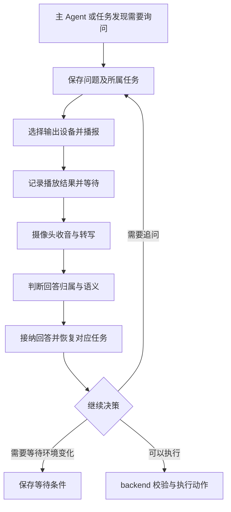

# Personal Agent 架构与基础设施选型参考

本文件研究持续个人助手对 Home Agent 的架构启发，覆盖产品行为、开源实现、Agent 基础设施、记忆和主动语音交互。资料核对日期为 **2026 年 10 月 4 日**。重点对象是 2026 年 9 月这一批 Muse、Dots、Cue、Grok Bot，以及近期的 Pi Durable、DeepSeek Harness 等基础设施。

Home Agent 的目标是本地全天候运行的家庭助手：长期理解家庭、持续调整关注事项，按需启动独立任务，在观察、对话、等待和任务结果之间继续推进。当前实现使用 LangGraph；下文候选框架的比较不要求现有查询和职责交付先更换运行框架。

**当前判断：Pi Durable 与 eve 是最值得深入比较的两条运行框架路线，尚未确定采用。** 前者更适合自主组织持续会话与任务，后者提供较完整的问询、渠道与后台运行设施。DSH、Strands、Mastra、AI SDK 加持久执行底座仍是有效候选；没有本项目同场景实测，不能宣布胜者。

## 文档定位与证据边界

- **外部事实**：由官方文档、发布说明或指定提交的源码支持；不等于本项目已经接入。
- **设计判断**：把外部机制映射到家庭场景的推论；不等于已决定实施。
- **未确认事项**：没有足够公开资料或尚未实测，不能从功能名称、演示或依赖存在推断实现保证。

本文件不维护实施批次、接口承诺或施工清单。实际能力见 [Agent README](../../apps/agent/README.md)、[感知说明](../perception.md)；领域所有权和实施设计仍由[信息边界与状态归属](../plans/household-model.md)、[家庭观察与 Agent 工作协作](../plans/household-automation.md)、[音视频感知计划](../plans/media-perception.md)维护。这里的设计取舍不自动修改这些文档中的接口与责任。

开源完整应用、Agent 运行框架、模型 SDK、持久执行引擎和记忆库分别解决不同问题。星数只说明关注规模，主仓库热度不证明新子包成熟，Python 能力也不能自动算到同名 TypeScript SDK。OpenClaw、Hermes 及其衍生项目不作为此次选型的主要依据。

## 产品目标与运行方式

### 持续负责与有限执行

持续存在的助手可以跨越很多个有限上下文窗口。主 Agent 需要保持身份、职责、当前关注和未完成承诺；具体任务可以从新上下文启动，也可以在必要时恢复既有会话。这里的“新启动”指不依赖上次进程内存，不意味着丢弃任务背景。

主 Agent 的价值在于发现工作、协调依赖和冲突、检查结果、调整下一步关注，并判断何时值得打扰用户。事件调度负责可靠唤醒，模型负责开放判断，二者不能相互替代。24 小时运行不要求模型连续推理，也不要求只有一个永不结束的消息数组。

“随时全新启动”与“执行中任意终止后仍然安全”是两回事。设备动作已经发出但结果尚未保存时，重启不能仅凭任务恢复自动重发。任务、动作记录和外部结果需要明确关联。

### 新一批产品公开到了什么程度

| 产品     | 已公开的行为与机制                                                                                                                | 对 Home Agent 的启发与限制                                                                       |
| -------- | --------------------------------------------------------------------------------------------------------------------------------- | ------------------------------------------------------------------------------------------------ |
| Muse     | 主聊天与侧聊天、长期目标、后台任务、按时间与相关事件推进、主动建议、可编辑记忆；完成后台工作后判断是否需要通知                    | 长期目标、执行过程、记忆与通知决策是不同对象。侧聊天不能单独证明内部采用主从 Agent 拓扑          |
| Dots     | 主 Dot 委派后台 Agent；独立任务获得任务所需上下文；自行暂停与唤醒；后台主动研究关联新信息与旧工作；独立保存偏好、决策和工作笔记   | “持续协调 + 独立任务 + 主动研究”有直接产品依据。主任务、委派任务和计划任务的生命周期并不相同     |
| Cue      | 每个 Agent 有持续身份及自己的邮箱、电话、钱包和电脑；多个 Agent 围绕共同目标交接工作；提供连接器与 routines（重复执行的例行任务） | 更接近多个持续角色协作，不能直接等同于一个主 Agent 带临时 worker；记忆检索、压缩和恢复细节未确认 |
| Grok Bot | Bot 拥有身份、记忆和例行任务；官方描述 Chief of Staff Bot 协调专业 Bot；能力可共享，记忆按角色归属                                | 支持全局协调者与专业角色的组织方式；不证明任何特定开源技术栈被采用                               |

来源：[Muse 设计](https://introducing.muse.ai/)、[Dots 任务与记忆](https://learn.chatgpt.com/docs/dots/tasks-and-memory)、[Dots 控制](https://learn.chatgpt.com/docs/dots/controls)、[Cue 发布](https://manus.im/blog/introducing-manus-2-0)、[Cue 官网](https://cue.im/)、[Grok Bot 设计](https://x.ai/news/designing-grok-bot)。

Muse 的官方技术说明把持久应用状态放在运行单元之外的 PostgreSQL 中；这支持执行与状态分离，但不能推出其长期记忆的索引或检索算法。第三方实机拆解报告了分角色加载上下文、Markdown 个人资料和后台记忆维护，但没有观察到真实模型请求流量，不能当作完整内部架构。[官方技术说明](https://research.meta.ai/blog/security-and-safety-for-ai-agents-our-approach-with-muse)、[第三方拆解及限制](https://personalagentbench.com/agents/muse/)

这些产品没有公开足够证据证明采用 Hindsight、Mem0、Graphiti 或某个 Agent 框架。发布效果也不能直接证明持续运行可靠性。Manus 的 Cascade 介绍强调按需加载能力，但 Cue 共用基础设施不意味着 Manus 所有机制均已在 Cue 中确认。

## 用家庭场景判断架构适配

### 持续责任中的任务尚未确定

“这周留意一下猫吃饭是否异常”可能经历查看证据、发现拍摄缺口、询问家人、调整观察、等待次日结果。主 Agent 必须能创建新的工作，并在一次任务结束后继续承担原责任。仅按时重复同一句提示词不足以表达这种行为。

关键比较点是持续关注如何保存、任务如何生成和回传、结果如何改变计划，而不是框架是否有循环或定时 API。

### 人的回答会改变任务

“要开空调吗？”之后，人可能回答“先别开，小王是不是还在睡？”，查询后又补充“那等他醒了再说”。回答引入调查、修改目标并形成等待条件，并非固定批准／拒绝流程。

框架需要容纳执行中改方向、追问、取消与延后；家庭交互层仍须判断谁在说话、回答哪个问题。一个任务等待不能阻塞主 Agent 接待其他事务。

### 连续感知的信息远多于值得关注的事情

每帧画面、每次设备上报不应都成为主会话消息。主 Agent 更需要知道：关注对象发生变化、出现相反证据、任务具备继续条件、现在适合向人确认。

模型可调整需要观察的问题与证据粒度，但持续采集、质量控制和高频确定性处理仍属于本地感知与 backend。上下文压缩只能控制输入大小，不能自动判断哪些家庭经历值得长期记住。

### 同时处理相关但独立的事务

猫的进食调查、洗衣提醒和晚间安静要求可以并行推进；新发现的睡眠状态又可能影响提醒方式。主 Agent 需要结果、约束变化、证据位置与未解决问题，不需要复制所有子任务的工具输出。

按问题创建任务，比预先建立“灯光 Agent、空调 Agent、猫 Agent”更符合当前需求。设备分组不是责任边界，跨设备关系也不天然需要多个长期角色。

### 有区分度的验证问题

比较应围绕同一条家庭交互：主动提问、等待期间处理别的事、收到回答后追问、后台任务返回新证据、服务重启、最终动作与结果确认。重点是接入成本及行为边界，而非给“支持多 Agent”等通用功能打勾。

| 观察维度     | 有区分度的问题                                                   |
| ------------ | ---------------------------------------------------------------- |
| 持续责任     | 任务结束、上下文换新后，未兑现承诺和关注事项是否仍能驱动后续工作 |
| 交互连续性   | 改方向、未回答、迟到回答、多人回答如何进入正确任务               |
| 并发         | 等待中的任务是否阻塞主 Agent；后台结果是否可靠回到协调者         |
| 恢复         | 保存聊天与恢复中间执行分别保证什么；哪些工具可能重跑             |
| 上下文与记忆 | 原始证据能否回查；压缩后是否遗失纠正、时间和人物归属             |
| 总成本       | 额外服务、模型整理成本、运维、升级和需要维护的通用代码有多少     |

这些是选型依据，不是已通过的验收结果，也不授权自动新增测试。

## 状态与上下文的设计判断

| 信息       | 家庭例子                             | 合适的责任边界                                                         |
| ---------- | ------------------------------------ | ---------------------------------------------------------------------- |
| 当前事实   | 空调报告、成员出现及来源时间         | backend 提供来源、时间和当前可用性，不把最近出现当作当前位置           |
| 关注与承诺 | 等小王醒后再询问、持续观察猫进食     | Agent 应用层拥有持续工作，按授权查询材料和请求动作，具体契约见协作计划 |
| 工作上下文 | 当前调查的推理、工具结果、待回答问题 | 按任务隔离，有界保存和恢复                                             |
| 长期知识   | 明确偏好、稳定家庭背景               | 记忆系统，包含归属、适用范围与来源                                     |
| 经历和反馈 | 提醒太晚后被用户纠正                 | 可检索经历及证据引用                                                   |
| 可复用做法 | 在夜间如何安静提醒                   | 经确认的流程或技能，按需加载                                           |

主 Agent 的每次输入可由稳定职责、相关关注事项、最近变化、任务结果和按需检索的记忆组成。保留范围内的历史按需查询，不必全部进入模型；输入缺口及媒体期限分别说明。新任务的交接至少表达目标、必要背景、约束和期望结果；返回至少表达结论、证据位置和未决事项。

持续 Agent 不必对应一条长期主消息历史。按事件／批次新建会话、复用分工会话和每次重新选取材料可以混用；持续身份与责任由外部工作状态接续。上下文管理包含入口筛选、独立调查、状态替换、近期范围限制、按需检索及可选摘要／压缩，不能只靠压缩应对高频事件。MiLoCo 的具体混合实现见[会话与上下文参考](miloco-perception.md#agent-事件会话与上下文管理)，这些产品的公开行为不足以证明采用相同内部机制；本项目输入组织与预算要求见[实施计划](../plans/household-automation.md#材料交接与模型执行)。

本项目的持续工作、问询与输入接续契约由[协作实施计划](../plans/household-automation.md#用户报告与持续工作)维护；家庭状态与工作状态的边界由[领域模型](../plans/household-model.md#ownership)维护。本文件继续比较外部机制与运行框架，不另维护实施协议。

长期自动化定义、Agent 持续工作、模型执行状态与设备动作记录并非同一个对象。数据库保存任务不保证它会被唤醒；保存会话不等于恢复执行；恢复执行不保证外部动作恰好执行一次。选择底座时必须明确每项状态的唯一所有者。

## 主动语音问答

### 所需的交互闭环

这是设计参考，不表示目前存在这些接口。任务连续性保存目标、进度和等待条件；对话连续性保存当前问题、轮次、播放状态及回答关联。语音、网页和手机回答可以进入同一语义入口，但不能仅凭一段转写推断说话人身份。

框架原生审批只是其中一种情况。一般回答可以补充信息、改变目标、另起话题或撤销问题。普通续聊不必每句话都使用执行中断；只有任务确实依赖外部输入时才需要持久等待。

### 当前项目的缺口

核对时，[聊天图](../../apps/agent/src/graph/home-agent.ts)已支持模型与四个只读家庭工具的循环并保存消息，尚无持续工作与待回答问题；[语音判断](../../apps/agent/src/speech-dialogue.ts)及其[共享契约](../../packages/api/src/contracts/speech-dialogue.ts)只判断转写是否构成完整助手请求。当前流程不包含 Agent 刚刚提出的问题或待回答任务，因此“好”“先不要”“另一台”等回答不能只沿用独立请求判定。

[感知说明](../perception.md#语音片段交付与对话判断)明确了短期语音收件箱的生命周期；它不是跨重启的任务交接存储。实时多轮回应和设备执行不能由该入口推定已实现。还需要输出设备接入、问题状态、回答关联、超时取消、可靠交接和播放收音协调。摄像头可收音不代表其扬声器已能被本项目控制。

实际计算的期限与等待人回答的期限需要分别表达。规划中的短执行预算不能直接限制持续责任的总寿命。等待期间应释放执行资源，其他任务继续运行。

### 实时语音与长期任务的边界

“播报结束后收回答”与“边说边听、允许插话”是不同能力。后者还需停止播放、处理回声、判断说话结束，并把真正被听到的内容反映到对话状态。任务 steering（执行中改方向）不等于音频层的即时打断。

LiveKit Agents 提供轮次和插话机制；OpenAI Agents SDK、Pydantic AI 也提供实时语音路径，但不能据此推定已经适配米家摄像头与家庭扬声器。[LiveKit 轮次机制](https://docs.livekit.io/agents/logic/turns/)、[OpenAI 实时 Agent](https://developers.openai.com/api/docs/guides/realtime)、[Pydantic AI 实时语音](https://pydantic.dev/docs/ai/realtime/overview/)

## 开源完整应用的借鉴

这些项目是应用参考，不与运行框架混排。其社区关注不证明它们已经达到 Muse、Dots 的产品可靠性。

| 项目                | 核实的 Agent 基础                                                                            | 值得借鉴的机制                                                                 | 对本项目的限制                                                     |
| ------------------- | -------------------------------------------------------------------------------------------- | ------------------------------------------------------------------------------ | ------------------------------------------------------------------ |
| Rowboat             | Vercel AI SDK；自行实现执行运行时                                                            | 独立整理人物与偏好笔记、后台任务、异步工具与执行状态、按任务准备上下文         | 偏办公场景；自建通用运行设施的成本不应直接复制                     |
| CopilotKit OpenMuse | CopilotKit Runtime 与 TanStack AI 的模型路径                                                 | 主聊天／侧聊天、目标与建议、明确的 `waiting_input`、持久 worker 和用户回答入口 | Alpha；当前会话保存依赖独立的 CopilotKit Intelligence 服务         |
| CopilotKit OpenBot  | CopilotKit Runtime／Intelligence，AG-UI 接入多种 Agent；包含直接模型、LangGraph、Mastra 实现 | 持续角色、可靠交接队列、约束与预期结果、结果回传及失败分类                     | 偏 AI 同事模板；集群机制并非单机家庭必需；也存在 Intelligence 依赖 |

AG-UI 是 Agent 与应用之间传递消息、工具调用和状态的协议，不是执行框架。CopilotKit、TanStack AI 与 Vercel AI SDK 也不是同一库。

### Rowboat

源码核对提交：`3b3c71593b0213499eddae9208d78209c7e7fe9d`。

[模型适配](https://github.com/rowboatlabs/rowboat/blob/3b3c71593b0213499eddae9208d78209c7e7fe9d/apps/x/packages/core/src/runtime/turns/bridges/real-model-registry.ts)通过 AI SDK 执行单个模型步骤，工具由[自有运行时](https://github.com/rowboatlabs/rowboat/blob/3b3c71593b0213499eddae9208d78209c7e7fe9d/apps/x/packages/core/src/runtime/turns/runtime.ts)处理。[Agent Notes](https://github.com/rowboatlabs/rowboat/blob/3b3c71593b0213499eddae9208d78209c7e7fe9d/apps/x/packages/core/src/knowledge/agent_notes_agent.ts)区分人物背景、明确偏好和场景风格，并要求跳过一次性任务；这是整理职责和提示词依据，不是准确性保证。

家庭映射：用户说“今天别开空调，我有点冷”，当前任务接纳临时约束，后台整理再判断有无长期价值，不能直接写成永久偏好。

### OpenMuse

源码核对提交：`b06caad7005ac5b6d2b451752a3794a6ae1759c1`。

[TanStack AI 入口](https://github.com/CopilotKit/openmuse/blob/b06caad7005ac5b6d2b451752a3794a6ae1759c1/apps/server/src/engine/tanstack-agent.ts)管理模型与工具循环；[回答入口](https://github.com/CopilotKit/openmuse/blob/b06caad7005ac5b6d2b451752a3794a6ae1759c1/apps/server/src/engine/service.ts)检查任务是否为 `waiting_input`；[worker](https://github.com/CopilotKit/openmuse/blob/b06caad7005ac5b6d2b451752a3794a6ae1759c1/apps/server/src/engine/worker.ts)通过数据库中的执行占用及期限管理任务。

当前 README 明确要求 Intelligence 项目密钥，并指出该服务不包含在仓库 MIT 许可中；官网与仓库描述不一致时需按所用提交核对，不能宣称整套完全独立本地运行。[依赖边界](https://github.com/CopilotKit/openmuse/blob/b06caad7005ac5b6d2b451752a3794a6ae1759c1/README.md)

### OpenBot

源码核对提交：`cb5dc32a44517622c6db4e527e61d3abb389b43c`。

[运行时](https://github.com/CopilotKit/OpenBot/blob/cb5dc32a44517622c6db4e527e61d3abb389b43c/server/src/copilot.ts)区分内置与远程 Agent。[交接运行器](https://github.com/CopilotKit/OpenBot/blob/cb5dc32a44517622c6db4e527e61d3abb389b43c/server/src/agents/handoff-runner.ts)携带发起者、接收者、任务、约束和期望结果，并经队列交付；“没找到”是一次已完成回答，不等于网络失败应重复重试。

家庭映射：主 Agent 交办“核对猫今日进食，区分没吃和没拍到”，任务只接收必要证据，结果回到协调者。可借鉴交接语义，不必照搬多副本部署机制。

## AI SDK 与 LangGraph 的职责范围

| 能力             | AI SDK                                             | LangGraph                                                    |
| ---------------- | -------------------------------------------------- | ------------------------------------------------------------ |
| 核心定位         | TypeScript 模型接入、工具与 Agent 应用工具集       | 有状态执行与编排运行时                                       |
| 模型与结构化输出 | 统一供应商接口、流式响应与结构化输出               | 节点调用模型，通常结合 LangChain，也可使用其他客户端         |
| Agent 循环       | `ToolLoopAgent` 管理模型与工具的多步循环           | 图或上层 Agent 封装组织循环                                  |
| 状态与恢复       | 普通循环不自动持久化；需外部运行层或 Workflow 集成 | checkpointer（执行状态保存器）支持线程状态保存与恢复         |
| 人类输入         | 有工具审批协议，持久等待需运行层                   | `interrupt()` 与 `Command({ resume })` 配合持久 checkpointer |
| 长期记忆         | 外部服务、供应商工具或自定义存储                   | 跨线程 Store 提供存储能力，整理与检索策略仍需定义            |
| UI               | 消息、工具结果流与前端 hooks                       | 执行流需与应用交互层对接                                     |
| 全天候助手       | 仍需持续责任、唤醒、记忆与交互机制                 | 同样需要，不是保存一张图就获得完整个人助手                   |

AI SDK 的模型接口更适合与 LangChain 模型接口比较；Agent 循环则应与 LangChain `createAgent` 比较，不能把整个 LangChain 仅视为模型适配层。AI SDK 加持久运行层才更接近 LangGraph 加 checkpointer。AI SDK 可只在本地后端使用，不要求使用其 UI 或部署到 Vercel。[AI SDK 概览](https://ai-sdk.dev/docs/introduction)、[Agent 循环](https://ai-sdk.dev/docs/agents/overview)、[LangChain 概览](https://docs.langchain.com/oss/javascript/langchain/overview)、[LangGraph 持久化](https://docs.langchain.com/oss/javascript/langgraph/persistence)

AI SDK 7 的 `WorkflowAgent` 来自 `@ai-sdk/workflow`，为循环增加持久执行与审批恢复；核对时要求 Workflow 5 beta。`HarnessAgent` 则统一接入 Pi 等已有运行框架，底层能力仍属于对应框架，不能推定已适配 Pi Durable。[WorkflowAgent](https://ai-sdk.dev/docs/agents/workflow-agent)、[HarnessAgent](https://ai-sdk.dev/docs/ai-sdk-harnesses/overview)

LangGraph 恢复中断时会从所在节点开头重新运行，故不能把有外部效果的播报或设备操作随意放在中断前并假定只发生一次。永久保存会话也不意味着上下文不会增长，需要独立整理策略。[中断语义](https://docs.langchain.com/oss/javascript/langgraph/interrupts)

## Agent 基础设施候选

### 直接相关的运行路线

| 路线                              | 已确认的主要能力                                                                                                           | 场景判断                                                                                  | 主要限制与未知                                                                                       |
| --------------------------------- | -------------------------------------------------------------------------------------------------------------------------- | ----------------------------------------------------------------------------------------- | ---------------------------------------------------------------------------------------------------- |
| Pi Durable                        | 持久根会话、独立会话、后台任务边界、去重收件箱、后台压缩、文档与记录原子提交；有前台和后台子 Agent 官方示例                | 主 Agent 持续接待、独立任务运行和结果回传已有底层机制及组合示例，适合自主组织家庭运行核心 | 实验性 API；存储由单进程独占；家庭问答协议、外部事件与定时唤醒接入、视觉证据链路需核验               |
| eve                               | 持久会话、子 Agent、计划任务、渠道、`ask_question`                                                                         | 频繁问询与跨渠道接续时可减少应用代码                                                      | 预览期；构建和 Workflow 体系；现有 Bun 服务接入未实测                                                |
| DeepSeek Harness                  | Cordis 驱动的插件架构，Agent 循环、模型等均可替换                                                                          | 若家庭能力需要独立插件，扩展性有价值                                                      | 开发者预览且会破坏兼容；无人值守恢复不能由插件能力推定                                               |
| Strands Harness 与 SDK            | TS／Python、上下文管理、会话、多 Agent、中断、预算和工具                                                                   | 可作为比裸模型 SDK 更完整的进程内核心                                                     | TS 能力需逐项核对；会话保存不等于全部中间执行恢复                                                    |
| Mastra                            | TS Agent、工作流暂停恢复、记忆和应用工具                                                                                   | 记忆整理与应用整合工作量较大时有吸引力                                                    | 持续关注机制仍需定义；整理成本和失真需评估                                                           |
| AI SDK 加持久执行底座             | 模型适配、工具循环、可选持久工作流                                                                                         | 普通 TS 编程方式和较自由的领域组织                                                        | 主会话、任务交接与记忆仍需装配；不能演变为重写通用运行器                                             |
| Deep Agents／LangChain／LangGraph | 上层 Agent 循环、上下文压缩、文件卸载、Skills、隔离子 Agent、跨线程记忆与中断恢复；异步子 Agent 可结合 Agent Protocol 服务 | 主 Agent 长期接待、后台调查与多轮问询均有直接可用的机制，应作为完整候选比较               | OSS 库与 Agent Server 的能力、部署和许可边界不同；后台完成主动回报需接通知机制，家庭交互语义仍需定义 |

来源：[Pi Durable](https://earendil.com/posts/pi-durable/)、[eve 文档](https://github.com/vercel/eve/blob/main/docs/README.md)、[DSH](https://github.com/deepseek-ai/deepseek-harness)、[Strands](https://github.com/strands-agents/harness-sdk)、[Mastra](https://github.com/mastra-ai/mastra)。

eve 的问题事件带请求标识，子 Agent 的问题可以由父会话展示并路由回答，提供了比通用暂停原语更具体的交互协议。它可自托管，但仍须配置自己的运行基础设施。[问询协议](https://github.com/vercel/eve/blob/main/docs/tools/human-in-the-loop.md)、[部署](https://github.com/vercel/eve/blob/main/docs/guides/deployment/overview.md)

### Lang 系列的能力与部署边界

LangGraph、LangChain 和 Deep Agents 是可组合的不同层次。LangGraph 提供状态与执行机制；LangChain `createAgent` 提供可配置的模型／工具循环和中间件；Deep Agents 在其上提供更完整的 harness（管理模型、工具、上下文与任务的运行框架）。采用 Deep Agents 不要求应用逐步画出全部推理流程。应将这套上层能力与其他完整框架比较，而不是用裸 LangGraph 的装配成本代表整个系列。[官方层次说明](https://docs.langchain.com/oss/javascript/langchain/overview)

| 家庭场景                  | 已有机制                                                                                                          | 应用仍需明确的部分                                           |
| ------------------------- | ----------------------------------------------------------------------------------------------------------------- | ------------------------------------------------------------ |
| 主 Agent 长期处理家庭事务 | Deep Agents 自动摘要旧消息，把大型工具内容卸载到文件并保留检索引用；Skills 按需加载                               | 哪些观察形成长期责任，哪些事实不能只保留在摘要中             |
| 独立调查“猫今天是否进食”  | 同步子 Agent 默认隔离上下文，也可继承上下文；适合交办有界工作后汇总                                               | 传入哪些证据、结果的可信程度，以及任务结束条件               |
| 调查期间继续与家人交谈    | 异步子 Agent 在独立线程运行，主 Agent 可启动、检查、追加指令、取消与列举；任务记录独立于消息历史                  | 接入 Agent Protocol 服务、任务容量，以及完成后何时主动回报   |
| 跨天记住偏好与经验        | `StoreBackend` 支持跨线程保存文件，`CompositeBackend` 可分配不同存储路径，记忆文件可加载进提示词                  | 成员与家庭共享范围、纠正、遗忘、来源和记忆整理策略           |
| 主动提问后等待回答        | LangGraph `interrupt()` 配合持久 checkpointer 保存等待状态，以 `Command({ resume })` 继续；支持按中断标识关联回答 | 把摄像头麦克风的回答绑定到正确问题、超时、迟到及多轮语音体验 |

来源：[上下文管理](https://docs.langchain.com/oss/javascript/deepagents/context-engineering)、[子 Agent](https://docs.langchain.com/oss/javascript/deepagents/subagents)、[异步子 Agent](https://docs.langchain.com/oss/javascript/deepagents/async-subagents)、[记忆](https://docs.langchain.com/oss/javascript/deepagents/memory)、[中断与恢复](https://docs.langchain.com/oss/javascript/langgraph/interrupts)。这些是框架文档能力，未表示当前 Home Agent 已接入。

异步委派与主动回报需要分开核对。官方异步接口通过兼容 Agent Protocol 的服务管理线程和运行，允许自托管，并非只能使用云端 LangSmith。默认由主 Agent 查询结果；官方参考仓库另外提供 Python 和 TypeScript 的 completion notifier，在子 Agent 完成后向父线程提交新运行，唤醒主 Agent。它是可复用的通知示例，不是已经自动接好的默认行为。[官方异步参考实现](https://github.com/langchain-ai/async-deep-agents)

持续运行的另一层是 Agent Server：后台运行、定时触发，以及同一线程运行中收到新消息时的排队／中止／拒绝／回滚策略，不能全部归给 OSS LangGraph。定时任务可以绑定已有线程，也可以每次创建新线程，适合分别表达持续关注和独立检查。[定时任务](https://docs.langchain.com/langsmith/cron-jobs)、[运行中新输入处理](https://docs.langchain.com/langsmith/double-texting)

部署比较应至少区分两种组合：

- **本地 OSS 库。** 可嵌入自己的服务，使用 Deep Agents 的上下文与子 Agent 能力、LangGraph 的持久状态及问询恢复；不应由此推定已经具备 Agent Server 的后台调度与并发输入策略。
- **Deep Agents 加 Agent Server。** 可复用更多运行设施，但官方独立服务器部署涉及 PostgreSQL、Redis、许可配置和运行维护；不能按安装几个 npm 包的成本评估，也不能把这些条件扩大为使用 OSS 库的要求。[独立服务器部署](https://docs.langchain.com/langsmith/deploy-standalone-server)

对本地全天候家庭助手，真正的比较点是两种组合各需多少额外设施，以及任务回报、恢复与语音问询如何接入现有服务。仅凭“LangGraph 是图”或“Deep Agents 属于同一系列”都不能降低这条路线的候选地位。TypeScript 文档部分段落混用 Python 部署示例，具体 API 与本地 Bun 运行仍须按采用版本核验。

### Pi Durable 的运行机制与边界

Pi 1.0 与 Pi Durable 是不同交付：前者仍以交互式 coding agent 为中心，后者是专门面向长期运行的实验性框架。以下依据包 README；它说明可复用的机制，不代表已在 Home Agent 验证。[发布边界](https://earendil.com/posts/pi-1-0/)、[Durable README](https://github.com/earendil-works/pi/blob/main/packages/durable/README.md)

| 机制               | 已有语义                                                                                                         | 对家庭助手的意义                                         |
| ------------------ | ---------------------------------------------------------------------------------------------------------------- | -------------------------------------------------------- |
| 根对话与恢复       | 使用持久存储时，`root()` 取得同一个根对话，`resume()` 启动未完成工作的调度                                       | 主 Agent 不依赖原进程一直存活                            |
| 独立对话与分支     | 新建对话可从新上下文开始；`fork()` 继承指定分支点之前的历史并独立继续                                            | 按问题隔离任务，明确何时需要继承历史                     |
| 后台所有权边界     | `{ background: true }` 任务拥有的工作不保持父对话忙碌，也不随普通父级中止而停止；可显式连同后台工作中止          | 主 Agent 可继续接待其他事情，后台调查有独立生命周期      |
| 持久收件箱         | follow-up 在当前运行结束后进入；steer 在当前工具轮次后进入；write 只追加记录，不触发模型；`requestId` 去重提交项 | 用户改方向、家庭变化与后台回报可采用不同交付方式         |
| Document 与 Commit | 带类型的 JSON 状态可与对话条目、任务创建一起原子提交                                                             | 可一致保存问题记录与对应等待状态，但问题语义仍由应用定义 |
| 压缩与交接         | 支持后台压缩、保留近期原文和历史记录，也可用 `reset()` 携带交接说明开始新上下文                                  | 控制主 Agent 输入体积，保留历史查询依据                  |

官方的[前台子 Agent 示例](https://github.com/earendil-works/pi/blob/main/packages/durable/test/examples/22-subagent-foreground.ts)展示工具调用拥有子对话并等待回答；[后台子 Agent 示例](https://github.com/earendil-works/pi/blob/main/packages/durable/test/examples/23-subagent-background.ts)进一步提供创建、发消息、等待、停止、列出和结果回报。后台锚点任务拥有子对话，报告任务把结果作为 follow-up 交回父对话，并用请求 ID 避免重启后重复提交消息与回报。它不是内置完整个人助手产品，但也不是要求应用从零实现子任务队列与恢复设施。

这些能力需要按各自范围理解：

- **任务等待不是现成问答协议。** README 的 `waiting` 示例等待其他任务结束，不能直接当作已提供与 eve 相同的提问／回答 API。家庭问题仍需标识、回答归属、超时、撤销与迟到处理。
- **运行中引导不是语音即时打断。** `steer` 在当前工具轮次结束后参与运行，停止扬声器播放由语音交互层处理。
- **提交去重不是设备动作恰好一次。** `requestId` 去重提交项；工具仅在声明 `replay: "safe"` 时允许崩溃后重跑，否则返回已中断的结果。播报、喂食等工具必须按实际外部效果决定重放与核对方式。
- **原子提交有存储边界。** Pi 管理的文档、条目和任务可一起提交，但不会自动与 backend 数据库或物理设备组成同一事务。设备状态与正式动作记录仍须遵守项目的单一所有权。
- **上下文压缩不是完整长期记忆。** Document 提供状态容器，压缩控制模型输入；值得保留哪些经历、怎样纠正与检索仍是独立问题。
- **内置文件工具的限制不能扩大解释。** README 在 `CodingTools` 说明中指出尚不支持读取图片，这不能推出整个 Pi Durable 不支持视觉模型；模型图像输入、媒体引用和工具结果链路需要分别核验。
- **进程崩溃与断电保证不同。** SQLite 默认 WAL 加 `synchronous = NORMAL`，最新提交在断电或宿主故障时可能丢失；JSONL 可选择 `fsync`。同一存储仅由一个进程拥有，没有跨进程锁。内置存储也不能直接算作 PostgreSQL 适配。
- **存储不会保存扩展代码。** 对话保存扩展名称，重启后宿主仍需安装对应实现；这与任务恢复的版本管理有关。

这些机制加强了 Pi Durable 作为优先验证对象的依据，但尚不构成采用决定。关键未验证面是家庭事件接入、主动问答接续、视觉证据交付，以及与 backend 的状态边界。采用它时通常优先复用 `pi-ai`，无需为“统一”强套 AI SDK。

### 补充对照

| 候选                  | 有价值的能力                                     | 本项目的判断                                                               |
| --------------------- | ------------------------------------------------ | -------------------------------------------------------------------------- |
| OpenAI Agents SDK     | Agent 委派、工具、审批、追踪与实时语音           | 语音交互值得参考；长期本地运行需另行核对，不等于 Dots 内部实现             |
| Google ADK TypeScript | 顺序、并行、循环、路由及远程 Agent 协作          | 有效候选；不能直接套用 Python ADK 的实时和持久能力                         |
| Pydantic AI           | 类型化工具、实时语音、历史交接、多种持久执行集成 | 语音成为核心时值得保留；会增加 Python 服务边界                             |
| Agno 与 AgentOS       | Agent SDK、服务运行、存储、审批和管理 API        | 能力完整，但需划清与 backend 的平台职责，主要是 Python 路线                |
| Letta                 | 有状态 Agent 与记忆管理                          | 同时涉及框架与记忆系统；不同发布形态的能力需区分，不能只当作一个记忆函数库 |

来源：[OpenAI Agents SDK](https://developers.openai.com/api/docs/guides/agents/sdk)、[ADK TS](https://github.com/google/adk-js)、[Pydantic AI](https://pydantic.dev/docs/ai/overview/)、[Agno](https://github.com/agno-agi/agno)、[Letta](https://github.com/letta-ai/letta)。

框架可支持开放决策，图也不天然限制 Agent 自主性；比较重点是完整组合已经提供什么、需要额外组装多少机制，以及本地部署成本。

## 持久执行底座

| 底座         | 主要职责                                  | 家庭部署取舍                                                     |
| ------------ | ----------------------------------------- | ---------------------------------------------------------------- |
| DBOS         | 工作流、持久休眠、消息、队列和恢复        | TS 与 PostgreSQL 路线贴近现有设施；AI SDK 加 DBOS 是有效组合候选 |
| Restate      | 持久调用、外部输入等待和状态              | 可自托管；需接受其服务及执行模型，核对许可与部署成本             |
| Temporal     | 长期流程、计时、消息和故障恢复            | 适合作为复杂可靠流程的对照，额外服务和运维成本需计入             |
| Workflow SDK | 持久步骤与等待，集成 AI SDK／eve          | 与该技术路线结合紧密；具体 beta 版本和本地运行路径需验证         |
| pg-boss      | PostgreSQL 任务队列、计划与延迟任务、重试 | 适合调度，不能据此推定拥有完整 Agent 会话与任意执行点恢复        |

来源：[DBOS](https://docs.dbos.dev/typescript/programming-guide)、[DBOS 消息](https://docs.dbos.dev/typescript/tutorials/workflow-communication)、[Restate](https://docs.restate.dev/ai/patterns/human-in-the-loop)、[Temporal](https://docs.temporal.io/temporal)、[WorkflowAgent](https://ai-sdk.dev/docs/agents/workflow-agent)、[pg-boss](https://github.com/timgit/pg-boss)。

这些底座主要替代通用调度与恢复代码，不一定替代 Agent 工具循环。组合时每段执行应有清楚的恢复责任，避免两层同时重试同一动作。记忆保存、任务唤醒和动作去重仍是不同保证。

## 长期记忆候选与家庭约束

记忆首先是信息组织、写入与修正问题，然后才是存储选型。持续感知下，筛选哪些经历值得保存往往比换一个向量数据库更影响成本。去掉重复观测时仍需保留人物、时间、纠正和证据来源，不能过度摘要后指望检索恢复。

| 候选                        | 值得研究的方向                                                       | 边界与代价                                                                         |
| --------------------------- | -------------------------------------------------------------------- | ---------------------------------------------------------------------------------- |
| Hindsight                   | `retain / recall / reflect` 保存、召回与反思；主题总结 Mental Models | 写入与刷新会调用模型；主题总结不能代替最新设备状态；中文、纠正和成本未在本项目验证 |
| Mem0                        | 偏好与跨会话个性化记忆                                               | 适合作为较通用的对照；开源与托管附加能力需分别核对                                 |
| Graphiti                    | 实体关系、时间变化与来源追溯                                         | 适合物品位置和关系历史；增加图存储等成本，不能再产生一份权威设备清单               |
| Honcho                      | 对人物及不同视角的持续表征                                           | 值得研究家庭成员理解；不能把模型推断当作用户明确表达                               |
| Letta                       | 持续 Agent 的记忆组织与后台整理                                      | 接入范围可能覆盖运行框架，不是纯记忆库；具体版本与自托管能力需确认                 |
| OpenViking                  | 资料、记忆与技能的分层上下文组织                                     | 适合设备说明书与家庭知识逐渐增长的情况；需接受其组织方式                           |
| MemOS                       | 多模态、工具经历及记忆更新                                           | 完整服务与本地插件不是同一部署成本，应按具体形态比较                               |
| memU                        | 个人知识组织与技能提炼                                               | 定位随版本变化，不能沿用早期“24/7 主动 Agent 记忆框架”介绍直接选型                 |
| LangMem                     | 抽取、合并与后台记忆更新组件                                         | 属于 Lang 生态；Python 路径与当前 TS 服务的边界需考虑                              |
| Mastra Observational Memory | Observer 整理旧消息，Reflector 合并观察，控制上下文体积              | 比简单截断完整，但不是最新事实、承诺和唤醒条件的替代存储                           |

来源：[Hindsight](https://github.com/vectorize-io/hindsight)、[Mental Models](https://hindsight.vectorize.io/developer/mental-models)、[Mem0](https://github.com/mem0ai/mem0)、[Graphiti](https://github.com/getzep/graphiti)、[Honcho](https://github.com/plastic-labs/honcho)、[Letta](https://github.com/letta-ai/letta)、[OpenViking](https://github.com/volcengine/OpenViking)、[MemOS](https://github.com/MemTensor/MemOS)、[memU](https://github.com/NevaMind-AI/memU)、[LangMem](https://langchain-ai.github.io/langmem/)、[Mastra 记忆](https://mastra.ai/docs/memory/observational-memory)。其中外围候选仅形成调研入口，不表示已完成源码与版本审核。

家庭场景中有必要保持以下约束：

- 区分共享、成员私有及访客临时信息；匿名语音不能仅凭画面出现了谁就绑定身份。
- 区分观察、推断、明确偏好和当前指令；“连续晚睡”不能自动变成“喜欢晚睡”。
- 保留适用时间与纠正关系；“今晚不开空调”不是永久规则。
- 摘要保留来源标识，原始媒体可用性另行表达，过期不能伪装成仍可回查。
- 删除与遗忘要考虑衍生摘要、索引和人物表征，而非只删除原文。
- 记忆不产生动作权限；“喜欢某物”不是购买或设备操作授权。

有区分度的记忆材料包括中文偏好改变、临时要求、物品换位置、人物识别纠正、不同成员的冲突偏好。关注误记、旧事实误用、人物混淆、来源追溯、遗忘、写入成本与延迟；公开聊天记忆榜单不能替代家庭场景判断。当前没有足够证据确定 Hindsight 或其他库是首选。

## 研究依据与综合取舍

[Pera](https://arxiv.org/html/2608.30478v1)区分长期服务的观察／控制与有界任务执行，为持续主 Agent 提供概念依据，但不是已验证的家庭产品框架。[Memory in the Age of AI Agents](https://arxiv.org/abs/2512.13564)区分事实、经验与工作记忆，有助于避免把所有状态都塞进一个记忆库。[π-Bench](https://arxiv.org/abs/2605.14678)强调跨任务关系、隐含需求与跨会话连续性，说明任务完成率不能单独衡量主动帮助。[Anthropic 的多 Agent 实现](https://www.anthropic.com/engineering/multi-agent-research-system)支持以独立上下文消化细节再汇总，但不能直接证明全天候家庭运行可靠。

场景判断支持的取舍是：

1. **主 Agent 持续负责，任务按问题隔离。** 不把全局协调简化成纯定时器，也不把所有事务塞进一条无限会话。
2. **Pi Durable、eve 与 Deep Agents／LangGraph 的完整组合是重点比较对象，不是已批准选型。** Pi Durable 提供持续会话、后台任务、原子状态与子 Agent 回报机制；eve 提供问询与渠道协议；Deep Agents 提供上下文、记忆、子 Agent 和可组合的中断恢复，并可结合 Agent Server 获得更多运行设施。应分别计入实验／预览风险、部署许可、运维和现有项目接入成本，尚无充分证据确定首选。
3. **DSH、Strands、Mastra 和 AI SDK 加 DBOS 保留为实质候选。** 分别检验插件扩展、进程内完整度、记忆整合及普通 TS 加数据库的成本优势；现有 LangGraph 实现是项目基线，但不代表 Lang 系列的能力上限。
4. **模型 SDK 与运行框架分别决策。** AI SDK 可以作为基建，不代表它因此成为整个系统首选；采用 Pi Durable 时通常复用其原生模型层。不要为了统一重复包装。
5. **语音交互与长期任务相互连接但各有职责。** 回答关联、打断、回声与说话人问题不能靠 checkpoint 自动解决。
6. **复用成熟通用设施，把自定义代码留给家庭规则。** 不因开源参考采用自研运行器，就复制其队列、锁、恢复和存储实现。

上述结论是基于产品资料、部分源码和项目现状的选型参考。具体本地模型效果、Bun 兼容性、中文多轮语音、摄像头与输出设备联合运行、日级稳定性和故障恢复均未由本次调研验证。
